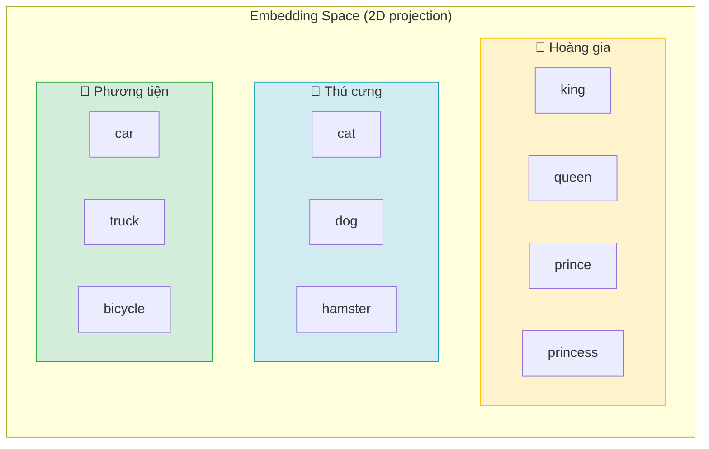
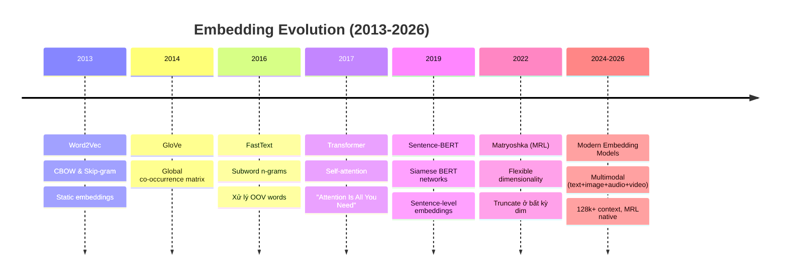
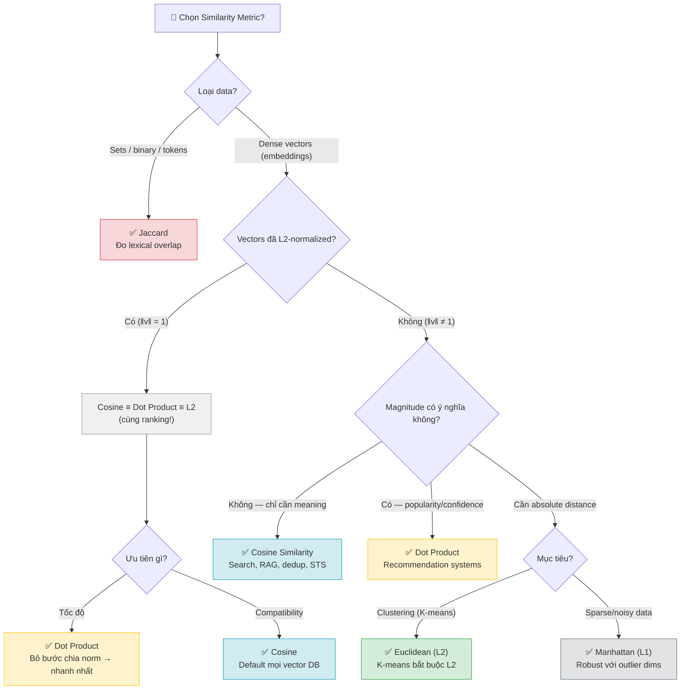
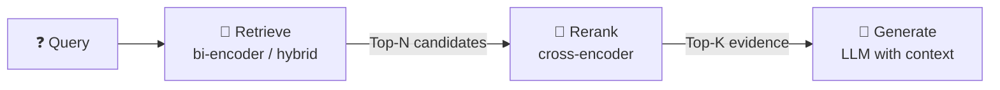

# Tài liệu Toàn diện về Embedding

> **Phiên bản**: March 2026 | **Ngôn ngữ**: Việt-Anh (thuật ngữ kỹ thuật giữ nguyên tiếng Anh)
> **Nguồn**: 65+ citations từ official docs, papers, benchmarks
> **Cấu trúc**: 3-Layer Architecture — Foundations → Systems → Operations

---

Embedding xuất hiện từ một nhu cầu rất thực tế: máy tính chỉ xử lý được số, trong khi dữ liệu con người quan tâm lại là từ ngữ, câu, hình ảnh hay âm thanh. Muốn tìm kiếm theo nghĩa, gom nhóm nội dung tương tự, gợi ý đúng sở thích hay kết nối text với image, trước hết cần biến những dữ liệu rời rạc ấy thành vector mà vẫn giữ được thông tin ngữ nghĩa. Vì vậy, để hiểu embedding, cần trả lời bốn câu hỏi nền tảng: vector này thực chất là gì, vì sao các thế hệ model liên tục thay đổi, khoảng cách giữa các vector nên được đo như thế nào, và các vector ấy được đưa vào retrieval/RAG theo kiến trúc nào.

## Mục lục

- [Layer 1 — Foundations (Nền tảng)](#layer-1--foundations-nền-tảng)
  - [1.1 Embedding là gì?](#11-embedding-là-gì)
  - [1.2 Lịch sử phát triển](#12-lịch-sử-phát-triển)
  - [1.3 Các thuật toán tính Similarity](#13-các-thuật-toán-tính-similarity)
  - [1.4 Retrieval Foundations](#14-retrieval-foundations)
    - [1.4.1 Bi-encoder vs Cross-encoder](#141-bi-encoder-vs-cross-encoder)
    - [1.4.2 Query vs Document Asymmetry](#142-query-vs-document-asymmetry)
    - [1.4.3 Chunk vs Document](#143-chunk-vs-document)
    - [1.4.4 Dense, Sparse, Hybrid](#144-dense-sparse-hybrid)
    - [1.4.5 Retrieve, Rerank, Generate](#145-retrieve-rerank-generate)
- [Layer 2 — Systems & Applications (Hệ thống & Ứng dụng)](#layer-2--systems--applications-hệ-thống--ứng-dụng)
  - [2.1 Semantic Search / Information Retrieval](#21-semantic-search--information-retrieval)
  - [2.2 RAG + Rerank](#22-rag--rerank-pipeline-3-giai-đoạn)
  - [2.3 Clustering (Phân cụm)](#23-clustering-phân-cụm)
  - [2.4 Recommendation Systems](#24-recommendation-systems)
  - [2.5 Classification & Sentiment Analysis](#25-classification--sentiment-analysis)
  - [2.6 Anomaly Detection](#26-anomaly-detection)
  - [2.7 Deduplication / Near-duplicate Detection](#27-deduplication--near-duplicate-detection)
  - [2.8 Multimodal Embedding](#28-multimodal-embedding)
- [Layer 3 — Operations (Vận hành & Tối ưu)](#layer-3--operations-vận-hành--tối-ưu)
  - [3.1 Embedding Models Comparison](#31-embedding-models-comparison)
  - [3.2 Vector Databases](#32-vector-databases-ma-trận-chọn-nhanh)
  - [3.3 Chunking Strategies](#33-chunking-strategies)
  - [3.4 Dimension Reduction & Quantization](#34-dimension-reduction--quantization)
  - [3.5 Hybrid Search (Sparse + Dense)](#35-hybrid-search-sparse--dense)
  - [3.6 Evaluation Methodology](#36-evaluation-methodology)
- [Tổng hợp Sources](#-tổng-hợp-sources)

---

# Layer 1 — Foundations (Nền tảng)

Ở mức nền tảng, điều quan trọng không phải là nhớ tên từng model, mà là nắm bốn ý cốt lõi. Thứ nhất, embedding biến dữ liệu rời rạc thành biểu diễn số học có ý nghĩa. Thứ hai, các thế hệ model mới xuất hiện để sửa dần những giới hạn của thế hệ trước. Thứ ba, khi đã có vector, việc chọn similarity metric sẽ quyết định trực tiếp cách các hệ thống search, recommendation hay clustering hoạt động. Thứ tư, một hệ thống retrieval không chỉ có vector và metric; nó còn cần kiến trúc encode, đơn vị retrieve và pipeline phù hợp.

Mạch nội dung của `Layer 1` đi từ bản chất của embedding, sang lịch sử phát triển, rồi đến cách đo độ giống nhau giữa các vector, trước khi nối sang các kiến trúc retrieval thường dùng trong search và RAG. Cách đi này giúp từng khái niệm mới xuất hiện đều có điểm tựa từ phần trước.

## 1.1 Embedding là gì?

Để hiểu embedding, cần nhìn từ ba góc độ: dữ liệu rời rạc được ánh xạ sang vector ra sao, vì sao vị trí trong embedding space mang ý nghĩa, và embedding giải quyết được những giới hạn gì so với biểu diễn truyền thống.

Text, image hay audio ở dạng thô không thể đem đi cộng, trừ, so sánh hay tìm láng giềng gần nhất một cách trực tiếp. Máy học cần một biểu diễn số học; nhưng nếu biểu diễn đó chỉ ghi nhận danh tính của token mà không giữ được quan hệ ý nghĩa, thì các bài toán như search, clustering hay recommendation vẫn hoạt động rất kém. Embedding được đưa ra để giải quyết chính bài toán này.

### Từ dữ liệu rời rạc sang không gian liên tục

**Embedding** là phép ánh xạ dữ liệu rời rạc (discrete) — chẳng hạn từ ngữ, câu, hình ảnh, âm thanh — sang **vector liên tục** (continuous) trong không gian nhiều chiều (high-dimensional space). Ký hiệu toán học:

$$f: X \rightarrow \mathbb{R}^n$$

Trong đó:
- **X** là tập dữ liệu đầu vào (ví dụ: tập từ vựng, tập hình ảnh, tập âm thanh)
- **ℝⁿ** là không gian vector n chiều (thường n = 384, 768, 1024, 1536, 3072)
- **f** là hàm embedding (có thể là neural network, hoặc lookup table)

Cách hiểu đơn giản: mỗi từ, câu hay hình ảnh được "đặt" vào một tọa độ trong không gian nhiều chiều, sao cho **các khái niệm có ý nghĩa tương tự sẽ nằm gần nhau**.

Về mặt hệ thống, số chiều không chỉ là chuyện toán học mà còn là chuyện storage và cost. Một vector `1536` chiều ở dạng `float32` chiếm khoảng `1536 × 4 = 6144 bytes`, tức xấp xỉ `6 KB`. Nếu lưu `1 triệu` chunks, riêng phần raw vectors đã vào khoảng `6 GB`, chưa tính metadata, index structure hay replication trong vector database.

### Distributional Hypothesis

> *"Words that appear in similar contexts have similar meanings."*
> — Distributional Hypothesis ([Harris, 1954](https://www.tandfonline.com/doi/abs/10.1080/00437956.1954.11659520))

Ý tưởng cốt lõi: nếu hai từ thường xuất hiện trong ngữ cảnh giống nhau, chúng có ý nghĩa tương tự → vectors của chúng sẽ **gần nhau** trong không gian embedding.

**Ví dụ cụ thể:**
- "king" và "queen" gần nhau vì cùng xuất hiện trong ngữ cảnh hoàng gia, quyền lực
- "cat" và "dog" gần nhau vì cùng xuất hiện trong ngữ cảnh thú cưng, chăm sóc
- "Python" và "JavaScript" gần nhau vì cùng ngữ cảnh lập trình

**Word Analogy — phép toán trên vectors:**

Một trong những phát hiện ấn tượng nhất của Word2Vec là khả năng thực hiện phép toán trên vectors:

```
king - man + woman ≈ queen
Paris - France + Japan ≈ Tokyo
```

Điều này cho thấy embedding đã capture được **quan hệ ngữ nghĩa** (semantic relationships) giữa các từ — cụ thể là quan hệ giới tính (king/queen), quan hệ thủ đô/quốc gia (Paris/France).

### Diagram: Embedding Space



> **Hình 1**: Embedding space — các khái niệm liên quan nằm **gần nhau** trong cùng cluster. Khoảng cách giữa clusters phản ánh sự khác biệt ngữ nghĩa. Trong thực tế không gian có hàng trăm đến hàng nghìn chiều; hình trên là phép chiếu 2D minh họa.

### Tại sao Embedding quan trọng?

1. **Biểu diễn ngữ nghĩa**: One-hot encoding (vector thưa, mỗi từ 1 vị trí = 1) không capture được ý nghĩa. Embedding giải quyết bằng cách đặt "cat" và "kitten" gần nhau.
2. **Giảm chiều**: Vocabulary 100,000 từ → one-hot cần 100,000 dims. Embedding chỉ cần 384-3072 dims mà chứa nhiều thông tin hơn.
3. **Tính toán similarity**: Cho phép đo "khoảng cách ý nghĩa" giữa 2 khái niệm bất kỳ bằng phép toán vector đơn giản.
4. **Transfer learning**: Embedding được train trên dataset lớn có thể transfer sang task khác — không cần train lại từ đầu.
5. **Multimodal bridge**: Embedding cho phép đặt text, image, audio vào cùng không gian → so sánh cross-modal (tìm ảnh bằng mô tả text).

Nói ngắn gọn, embedding không chỉ đổi dữ liệu thành số, mà đổi dữ liệu thành số theo cách vẫn bảo toàn được phần nào cấu trúc ngữ nghĩa. Lịch sử phát triển của embedding vì thế cũng chính là lịch sử cải thiện chất lượng biểu diễn đó: hiểu ngữ cảnh tốt hơn, xử lý từ hiếm tốt hơn, và phục vụ hệ thống thực tế hiệu quả hơn.

---

## 1.2 Lịch sử phát triển

Lịch sử embedding không nên được nhìn như một timeline đơn thuần. Mỗi bước tiến xuất hiện đều để giải quyết một hạn chế khá cụ thể của thế hệ trước đó.

Lịch sử embedding có thể nhìn như một chuỗi lời giải nối tiếp nhau. Word2Vec học quan hệ từ ngữ từ ngữ cảnh cục bộ. GloVe bổ sung thống kê toàn cục. FastText xử lý tốt hơn các từ hiếm và OOV. Transformer mở ra contextual embeddings. Sentence-BERT làm cho retrieval quy mô lớn khả thi hơn. Matryoshka giúp cân bằng chất lượng với memory, latency và cost.

### Timeline tổng quan

| Năm | Model | Đặc điểm | Paper |
|-----|-------|----------|-------|
| 2013 | **Word2Vec** | CBOW & Skip-gram, static embeddings — mỗi từ có đúng 1 vector bất kể ngữ cảnh | [Mikolov et al., 2013](https://arxiv.org/abs/1301.3781) |
| 2014 | **GloVe** | Ma trận co-occurrence + global statistics, kết hợp count-based và prediction-based | [Pennington et al., 2014](https://aclanthology.org/D14-1162.pdf) |
| 2016 | **FastText** | Subword n-grams → xử lý OOV (out-of-vocabulary) words tốt hơn | [Bojanowski et al., 2016](https://arxiv.org/abs/1607.04606) |
| 2017 | **Transformer** | Self-attention mechanism, "Attention Is All You Need" — nền tảng cho tất cả modern models | [Vaswani et al., 2017](https://arxiv.org/abs/1706.03762) |
| 2019 | **Sentence-BERT** | Siamese/triplet BERT networks cho sentence-level embeddings — nhanh hơn cross-encoder 1000x cho search | [Reimers & Gurevych, 2019](https://arxiv.org/abs/1908.10084) |
| 2022 | **Matryoshka (MRL)** | Cho phép truncate embedding ở bất kỳ dimension nào mà vẫn giữ chất lượng — flexible dimensionality | [Kusupati et al., 2022](https://arxiv.org/abs/2205.13147) |
| 2024-2026 | **Modern Models** | text-embedding-3, embed-v4, Gemini Embedding 2 — multimodal, MRL, 128k+ context | Xem [Section 3.1](#31-embedding-models-comparison) |

### Diagram: Timeline Evolution



### Bước nhảy lớn nhất: Static → Contextual

Nếu chỉ chọn một bước ngoặt lớn nhất trong lịch sử embedding, đó là chuyển từ **static embeddings** sang **contextual embeddings**. Sự thay đổi này quyết định việc mô hình có thể hiểu ngữ cảnh và xử lý từ đa nghĩa đến mức nào.

**Static embeddings** (Word2Vec, GloVe, FastText):
- Mỗi từ → **1 vector cố định** duy nhất, bất kể ngữ cảnh
- Từ "bank" (ngân hàng) và "bank" (bờ sông) → **cùng chung 1 vector**
- Training: unsupervised trên corpus lớn, mỗi từ có 1 entry trong lookup table
- Ưu điểm: nhanh, nhỏ gọn, dễ sử dụng
- Nhược điểm: không phân biệt polysemy (từ đa nghĩa)

**Contextual embeddings** (Transformer-based: BERT, GPT, Sentence-BERT):
- Cùng 1 từ nhưng **vector thay đổi theo ngữ cảnh** xung quanh
- "The **bank** of the river" → vector khác hoàn toàn so với "I went to the **bank** to deposit money"
- Training: self-supervised (masked language modeling, next sentence prediction)
- Ưu điểm: hiểu ngữ cảnh, phân biệt đa nghĩa, transfer learning mạnh
- Nhược điểm: chậm hơn, cần GPU, model lớn hơn nhiều

### Chi tiết các model quan trọng

**Word2Vec (2013)** — [Mikolov et al.](https://arxiv.org/abs/1301.3781)

Word2Vec là cột mốc đầu tiên cho thấy vector có thể được học trực tiếp từ context thay vì gán thủ công hay giữ dạng one-hot.

Hai kiến trúc:
- **CBOW** (Continuous Bag of Words): dự đoán từ trung tâm từ các từ xung quanh. Nhanh hơn, tốt cho frequent words.
- **Skip-gram**: dự đoán các từ xung quanh từ từ trung tâm. Chậm hơn nhưng tốt hơn cho rare words.

Training dùng negative sampling để tăng tốc (không cần softmax trên toàn bộ vocabulary).

**GloVe (2014)** — [Pennington et al.](https://aclanthology.org/D14-1162.pdf)

So với Word2Vec, GloVe đưa thêm thông tin thống kê toàn cục của toàn bộ corpus vào quá trình học vector.

"Global Vectors for Word Representation" — kết hợp 2 approaches:
- **Count-based**: xây ma trận co-occurrence (từ nào xuất hiện cùng từ nào, bao nhiêu lần)
- **Prediction-based**: factorize ma trận đó bằng weighted least squares

Ưu điểm so với Word2Vec: tận dụng global statistics (toàn bộ corpus) thay vì chỉ local context windows.

**FastText (2016)** — [Bojanowski et al.](https://arxiv.org/abs/1607.04606)

FastText tập trung vào một hạn chế rất thực tế của word embeddings: xử lý kém với từ hiếm và từ chưa từng xuất hiện trong training.

Cải tiến quan trọng: biểu diễn từ bằng **tổng các subword n-grams**. Ví dụ từ "embedding" → {"em", "emb", "mbe", "bed", "edd", "ddi", "din", "ing", ...}.

→ Xử lý **OOV words** (từ chưa thấy trong training): vì subwords có thể overlap với các từ đã biết.
→ Đặc biệt hữu ích cho các ngôn ngữ có hình thái học phong phú (morphologically rich languages) như tiếng Thổ Nhĩ Kỳ, tiếng Phần Lan, và cả tiếng Việt (trong một số trường hợp).

**Transformer (2017)** — [Vaswani et al.](https://arxiv.org/abs/1706.03762)

Transformer không chỉ là một kiến trúc mô hình; nó còn thay đổi cách embeddings được tạo ra. Nhờ **self-attention**, mỗi token được biểu diễn trong quan hệ với toàn bộ ngữ cảnh xung quanh, thay vì chỉ mang một vector cố định.

Hệ quả rất lớn:
- Embedding không còn là một lookup table cố định cho từng từ
- Cùng một token có thể mang **representation khác nhau tùy câu**
- Transformer trở thành nền tảng cho BERT, GPT và hầu hết modern embedding models

**Sentence-BERT (2019)** — [Reimers & Gurevych](https://arxiv.org/abs/1908.10084)

Sentence-BERT giải quyết một vấn đề mang tính hệ thống: BERT gốc cho chất lượng tốt nhưng quá chậm cho retrieval quy mô lớn nếu dùng cross-encoder.

Giải quyết vấn đề lớn: BERT gốc cần input cặp câu (cross-encoder) → O(n²) cho search trong N documents.

SBERT dùng **Siamese network**: encode mỗi câu **độc lập** thành 1 vector → so sánh bằng cosine similarity → tốc độ nhanh gấp ~1000x so với cross-encoder BERT, đồng thời giữ chất lượng sentence-level tốt hơn nhiều so với mean pooling BERT thông thường.

**Matryoshka Representation Learning (2022)** — [Kusupati et al.](https://arxiv.org/abs/2205.13147)

Matryoshka Representation Learning trả lời một nhu cầu rất thực tế trong production: giảm kích thước vector để tiết kiệm memory, storage và latency mà vẫn giữ được phần lớn chất lượng.

Tên gọi từ búp bê Matryoshka (búp bê Nga lồng nhau): embedding vector được train sao cho **prefix bất kỳ** (d chiều đầu tiên) đã chứa đủ thông tin tốt.

Ví dụ: model output 3072 dims, nhưng bạn có thể chỉ lấy 1536 dims đầu → vẫn giữ chất lượng cao. Lấy 768 dims → vẫn tốt. Điều này giúp giảm memory/cost mà không cần PCA hay retrain.

Modern models hỗ trợ MRL native: OpenAI text-embedding-3, Cohere embed-v4, Google Gemini Embedding 2, Jina v3.

Mỗi thế hệ model giải một giới hạn riêng của bài toán biểu diễn. Nhưng bất kể model nào được dùng, đầu ra cuối cùng vẫn là vector; vì vậy câu hỏi tiếp theo luôn là đo độ giống nhau giữa các vector ấy như thế nào.

---

## 1.3 Các thuật toán tính Similarity

Mỗi similarity metric giữ lại một phần thông tin khác nhau của vector, và chính điều đó làm search, clustering, recommendation hay deduplication hành xử khác nhau. Vì vậy, phần này đi từ công thức đến hệ quả hệ thống thay vì chỉ dừng ở định nghĩa.

Phần này đặc biệt quan trọng vì cùng một embedding model, nhưng metric khác nhau sẽ dẫn đến hành vi hệ thống khác nhau. Search, recommendation, clustering hay deduplication đều phụ thuộc trực tiếp vào việc "gần" và "xa" được định nghĩa ra sao.

Có thể xem mỗi metric như một cách giữ lại hoặc loại bỏ một phần thông tin của vector: có metric chỉ quan tâm hướng, có metric giữ cả độ lớn, có metric đo khoảng cách tuyệt đối, và có metric chỉ đo overlap từ vựng.

### Bảng so sánh tổng quan

| Metric | Công thức | Range | Ưu điểm | Nhược điểm |
|--------|----------|-------|---------|------------|
| **Cosine Similarity** | `cos(θ) = (A·B) / (‖A‖ × ‖B‖)` | [-1, 1] | Không phụ thuộc magnitude | Mất tín hiệu magnitude |
| **Dot Product** | `A·B = Σ(aᵢ × bᵢ)` | (-∞, +∞) | Nhanh nhất; giữ tín hiệu popularity/norm | Thiên về vectors có norm lớn |
| **Euclidean (L2)** | `√Σ(aᵢ - bᵢ)²` | [0, +∞) | Trực giác hình học, khoảng cách thực | Nhạy cảm với scale |
| **Manhattan (L1)** | `Σ|aᵢ - bᵢ|` | [0, +∞) | Robust với outliers hơn L2 | Ít phổ biến trong NLP |
| **Jaccard** | `|A∩B| / |A∪B|` | [0, 1] | Tốt cho set/boolean data | Không dùng cho continuous vectors |

### Chi tiết từng Metric

#### Cosine Similarity — Chỉ đo hướng, bỏ qua độ dài

**Công thức đầy đủ:**

$$\text{cosine}(A, B) = \frac{A \cdot B}{\|A\| \times \|B\|} = \frac{\sum_{i=1}^{n} a_i \times b_i}{\sqrt{\sum_{i=1}^{n} a_i^2} \times \sqrt{\sum_{i=1}^{n} b_i^2}}$$

**Đặc điểm bản chất — chỉ quan tâm "hướng":**

Cosine đo **góc** giữa 2 vectors và **chia cho tích độ dài** của chúng. Phép chia này chính là điều then chốt: nó **triệt tiêu hoàn toàn ảnh hưởng của magnitude** (độ lớn/độ dài vector). Hai vectors chỉ ra cùng hướng → cosine = 1, dù vector A dài gấp 10 lần vector B.

Hệ quả trực tiếp: cosine **không quan tâm "bao nhiêu"**, chỉ quan tâm **"về cái gì"**.

**Từ đặc điểm này → tại sao dùng cho semantic search:**

Trong thực tế, khi user search "cách debug Python", họ muốn tìm documents **nói về cùng chủ đề** — bất kể document dài 1 đoạn hay 10 trang. Cosine đáp ứng chính xác nhu cầu này:

- Một đoạn ngắn: *"Debug Python bằng pdb"* (embedding norm nhỏ vì ít thông tin)
- Một bài dài: *"Hướng dẫn toàn diện debug Python: pdb, breakpoints, logging, IDE debugger..."* (embedding norm lớn vì nhiều thông tin)

Cả hai đều **trỏ cùng hướng** "debug Python" trong embedding space → cosine similarity cao cho cả hai. Nếu dùng dot product hoặc L2, document dài sẽ bị ưu tiên/bất lợi chỉ vì nó dài hơn — không phải vì nó relevant hơn.

**Vì lý do này:**
- Cosine là **metric mặc định** cho semantic search, RAG retrieval, semantic text similarity (STS), deduplication
- Hầu hết embedding models (OpenAI, Cohere, Google, Jina...) được **train để tối ưu cosine** giữa query-document pairs
- Tất cả major vector databases (Pinecone, Weaviate, Qdrant, pgvector) đều **default hoặc recommend cosine**
- Khi bạn **không chắc dùng metric nào** → cosine luôn là lựa chọn an toàn nhất

> Sources: [FAISS docs — MetricType and distances](https://github.com/facebookresearch/faiss/wiki/MetricType-and-distances), [scikit-learn cosine_similarity](https://scikit-learn.org/stable/modules/generated/sklearn.metrics.pairwise.cosine_similarity.html)

#### Dot Product — Đo hướng VÀ độ lớn cùng lúc

**Công thức:**

$$\text{dot}(A, B) = A \cdot B = \sum_{i=1}^{n} a_i \times b_i = \|A\| \times \|B\| \times \cos(\theta)$$

**Đặc điểm bản chất — magnitude là thông tin, không phải nhiễu:**

Nhìn vào công thức: `dot(A,B) = ‖A‖ × ‖B‖ × cos(θ)`. Dot product chính là cosine **nhân thêm độ dài** của cả 2 vectors. Khác với cosine (chia norm để triệt tiêu magnitude), dot product **cố tình giữ magnitude** như một tín hiệu có ý nghĩa.

Câu hỏi then chốt: **khi nào magnitude mang ý nghĩa?**

**Từ đặc điểm này → tại sao dùng cho recommendation systems:**

Trong recommendation, models (như two-tower architecture của Google, YouTube, Spotify) được train trên hàng tỷ interactions: user xem video nào, click sản phẩm nào, nghe bài hát nào. Quá trình training tạo ra embedding cho mỗi user và mỗi item. Điều quan trọng là **cách training ảnh hưởng đến norm**:

- **Item phổ biến** (Avengers, Despacito, iPhone) xuất hiện trong training data **hàng triệu lần** → model "thấy" item này rất nhiều → gradient updates liên tục → embedding vector **hội tụ mạnh**, norm lớn, "tự tin" cao.
- **Item niche** (phim indie, bài hát underground) xuất hiện **vài trăm lần** → model ít thấy → embedding vector **kém hội tụ**, norm nhỏ hơn, "tự tin" thấp hơn.

Norm của embedding tự nhiên encode mức độ **"confidence"** — model tin tưởng bao nhiêu vào embedding đó.

Khi tính `score = user · item`:
- `score = ‖user‖ × ‖item‖ × cos(θ)`
- `cos(θ)` = mức độ **phù hợp sở thích** (hướng gần nhau = relevant)
- `‖item‖` = mức độ **tin cậy / phổ biến** của item

→ Dot product tự động tính: **"item này phù hợp sở thích user bao nhiêu" × "model tự tin bao nhiêu về item này"**.

**Ví dụ cụ thể**: User thích sci-fi. Có 2 items cùng thuộc sci-fi (cos(θ) gần bằng nhau):
- "Avengers: Endgame" — cực popular, ‖embedding‖ = 8.5
- "Blade Runner 2049" — niche cult, ‖embedding‖ = 3.2
- Dot product score: Endgame ≈ 8.5 × cos(θ), Blade Runner ≈ 3.2 × cos(θ)
- → Endgame score cao hơn ~2.6x chỉ nhờ popularity signal

Đây là **hành vi mong muốn**: giữa 2 phim cùng relevant, recommend phim popular hơn là lựa chọn **an toàn hơn** (nhiều người thích = xác suất user thích cao hơn). Cosine sẽ cho 2 phim điểm gần bằng nhau — mất tín hiệu popularity quý giá này.

**Ngược lại — khi nào KHÔNG nên dùng dot product:**

Trong semantic search, magnitude **không mang ý nghĩa hữu ích**. Document dài hơn không có nghĩa là relevant hơn — nhưng dot product sẽ ưu tiên nó. Đây là lý do semantic search dùng cosine (triệt tiêu magnitude) chứ không dùng dot product.

> Source: [Google ML Recommendation — Candidate Generation](https://developers.google.com/machine-learning/recommendation/overview/candidate-generation)

#### Euclidean Distance (L2) — Khoảng cách tuyệt đối trong không gian

**Công thức:**

$$L2(A, B) = \sqrt{\sum_{i=1}^{n} (a_i - b_i)^2}$$

**Đặc điểm bản chất — đo "khoảng cách thực" giữa 2 điểm:**

L2 đo khoảng cách "đường chim bay" giữa 2 điểm trong không gian — chính xác như cách bạn dùng thước đo khoảng cách trên bản đồ. L2 = 0 nghĩa là 2 points trùng nhau. Đặc điểm quan trọng: L2 **nhạy cảm với cả hướng lẫn magnitude** — 2 vectors cùng hướng nhưng khác độ dài vẫn có L2 lớn.

Một hệ quả toán học quan trọng: **trung bình cộng** (mean) của một nhóm điểm chính là điểm **minimize tổng L2²** đến tất cả các điểm trong nhóm. Không có metric nào khác có tính chất này.

**Từ đặc điểm này → tại sao K-means bắt buộc dùng L2:**

K-means hoạt động bằng cách lặp 2 bước: (1) gán mỗi điểm vào centroid gần nhất, (2) cập nhật centroid = **trung bình cộng** các điểm trong cluster. Bước (2) chính là bước **minimize tổng L2²** — đây là objective function toán học của K-means:

$$\text{Inertia} = \sum_{i=1}^{N} \|x_i - \mu_{c(i)}\|^2$$

Nếu dùng cosine ở bước (1) nhưng mean ở bước (2), 2 bước **không nhất quán** về mặt toán học → thuật toán không đảm bảo hội tụ và kết quả sai. Đây không phải "best practice" mà là **yêu cầu toán học**: K-means = L2.

> **Mẹo**: Nếu muốn clustering theo cosine similarity → **normalize tất cả vectors về L2-norm = 1 trước**, rồi chạy K-means bình thường. Khi ‖v‖ = 1, minimize L2 ≡ maximize cosine (chứng minh bên dưới) → K-means trên normalized vectors = "cosine K-means".

**Khi nào nên dùng L2:**
- **K-means clustering**: bắt buộc (objective function)
- **kNN classification**: kNN truyền thống dùng L2 để tìm k neighbors gần nhất
- **Anomaly detection (distance-based)**: tính L2 trung bình đến K nearest neighbors → outlier = điểm có L2 lớn (nằm xa mọi thứ)
- **Đo information loss sau quantization/compression**: L2 giữa vector gốc vs vector sau nén → reconstruction error

**Khi nào KHÔNG nên dùng L2:**
- Cho **semantic search** — L2 nhạy cảm với magnitude nên document dài bị bất lợi so với document ngắn dù cùng relevant. Cosine phù hợp hơn.
- Khi **vectors có scale khác nhau** — L2 bị bias bởi scale. Normalize trước hoặc dùng cosine.

**Quan hệ L2 — Cosine khi normalized:**

Nếu embedding đã L2-normalized (‖v‖ = 1):

$$\|A - B\|^2 = \|A\|^2 + \|B\|^2 - 2(A \cdot B) = 1 + 1 - 2\cos(\theta) = 2(1 - \cos(\theta))$$

→ L2² là **hàm tuyến tính nghịch** của cosine → minimize L2 ≡ maximize cosine → **cùng ranking**. Đây là lý do normalize + L2 là cách làm K-means theo cosine.

#### Manhattan Distance (L1) — Cộng từng chiều, không khuếch đại outlier

**Công thức:**

$$L1(A, B) = \sum_{i=1}^{n} |a_i - b_i|$$

**Đặc điểm bản chất — không bình phương, nên không khuếch đại:**

So sánh L1 vs L2 qua cách xử lý sự khác biệt trên từng dimension:
- **L2** bình phương mỗi difference trước khi cộng: `(aᵢ - bᵢ)²`. Difference = 10 → đóng góp 100. Difference = 1 → đóng góp 1. **Tỷ lệ khuếch đại: 100:1** — dimension khác biệt lớn dominate hoàn toàn.
- **L1** chỉ lấy absolute value: `|aᵢ - bᵢ|`. Difference = 10 → đóng góp 10. Difference = 1 → đóng góp 1. **Tỷ lệ: 10:1** — cân bằng hơn nhiều.

Hệ quả: L1 **robust hơn với outlier dimensions**. Nếu 2 embeddings giống nhau ở 99/100 dimensions nhưng khác rất lớn ở 1 dimension (do noise hoặc encoding artifact), L2 bị dominate bởi dimension đó → khoảng cách bị "thổi phồng". L1 ít bị ảnh hưởng hơn.

**Từ đặc điểm này → khi nào phù hợp:**
- **Sparse high-dimensional data**: trong không gian rất cao chiều (hàng nghìn dims), L2 distances giữa các points có xu hướng **hội tụ về cùng 1 giá trị** (curse of dimensionality) → mất khả năng phân biệt. L1 ít bị hiệu ứng này hơn vì không bình phương.
- **Data có noise / outlier dimensions**: khi embedding có một số dimensions bị nhiễu (phổ biến với models cũ hoặc data chưa clean), L1 cho kết quả ổn định hơn L2.
- **Feature-level analysis**: khi muốn biết "tổng sự khác biệt" giữa 2 embeddings trên mọi dimensions — L1 cho con số dễ diễn giải hơn vì chỉ cộng các absolute differences.

**Hạn chế thực tế:**
- Hầu hết embedding models **không được train để optimize L1** → ranking quality kém hơn cosine/dot product
- Phần lớn vector databases **không có L1 index** → phải brute-force search, rất chậm
- Ít dùng trong embedding workflows hiện đại — chủ yếu gặp trong traditional ML pipelines

#### Jaccard Similarity — Đo overlap giữa 2 tập hợp

**Công thức:**

$$\text{Jaccard}(A, B) = \frac{|A \cap B|}{|A \cup B|}$$

**Đặc điểm bản chất — hoạt động trên sets, không phải vectors:**

Jaccard khác hoàn toàn 4 metrics trên: nó **không thao tác trên continuous vectors** mà trên **tập hợp** (sets). Câu hỏi nó trả lời: "trong tất cả phần tử mà A hoặc B có, bao nhiêu phần trăm là chung?"

Đây là phép đo **lexical overlap** (trùng lặp từ vựng) thuần túy — không hiểu ngữ nghĩa. "Xử lý lỗi phần mềm" và "debug software errors" có Jaccard = 0 vì không có từ nào trùng, dù nghĩa hoàn toàn giống nhau.

**Từ đặc điểm này → vai trò trong hệ thống search:**

Jaccard (và biến thể BM25) quan trọng cho **keyword matching** — trường hợp mà semantic similarity *không đủ*:
- **Tên riêng, mã sản phẩm, thuật ngữ chuyên ngành**: "iPhone 15 Pro Max" — cần exact match, không cần hiểu ngữ nghĩa
- **Mã lỗi, số hiệu**: "ERR_CONNECTION_REFUSED", "CVE-2024-12345" — phải khớp chính xác
- **Hybrid search**: kết hợp Jaccard/BM25 (tìm chính xác) + cosine embedding (tìm ngữ nghĩa) → bổ sung cho nhau. Đây là cách RAG pipelines hiện đại hoạt động (xem [Section 2.2](#22-rag--rerank-pipeline-3-giai-đoạn))

**Jaccard còn là nền tảng cho MinHash/LSH** — kỹ thuật approximate deduplication ở massive scale (hàng triệu documents). Thay vì tính Jaccard cho mọi cặp (O(n²)), MinHash hash sets → estimate Jaccard trong O(n) — giữ cùng ý tưởng đo overlap nhưng nhanh hơn hàng triệu lần.

**Không dùng Jaccard cho:**
- **Dense embedding vectors** (float arrays) — Jaccard cần sets/binary input, không hoạt động trên continuous numbers
- **Semantic similarity** — "mèo" và "cat" có Jaccard = 0 dù cùng nghĩa

### Tổng hợp: Từ đặc điểm → Use Case

| Metric | Đặc điểm cốt lõi | Hệ quả | → Phù hợp cho |
|--------|-------------------|--------|----------------|
| **Cosine** | Chỉ đo hướng, triệt tiêu magnitude | Không bias bởi document length hay embedding norm | Semantic search, RAG, STS, dedup — mọi thứ cần "pure meaning similarity" |
| **Dot Product** | Đo hướng × magnitude | Magnitude encode popularity / confidence | Recommendation systems — muốn kết hợp relevance + popularity |
| **L2** | Khoảng cách tuyệt đối; mean minimizes tổng L2² | Centroid (mean) có ý nghĩa toán học | K-means clustering (bắt buộc), kNN, anomaly detection |
| **L1** | Cộng absolute diff, không bình phương | Không khuếch đại outlier dimensions | Sparse/noisy data, feature-level analysis |
| **Jaccard** | Đo overlap giữa 2 sets | Chỉ biết lexical match, không hiểu semantics | Keyword search, BM25, MinHash dedup, exact term matching |

Có thể ghi nhớ ngắn gọn như sau: cosine trả lời câu hỏi "nói về cái gì?", dot product thêm tín hiệu "tự tin bao nhiêu?", L2 cho biết "xa nhau bao nhiêu?", còn Jaccard cho biết "có bao nhiêu từ trùng?".

### Khi vectors đã được normalize

> **Với L2-normalized vectors**: cosine similarity ≡ dot product ≡ L2 ranking.
> Khi `‖A‖ = ‖B‖ = 1`, thì `cos(θ) = A·B` và `‖A-B‖² = 2(1 - A·B)`.
> → Chọn metric nào cũng cho **cùng ranking** — chỉ khác scale.
> Nhiều embedding models (OpenAI, Cohere) trả vectors đã normalized, nên trong thực tế có thể dùng dot product để tính nhanh hơn vì không cần chia cho norm.
>
> Sources: [FAISS docs — MetricType and distances](https://github.com/facebookresearch/faiss/wiki/MetricType-and-distances), [scikit-learn cosine_similarity](https://scikit-learn.org/stable/modules/generated/sklearn.metrics.pairwise.cosine_similarity.html)

### Sai lầm thường gặp

| Sai lầm | Tại sao sai | Cách sửa |
|---------|------------|----------|
| Dùng L2 cho semantic search | L2 nhạy cảm magnitude → document dài bị rank thấp dù relevant (norm lớn → L2 xa) | Chuyển sang cosine (triệt tiêu magnitude) |
| Dùng cosine cho recommendation | Cosine triệt tiêu magnitude → mất tín hiệu popularity quý giá, items niche rank ngang popular | Chuyển sang dot product (giữ magnitude) |
| Dùng K-means với cosine distance | K-means objective là minimize tổng L2² — dùng cosine thì bước gán cluster và bước cập nhật centroid không nhất quán | Normalize vectors trước (→ L2 ≡ cosine), rồi chạy K-means bình thường |
| Dùng Jaccard cho dense embeddings | Jaccard cần set/binary input — continuous float vectors cho kết quả vô nghĩa | Dùng cosine cho dense vectors |
| Không normalize khi dùng dot product cho search | Ranking bị bias: documents có embedding norm lớn luôn rank trên, bất kể relevance | Normalize vectors trước khi index, hoặc dùng cosine |

### Diagram: Khi nào dùng metric nào?



## 1.4 Retrieval Foundations

Retrieval foundations nối phần nền về embedding với các hệ thống search và RAG. Phần này đi qua kiến trúc encode, vai trò query/document, đơn vị retrieve, hybrid retrieval và pipeline nhiều giai đoạn thường gặp trong thực tế.

Similarity giải thích cách so sánh các vector, nhưng chỉ như vậy vẫn chưa đủ để xây semantic search hay RAG. Trước khi sang `Layer 2`, còn cần một lớp nền nữa: vector được tạo ra theo kiến trúc nào, được dùng để retrieve ở cấp độ nào, và pipeline retrieval thường được tổ chức ra sao. Những khái niệm dưới đây chính là chiếc cầu nối từ "embedding" sang "hệ thống dùng embedding".

### 1.4.1 Bi-encoder vs Cross-encoder

Khi cần so sánh một query với hàng triệu documents, cách thiết kế kiến trúc encode sẽ quyết định toàn bộ hành vi hệ thống.

**Bi-encoder** encode query và document **riêng rẽ**, rồi so sánh hai vector đầu ra bằng một similarity metric như cosine. Trong nhiều hệ thống, đó là cùng một model được gọi hai lần; trong các hệ thống khác, query side và document side có thể được tối ưu hơi khác nhau, nhưng nguyên tắc cốt lõi vẫn giữ nguyên: **mỗi input được encode độc lập**.

**Cross-encoder** thì ngược lại: nó nhận **cặp (query, document) cùng lúc** làm input. Vì query và document đi vào model đồng thời, mọi token trong query có thể tương tác trực tiếp với mọi token trong document thông qua attention. Kết quả đầu ra thường không phải là hai vectors, mà là **một relevance score** cho chính cặp đó.

Sự khác biệt này dẫn đến trade-off cốt lõi:

| Aspect | **Bi-encoder** | **Cross-encoder** |
|--------|----------------|-------------------|
| **Input** | Query và document encode riêng | Nhận cặp `(query, doc)` cùng lúc |
| **Output** | 2 vectors → similarity score | 1 relevance score trực tiếp |
| **Tốc độ** | Nhanh, vì document vectors có thể pre-compute | Chậm, vì phải chấm từng cặp |
| **Scale** | Phù hợp retrieval trên triệu documents | Chỉ hợp re-score số lượng nhỏ candidates |
| **Điểm mạnh** | Scalable, phù hợp search/retrieval | Chính xác hơn nhờ token interaction |
| **Điểm yếu** | Mất chi tiết token-level | Không thể scan toàn corpus trực tiếp |

Từ đây có thể thấy vì sao semantic search hiện đại gần như luôn dùng **bi-encoder cho retrieval** và **cross-encoder cho reranking**. Bi-encoder giúp tìm nhanh trong tập rất lớn; cross-encoder dùng ở bước sau để tăng precision trên một tập candidates nhỏ hơn. Trong lịch sử phát triển model, Sentence-BERT là cột mốc quan trọng vì nó đưa tư duy bi-encoder vào retrieval ở quy mô lớn, còn nhiều reranker hiện đại đi theo hướng cross-encoder.

### 1.4.2 Query vs Document Asymmetry

Dù bi-encoder encode query và document riêng rẽ, hai loại input này **không có cùng vai trò**.

- **Query** thường ngắn, mang tính hỏi thông tin, mô tả nhu cầu tìm kiếm
- **Document** thường dài hơn, mang tính cung cấp thông tin, chứa nội dung cần được tìm thấy

Nếu coi chúng là cùng một loại input và encode hoàn toàn giống nhau, hệ thống rất dễ ưu tiên các câu "trông giống query" thay vì những đoạn thật sự trả lời query đó. Nói cách khác, một câu hỏi thường giống một câu hỏi khác hơn là giống một đoạn trả lời, dù đoạn trả lời mới là thứ người dùng cần.

Đó là lý do nhiều modern embedding models cung cấp chế độ riêng cho:

- `search_query`
- `search_document`

Ý nghĩa không phải là query và document nằm ở hai không gian hoàn toàn khác nhau, mà là model biết **vai trò** của input để tối ưu representation phù hợp hơn cho retrieval. Đây là nền tảng của khái niệm **asymmetric search** sẽ được dùng nhiều ở `Layer 2`.

### 1.4.3 Chunk vs Document

Một vector có thể đại diện cho nhiều cấp độ khác nhau: một từ, một câu, một đoạn, một chunk, hay cả document. Vì vậy, trước khi retrieve, cần quyết định **đơn vị nào sẽ được index**.

Trong classic semantic search, retrieval có thể diễn ra ở cấp **document** nếu mỗi tài liệu tương đối tập trung vào một chủ đề và người dùng muốn mở cả tài liệu đó.

Trong RAG, retrieval thường diễn ra ở cấp **chunk** hơn là cả document. Lý do rất thực tế:

1. **Cả document thường quá rộng**: một tài liệu dài có thể nói về nhiều ý khác nhau, nên embedding của toàn tài liệu dễ bị "trung bình hóa" và mất trọng tâm
2. **LLM có context window hữu hạn**: không thể đưa cả knowledge base vào prompt, nên cần retrieve các đoạn nhỏ vừa đủ liên quan
3. **Chunk giúp grounding tốt hơn**: answer có thể bám sát đúng đoạn chứa thông tin, thay vì một document dài nhưng loãng

Nhưng chunk cũng không thể nhỏ tùy ý. Chunk quá nhỏ sẽ làm mất ngữ cảnh; chunk quá lớn sẽ làm loãng ý nghĩa. Đây chính là lý do `chunking strategies` trở thành một chủ đề riêng ở `Layer 3`.

### 1.4.4 Dense, Sparse, Hybrid

Khi retrieve, có ba cách biểu diễn phổ biến:

| Kiểu retrieval | Dựa trên gì | Mạnh ở đâu | Yếu ở đâu |
|----------------|-------------|------------|-----------|
| **Sparse** | Token overlap, BM25, TF-IDF | Exact match: tên riêng, mã lỗi, mã sản phẩm | Không hiểu synonym hay paraphrase |
| **Dense** | Embedding vectors | Semantic match: paraphrase, đa ngôn ngữ, câu hỏi tự nhiên | Dễ mất tín hiệu exact token-level |
| **Hybrid** | Kết hợp sparse + dense | Giữ cả exact match lẫn semantic match | Hệ thống phức tạp hơn, cần fusion/rerank |

Không có phương pháp nào thắng tuyệt đối. Sparse retrieval giỏi ở chỗ embedding thường yếu: rare terms, proper nouns, product codes. Dense retrieval lại giỏi ở chỗ sparse yếu: synonym, paraphrase, diễn đạt tự nhiên. Vì vậy, nhiều hệ thống production dùng **hybrid retrieval** để tăng recall trước khi rerank.

### 1.4.5 Retrieve, Rerank, Generate

Khi ghép các khái niệm trên lại, ta có mental model quan trọng nhất cho search hiện đại và RAG:

1. **Retrieve**: dùng phương pháp nhanh và scalable để lấy ra một tập candidates đủ rộng
2. **Rerank**: dùng model chính xác hơn để sắp xếp lại candidates theo relevance thực sự
3. **Generate**: nếu có LLM ở cuối pipeline, dùng top results làm context để sinh câu trả lời grounded



Nguyên tắc quan trọng nhất của pipeline này là: **reranker không thể cứu những gì retriever chưa lấy ra**. Nếu relevant document bị bỏ sót ở bước retrieve, bước rerank và bước generate phía sau sẽ không còn cơ hội nhìn thấy nó. Vì vậy:

- giai đoạn đầu ưu tiên **recall**
- giai đoạn sau tối ưu **precision**

Đây là khung tư duy sẽ lặp lại nhiều lần ở `Layer 2`: semantic search, RAG và recommendation systems đều chỉ là các biến thể khác nhau của pattern nhiều giai đoạn này.

Sau `Layer 1`, bức tranh nền tảng có thể gói lại trong bốn ý: embedding là biểu diễn số học mang thông tin ngữ nghĩa; lịch sử embedding là quá trình cải thiện dần chất lượng biểu diễn đó qua nhiều thế hệ model; similarity metric là cầu nối biến vector thành hành vi cụ thể; và retrieval foundations giải thích cách những vector ấy được dùng trong search và RAG thực tế. Từ nền tảng này, `Layer 2` sẽ đi vào từng nhóm ứng dụng, còn `Layer 3` tập trung vào các quyết định vận hành và tối ưu hệ thống.
