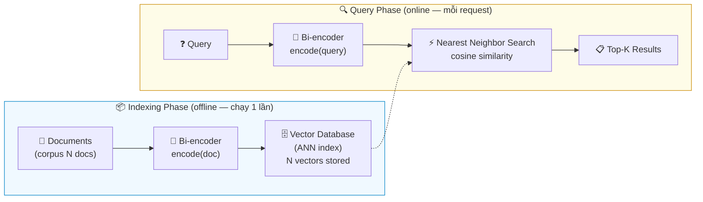
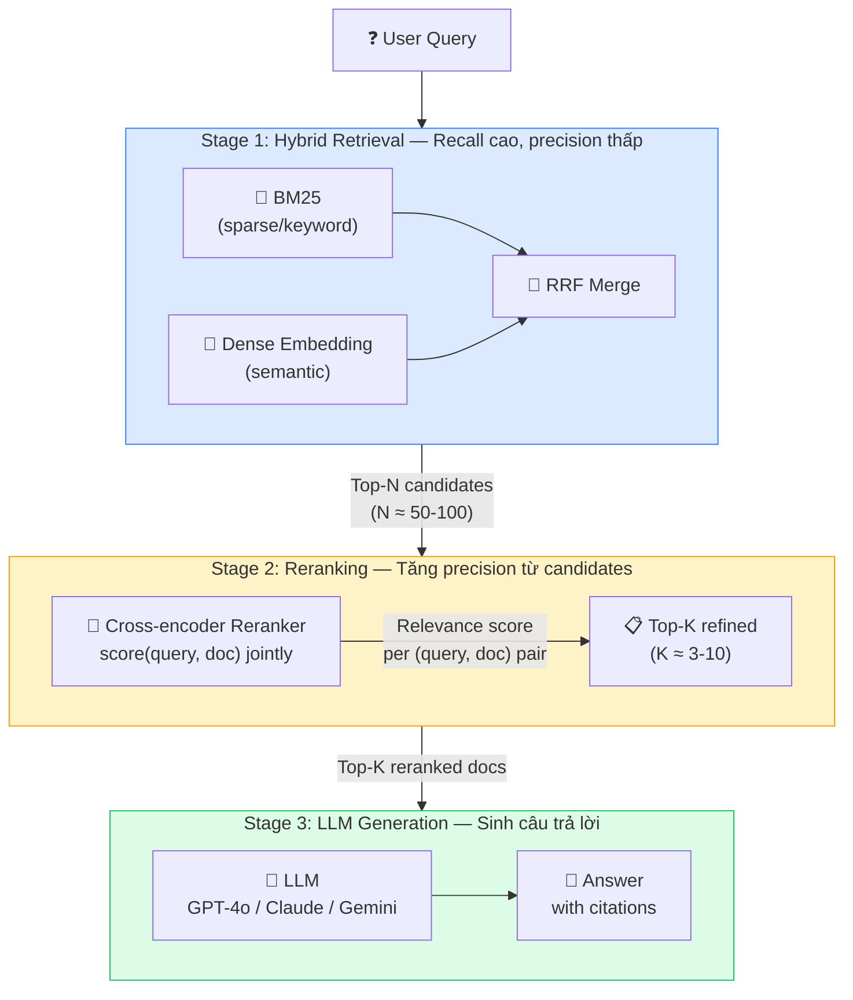
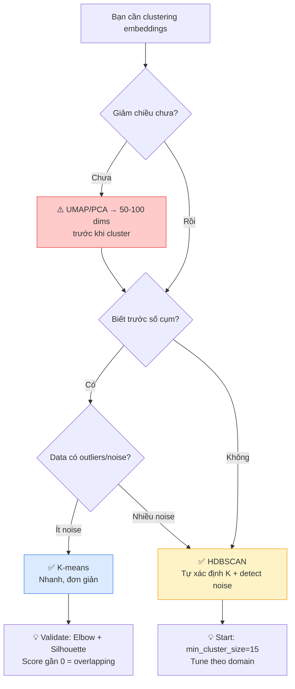
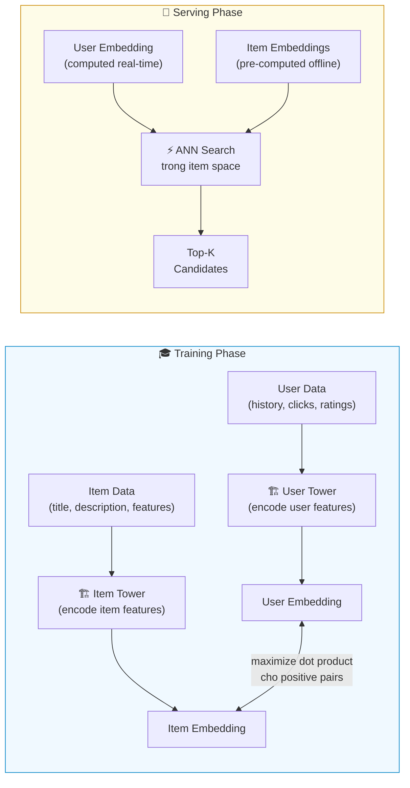
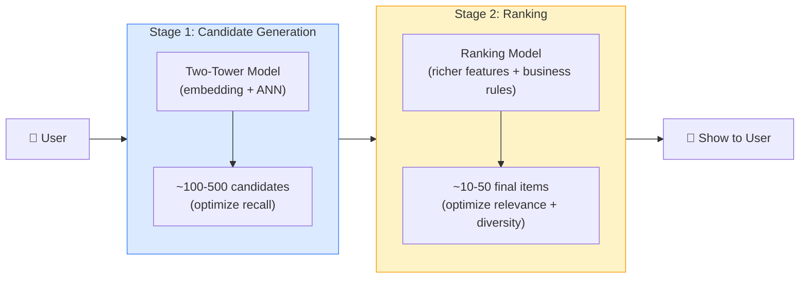

---

# Layer 2 — Systems & Applications (Hệ thống & Ứng dụng)

Layer này chuyển từ nền tảng sang ứng dụng. Nếu `Layer 1` trả lời embedding là gì và hoạt động theo nguyên lý nào, thì `Layer 2` trả lời embedding được đem vào các bài toán thực tế ra sao. Trong phần này, chúng ta sẽ lần lượt đi qua semantic search, RAG, clustering và recommendation; ở mỗi bài toán, trọng tâm không chỉ là model mà còn là cách ghép model vào pipeline hệ thống.

## 2.1 Semantic Search / Information Retrieval

Mục này sẽ nhìn semantic search như một hệ thống hoàn chỉnh: từ vấn đề keyword search gặp phải, cách chọn đơn vị index, cách encode query, cho đến các quyết định quan trọng như bi-encoder, query/document asymmetry, khi nào dense search là đủ, khi nào cần hybrid, và ANN search ở scale lớn.

### Tổng quan

Keyword search (BM25, TF-IDF) so sánh **token chính xác** giữa query và document — nhanh, đơn giản, và hoạt động tốt khi người dùng biết chính xác từ khóa cần tìm. Nhưng nó có một điểm yếu cốt lõi: khi người dùng diễn đạt ý tưởng bằng **từ ngữ khác** với document gốc, keyword search thất bại hoàn toàn. Đây là **vocabulary mismatch problem** — query "cách xử lý lỗi phần mềm" sẽ **không** tìm được document chứa "debug application errors" dù cả hai nói về cùng một thứ.

Semantic search (tìm kiếm ngữ nghĩa) giải quyết vấn đề này bằng cách dùng embeddings để tìm documents **có ý nghĩa liên quan** đến query, thay vì khớp từ ngữ bề mặt. Embedding biểu diễn *ý nghĩa* thay vì *từ ngữ*, nên "xe hơi" và "automobile" nằm gần nhau trong embedding space dù không share ký tự nào. Cùng query "cách xử lý lỗi phần mềm" ở trên, semantic search sẽ tìm được document "debug application errors" — vì cả hai encode ra vectors gần nhau trong semantic space.

Phần nền về **bi-encoder**, **cross-encoder** và **query/document asymmetry** đã có ở [Section 1.4.1](#141-bi-encoder-vs-cross-encoder) và [Section 1.4.2](#142-query-vs-document-asymmetry). Ở `Layer 2`, trọng tâm không còn là định nghĩa từng khái niệm, mà là hiểu chúng được ghép thành **một hệ thống search thực tế** như thế nào.

### Semantic Search Flow — Từ index đến top-K results

Ở mức hệ thống, semantic search thường diễn ra theo ba bước:

1. **Index documents**: mỗi document được encode thành một vector và lưu vào vector database
2. **Encode query**: khi người dùng search, query cũng được encode thành một vector trong **cùng không gian**
3. **Tìm láng giềng gần nhất**: hệ thống so sánh query vector với document vectors để lấy ra top-K documents gần nhất

Trong thực tế, bước retrieve gần như luôn dùng **bi-encoder**. Lý do không phải vì nó chính xác nhất, mà vì nó là lựa chọn hợp lý nhất khi phải search trên tập rất lớn.

### Index theo document hay passage/chunk?

Câu "index documents" ở trên nghe có vẻ đơn giản, nhưng trong hệ thống thực tế còn một quyết định rất quan trọng: **thứ gì mới là đơn vị retrieve**. Có nơi index cả tài liệu, có nơi cắt tài liệu thành các đoạn nhỏ hơn rồi index từng đoạn.

- **Index theo document**: hợp khi mỗi tài liệu ngắn, tập trung vào một chủ đề, và người dùng thường muốn mở cả tài liệu đó
- **Index theo passage/chunk**: hợp khi tài liệu dài, chứa nhiều ý, hoặc hệ thống cần trả lại đúng đoạn liên quan nhất thay vì cả tài liệu

Nếu nhét cả một tài liệu dài vào một vector duy nhất, embedding của tài liệu đó dễ bị "trung bình hóa". Query có thể chỉ liên quan rất mạnh đến một đoạn nhỏ, nhưng vector của toàn tài liệu lại bị pha loãng bởi nhiều phần khác không liên quan.

Vì vậy, semantic search cho knowledge base, help center, API docs hay policy documents thường index theo **passage/chunk** hơn là cả document. Ngược lại, với FAQ ngắn, product cards, hoặc catalog items vốn đã cô đọng, index theo **document** thường vẫn đủ tốt và đơn giản hơn để vận hành.

### Bi-encoder trong Semantic Search — Tại sao vẫn là mặc định

1. **Đặc điểm cốt lõi**: Bi-encoder encode query và document **độc lập** — 2 lần gọi model riêng biệt, không có interaction giữa chúng
2. **Hệ quả 1 (tốc)**: Vì encode độc lập → document embeddings có thể **pre-compute offline** 1 lần rồi lưu vào vector database. Khi có query mới, chỉ cần encode query (1 vector) → tìm nearest neighbors trong vector index → trả kết quả trong ~ms
3. **Hệ quả 2 (xấu)**: Vì encode độc lập → **không có cross-attention** giữa query và document tokens. Model không "thấy" query khi encode document (và ngược lại) → bỏ sót **subtle token-level matching**. Ví dụ: query "Python error handling best practices" và document "try-except patterns in Python for production code" — bi-encoder có thể miss vì 2 câu dùng từ khác nhau cho cùng concept
4. **Giải pháp**: Dùng bi-encoder làm **Stage 1** (lọc nhanh triệu → trăm candidates), rồi cross-encoder **reranker** làm **Stage 2** (re-score chính xác trăm → chục) — xem [Section 2.2](#22-rag--rerank-pipeline-3-giai-đoạn)



> **Tóm lại**: Encode độc lập → pre-compute được → nhanh ở scale triệu documents → nhưng mất cross-attention → cần reranker bổ sung precision. Đây là trade-off cốt lõi của bi-encoder.

Trong đoạn trên, `ANN` là viết tắt của **Approximate Nearest Neighbor** — nhóm thuật toán dùng để tìm vector gần nhất thật nhanh trong tập dữ liệu lớn. Phần dưới sẽ quay lại giải thích cụ thể các thuật toán như HNSW, IVF và DiskANN.

### Asymmetric Search trong thực tế

Một điểm vận hành rất quan trọng là: query và document tuy cùng nằm trong retrieval pipeline, nhưng **không đóng cùng vai trò**:
- Query **hỏi thông tin** — thường ngắn ("best practices for embedding"), là câu hỏi hoặc keyword
- Document **chứa thông tin** — thường dài (đoạn văn, trang web), là nội dung giải thích

Vì thế, semantic search chất lượng tốt thường không chỉ cần đúng model, mà còn cần encode đúng **vai trò** của input. Nếu encode sai kiểu, chất lượng retrieval giảm rõ rệt ngay cả khi embeddings và vector database đều không đổi.

Nhiều modern embedding models yêu cầu chỉ định `input_type`:
- `search_query` — cho câu hỏi/query (ngắn, hỏi thông tin)
- `search_document` — cho document/passage cần index (dài, chứa thông tin)

**Ví dụ ở mức mã giả:**
```text
# When indexing documents
document_embeddings = embed(
    texts=documents,
    input_type="search_document"
)

# When searching
query_embedding = embed(
    texts=[query],
    input_type="search_query"
)
```

⚠️ **Dùng sai input_type sẽ giảm chất lượng retrieval đáng kể** — model encode khác nhau cho query vs document. Đây là lỗi phổ biến khi mới bắt đầu.

> Source: [Cohere Embed docs](https://docs.cohere.com/docs/cohere-embed), [SBERT — Semantic Search](https://www.sbert.net/examples/sentence_transformer/applications/semantic-search/README.html)

### Khi nào Dense Search đủ, khi nào cần Hybrid?

Trong khá nhiều sản phẩm, chỉ dùng **dense retrieval** đã cho chất lượng rất tốt. Điều này thường đúng khi:

- query được viết như câu tự nhiên, có nhiều paraphrase và synonym
- dữ liệu chủ yếu là nội dung mô tả, bài viết, FAQ, hoặc tài liệu giải thích
- người dùng quan tâm đến **ý nghĩa gần đúng** hơn là exact keyword
- hệ thống phải hỗ trợ đa ngôn ngữ hoặc nhiều cách diễn đạt khác nhau

Nhưng chỉ dùng dense retrieval thường chưa đủ an toàn khi:

- corpus có nhiều **mã lỗi**, **SKU**, **product code**, **số điều luật**, **tên riêng**, hoặc các cụm từ phải khớp thật chính xác
- người dùng hay gõ query ngắn theo kiểu từ khóa hơn là câu hỏi tự nhiên
- sai sót retrieval có chi phí cao, ví dụ legal search, medical search, enterprise search nội bộ

Vì vậy, semantic search trong production thường đi theo một quy tắc đơn giản: nếu bài toán thiên về **meaning matching**, dense retrieval là nền rất tốt; nếu **exact term** có giá trị cao hoặc bỏ sót một từ khóa quan trọng là không chấp nhận được, hybrid retrieval (`BM25 + dense`) an toàn hơn nhiều. RAG là một trường hợp rất rõ của logic này, nhưng ngay cả search thông thường cũng thường cần cùng kiểu kết hợp.

### ANN Algorithms — Tìm kiếm nhanh trong triệu vectors

Sau khi documents hoặc passages đã được encode và lưu sẵn, bài toán còn lại là: với một query vector mới, làm sao tìm được các document vectors gần nhất đủ nhanh. Cách đơn giản nhất là brute-force search — so sánh query với **tất cả** N vectors, complexity O(N). Với vài nghìn documents thì ổn, nhưng khi N = hàng triệu hay hàng tỷ, brute-force trở nên quá chậm. ANN (Approximate Nearest Neighbor) algorithms giải quyết bằng cách **hy sinh một chút accuracy để đạt tốc độ sub-linear** — tìm "gần đúng" top-K vectors nhanh hơn nhiều lần.

#### HNSW (Hierarchical Navigable Small World)

**Cách hoạt động**: Xây một **multi-layer graph** trên tập vectors. Layer cao nhất chỉ có vài nodes (long-range connections), layer thấp nhất có tất cả nodes (short-range connections). Search bắt đầu từ layer cao → nhảy nhanh đến vùng gần đúng → xuống layer thấp → tìm chính xác trong vùng lân cận.

**Tại sao hay dùng?** Vì HNSW thường cho latency thấp và recall cao trong nhiều use case search thực tế. Đổi lại, nó tốn RAM và không phải lựa chọn rẻ nhất khi corpus rất lớn.

#### IVF (Inverted File Index)

**Cách hoạt động**: Chia không gian vector thành K clusters (bằng K-means). Mỗi cluster lưu danh sách vectors thuộc cluster đó. Khi search: tìm cluster gần nhất với query → chỉ search trong cluster đó (và vài clusters lân cận).

**Khi nào hợp lý?** Khi muốn tiết kiệm memory hơn graph-based search. Đổi lại, IVF cần bước partition trước và thường nhạy hơn với cách dữ liệu được phân cụm.

#### DiskANN

**Cách hoạt động**: Giống HNSW nhưng lưu graph trên **disk** thay vì RAM. Dùng SSD random reads thay vì memory access.

**Khi nào dùng?** Khi dataset quá lớn cho RAM nhưng vẫn cần giữ chất lượng search tốt. Đổi lại, latency thường cao hơn in-memory ANN.

| Algorithm | Ý tưởng | Điểm mạnh chính | Trade-off chính | Dùng trong |
|-----------|---------|-----------------|-----------------|-----------|
| **HNSW** | Multi-layer graph | Nhanh, recall cao | Tốn RAM | Qdrant, Weaviate, pgvector, Pinecone |
| **IVF** | K-means partition | Ít memory hơn | Cần partition/training trước | FAISS, Milvus |
| **DiskANN** | Graph trên SSD | Scale rất lớn | Latency cao hơn in-memory | Milvus |

> **Recall vs Latency là trade-off cốt lõi**: Không có ANN algorithm nào vừa nhanh nhất vừa chính xác nhất. Ở `Layer 2`, điều quan trọng là hiểu vì sao ANN tồn tại. Chi tiết tuning và chọn vector database phù hợp sẽ được đi sâu hơn ở `Layer 3`.

> Sources: [FAISS wiki — Indexes](https://github.com/facebookresearch/faiss/wiki/Faiss-indexes), [HNSW paper — Malkov & Yashunin, 2018](https://arxiv.org/abs/1603.09320), [SBERT — Semantic Search](https://www.sbert.net/examples/sentence_transformer/applications/semantic-search/README.html)

---

## 2.2 RAG + Rerank (Pipeline 3 giai đoạn)

Mục này sẽ đi qua toàn bộ pipeline RAG theo đúng thứ tự vận hành: vì sao cần retrieval, vì sao Stage 1 phải ưu tiên recall, vì sao cần rerank ở Stage 2, cách ghép các chunks đã retrieve thành context có ích, và LLM ở Stage 3 phụ thuộc vào toàn bộ phần trước như thế nào.

### Tổng quan — Tại sao cần RAG?

**Retrieval-Augmented Generation (RAG)** kết hợp retrieval với LLM generation. Để hiểu tại sao cần RAG, hãy theo chuỗi nhân-quả:

1. **LLM chỉ biết training data** — knowledge bị đóng băng tại cutoff date. Không biết tài liệu nội bộ công ty, sản phẩm mới, hay tin tức hôm nay
2. **Không thể retrain liên tục** — fine-tuning tốn kém (GPU hours, data preparation) và vẫn không giải quyết real-time data
3. **Cần inject context vào prompt** — đưa thông tin liên quan vào prompt để LLM trả lời dựa trên context thực tế
4. **Nhưng context window có giới hạn** — không thể đưa toàn bộ database vào prompt (128K tokens ≈ 100 trang — vẫn quá nhỏ cho enterprise data)
5. **→ Cần retrieval để chọn context phù hợp nhất** — tìm đúng 3-10 chunks liên quan nhất từ hàng triệu documents → đưa vào prompt → LLM sinh câu trả lời **grounded trong actual documents**

**Kết quả**: RAG giảm hallucination (answer có nguồn), knowledge luôn up-to-date (chỉ cần update database), và không cần retrain LLM.

### Diagram: RAG + Rerank Pipeline



### Nguyên tắc quan trọng: Optimize Recall trước Rerank

> ⚠️ **Reranker chỉ sắp xếp lại những gì đã được retrieve — không thể recover documents bị miss ở Stage 1.**

Nếu Stage 1 trả về 100 candidates mà document chứa câu trả lời **không nằm trong đó** → reranker và LLM đều không thể cứu. Vì vậy:
- **Recall@N** (Stage 1) quan trọng hơn **Precision@N** ở stage này
- Stage 1 nên cast a wide net (N = 50-100) để maximize recall
- Stage 2 (reranker) sẽ tăng precision từ candidates đó
- Chất lượng **chunking** ảnh hưởng trực tiếp đến recall — nếu chunk cắt giữa câu trả lời, embedding không capture được ý → miss document. Xem chi tiết chunking strategies tại [Section 3.3](#33-chunking-strategies)

### Stage 1: Hybrid Retrieval (BM25 + Dense)

Phần nền về **dense**, **sparse** và **hybrid retrieval** đã có ở [Section 1.4.4](#144-dense-sparse-hybrid). Trong RAG, việc kết hợp này đặc biệt quan trọng vì **Stage 1 phải ưu tiên recall**: lấy đủ rộng để không bỏ sót đoạn chứa câu trả lời.

**Tại sao cần kết hợp?** Vì BM25 và dense embedding **mạnh ở những chỗ khác nhau**, và yếu ở những chỗ khác nhau:

| Method | Mạnh — và tại sao | Yếu — và tại sao |
|--------|-------------------|-------------------|
| **BM25 (Sparse)** | Exact keyword match: tên riêng ("GPT-4o"), mã sản phẩm ("SKU-1234"), thuật ngữ chuyên ngành ("habeas corpus"). Vì BM25 so sánh **token chính xác** → không bỏ sót rare terms | Không hiểu synonyms ("mèo" ≠ "cat"), paraphrases ("how to fix" ≠ "troubleshooting guide"). Vì BM25 chỉ match **surface form**, không hiểu semantics |
| **Dense Embedding** | Semantic similarity: paraphrases, đa ngôn ngữ, câu hỏi tự nhiên. Vì embedding capture **ý nghĩa** thay vì từ ngữ → "fix bug" gần "debug error" | Yếu exact match: rare terms, proper nouns, product codes. Vì embedding **nén toàn bộ câu thành 1 vector** → mất chi tiết token-level |

**Reciprocal Rank Fusion (RRF)** — merge 2 ranked lists **không cần normalize scores**:

$$\text{RRF\_score}(d) = \sum_{i} \frac{1}{k + \text{rank}_i(d)}$$

**Tại sao RRF hoạt động tốt?** BM25 trả về scores dạng TF-IDF (giá trị 0-30+), dense retrieval trả về cosine similarity (giá trị 0-1). Hai scales **không so sánh trực tiếp được**. RRF giải quyết bằng cách chỉ dùng **rank** (vị trí), không dùng score → robust khi merge lists từ models khác nhau. Constant `k` (thường = 60) smooths contribution — documents ranked cao ở cả 2 lists sẽ có RRF score cao nhất.

**Tỷ lệ dense/sparse**: Heuristic phổ biến **70-80% dense + 20-30% sparse**, nhưng phụ thuộc domain:
- **Legal/medical**: sparse cao hơn (40-50%) vì exact terminology quan trọng ("Section 230", "myocardial infarction")
- **Casual Q&A**: dense cao hơn (80-90%) vì users diễn đạt tự nhiên, nhiều paraphrases
- **Không có chuẩn cố định** — phải tune trên eval data của domain mình

### Stage 2: Reranking — Tăng precision trên tập candidates nhỏ

Phần nền về **bi-encoder** và **cross-encoder** đã có ở [Section 1.4.1](#141-bi-encoder-vs-cross-encoder). Trong RAG, sự khác biệt đó trở thành một chiến lược hệ thống rất rõ:

- **Stage 1** dùng retriever nhanh để lấy ra một tập candidates đủ rộng
- **Stage 2** dùng reranker chính xác hơn để đọc lại từng cặp `(query, chunk)` trong tập nhỏ đó

Reranking hiệu quả hơn retrieval ở bước này vì:

- retriever nén mỗi chunk thành một vector để giữ scale, nên dễ mất chi tiết token-level
- reranker nhìn query và chunk **cùng lúc**, nên thấy được các tín hiệu khớp tinh vi hơn
- số lượng candidates lúc này chỉ còn khoảng `50-100`, nên chi phí chấm từng cặp là chấp nhận được

| Giai đoạn | Mục tiêu chính | Loại model thường dùng | Quy mô xử lý |
|-----------|----------------|------------------------|--------------|
| **Stage 1 — Retrieve** | Maximize recall | Bi-encoder / hybrid retrieval | Hàng triệu chunks |
| **Stage 2 — Rerank** | Tăng precision | Cross-encoder reranker | ~50-100 candidates |

→ **Pattern tổng quát**: retrieval mở rộng trước, reranking làm sắc lại sau. Nếu Stage 1 bỏ sót evidence, Stage 2 không thể tự tạo lại nó.

**Reranker models nổi bật:**
- **Cohere Rerank v3.5** — managed API, multilingual, dễ integrate. — [docs](https://docs.cohere.com/docs/rerank-overview)
- **BGE Reranker** — open-source, self-hosted, hỗ trợ multilingual
- **ColBERT** (Contextualized Late Interaction over BERT) — **middle ground** giữa bi-encoder và cross-encoder:

  **ColBERT hoạt động thế nào?** Encode query và document **riêng rẽ** (như bi-encoder) → nhưng giữ **tất cả token embeddings** thay vì compress thành 1 vector. Khi scoring: tính **MaxSim** — mỗi query token tìm document token match nhất → sum tất cả MaxSim scores.

  **Tại sao tốt hơn bi-encoder?** Vì giữ token-level information thay vì compress. **Tại sao nhanh hơn cross-encoder?** Vì encode riêng → document token embeddings có thể precompute offline. Chỉ cần compute MaxSim at query time.

  > Source: [ColBERT paper — Khattab & Zaharia, 2020](https://arxiv.org/abs/2004.12832)

### Context Assembly — Từ top-K chunks đến prompt cuối

Sau khi rerank xong, pipeline vẫn chưa thật sự hoàn tất. Top-K chunks lúc này mới chỉ là **nguyên liệu thô**; hệ thống còn phải quyết định **đưa chunk nào vào prompt, theo thứ tự nào, và bỏ bớt phần nào** để không làm loãng context.

Một vài nguyên tắc rất thực tế:

- **Bỏ trùng lặp**: nhiều chunks có thể nói cùng một ý bằng câu chữ hơi khác nhau; nếu nhét tất cả vào prompt, ta chỉ lãng phí token budget
- **Ưu tiên evidence trực tiếp**: đoạn nào trả lời đúng trọng tâm câu hỏi nên được đưa lên trước; background chỉ nên thêm khi thật sự giúp hiểu ngữ cảnh
- **Giữ metadata quan trọng**: tiêu đề, nguồn, section name, timestamp hoặc document ID thường giúp LLM trích dẫn và diễn giải đúng hơn
- **Sắp xếp có chủ đích**: có hệ thống xếp theo relevance score, có hệ thống gom theo tài liệu gốc rồi giữ thứ tự tự nhiên trong tài liệu để tránh mất mạch
- **Tôn trọng token budget**: ba chunks ngắn nhưng sắc thường hữu ích hơn mười chunks dài và loãng

Nếu context assembly làm không tốt, retrieval có thể đúng mà câu trả lời cuối vẫn kém: evidence chính bị chìm giữa các đoạn phụ, prompt lặp ý, citations rối, hoặc hai đoạn mâu thuẫn bị đặt cạnh nhau mà không có tín hiệu phân giải.

### Stage 3: LLM Generation

LLM nhận top-K reranked documents làm context → generate câu trả lời có citations. Chất lượng answer **phụ thuộc trực tiếp vào chất lượng retrieved chunks** — đây là lý do optimize Stage 1 và Stage 2 quan trọng hơn chọn LLM nào.

Prompt thường yêu cầu:
- Chỉ trả lời dựa trên context (giảm hallucination)
- Trích dẫn nguồn [1], [2] cho mỗi claim
- Nói "không biết" nếu context không chứa câu trả lời

### Evaluation Metrics cho RAG

| Giai đoạn | Metric | Ý nghĩa | Tại sao quan trọng |
|-----------|--------|---------|-------------------|
| **Stage 1** | Recall@N | Bao nhiêu relevant docs nằm trong N candidates? | Reranker không thể recover docs bị miss → recall là ceiling |
| **Stage 2** | nDCG@K | Relevant docs có ở vị trí cao trong top-K? | Docs ở vị trí 1-3 ảnh hưởng LLM nhiều hơn vị trí 8-10 |
| **Stage 3** | Faithfulness | Answer có grounded trong context? | Phát hiện hallucination — LLM bịa thông tin không có trong context |
| **Stage 3** | Answer Relevance | Answer có trả lời đúng câu hỏi? | Context đúng nhưng LLM trả lời lạc đề |

> Sources: [RAG paper — Lewis et al., 2020](https://arxiv.org/abs/2005.11401), [Pinecone Rerankers Guide](https://docs.pinecone.io/guides/search/rerank-results), [Cohere Rerank Overview](https://docs.cohere.com/docs/rerank-overview), [SBERT Retrieve & Re-rank](https://www.sbert.net/examples/sentence_transformer/applications/retrieve_rerank/README.html)

### Mã giả: Retrieve → Rerank → Generate

```text
query = "What is Matryoshka Representation Learning?"

# Stage 1: retrieve a broad candidate set
# In production, embedding and rerank calls are often batched and sometimes async
# to avoid sending one chunk or one document per network round-trip.
query_embedding = embed(query)
candidates = hybrid_retrieve(
    query=query,
    query_embedding=query_embedding,
    top_n=50
)

# Stage 2: rerank for precision
top_results = rerank(
    query=query,
    documents=candidates,
    top_k=5
)

# Stage 3: generate with grounded context
context = build_context(top_results)
answer = generate(
    question=query,
    context=context,
    instruction="Answer only from the provided context and cite evidence"
)

return answer
```

---

## 2.3 Clustering (Phân cụm)

Mục này chuyển sang một kiểu sử dụng embeddings khác: không còn đi tìm tài liệu cho một query cụ thể, mà dùng embeddings để khám phá cấu trúc ẩn của dữ liệu. Chúng ta sẽ lần lượt xem khi nào nên dùng clustering thay vì classification, vì sao cần giảm chiều trước khi cluster, khi nào dùng K-means hay HDBSCAN, và làm sao kiểm tra cluster có thật sự hữu ích hay không.

### Tổng quan

Ở §2.1 và §2.2, ta dùng embeddings để **tìm** documents liên quan đến một query cụ thể — luôn bắt đầu từ câu hỏi của người dùng. Nhưng đôi khi ta chưa có câu hỏi nào cả, mà muốn **khám phá cấu trúc** của dữ liệu: trong hàng nghìn bài viết, có những nhóm chủ đề nào? Feedback khách hàng tập trung vào những vấn đề gì? Vì embeddings đặt items có ý nghĩa tương tự **gần nhau** trong vector space, câu hỏi "vectors nào nằm gần nhau?" chính là bài toán **phân cụm** (clustering) — gom các items vào nhóm mà **không cần labels** (unsupervised).

**Use cases thực tế:**
- **Topic discovery**: gom hàng nghìn bài viết thành nhóm chủ đề (AI, finance, health...) → tự động tạo taxonomy
- **Customer segmentation**: phân loại feedback/reviews theo chủ đề → biết khách hàng phàn nàn về gì nhiều nhất
- **Data exploration**: khám phá cấu trúc ẩn trong dataset trước khi build models → hiểu distribution
- **Content organization**: tự động tạo categories cho knowledge base → routing câu hỏi đến đúng team
- **Anomaly triage**: cluster support tickets → ticket nào không thuộc cluster nào = potentially new issue

### Khi nào dùng Clustering, khi nào nên Classification?

Clustering và classification đều là cách gom dữ liệu thành nhóm, nhưng chúng phục vụ hai giai đoạn rất khác nhau của bài toán.

- **Clustering** phù hợp khi chưa có labels rõ ràng, hoặc chính ta còn chưa biết taxonomy nên trông như thế nào
- **Classification** phù hợp khi categories đã ổn định và hệ thống cần gán nhãn **nhất quán** cho dữ liệu mới

Nói ngắn gọn: clustering giúp **khám phá**, còn classification giúp **vận hành**. Trong nhiều dự án thực tế, quy trình thường là:

1. dùng clustering để nhìn ra các nhóm chủ đề tự nhiên trong dữ liệu
2. con người đọc các cụm, chỉnh sửa và đặt tên taxonomy
3. khi taxonomy đã đủ ổn định, chuyển sang classification để gán nhãn tự động với chất lượng lặp lại được

Vì vậy, clustering thường là bước rất tốt ở đầu dự án hoặc khi domain thay đổi nhanh. Nhưng nếu tổ chức đã có bộ nhãn rõ ràng và cần dự đoán đáng tin cậy cho từng record mới, classification thường là công cụ phù hợp hơn.

### Lưu ý quan trọng: Curse of Dimensionality

Với K-means hay HDBSCAN ở phần dưới, bước đầu tiên bạn nghĩ đến có thể là đưa embeddings (1536 dims) **thẳng vào** clustering algorithm. Đây là sai lầm phổ biến.

> ⚠️ **Embedding vectors 1536 dims không nên cluster trực tiếp.**

**Tại sao?** Clustering algorithms dựa vào **khoảng cách** để phân biệt "gần" vs "xa" — nhưng trong không gian chiều cao (high-dimensional space), khoảng cách giữa mọi cặp điểm **converge về cùng một giá trị**. Hiện tượng này gọi là **curse of dimensionality**: khi số chiều tăng, tỷ lệ giữa khoảng cách gần nhất và xa nhất tiến về 1. Hệ quả: algorithm không phân biệt được điểm nào "gần" vs "xa" → cluster boundary mờ nhạt → kết quả kém.

Ngoài chuyện hình học trở nên kém phân biệt, số chiều cao còn làm compute tăng rất nhanh. Chỉ riêng việc quét brute-force qua `1 triệu` vectors `1536` chiều đã đòi hỏi cỡ `1.5 tỷ` phép nhân-cộng cho một lượt so sánh toàn bộ, nên đây vừa là vấn đề chất lượng, vừa là vấn đề hiệu năng.

**Giải pháp**: Giảm chiều trước khi cluster:
- **UMAP** (50-100 dims) cho clustering — giữ cấu trúc local neighborhood
- **PCA** (50-100 dims) nếu cần tốc độ — linear, deterministic
- **UMAP** (2-3 dims) cho visualization — nhưng **không dùng 2D UMAP output để cluster** (mất quá nhiều thông tin)

### K-means — Phù hợp nhất khi các cụm có hình dạng gần giống hình cầu

K-means là thuật toán clustering phổ biến nhất vì đơn giản và nhanh. Thuật toán bắt đầu bằng việc đặt trước `K` điểm đại diện vào dữ liệu, rồi liên tục cập nhật các điểm đại diện đó về giữa nhóm điểm đang thuộc về chúng. Trong K-means, điểm đại diện này gọi là **centroid**, tức **tâm của cụm**.

Phần dưới đây lần lượt trình bày cách thuật toán hoạt động, điều kiện dữ liệu mà nó xử lý tốt, và những trường hợp nó thường cho kết quả kém.

**Cách hoạt động:**
1. Chọn trước số cụm `K`, rồi đặt `K` centroid ban đầu vào dữ liệu
2. Mỗi điểm dữ liệu được gán vào centroid gần nhất
3. Với mỗi cụm, tính lại centroid = **trung bình** (mean) của tất cả điểm trong cụm đó
4. Lặp lại bước 2-3 cho đến khi các centroid gần như không còn thay đổi nữa

> K-means thường dùng **L2 distance** (Euclidean distance), tức khoảng cách đường thẳng giữa hai điểm trong không gian vector.

**Mục tiêu tối ưu**: giảm **inertia** xuống thấp nhất. Có thể hiểu inertia là **tổng bình phương khoảng cách từ mỗi điểm đến tâm cụm của nó**:

$$\text{Inertia} = \sum_{i=1}^{N} \|x_i - \mu_{c(i)}\|^2$$

Nếu không muốn nhớ công thức, chỉ cần nhớ ý chính: K-means cố làm cho **các điểm trong cùng cụm nằm càng gần tâm cụm càng tốt**.

**Vì sao K-means phù hợp nhất khi các cụm gần giống hình cầu?** Đây là hệ quả trực tiếp từ cách thuật toán hoạt động:

1. Mỗi điểm luôn được gán cho **tâm gần nhất**
2. Vì vậy, mỗi cụm thực chất là một vùng dữ liệu **bao quanh một tâm**
3. Cách chia này hợp với các cụm tương đối **tròn**, gọn và có kích thước không quá lệch nhau
4. Ngược lại, nếu cụm có hình dạng **dài**, **cong**, hoặc một cụm rất dày còn cụm khác rất thưa, K-means thường chia không tốt

Hai tình huống thường gặp:
- Nếu dữ liệu trông như vài "đám mây điểm" tròn, tách nhau khá rõ, K-means thường hoạt động ổn
- Nếu dữ liệu trông như hai dải dài hoặc hai hình lưỡi liềm, K-means vẫn cố chia theo các vùng quanh tâm cụm, nên dễ cắt sai

| Ưu điểm | Nhược điểm |
|---------|------------|
| Đơn giản, dễ hiểu | Phải chỉ định trước K (số cụm) |
| Nhanh — O(NKd) mỗi iteration | Phù hợp nhất khi các cụm khá tròn và không quá lệch nhau về kích thước |
| Scale tốt đến triệu điểm | Nhạy cảm với khởi tạo (dùng k-means++) |
| Kết quả lặp lại được khi fix seed | Không xử lý outlier — mỗi điểm **buộc phải** thuộc 1 cluster |

**Chọn K**: dùng **Elbow method** (plot inertia vs K, chọn "khuỷu tay" — điểm mà tăng K không giảm inertia đáng kể) hoặc **Silhouette score**.

**Silhouette score** — đo chất lượng clustering:

$$s(i) = \frac{b(i) - a(i)}{\max(a(i), b(i))}$$

Trong đó:
- `a(i)` = khoảng cách trung bình từ điểm i đến **các điểm cùng cluster** (intra-cluster)
- `b(i)` = khoảng cách trung bình từ điểm i đến **cluster gần nhất** khác (inter-cluster)
- Score gần **+1** = điểm nằm rõ trong cluster. Score gần **0** = overlapping. Score **âm** = có thể sai cluster.

Diễn giải thực tế:
- **Silhouette cao** = các cụm tách nhau khá rõ
- **Silhouette gần 0** = các cụm chồng lấn nhiều
- **Silhouette âm** = có điểm nhiều khả năng đang bị gán sai cụm

> Source: [scikit-learn K-means](https://scikit-learn.org/stable/modules/generated/sklearn.cluster.KMeans.html)

### HDBSCAN — Khi Clusters có Density khác nhau

Nếu K-means phù hợp với các cụm khá tròn và tương đối đồng đều, thì HDBSCAN phù hợp hơn với dữ liệu "lộn xộn" hơn. Thay vì ép dữ liệu vào đúng `K` cụm, HDBSCAN đi tìm những vùng có **mật độ điểm cao**.

Ở đây, **mật độ** có thể hiểu là: trong vùng xung quanh một điểm, có nhiều điểm khác nằm gần nó hay không.

**Cách hoạt động ở mức khái quát:**
1. Tìm những vùng mà nhiều điểm nằm sát nhau
2. Gom các vùng dày đặc đó thành cụm
3. Nếu một điểm nằm lẻ loi, không thực sự thuộc vùng dày đặc nào, HDBSCAN có thể coi nó là **noise** thay vì ép nó vào một cụm
4. Từ cấu trúc đó, thuật toán tự quyết định nên có bao nhiêu cụm là hợp lý

Về mặt thuật toán, HDBSCAN vẫn có những khái niệm như `core distance`, `mutual reachability distance`, hay một cấu trúc cây để tìm ra các cụm ổn định nhất. Ở mức ứng dụng, điều cần nắm là:

- nó tìm cụm dựa trên **vùng dày đặc**
- nó **không bắt buộc** mọi điểm phải thuộc một cụm
- nó có thể tự quyết định số cụm thay vì buộc ta chọn trước `K`

**Vì sao HDBSCAN thường hợp hơn K-means cho embeddings?** Vì dữ liệu thực tế hiếm khi đẹp như vài cụm tròn, đều nhau:
- Có cụm rất lớn, có cụm rất nhỏ
- Có cụm đậm đặc, có cụm thưa hơn
- Có nhiều điểm "lạc đàn" không thật sự thuộc chủ đề nào rõ ràng
- Có những cụm kéo dài hoặc méo, không tròn

Trong các trường hợp đó, HDBSCAN thường linh hoạt hơn K-means.

| Ưu điểm | Nhược điểm |
|---------|------------|
| **Tự xác định số cụm** — không cần chỉ định K | Chậm hơn K-means ở scale lớn |
| Phát hiện **outlier/noise** (label = -1) | Cần tune `min_cluster_size` |
| Xử lý tốt hơn khi cụm có mật độ/hình dạng khác nhau | Kết quả phụ thuộc vào hyperparameters |
| Robust với noise trong data | Khó scale >1M points (có approximate modes) |

> Source: [scikit-learn HDBSCAN](https://scikit-learn.org/stable/modules/generated/sklearn.cluster.HDBSCAN.html), [HDBSCAN paper — Campello et al., 2013](https://link.springer.com/chapter/10.1007/978-3-642-37456-2_14)

### K-means vs HDBSCAN — Decision Tree

Có thể tóm tắt việc chọn thuật toán như sau:
- **K-means**: dùng khi bạn biết trước số cụm và dữ liệu khá gọn, khá sạch
- **HDBSCAN**: dùng khi dữ liệu lộn xộn hơn, có noise, hoặc bạn chưa biết rõ nên chia thành bao nhiêu cụm



Đến đây, ta đã có một pipeline khá rõ: giảm chiều trước, chọn K-means nếu dữ liệu tương đối gọn và biết trước số cụm, hoặc chọn HDBSCAN nếu dữ liệu có noise và hình dạng cụm phức tạp hơn. Nhưng chọn được thuật toán mới chỉ là nửa đầu của bài toán.

Bước tiếp theo là kiểm tra xem các cụm vừa tạo ra có thật sự đáng tin và hữu ích hay không. Đây là lúc nhiều người nhìn ngay vào UMAP 2D plot để kết luận, vì hình vẽ thường rất trực quan. Vấn đề là UMAP 2D chỉ nên được xem như công cụ quan sát nhanh, không phải bằng chứng cuối cùng về chất lượng clustering.

### Đánh giá Cluster — UMAP 2D chỉ là một phần của câu chuyện

UMAP 2D plot có thể trông rất đẹp nhưng vẫn **gây hiểu nhầm**. Trong quá trình chiếu dữ liệu từ không gian nhiều chiều xuống 2D, UMAP có thể làm xuất hiện các cụm nhìn có vẻ tách biệt dù trong không gian gốc chúng không tách rõ, hoặc ngược lại làm các cụm thật bị dính vào nhau. Vì vậy, việc đánh giá cluster nên đi theo một quy trình đầy đủ hơn:

1. **Chuẩn hóa embeddings** trước khi cluster (nếu đang làm việc theo cosine similarity)
2. **Giảm chiều** bằng UMAP/PCA xuống khoảng 50-100 chiều để cluster (không phải 2D)
3. **Cluster** bằng K-means hoặc HDBSCAN
4. **Lấy ví dụ đại diện**: chọn 5-10 samples tiêu biểu trong mỗi cluster → đọc thủ công → đặt tên cluster
5. **Kiểm tra ích lợi thực tế**: clusters có giúp task thực tế không?
   - Routing: tickets được route đúng team?
   - Taxonomy: categories có ý nghĩa business?
   - Dedup: cluster grouping có overlap hợp lý?

> Các metric như silhouette hay inertia chỉ cho biết cluster có "đẹp về mặt hình học" hay không. Chúng không tự bảo đảm cluster đó có **ý nghĩa về mặt nội dung**.
> Ví dụ: một cluster có silhouette rất cao nhưng lại gom "AI" với "blockchain" vào cùng nhóm thì với người dùng cuối, cluster đó vẫn không hữu ích.

### Mã giả: Clustering + UMAP Visualization

Đoạn mã giả dưới đây ghép lại toàn bộ quy trình trên: normalize embeddings, giảm chiều để cluster, chạy cả K-means lẫn HDBSCAN, rồi mới dùng UMAP 2D cho visualization như một bước quan sát riêng.

```text
embeddings = load_embeddings(texts)

# Step 1: normalize if the similarity setup depends on cosine
normalized_embeddings = l2_normalize(embeddings)

# Step 2: reduce dimensions for clustering
cluster_vectors = reduce_dimensions(
    normalized_embeddings,
    method="UMAP or PCA",
    target_dims=50
)

# Step 3a: run K-means
kmeans_labels = kmeans(cluster_vectors, k=5)
kmeans_score = silhouette(cluster_vectors, kmeans_labels)

# Step 3b: run HDBSCAN
hdbscan_labels = hdbscan(
    cluster_vectors,
    min_cluster_size=15,
    min_samples=5
)
noise_count = count_noise_points(hdbscan_labels)

# Step 4: reduce separately for 2D visualization
viz_points = reduce_dimensions(
    normalized_embeddings,
    method="UMAP",
    target_dims=2
)

# Step 5: inspect and compare the clustering outputs
plot(viz_points, labels=kmeans_labels, title="K-means clusters")
plot(viz_points, labels=hdbscan_labels, title="HDBSCAN clusters")
representative_samples = sample_examples_per_cluster(texts, hdbscan_labels)

# Step 6: validate with real task usefulness
review(representative_samples)
check_business_usefulness()
```

---

## 2.4 Recommendation Systems

Mục này cho thấy cùng tư duy retrieval có thể được áp dụng sang recommendation. Chúng ta sẽ lần lượt đi qua two-tower architecture, pipeline candidate generation → ranking, lý do recommendation thường dùng dot product, bài toán cold-start, cách đánh giá chất lượng hệ thống, và việc cân bằng giữa exploration với exploitation trong vận hành thực tế.

### Tổng quan

Bài toán recommendation có một thách thức quen thuộc: từ hàng triệu items (phim, sản phẩm, bài viết), chọn ra vài chục items phù hợp nhất cho **mỗi** user — và phải nhanh (real-time). Nếu nghe giống bài toán search (từ hàng triệu documents, tìm vài chục liên quan nhất), đó không phải trùng hợp — cả hai đều là bài toán **tìm nearest neighbors ở scale lớn**.

Embedding-based recommendation giải quyết bằng cách đặt **users** và **items** vào **cùng một không gian vector**. Khi user và item gần nhau → item phù hợp với user đó. Đây chính là **bi-encoder pattern** từ [Section 1.4.1](#141-bi-encoder-vs-cross-encoder) áp dụng cho domain khác: thay vì encode query/document **độc lập** → pre-compute document embeddings → ANN lookup, ta encode user/item **độc lập** → pre-compute item embeddings → ANN lookup → top-K recommendations. Cùng nguyên lý, cùng trade-offs, khác domain.

### Two-Tower Architecture — Bi-encoder cho Recommendation



**Kiến trúc chi tiết:**

- **User tower**: encode user features (browsing history, demographics, device, time of day) → **user embedding**
- **Item tower**: encode item features (title, description, category, price, popularity) → **item embedding**
- **Scoring**: `score(user, item) = user_embedding · item_embedding`

**Tại sao Two-Tower scale được?**
1. **Item embeddings pre-compute offline** — giống document embeddings trong search. Hàng triệu items được encode 1 lần → lưu vào vector database
2. **User embedding compute real-time** — khi user request, chỉ cần encode 1 user vector
3. **ANN search** trong item embedding space → trả về top-K candidates trong ~ms
4. → Scale đến **hàng triệu items** mà vẫn giữ latency thấp. YouTube dùng pattern này cho billions of videos.

### Candidate Generation → Ranking — Pipeline 2 giai đoạn

Giống RAG (retrieve → rerank → generate), recommendation systems thường có **2 giai đoạn**, với logic tương tự:



**Stage 1 — Candidate Generation** (tương đương retrieval trong RAG):
- Two-Tower + ANN: cast wide net, lấy ~100-500 candidates
- **Optimize recall**: không bỏ sót items user có thể thích
- Cheap model (embedding + dot product) → fast

**Stage 2 — Ranking** (tương đương reranking trong RAG):
- Model phức tạp hơn: dùng thêm features (user history sequence, item freshness, context)
- **Business rules**: diversity (không recommend cùng category), freshness, ad revenue
- Expensive model → chỉ chạy trên ~100-500 candidates từ Stage 1

> **Pattern chung**: Retrieval (cheap, wide) → Ranking (expensive, precise). Pattern này xuất hiện trong cả search, recommendation, và ads targeting. Lý do: không có model nào vừa chính xác vừa scalable — nên chia thành 2 stages.

> Sources: [Google ML — Recommendation: Candidate Generation](https://developers.google.com/machine-learning/recommendation/overview/candidate-generation), [Deep Neural Networks for YouTube Recommendations — Covington et al., 2016](https://research.google/pubs/deep-neural-networks-for-youtube-recommendations/), [Google Cloud — Two-Tower Architecture](https://cloud.google.com/architecture/implement-two-tower-retrieval-large-scale-candidate-generation)

### Tại sao dùng Dot Product thay vì Cosine?

Trong recommendation, **popularity là tín hiệu quan trọng**, và dot product capture nó tự nhiên:

| Aspect | Dot Product | Cosine Similarity |
|--------|------------|-------------------|
| **Công thức** | `A·B = ‖A‖‖B‖cos(θ)` | `cos(θ) = (A·B)/(‖A‖‖B‖)` |
| **Magnitude** | Giữ tín hiệu norm | Normalize → mất norm |
| **Item phổ biến** | Score cao tự nhiên (norm lớn) | Không ưu tiên |
| **Ý nghĩa** | Relevance × Popularity | Pure relevance only |
| **Use case** | Recommend items vừa liên quan vừa phổ biến | Tìm items tương tự nhất (diversity) |

**Tại sao norm encode popularity?** Items phổ biến (nhiều interactions) được model thấy nhiều lần trong training → gradients tích lũy → embedding norm lớn hơn. Đây là tính chất tự nhiên của training process, không phải bug.

**Ví dụ**: "Avengers: Endgame" (rất phổ biến) và "Blade Runner 2049" (ít phổ biến hơn) cùng thuộc genre sci-fi:
- **Dot product**: ưu tiên Endgame (norm lớn hơn → score cao hơn dù góc θ tương tự)
- **Cosine**: score gần bằng nhau (chỉ đo góc, bỏ qua popularity)

**Cẩn thận**: Dot product có thể **over-favor popular items** nếu không kiểm soát → popular items dominate top-K → thiếu diversity. Giải pháp: post-processing diversification, popularity penalty, hoặc dùng cosine + explicit popularity feature.

> Sources: [Google ML — Candidate Generation](https://developers.google.com/machine-learning/recommendation/overview/candidate-generation), [Google ML — Supervised Similarity](https://developers.google.com/machine-learning/clustering/dnn-clustering/supervised-similarity)

### Cold-start Problem — Tại sao xảy ra và cách giải quyết

Two-Tower architecture ở trên rất powerful — scale đến hàng triệu items, latency thấp, YouTube dùng cho billions of videos. Nhưng nó hoạt động dựa trên một **giả định ngầm**: model cần **interaction history** (clicks, ratings, purchases) để học được user thích gì và item nào hấp dẫn. Khi giả định này bị phá vỡ — user mới chưa có lịch sử, hoặc item mới chưa ai tương tác — model không có signal để encode meaningful embedding → recommendations kém. Đây là **cold-start problem**.

**Cold-start có 2 loại khác nhau:**

| Loại | Vấn đề | Tại sao khó |
|------|--------|-------------|
| **New User** | Không biết user thích gì | Chưa có clicks/ratings → user embedding không có ý nghĩa |
| **New Item** | Item chưa ai interact | Chưa có interactions → item embedding chưa học được từ collaborative signals |

**Giải pháp theo mechanism:**

1. **Content-based features** (giải quyết cả 2 loại):
   - User tower: dùng **demographics** (age, location) + **device type** + **time context** thay vì chỉ behavior history → user mới vẫn có meaningful embedding từ metadata
   - Item tower: dùng **text features** (title, description, category) thay vì chỉ interaction signals → item mới vẫn có embedding từ content
   - **Tại sao hiệu quả?** Vì content features là **static** — không cần interaction history. Model học mapping "user profile → interests" và "item description → embedding" từ existing users/items

2. **Hybrid approach**: kết hợp collaborative filtering (behavior) + content-based (features) → system dùng collaborative signals khi có, fallback sang content khi không có

3. **Popularity fallback**: user mới → recommend items phổ biến nhất (highest average rating, most purchased). Đơn giản nhưng hiệu quả vì popular items có xác suất cao relevant cho bất kỳ user nào

4. **Khám phá có kiểm soát**: dành một phần nhỏ recommendations cho item mới hoặc item còn ít dữ liệu, để hệ thống thu thập thêm tín hiệu. Vì đây là một chủ đề lớn hơn cold-start, phần dưới sẽ tách riêng exploration và exploitation.

> Source: [Google ML — Recommendation: Candidate Generation](https://developers.google.com/machine-learning/recommendation/overview/candidate-generation)

### Exploration vs Exploitation — Không thể chỉ lặp lại cái đã biết

Một recommender tốt không chỉ chọn item có điểm cao nhất theo mô hình hiện tại. Nó còn phải tạo cơ hội để hệ thống học xem user có thể thích điều gì tiếp theo.

- **Exploitation**: ưu tiên những item mà model đã tin khá chắc là user sẽ thích
- **Exploration**: cố ý dành một phần nhỏ lưu lượng cho item mới, item ít dữ liệu, hoặc item giúp hệ thống học thêm về user

Nếu chỉ **exploitation**, hệ thống dễ rơi vào vòng lặp quen thuộc:

- luôn đẩy cùng một nhóm item phổ biến
- item mới rất khó có cơ hội xuất hiện
- hồ sơ sở thích của user không được mở rộng
- diversity giảm dần theo thời gian

Nếu chỉ **exploration**, trải nghiệm lại trở nên kém ổn định vì người dùng thấy quá nhiều item chưa đủ liên quan.

Trong thực tế, hệ thống thường cân bằng theo những cách khá thực dụng:

- dành `1-2` vị trí trong mỗi danh sách cho item mới hoặc under-exposed items
- thêm diversity rules để top-K không bị chiếm bởi cùng một category
- dùng các chiến lược đơn giản như `epsilon-greedy`, hoặc tiến xa hơn là `contextual bandit`, khi hệ thống cần học liên tục từ phản hồi người dùng

Điểm quan trọng là exploration không phải "ném ngẫu nhiên". Nó là một phần có chủ đích của hệ thống để vừa phục vụ user hiện tại, vừa giúp model tốt hơn ở những lượt sau.

### Evaluation cho Recommendation

Khác với semantic search, recommendation không thể đánh giá chỉ bằng câu hỏi "item có liên quan không?". Một recommender tốt còn phải tạo ra hành vi tốt trong sản phẩm: click, conversion, watch time, retention, và cả diversity phù hợp.

| Lớp đánh giá | Metric | Ý nghĩa |
|--------------|--------|---------|
| **Candidate Generation** | Recall@K | Item mà user thực sự tương tác có nằm trong candidate set hay không |
| **Ranking** | nDCG@K | Những item tốt có được đưa lên vị trí cao hay không |
| **Ranking** | MRR / HitRate@K | User có nhìn thấy ít nhất một item phù hợp đủ sớm hay không |
| **Product** | CTR | Recommendation có đủ hấp dẫn để được click không |
| **Product** | Conversion / Watch Time / Dwell Time | Click có dẫn đến giá trị thật hay chỉ là click hời hợt |
| **Product** | Retention / Session Length | Hệ thống có giúp user quay lại và ở lại lâu hơn không |

Offline metrics rất hữu ích để iterate model nhanh. Nhưng online metrics mới cho biết recommender có thật sự tốt trong sản phẩm hay không. Một model có thể tăng CTR bằng cách đẩy các item giật chú ý hơn, nhưng lại làm giảm retention hoặc giảm diversity.

Vì vậy, evaluation cho recommendation thường đi theo hai lớp:

1. **Offline evaluation** để lọc nhanh mô hình và so sánh các thay đổi về candidate generation hoặc ranking
2. **Online evaluation** bằng A/B test để kiểm tra tác động thật lên hành vi người dùng và mục tiêu business

Đây cũng là lý do recommendation systems hiếm khi có một metric duy nhất đại diện cho tất cả. Hệ thống tốt là hệ thống cân bằng được relevance, business value và trải nghiệm dài hạn của người dùng.
