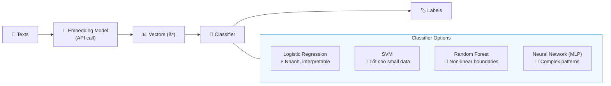
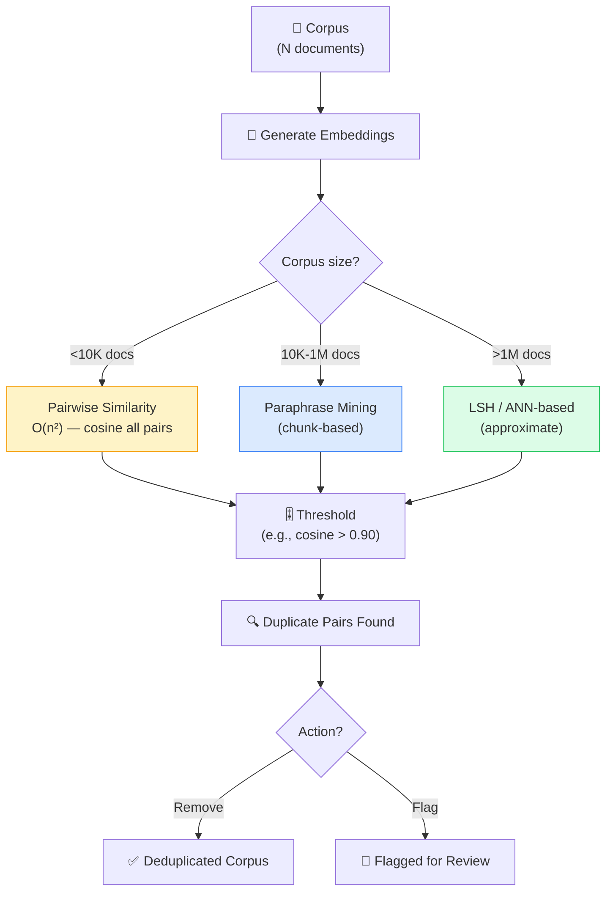
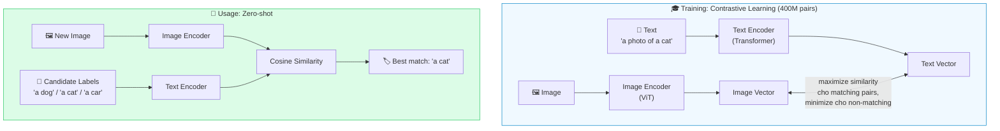
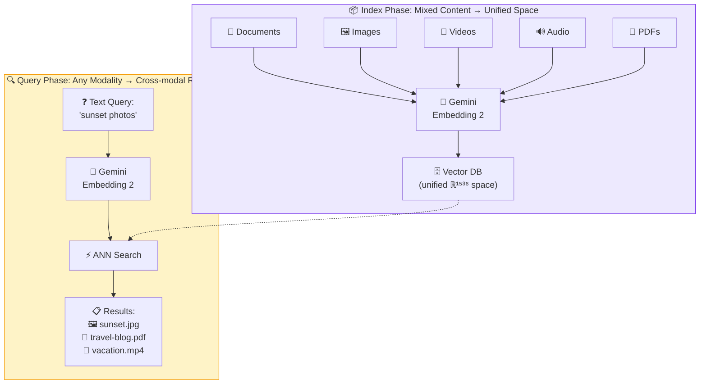

---

Phần này tiếp tục `Layer 2` nhưng chuyển sang bốn nhóm ứng dụng khác của embedding: classification, anomaly detection, deduplication và multimodal retrieval. Điểm chung vẫn là embeddings đóng vai trò lớp biểu diễn nền; điều thay đổi là cách hệ thống đọc các vector đó để gán nhãn, phát hiện điểm bất thường, loại dữ liệu trùng lặp, hoặc nối nhiều modality vào cùng một không gian.

## 2.5 Classification & Sentiment Analysis

### Tổng quan

Khi bài toán đã có **labels rõ ràng** như `positive/negative`, `spam/ham`, `billing/support`, embeddings có thể được dùng như một lớp đặc trưng chung rồi đưa vào một classifier nhỏ ở phía sau. Đây là cách rất thực dụng để xây text classifier nhanh mà không phải fine-tune ngay một model lớn.

Nói theo cách đơn giản hơn: embedding biến mỗi đoạn text thành một **vector đặc trưng có cùng kích thước**, còn classifier là mô hình đọc vector đó và quyết định nó thuộc nhãn nào.

### Pipeline



Ở pipeline này, embedding model đóng vai trò **feature extractor**. Nó rút từ text ra một biểu diễn số học đủ giàu thông tin để một classifier nhỏ như Logistic Regression hay SVM có thể học ranh giới giữa các nhãn.

### So sánh: Embedding + Classifier vs Fine-tuning

| Aspect | Embedding + Classifier | Fine-tuning Full Model |
|--------|----------------------|----------------------|
| **Training time** | Giây-phút (chỉ train classifier nhỏ) | Giờ-ngày (train cả model lớn) |
| **Data cần** | Ít (100-1000 samples có thể đủ) | Nhiều (thường >5000 samples) |
| **GPU cần** | Không (classifier chạy CPU) | Có (fine-tune cần GPU) |
| **Flexibility** | Cao: đổi model embed dễ dàng | Thấp: retrain toàn bộ |
| **Accuracy** | Tốt cho hầu hết tasks | Tốt nhất cho domain-specific |
| **Cost** | Rẻ (chỉ API calls + CPU) | Đắt (GPU hours) |

### Khi nào Embedding + Classifier là đủ?

Trong rất nhiều sản phẩm nội bộ hoặc business apps, cách làm này đã đủ tốt nếu:

- số lượng labels không quá nhiều và ý nghĩa của chúng khá ổn định
- dataset gán nhãn còn nhỏ hoặc vừa phải
- team cần iterate nhanh, dễ debug và chi phí thấp
- inference cần chạy nhẹ trên CPU hoặc tích hợp đơn giản vào hệ thống sẵn có

Ngược lại, fine-tuning thường đáng cân nhắc hơn khi:

- ngôn ngữ trong domain quá đặc thù, ví dụ legal, medical, scientific
- ranh giới giữa các nhãn rất tinh vi, không chỉ dựa vào nội dung tổng quát
- bạn có đủ dữ liệu gán nhãn để việc cập nhật cả model lớn mang lại lợi ích rõ rệt
- mô hình cần tối ưu rất mạnh cho một task duy nhất thay vì giữ tính đa dụng

### Multiclass vs Multilabel — Hai bài toán khác nhau

Nói đến classification, có một chỗ rất dễ bị bỏ qua: không phải lúc nào mỗi text cũng chỉ thuộc **một** nhãn duy nhất.

- **Multiclass**: mỗi mẫu chỉ có **một nhãn đúng**. Ví dụ một ticket chỉ thuộc `billing` hoặc `technical_support`
- **Multilabel**: một mẫu có thể có **nhiều nhãn cùng lúc**. Ví dụ một review vừa là `negative`, vừa là `shipping_issue`, vừa là `damaged_product`

Sự khác biệt này kéo theo cách thiết kế mô hình khác nhau:

- multiclass thường dùng một đầu ra chọn **một nhãn duy nhất**
- multilabel thường dự đoán **xác suất riêng cho từng nhãn**, rồi áp threshold cho từng nhãn đó

Nếu nhầm hai bài toán này với nhau, chất lượng hệ thống sẽ nhìn rất lạ: model multiclass sẽ bị ép chọn một nhãn duy nhất dù dữ liệu thật có nhiều ý, còn model multilabel có thể gán quá nhiều nhãn nếu threshold không được kiểm soát.

### Ví dụ Use Cases

- **Sentiment analysis**: positive/negative/neutral từ reviews
- **Spam detection**: spam vs ham trong email/comments
- **Topic classification**: gán chủ đề cho bài viết (AI, finance, sports...)
- **Intent recognition**: phân loại ý định trong chatbot (hỏi giá, khiếu nại, hỗ trợ kỹ thuật...)
- **Toxicity detection**: phát hiện nội dung độc hại/toxic

### Class Imbalance, Threshold và Abstain

Trong production, dữ liệu gán nhãn thường **không cân bằng**. Có thể `90%` tickets là hỗ trợ chung, còn `2%` là fraud hoặc escalation. Nếu chỉ nhìn `accuracy`, model rất dễ trông có vẻ tốt dù thực ra gần như bỏ qua những class hiếm nhưng quan trọng.

Một vài điểm cần chú ý:

- **Class imbalance**: nên quan sát số mẫu của từng nhãn, dùng `macro-F1`, và khi cần có thể dùng `class weights` hoặc resampling
- **Threshold**: với multilabel hoặc binary classification, threshold `0.5` không phải lúc nào cũng đúng; nhiều hệ thống đặt threshold riêng cho từng nhãn theo business cost
- **Abstain / Human Review**: nếu model không đủ tự tin, tốt hơn là chuyển sang hàng đợi review thay vì ép dự đoán

`Abstain` đặc biệt hữu ích khi:

- nhãn sai gây hậu quả lớn, ví dụ moderation, compliance, fraud
- câu trả lời cần độ chắc chắn cao hơn mức trung bình
- dữ liệu đầu vào bị mơ hồ hoặc nằm ngoài phân phối quen thuộc

Trong các hệ thống kiểu này, classifier không chỉ trả nhãn; nó còn trả **mức tin cậy** và đôi khi cả cờ "không chắc, cần người xem lại".

### Evaluation cho Classification

Với classification, độ chính xác không chỉ là một con số duy nhất. Cùng một model có thể nhìn ổn theo `accuracy`, nhưng lại bỏ sót gần hết những nhãn hiếm.

| Metric | Dùng khi nào | Ý nghĩa |
|--------|--------------|---------|
| **Accuracy** | Classes khá cân bằng | Tỷ lệ dự đoán đúng trên toàn bộ mẫu |
| **Precision** | False positive đắt giá | Trong những mẫu model gắn nhãn dương, có bao nhiêu mẫu thật sự đúng |
| **Recall** | False negative đắt giá | Trong những mẫu dương thật, model bắt được bao nhiêu |
| **F1-score** | Cần cân bằng precision và recall | Trung bình điều hòa giữa hai chỉ số trên |
| **Confusion Matrix** | Muốn biết model nhầm ở đâu | Cho thấy cặp nhãn nào hay bị lẫn với nhau |

Với sentiment, spam hay intent routing, `macro-F1` thường hữu ích hơn nhìn mỗi `accuracy`, vì nó buộc ta quan sát cả những class ít dữ liệu thay vì chỉ class đông mẫu.

Zero-shot classification cũng là một lựa chọn trung gian đáng nhớ. Nó hữu ích khi muốn bootstrap nhanh một hệ thống phân loại mà chưa có nhiều dữ liệu gán nhãn. Nhưng một khi labels đã ổn định và có dataset đủ tốt, embedding + classifier hoặc fine-tuning thường cho hành vi dễ kiểm soát và dễ đánh giá hơn.

### Mã giả: Sentiment Classification

```text
texts, labels = load_labeled_dataset()

# Step 1: convert texts to embeddings
vectors = embed(
    texts,
    model="embedding-model",
    dimensions=256
)

# Step 2: split train and test sets
train_vectors, test_vectors, train_labels, test_labels = train_test_split(
    vectors,
    labels,
    test_ratio=0.25
)

# Step 3: train a lightweight classifier
classifier = train_logistic_regression(
    train_vectors,
    train_labels
)

# Step 4: evaluate
predicted_labels = classifier.predict(test_vectors)
report_metrics(
    truth=test_labels,
    predicted=predicted_labels,
    metrics=["accuracy", "precision", "recall", "f1"]
)

# Step 5: predict on new text
new_text = "This product is worth buying"
new_vector = embed([new_text], model="embedding-model", dimensions=256)
predicted_label = classifier.predict(new_vector)
return predicted_label
```

> Source: [OpenAI Cookbook — Classification using Embeddings](https://github.com/openai/openai-cookbook/blob/main/examples/Classification_using_embeddings.ipynb)

Nếu `2.5` giả định rằng ta đã có labels và muốn gán nhãn nhất quán cho dữ liệu mới, thì phần tiếp theo đi sang tình huống ngược lại: chưa biết nhãn nào là đúng, chỉ biết rằng có những điểm **lạ** cần được kéo ra khỏi đám đông để kiểm tra.

---

## 2.6 Anomaly Detection

### Tổng quan

Anomaly detection (phát hiện bất thường) dùng embeddings để tìm ra những data points **khác biệt rõ rệt** so với phần lớn dataset. Ý tưởng cốt lõi là: nếu một điểm nằm xa khỏi các patterns quen thuộc trong embedding space, nó có thể là anomaly.

Điểm quan trọng là anomaly **không đồng nghĩa** với lỗi. Nó chỉ có nghĩa là điểm đó đủ khác thường để cần được xem xét kỹ hơn.

Phần này đi qua khi nào anomaly detection phù hợp hơn rules hay classification, ba hướng tiếp cận phổ biến, và cách đặt threshold sao cho hệ thống hữu ích trong thực tế.

**Use cases thực tế:**
- Phát hiện **customer support tickets bất thường** (chủ đề mới chưa từng thấy)
- Phát hiện **nội dung spam/scam** trong reviews
- **Quality control**: phát hiện sản phẩm có mô tả bất thường
- **Security**: phát hiện log entries bất thường (intrusion detection)
- **Content moderation**: phát hiện nội dung vi phạm khác biệt patterns bình thường

### Khi nào dùng Anomaly Detection, khi nào dùng Rules hoặc Classification?

Anomaly detection phù hợp nhất khi bạn **chưa biết rõ anomaly sẽ trông như thế nào**, hoặc anomaly quá hiếm nên không có đủ dữ liệu gán nhãn để train classifier tử tế.

- **Dùng anomaly detection** khi muốn tìm những điểm lạ trong dữ liệu chưa có taxonomy rõ
- **Dùng rule-based** khi đã có các dấu hiệu cố định, ví dụ regex cho mã lỗi, blacklist domains, ngưỡng transaction quá lớn
- **Dùng classification** khi đã có đủ ví dụ gán nhãn cho các loại bất thường cụ thể và muốn hệ thống gán nhãn nhất quán

Trong thực tế, anomaly detection thường là lớp **sàng lọc ban đầu**: nó đẩy các điểm đáng ngờ vào hàng đợi review, còn rules hoặc classifiers xử lý những pattern đã biết rõ.

### Semantic Novelty vs True Anomaly

Một điểm rất quan trọng với embeddings là: một item có thể **mới về mặt ngữ nghĩa** nhưng chưa chắc đã là **anomaly theo nghĩa xấu**.

- Một support ticket nói về tính năng vừa ra mắt có thể rất khác phần lớn tickets cũ, nên bị kéo ra như anomaly
- Nhưng đó có thể chỉ là **semantic novelty**: chủ đề mới xuất hiện, không phải lỗi hay hành vi bất thường

Vì vậy, anomaly detection bằng embeddings thường tốt ở việc phát hiện **cái gì đang khác đi**, chứ không tự quyết định được khác đó là tốt hay xấu. Quyết định cuối cùng vẫn cần bối cảnh nghiệp vụ.

### Global, Local và Contextual Anomalies

Không phải anomaly nào cũng giống nhau. Có thể chia thành ba kiểu để dễ hình dung:

- **Global anomaly**: điểm nằm xa hẳn phần còn lại của dataset
- **Local anomaly**: điểm chỉ lạ trong vùng lân cận của nó; toàn cục thì không quá hiếm
- **Contextual anomaly**: nội dung tự thân không lạ, nhưng lạ trong đúng bối cảnh đó. Ví dụ một ticket "server down" là bình thường trong incident queue, nhưng bất thường nếu xuất hiện trong một tập feedback về giao diện

Embeddings thường giúp tốt với global hoặc semantic local anomalies. Với contextual anomalies, bạn thường cần thêm metadata như thời gian, category, tenant, hoặc source hệ thống mới đánh giá đúng được.

### Các hướng tiếp cận phổ biến

#### 1. Isolation Forest

**Ý tưởng**: xây nhiều random decision trees, mỗi tree cố gắng **cô lập** (isolate) từng data point bằng random splits. Anomaly = data point dễ bị cô lập → **path length ngắn**.

**Tại sao anomaly có path ngắn?** Anomaly nằm xa cluster chính → chỉ cần vài random splits đã tách riêng được. Normal points nằm trong cluster dense → cần nhiều splits.

#### 2. Distance-based

**Ý tưởng**: tính khoảng cách trung bình từ mỗi point đến K nearest neighbors. Anomaly = points có khoảng cách lớn (nằm xa tất cả).

#### 3. Clustering-based

**Ý tưởng**: dùng HDBSCAN clustering → points labeled noise (label = -1) là anomaly candidates. Hoặc: tính khoảng cách mỗi point đến centroid gần nhất → threshold.

### Chọn threshold và cách xử lý kết quả

Phần khó nhất của anomaly detection thường không nằm ở thuật toán, mà ở **threshold** và **quy trình review**.

- threshold quá thấp → quá nhiều false positives, team review bị quá tải
- threshold quá cao → bỏ sót những trường hợp thật sự quan trọng

Vì vậy, nhiều hệ thống bắt đầu bằng cách:

1. lấy `top 1-5%` điểm bất thường nhất
2. cho con người đọc mẫu và gắn nhãn lại
3. điều chỉnh threshold cho đến khi tỷ lệ cảnh báo hữu ích chấp nhận được

Một nguyên tắc thực dụng khác là: anomaly detection thường nên **flag để review** trước, thay vì tự động xóa hay chặn ngay, trừ khi domain đã rất ổn định và rủi ro false positive thấp.

### Evaluation cho Anomaly Detection

Anomaly detection khó đánh giá hơn classification vì thường **thiếu labels đầy đủ**. Trong thực tế, nhiều team dùng các chỉ số gần với vận hành hơn là chỉ số học thuật thuần túy:

| Metric / Tín hiệu | Ý nghĩa |
|-------------------|---------|
| **Precision@Top-K** | Trong K điểm bị gắn cờ đầu tiên, có bao nhiêu điểm thật sự đáng xem |
| **Review Yield** | Tỷ lệ cảnh báo tạo ra hành động hữu ích sau khi con người đọc |
| **Alert Volume** | Mỗi ngày/tuần hệ thống đẩy ra bao nhiêu case; team review có xử lý nổi không |
| **Time-to-detect** | Hệ thống có kéo được pattern mới ra sớm hơn rule-based monitoring không |

Ngoài ra còn có một yếu tố rất thực tế là **drift**. Một pattern hôm nay còn lạ, nhưng vài tuần sau có thể đã thành bình thường. Vì vậy, anomaly detection cần được re-baseline định kỳ; nếu không, hàng đợi review sẽ đầy những trường hợp "từng mới nhưng giờ đã quen".

### Mã giả: Anomaly Detection Pipeline

```text
texts = load_dataset()
vectors = embed(texts)

# Method 1: isolation-based scoring
isolation_scores = isolation_forest(
    vectors,
    contamination=0.05
)

# Method 2: distance-based scoring
neighbor_distances = average_distance_to_k_neighbors(
    vectors,
    k=5,
    metric="cosine"
)

# Combine signals
# Normalize the two score families first because isolation and
# distance-based scores often live on different scales.
# Rank-normalization or min-max scaling is safer than adding raw values.
combined_scores = combine_scores(
    isolation_scores,
    neighbor_distances
)

# Select the most suspicious samples
threshold = percentile(combined_scores, 95)
anomaly_candidates = select_where(combined_scores >= threshold)

# Send candidates to review
flag_for_review(texts, anomaly_candidates)
```

> Sources: [scikit-learn Isolation Forest](https://scikit-learn.org/stable/modules/generated/sklearn.ensemble.IsolationForest.html), [OpenAI — Text and Code Embeddings use cases](https://openai.com/index/introducing-text-and-code-embeddings/)

Nếu `2.6` đi tìm những điểm **khác thường**, thì `2.7` đi theo hướng ngược lại: tìm những điểm **quá giống nhau** để dọn dữ liệu, giảm trùng lặp và tránh làm hệ thống bị nhiễu.

---

## 2.7 Deduplication / Near-duplicate Detection

### Tổng quan

Phát hiện và loại bỏ **duplicates** hoặc **near-duplicates** là một bài toán chất lượng dữ liệu rất thực tế. Mục tiêu không chỉ là tìm hai bản giống hệt nhau, mà còn phát hiện những trường hợp gần như trùng ý nhưng khác câu chữ, ngôn ngữ hoặc định dạng.

Việc này quan trọng vì:
- **Data quality**: duplicates làm bias training data
- **Storage**: giảm kích thước database/index
- **Search**: tránh trả về nhiều kết quả gần giống nhau
- **Content**: phát hiện plagiarism, repost

Phần này sẽ lần lượt tách bạch duplicate với near-duplicate, đi qua các hướng tiếp cận từ đơn giản đến scalable, rồi chốt ở câu hỏi thực tế nhất: threshold nào thì nên tự động xử lý, threshold nào thì nên chuyển sang review.

### Duplicate, Near-duplicate và Semantic duplicate khác nhau thế nào?

- **Duplicate**: gần như giống hệt nhau, ví dụ copy-paste cùng một đoạn text
- **Near-duplicate**: khác đôi chút về câu chữ, format, typo, tiêu đề, nhưng nội dung gần như không đổi
- **Semantic duplicate**: diễn đạt khác hẳn, thậm chí khác ngôn ngữ, nhưng truyền đạt cùng một ý

Càng đi từ duplicate sang semantic duplicate, bài toán càng bớt giống kiểm tra chuỗi và càng phụ thuộc nhiều hơn vào embeddings.

### Pipeline thực tế: Exact -> Fuzzy -> Semantic

Trong nhiều hệ thống, deduplication không nên bắt đầu ngay bằng embeddings. Một pipeline thực tế thường đi theo ba lớp:

1. **Exact dedup**: hash hoặc so sánh chuỗi sau khi normalize cơ bản để loại các bản sao giống hệt
2. **Fuzzy dedup**: xử lý khác biệt nhỏ như typo, format, tiêu đề gần giống
3. **Semantic dedup**: dùng embeddings để tìm những bản trùng ý nhưng khác cách diễn đạt

Cách đi này vừa rẻ hơn, vừa dễ giải thích hơn. Embeddings nên được dùng ở lớp cuối, khi những kỹ thuật đơn giản hơn không còn đủ nữa.

### Các hướng tiếp cận phổ biến

#### 1. Pairwise Similarity (O(n²))

Tính cosine similarity giữa **mọi cặp** → threshold → duplicate pairs.

- ✅ Đơn giản, chính xác
- ❌ O(n²) — chỉ phù hợp dataset nhỏ (<10k docs)
- Ví dụ: 10k docs = 50M cặp cần tính; 100k docs = 5B cặp → không khả thi

#### 2. Paraphrase Mining (Scalable)

**SBERT paraphrase mining**: kỹ thuật thông minh hơn — chia corpus thành chunks, tìm top-k similar pairs trong mỗi chunk, rồi merge. Giảm complexity đáng kể.

#### 3. Locality-Sensitive Hashing (LSH)

Hash embedding vectors → buckets. Vectors tương tự → cùng bucket với xác suất cao. Chỉ so sánh các cặp trong cùng bucket → near-linear time.

### Chọn threshold và hành động xử lý

Deduplication không chỉ có câu hỏi "có giống nhau không?", mà còn có câu hỏi "giống đến mức nào thì nên làm gì?".

- threshold cao hơn phù hợp cho **auto-remove** các bản gần như trùng hệt
- threshold thấp hơn phù hợp cho **flag review** hoặc gom thành nhóm để con người quyết định
- với multilingual corpora, hai câu khác ngôn ngữ nhưng cùng nghĩa có thể là semantic duplicate, nhưng việc có nên xóa hay giữ lại còn phụ thuộc mục tiêu sản phẩm

Trong nhiều hệ thống production, cách an toàn thường là:

1. **exact duplicates** → có thể xóa tự động
2. **near-duplicates rất rõ** → hợp nhất hoặc giữ một bản canonical
3. **semantic duplicates chưa chắc chắn** → gắn cờ để review, đặc biệt nếu việc xóa có ảnh hưởng business

### Chain Effect và chọn bản Canonical

Khi dedup ở mức semantic, một rủi ro rất hay gặp là **chain effect**:

- A rất giống B
- B rất giống C
- nhưng A và C không thật sự đủ giống để coi là cùng một bản

Nếu chỉ nối cặp theo kiểu "gần là nhập nhóm", hệ thống có thể tạo ra các cụm quá lớn và làm mất dữ liệu hợp lệ. Vì vậy, bước `build_duplicate_groups` không nên chỉ dựa trên nối chuỗi cặp một cách mù quáng; nó thường cần thêm điều kiện như:

- giới hạn độ rộng cụm
- so sánh lại với bản canonical của nhóm
- hoặc yêu cầu mọi bản trong nhóm phải đủ gần tâm nhóm, không chỉ gần một hàng xóm trung gian

Việc chọn **bản canonical** cũng nên theo policy rõ ràng. Tùy use case, bản được giữ lại có thể là:

- bản xuất hiện sớm nhất
- bản có metadata đầy đủ nhất
- bản có chất lượng nội dung tốt hơn
- hoặc bản đã được dùng làm ID tham chiếu ở nơi khác trong hệ thống

### Use Case khác nhau -> Threshold khác nhau

Deduplication cho các bài toán khác nhau không nên dùng cùng một threshold:

- **Training corpus**: thường cần threshold chặt hơn để tránh lặp dữ liệu làm bias model
- **Search results**: có thể chấp nhận threshold mềm hơn, miễn là top results không bị lặp quá rõ
- **Plagiarism / compliance**: thường cần quy trình review chặt hơn vì tác động pháp lý hoặc nghiệp vụ cao

### Workflow Deduplication



### Mã giả: Paraphrase Mining + Deduplication

```text
texts = load_corpus()
vectors = embed(texts)

# Step 1: find highly similar candidate pairs
candidate_pairs = paraphrase_mining(
    texts=texts,
    vectors=vectors
)

# Step 2: keep only pairs above the chosen threshold
near_duplicate_pairs = filter_by_similarity(
    candidate_pairs,
    threshold=0.70
)

# Step 3: group connected pairs into duplicate clusters
duplicate_groups = build_duplicate_groups(near_duplicate_pairs)

# Step 4: decide what to keep
canonical_texts = choose_canonical_version(
    duplicate_groups,
    policy="keep the earliest or highest-quality version"
)

# Step 5: review or remove
flag_groups_for_review(duplicate_groups)
write_deduplicated_corpus(canonical_texts)
```

> Source: [SBERT — Paraphrase Mining](https://www.sbert.net/examples/sentence_transformer/applications/paraphrase-mining/README.html)

Nếu `2.5`, `2.6` và `2.7` chủ yếu xoay quanh text embeddings, thì `2.8` mở rộng cùng các nguyên lý đó sang nhiều modality khác nhau. Câu hỏi không còn là "hai đoạn text có gần nhau không?" mà là "một query text có tìm đúng image, video hay PDF liên quan hay không?".

---

## 2.8 Multimodal Embedding

### Tổng quan

Multimodal embedding mở rộng ý tưởng của embedding từ một loại dữ liệu sang **nhiều modality cùng lúc**: text, image, audio, video, PDF. Khi mọi modality này được đặt vào **cùng một không gian vector**, hệ thống có thể làm những việc mà text-only embeddings không làm được, như tìm ảnh bằng câu mô tả, tìm video bằng transcript, hay nối một đoạn PDF với ảnh liên quan.

Điểm quan trọng ở đây không chỉ là "hỗ trợ nhiều loại input", mà là **hỗ trợ nhiều loại input trong một hệ biểu diễn chung**. Chính điều đó tạo ra cross-modal retrieval: query ở một modality, kết quả ở modality khác.

### Khi nào Multimodal Embedding thực sự cần thiết?

Không phải cứ có hình ảnh hay video là bắt buộc phải dùng multimodal embedding. Nó đặc biệt hữu ích khi:

- người dùng có thể query bằng text nhưng kết quả lại là image, video, audio hoặc PDF
- nội dung ý nghĩa nằm ở nhiều modality cùng lúc, ví dụ product title + product image
- hệ thống cần so sánh chéo giữa các modality thay vì chỉ xử lý từng modality riêng rẽ

Ngược lại, nếu image chỉ đóng vai trò minh họa còn toàn bộ logic tìm kiếm vẫn nằm ở text, text-only embeddings đôi khi đã đủ và đơn giản hơn nhiều để vận hành.

Phần này đi từ CLIP, qua Vertex multimodalembedding, đến Gemini Embedding 2 để thấy rõ cách các hệ thống multimodal phát triển: từ text-image dual-encoder sang các mô hình hợp nhất nhiều modality hơn.

### Các Pattern Retrieval phổ biến trong Multimodal

Khi nói "multimodal retrieval", thực ra có nhiều hướng truy xuất khác nhau:

- **Text -> Image**: gõ mô tả để tìm ảnh
- **Image -> Text**: đưa ảnh vào để tìm caption, sản phẩm, hoặc tài liệu mô tả
- **Text -> PDF / Video / Audio**: dùng query text để tìm nội dung ở modality khác
- **Mixed input -> Mixed output**: query gồm nhiều phần, ví dụ text + image mẫu, rồi trả về kết quả nhiều loại

Mỗi pattern có đặc điểm riêng. `Text -> Image` thường trực quan và dễ demo nhất. Nhưng trong production, những bài toán như `Text -> PDF` hay `Text -> mixed media` mới là nơi multimodal embeddings tạo ra nhiều giá trị cho knowledge systems.

### Chọn đơn vị Index cho Multimodal

Giống text retrieval, multimodal retrieval cũng cần quyết định **đơn vị nào sẽ được index**.

- với ảnh đơn lẻ, đơn vị index có thể là **mỗi ảnh**
- với PDF, đơn vị index có thể là **mỗi trang**, **mỗi section**, hoặc **một cụm trang**
- với video, đơn vị index thường không phải cả video mà là **clip** hoặc **frame segments**
- với sản phẩm, nhiều hệ thống index **gói hợp nhất** gồm `title + description + image` thay vì index từng phần riêng rẽ

Chọn đơn vị index sai dễ làm retrieval kém đi rất nhanh. Index quá lớn làm biểu diễn bị loãng; index quá nhỏ lại mất ngữ cảnh.

### 2.8.1 CLIP (OpenAI) — Đặt text và image vào cùng một không gian

**CLIP** (Contrastive Language-Image Pre-training) — model đầu tiên thành công lớn trong multimodal embedding:

**Kiến trúc:**



**Đặc điểm:**
- Training trên **400 triệu** cặp image-text từ internet (web scraping)
- Contrastive loss: maximize similarity cho matching pairs, minimize cho non-matching
- **Zero-shot transfer**: classify image bằng text descriptions mà **không cần fine-tune**
- Mở đường cho DALL-E, Stable Diffusion (dùng CLIP text encoder)

**Use cases:**
- **Image search by text**: "sunset over ocean" → tìm ảnh hoàng hôn
- **Image classification zero-shot**: gán label cho ảnh mới mà không cần training data
- **Content filtering**: kiểm tra image content khớp text description không

> Source: [CLIP paper — Radford et al., 2021](https://arxiv.org/abs/2103.00020)

Sau CLIP, câu hỏi tự nhiên là liệu cùng ý tưởng đó có thể mở rộng ra ngoài cặp `text + image` hay không. Những hệ thống đời sau bắt đầu hỗ trợ thêm video và những input phức tạp hơn, nhưng vẫn còn nhiều giới hạn về context và cách kết hợp modality.

### 2.8.2 Vertex AI multimodalembedding@001 (Legacy) — Mở rộng thêm modality nhưng còn giới hạn

| Feature | Spec |
|---------|------|
| **Modalities** | Text + Image + Video |
| **Dimensions** | 1408 (default); giảm được 128/256/512 |
| **Text limit** | Ngắn (captions, queries) |
| **Video** | Hỗ trợ video segments |
| **Status** | Legacy — xem xét migrate sang Gemini Embedding 2 |

**Giới hạn quan trọng**: text input ngắn trong mode text+image — không phù hợp cho long documents. Chỉ phù hợp cho short captions, product titles, brief descriptions.

**Use cases**: e-commerce image search ("red dress"), video retrieval, visual Q&A.

> Source: [Vertex AI — Multimodal Embeddings](https://cloud.google.com/vertex-ai/generative-ai/docs/embeddings/get-multimodal-embeddings)

Vertex cho thấy hướng mở rộng là khả thi, nhưng vẫn còn mang màu sắc của các hệ dual-encoder ghép nhiều modality lại với nhau. Bước tiếp theo là đi tới các mô hình **native multimodal**, nơi nhiều loại dữ liệu được xử lý trong một kiến trúc thống nhất hơn.

### 2.8.3 Gemini Embedding 2 (March 2026) — Hướng tới không gian hợp nhất nhiều modality

> ⚠️ **Preview Notice**: Model đang ở giai đoạn preview. Specs, pricing, và model name có thể thay đổi.

**Gemini Embedding 2** được giới thiệu như một mô hình embedding **natively multimodal** built trên kiến trúc Gemini. Không phải ghép nối 2 encoder riêng rẽ (như CLIP) mà embed tất cả modalities trong **cùng 1 architecture** — cho phép hiểu cross-modal relationships sâu hơn.

#### 5 Modalities được hỗ trợ

| Modality | Limit | Ghi chú |
|----------|-------|---------|
| **Text** | 8192 tokens | Long-context cho full documents |
| **Image** | Max 6 images/request | PNG, JPEG; hỗ trợ interleaved text+image |
| **Video** | Max 128 giây | MP4, MOV; codec H264/H265/AV1/VP9 |
| **Audio** | Max 80 giây | MP3, WAV |
| **PDF** | Max 6 trang | Native PDF understanding (layout, tables, figures) |

#### Specs

- **Dimensions**: default **3072**, recommended **1536 / 768** (MRL-based → truncate native)
- **Interleaved input**: gửi text + images trong cùng 1 request → **single unified embedding**
- **Architecture**: built trên Gemini → hiểu cross-modal semantics natively

#### Pricing (snapshot March 2026, preview — có thể thay đổi)

| Input Type | Price |
|-----------|-------|
| Text | **$0.20 / 1M tokens** |
| Image | **$0.00012 / image** |

#### So sánh với CLIP và Vertex multimodalembedding

| Feature | CLIP | Vertex multimodal@001 | Gemini Embedding 2 |
|---------|------|----------------------|---------------------|
| **Architecture** | Dual-encoder (separate) | Dual-encoder | Single unified model |
| **Modalities** | 2 (text, image) | 3 (text, image, video) | **5** (text, image, video, audio, PDF) |
| **Max dims** | 512/768 | 1408 | **3072** (MRL to 768) |
| **Text context** | ~77 tokens | Short | **8192 tokens** |
| **MRL support** | ❌ | ❌ | ✅ |
| **Interleaved** | ❌ | ❌ | ✅ |
| **Provider** | OpenAI (open-source) | Google Cloud | Google AI |

### Chọn mô hình theo bài toán

Nhìn bảng specs thôi vẫn chưa đủ để chọn model. Về mặt hệ thống, có thể hình dung khá đơn giản:

- **CLIP** hợp khi bài toán chủ yếu là `text <-> image`, cần mô hình kinh điển, dễ nghiên cứu hoặc tự triển khai
- **Vertex multimodalembedding@001** hợp với các hệ thống Google Cloud cũ cần hỗ trợ thêm video, nhưng đã có dấu hiệu bị thay thế
- **Gemini Embedding 2** hợp khi cần nhiều modality hơn, context dài hơn, hoặc muốn embed input interleaved trong một không gian hợp nhất

#### Diagram: Cross-modal Retrieval



> **Cross-modal**: text query → tìm images, videos, docs, audio cùng lúc — tất cả trong cùng 1 vector space!

### Lưu ý hệ thống khi dùng Multimodal Embedding

Multimodal embedding mở ra nhiều khả năng, nhưng cũng kéo theo vài lưu ý vận hành rất quan trọng:

- **Không trộn embeddings từ model khác nhau trong cùng index**: cùng là vector cho image hay text nhưng nếu được tạo bởi hai model khác nhau, chúng không tự nhiên nằm trong cùng một không gian có thể so sánh trực tiếp
- nếu chưa thể chuyển toàn bộ hệ thống sang một **unified multimodal model**, cách làm chuyển tiếp thường là lưu vectors **riêng theo từng modality hoặc từng model**, rồi truy xuất chéo qua metadata, hoặc dùng vector database hỗ trợ **multi-vector indexing** thay vì ép mọi vector vào cùng một index để so sánh trực tiếp
- **Phải thống nhất cách index và cách query**: nếu lúc index dùng `text + image` nhưng lúc query chỉ dùng text rời rạc, chất lượng có thể thay đổi nhiều hơn mong đợi
- **Chi phí và latency phụ thuộc modality**: embedding cho image, video, audio hay PDF thường đắt và nặng hơn text-only
- **Evaluation phải đúng với hướng truy xuất thực tế**: `text -> image`, `image -> text`, `text -> PDF` hay `audio -> text` là các bài toán khác nhau, không nên gộp vào một chỉ số chung duy nhất
- **Dữ liệu nguồn quan trọng hơn bao giờ hết**: caption sai, OCR lỗi, hình mờ, hoặc PDF layout phức tạp đều có thể làm embedding giảm chất lượng đáng kể

### Failure Modes thường gặp

Multimodal retrieval rất dễ cho demo đẹp, nhưng cũng có nhiều failure modes đặc trưng:

- **OCR yếu**: ảnh hoặc PDF có text nhỏ, mờ, lệch layout → model bỏ sót tín hiệu quan trọng
- **Visual bias**: ảnh rất đẹp hoặc rất nổi bật về màu sắc nhưng không đúng nội dung query
- **Sai đơn vị thời gian trong video**: index cả video dài khiến query chỉ khớp một đoạn nhỏ nhưng vẫn bị loãng
- **Table / chart mismatch**: biểu đồ và bảng trong PDF có thể chứa đúng dữ kiện, nhưng model hiểu kém hơn plain text
- **Modality dominance**: khi index `text + image`, một modality có thể lấn át modality còn lại nếu dữ liệu không cân bằng

Những lỗi này là lý do multimodal systems cần được đánh giá bằng bộ query thực tế, thay vì chỉ dựa vào vài ví dụ demo ấn tượng.

### Evaluation cho Cross-modal Retrieval

Evaluation trong multimodal nên bám sát đúng hướng truy xuất mà sản phẩm thật sẽ dùng:

| Bài toán | Nên đo gì |
|---------|-----------|
| **Text -> Image** | Recall@K, nDCG@K, human relevance review |
| **Image -> Text** | Caption/document relevance, MRR, top-K usefulness |
| **Text -> PDF / Video** | Evidence coverage, answerability, page/segment hit rate |
| **Mixed-media search** | Diversity theo modality, usefulness của top results |

Ngoài metrics offline, human evaluation thường quan trọng hơn trong multimodal vì nhiều lỗi khó thấy nếu chỉ nhìn similarity score. Một hệ thống có thể trả về ảnh "trông gần đúng", nhưng lại sai chi tiết mà người dùng thật rất quan tâm.

### Mã giả: Multimodal Embedding và Cross-modal Search

```text
# Step 1: build a unified multimodal index
items = [
    {"type": "image", "content": image_file_1},
    {"type": "pdf", "content": pdf_file_1},
    {"type": "video", "content": video_file_1}
]

item_vectors = multimodal_embed(
    items,
    model="multimodal-embedding-model",
    dimensions=768
)
store_in_vector_index(items, item_vectors)

# Step 2: embed a text query
query = {"type": "text", "content": "sunset over the ocean"}
query_vector = multimodal_embed(
    [query],
    model="multimodal-embedding-model",
    dimensions=768
)

# Step 3: search across all indexed modalities
results = vector_search(
    query_vector=query_vector,
    top_k=5
)

# Step 4: return mixed-modality results
show(results)
```

> Sources: [Gemini Embedding 2 Blog](https://blog.google/innovation-and-ai/models-and-research/gemini-models/gemini-embedding-2/), [Gemini API Pricing](https://ai.google.dev/gemini-api/docs/pricing)
