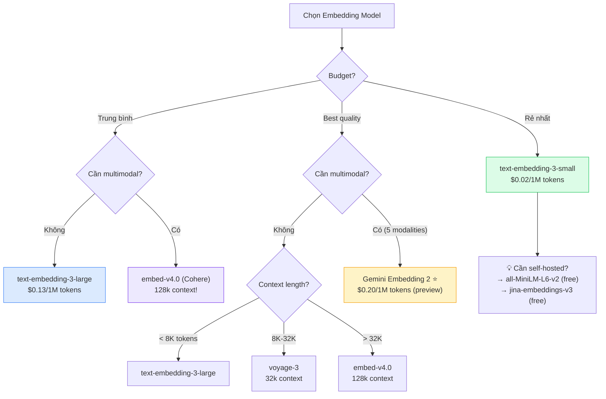
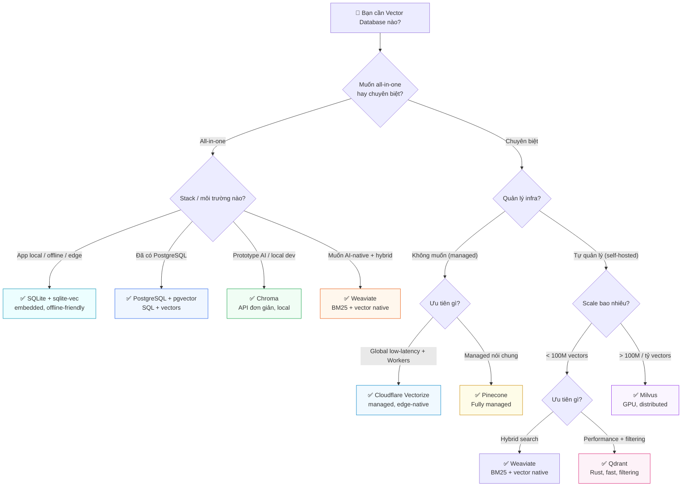
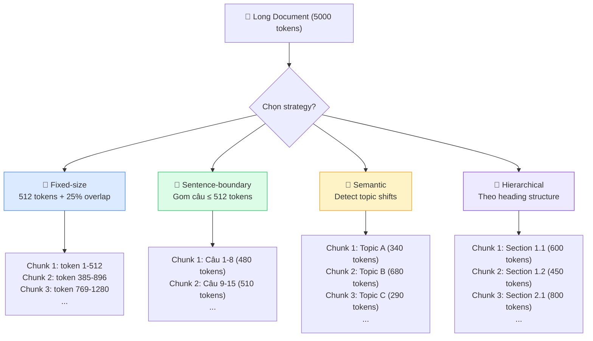

---

# Layer 3 — Operations (Vận hành & Tối ưu)

Nếu `Layer 2` trả lời embedding được dùng vào bài toán nào, thì `Layer 3` trả lời câu hỏi khó hơn: khi đã muốn đưa vào hệ thống thật, nên chọn model nào, lưu vectors ở đâu, chunk tài liệu ra sao, và cân bằng chất lượng với latency, storage, cost như thế nào. Phần này vì vậy không chỉ là tập hợp specs; nó là lớp ra quyết định vận hành.

## 3.1 Embedding Models Comparison

Chọn embedding model là một bài toán tối ưu nhiều chiều. Bảng benchmark chỉ là một phần rất nhỏ của câu chuyện; trong production, chất lượng thực trên domain của bạn, context length, số chiều vector, cost, compliance và việc có cần multimodal hay không thường quan trọng hơn vị trí trên leaderboard.

### Những câu hỏi cần khóa trước khi so model

Trước khi nhìn bảng specs, nên khóa trước vài câu hỏi nền:

1. **Task chính là gì?** Search, RAG, clustering, classification hay multimodal retrieval có nhu cầu rất khác nhau.
2. **Ngôn ngữ mục tiêu là gì?** Benchmark tiếng Anh thường không phản ánh đúng chất lượng cho tiếng Việt hoặc domain-specific jargon.
3. **Corpus dài đến đâu?** Model context ngắn sẽ buộc hệ thống chunk mạnh hơn.
4. **Bạn đang tối ưu cái gì?** Chất lượng tốt nhất, chi phí thấp nhất, hay khả năng self-hosted?
5. **Scale bao nhiêu vectors?** Số chiều của model ảnh hưởng trực tiếp đến storage, RAM và latency.

### Bảng 1 — Specs

| Model | Provider | Dims | Context | Multimodal | MRL | Languages |
|-------|----------|------|---------|------------|-----|-----------|
| **text-embedding-3-large** | OpenAI | 3072 (shortable) | 8191 tokens | ❌ | ✅ | Multi |
| **text-embedding-3-small** | OpenAI | 1536 (shortable) | 8191 tokens | ❌ | ✅ | Multi |
| **embed-v4.0** | Cohere | 256-1536 | 128k tokens | ✅ (text+image+PDF) | ✅ | 100+ |
| **embed-v3.0** | Cohere | 384/1024 | 512 tokens | ❌ | ❌ | Multi |
| **gemini-embedding-001** | Google | max 3072 | 2048 tokens | ❌ | ✅ | Multi |
| **Gemini Embedding 2** ⭐ | Google | 3072 (rec. 1536/768) | 8192 tokens | ✅ (5 modalities) | ✅ | Multi |
| **multimodalembedding@001** | Google (Legacy) | 1408 | Short | ✅ (text+img+video) | ❌ | Multi |
| **jina-embeddings-v3** | Jina AI | 1024 (MRL→32) | 8192 tokens | ❌ | ✅ | Multi |
| **all-MiniLM-L6-v2** | Sentence-Transformers | 384 | 256 tokens | ❌ | ❌ | English |
| **all-mpnet-base-v2** | Sentence-Transformers | 768 | 384 tokens | ❌ | ❌ | English |
| **voyage-3** | Voyage AI | 1024 | 32k tokens | ❌ | ❌ | Multi |
| **voyage-3-lite** | Voyage AI | 512 | 32k tokens | ❌ | ❌ | Multi |

> Sources: [OpenAI](https://openai.com/index/new-embedding-models-and-api-updates/), [Cohere embed-v4](https://docs.cohere.com/changelog/embed-multimodal-v4), [Cohere embed-v3](https://docs.cohere.com/docs/cohere-embed), [Gemini Embedding 2](https://blog.google/innovation-and-ai/models-and-research/gemini-models/gemini-embedding-2/), [gemini-embedding-001 docs](https://ai.google.dev/gemini-api/docs/embeddings), [Jina v3 paper](https://arxiv.org/pdf/2409.10173), [SBERT models](https://www.sbert.net/docs/sentence_transformer/pretrained_models.html), [Voyage AI models](https://docs.voyageai.com/docs/embeddings)

### Chọn model nào?

Sơ đồ dưới đây chỉ nên được đọc như một điểm bắt đầu nhanh. Quyết định cuối cùng vẫn nên quay về ba trục chính: chất lượng trên dữ liệu thật, tổng chi phí hệ thống, và các ràng buộc vận hành như compliance hoặc self-hosting.



### Heuristics vận hành nhanh

- **`text-embedding-3-small`**: hợp khi ngân sách rất nhạy cảm, cần baseline mạnh, và corpus không quá khó.
- **`text-embedding-3-large`**: hợp khi cần chất lượng text retrieval tốt, API ổn định, và không cần multimodal.
- **`embed-v4.0`**: đáng cân nhắc khi context dài và multimodal là nhu cầu thực, không phải chỉ để thử nghiệm.
- **`Gemini Embedding 2`**: đáng giá khi bài toán thực sự là cross-modal hoặc cần unified embedding cho nhiều loại dữ liệu.
- **Open-source nhỏ như `all-MiniLM-L6-v2`**: hợp khi cần self-hosted, prototyping nhanh, hoặc workload nội bộ chấp nhận đánh đổi chất lượng.

### Snapshot 2024-2026: Những model nổi bật nên nhớ

Nếu bỏ qua chi tiết benchmark và chỉ giữ lại vài mốc quan trọng của giai đoạn `2024-2026`, thị trường embedding hiện tại có thể được nhìn như sau:

- **`text-embedding-3-large`**: mốc tham chiếu phổ biến nhất cho text-only retrieval nhờ ecosystem rộng, API ổn định và MRL native.
- **`embed-v4.0`**: lựa chọn đáng chú ý khi cần long-context hoặc multimodal theo hướng enterprise documents như text, image, PDF.
- **`Gemini Embedding 2`**: đại diện cho xu hướng unified multimodal embedding, nơi text, image, audio, video và PDF cùng đi vào một không gian vector.
- **`voyage-3` / họ Voyage**: phù hợp khi ưu tiên retrieval quality cao và sẵn sàng đánh đổi bằng ecosystem nhỏ hơn các nhà cung cấp lớn.
- **`Qwen3-Embedding-8B`**: điểm neo quan trọng ở phía open-source, đặc biệt khi cần multilingual mạnh và muốn self-hosted.
- **`jina-embeddings-v3`**: hợp với bài toán self-hosted gọn nhẹ hơn, cần MRL linh hoạt và chấp nhận benchmark không ở nhóm đầu bảng.

Điểm quan trọng là không nên đọc danh sách này như một bảng xếp hạng tuyệt đối. Nó hữu ích hơn nếu được xem như bản đồ nhanh: model nào đại diện cho xu hướng nào, và bài toán nào khiến model đó đáng để benchmark trước.

### Bảng 2 — Quality (MTEB Benchmarks)

| Model | MTEB Avg | Source Type | Date | Source Link |
|-------|----------|------------|------|-------------|
| text-embedding-3-large | 64.6 | vendor-reported | Jan 2024 | [OpenAI blog](https://openai.com/index/new-embedding-models-and-api-updates/) |
| voyage-large-2-instruct | 68.28 | vendor-reported | May 2024 | [Voyage AI blog](https://blog.voyageai.com/2024/05/05/voyage-large-2-instruct/) |
| jina-embeddings-v3 | 65.52 (English) | paper-reported | Sep 2024 | [Jina v3 paper](https://arxiv.org/pdf/2409.10173) |
| Cohere embed-v3 | N/A (xem note) | vendor-reported | 2023 | [Cohere blog](https://cohere.com/blog/introducing-embed-v3) |

> **Note (Cohere embed-v3)**: Cohere không công bố single MTEB average number; họ report individual tasks trên MTEB và BEIR. Xem link nguồn để xem breakdown chi tiết.

> ⚠️ **Benchmark Comparability Warning**:
>
> Vendor-reported benchmarks **không** "apple-to-apple":
> - Khác dataset subset, evaluation protocol, thời điểm chạy
> - Self-reported → có thể cherry-pick kết quả tốt nhất
> - MTEB leaderboard thay đổi thường xuyên
>
> **Best practice**: Luôn ghi rõ **source type** (vendor-reported / independent / paper-reported) + **snapshot date**. Cần **benchmark riêng** cho ngôn ngữ mục tiêu (ví dụ: tiếng Việt không có trên MTEB tiêu chuẩn).
>
> Sources: [MTEB paper — Muennighoff et al., 2022](https://arxiv.org/abs/2210.07316), [Jina v3 paper](https://arxiv.org/pdf/2409.10173), [HuggingFace MTEB Blog](https://huggingface.co/blog/mteb)

### Bảng 3 — Pricing (Snapshot: March 2026)

| Model | Native Unit | Native Price | ~USD/1M tokens | Ghi chú |
|-------|-------------|-------------|----------------|---------|
| text-embedding-3-large | tokens | $0.13/1M tokens | **$0.13** | |
| text-embedding-3-small | tokens | $0.02/1M tokens | **$0.02** | Rẻ nhất |
| Gemini Embedding 2 (text) | tokens | $0.20/1M tokens | **$0.20** | Preview pricing |
| Gemini Embedding 2 (image) | per image | $0.00012/image | N/A | Tính theo ảnh |
| embed-v4.0 | tokens | TBD | TBD | Giá chưa công bố chính thức |
| embed-v3.0 | tokens | Xem [Cohere pricing](https://cohere.com/pricing) | N/A | Không dùng estimate |
| voyage-3 | tokens | Xem [Voyage pricing](https://www.voyageai.com/pricing) | N/A | Không dùng estimate |
| all-MiniLM-L6-v2 | — | **Free** (open-source) | $0 | Self-hosted, cần compute |
| jina-embeddings-v3 | — | **Free** (open-source) / API | $0 or API pricing | Self-hosted hoặc API |

> **Conversion note**: Ước tính 1 character ≈ 0.25 token (trung bình cho tiếng Anh). Tiếng Việt có thể cao hơn do tokenization. Luôn test thực tế với `tiktoken` hoặc API response `usage.total_tokens`.
>
> Sources: [OpenAI Pricing](https://openai.com/index/new-embedding-models-and-api-updates/), [Gemini Pricing](https://ai.google.dev/gemini-api/docs/pricing), [Vertex Pricing](https://cloud.google.com/vertex-ai/generative-ai/pricing)

### Dimensions, Storage và Latency

Một model có chất lượng tốt hơn nhưng vector dài hơn sẽ tạo áp lực rất thật lên hạ tầng. Công thức gần đúng cho raw vector storage là:

`num_vectors × dimensions × bytes_per_value`

Nếu dùng `float32`, mỗi chiều thường chiếm `4 bytes`. Điều đó có nghĩa là:

- `1 triệu` vectors `3072` chiều ≈ `12.3 GB` raw vectors
- `1 triệu` vectors `1536` chiều ≈ `6.1 GB`
- `1 triệu` vectors `768` chiều ≈ `3.1 GB`

Đó mới chỉ là phần vector thô, chưa tính metadata, index structure, replication hay caching. Vì vậy, MRL hoặc dimension truncation không chỉ là "tính năng hay", mà là đòn bẩy trực tiếp lên storage cost, RAM footprint và cả tốc độ search.

Trong nhiều hệ thống production dùng index kiểu `HNSW`, áp lực này thường được cảm nhận rất rõ ở **RAM** chứ không chỉ ở dung lượng lưu trữ trên đĩa. Nếu vectors dài và số lượng lớn, working set của index rất dễ phình to đến mức chi phối chi phí máy và thời gian warm-up. Đó là lý do `MRL`, dimension truncation và các kỹ thuật quantization như `int8` hoặc `binary` không chỉ là tối ưu phụ, mà thường là đòn bẩy vận hành trực tiếp.

### Sai lầm thường gặp khi chọn model

- Chọn theo leaderboard mà không benchmark trên dữ liệu thật
- Chọn model context rất dài nhưng corpus thực tế đã được chunk ngắn sẵn
- Chọn vector quá dài cho workload khổng lồ rồi mới phát hiện chi phí index quá cao
- Chọn multimodal model chỉ vì "nghe mạnh hơn", dù sản phẩm chủ yếu vẫn là text retrieval
- Quên rằng thay model thường kéo theo re-embed toàn bộ corpus

Nói ngắn gọn: model tốt nhất không phải model có benchmark cao nhất, mà là model cho **quality đủ tốt nhất với tổng cost chấp nhận được** trên chính hệ thống của bạn.

---

## 3.2 Vector Databases (Ma trận chọn nhanh)

Chọn vector database không chỉ là chọn chỗ để lưu vectors. Đó là quyết định về mô hình vận hành: managed hay self-hosted, có cần hybrid search/filtering không, đội ngũ có sẵn PostgreSQL hoặc SQLite hay không, và scale nào thì bắt đầu phải lo chuyện reindex, backup, shard, snapshot hay failover.

Ở mức khái quát, các lựa chọn thường rơi vào hai hướng lớn:

- **All-in-one**: vector search sống chung với stack hiện có hoặc đi kèm một platform bao trọn metadata, filtering, API và đôi khi cả ingestion. Hướng này hợp khi muốn giảm số lượng thành phần hạ tầng và tối ưu tốc độ triển khai.
- **Chuyên biệt**: dùng một vector engine được tối ưu chủ yếu cho indexing, ANN search, filtering và scale. Hướng này hợp khi vector retrieval là thành phần cốt lõi của hệ thống và cần tối ưu sâu về hiệu năng hoặc vận hành.

Ranh giới này không phải lúc nào cũng tuyệt đối. `PostgreSQL + pgvector` và `SQLite + sqlite-vec` nghiêng rõ về phía all-in-one trong stack có sẵn. `Pinecone`, `Qdrant`, `Milvus` nghiêng rõ về phía chuyên biệt. Còn `Weaviate` và `Chroma` nằm ở giữa: chúng vẫn là sản phẩm chuyên cho retrieval/AI, nhưng cố gắng đem lại trải nghiệm trọn gói hơn một engine thuần ANN.

### Những tiêu chí thật sự quyết định lựa chọn

| Tiêu chí | Câu hỏi cần trả lời | Tại sao quan trọng |
|----------|---------------------|--------------------|
| **Kiểu hệ thống** | Muốn `all-in-one` hay một engine `chuyên biệt` cho vector search? | Quyết định số lượng moving parts, cách đội ngũ vận hành, và mức tối ưu có thể đạt được |
| **Ops model** | Muốn fully managed hay tự quản lý cluster? | Ảnh hưởng trực tiếp đến thời gian vận hành và on-call burden |
| **Scale** | Dữ liệu là vài triệu, vài chục triệu hay hàng tỷ vectors? | Database phù hợp cho 5M vectors có thể không còn hợp ở 500M |
| **Filtering / Hybrid** | Có cần metadata filtering, BM25 + dense, rerank tích hợp không? | Nhiều hệ thống production mạnh ở filter và hybrid hơn là pure vector search |
| **Stack hiện có** | Đã có PostgreSQL, Kubernetes hay cloud vendor lock-in sẵn chưa? | Tận dụng hạ tầng hiện có thường rẻ và bền hơn đổi cả stack |
| **Latency / Cost** | Ưu tiên milliseconds thấp nhất hay tổng chi phí dễ chịu? | Database nhanh nhất chưa chắc là database phù hợp nhất |

### Bảng so sánh

| Hướng | Database | Best for | Key Feature | Source |
|-------|----------|----------|-------------|--------|
| **Chuyên biệt (managed)** | **Pinecone** | Dễ dùng, production-ready | Serverless, hybrid search, integrated rerank | [docs](https://docs.pinecone.io/guides/get-started/overview) |
| **Chuyên biệt (managed, edge-native)** | **Cloudflare Vectorize** | Global low-latency, Workers ecosystem, serverless edge apps | Vector DB phân tán toàn cầu, gắn chặt với Workers, R2, D1 | [docs](https://developers.cloudflare.com/vectorize/) |
| **All-in-one AI-native** | **Weaviate** | Hybrid search + GraphQL API | Semantic + keyword search, generative modules | [docs](https://docs.weaviate.io/weaviate/introduction) |
| **Chuyên biệt (self-hosted)** | **Qdrant** | Performance + advanced filtering | Rust-based, payload filtering, quantization | [docs](https://qdrant.tech/documentation/overview/) |
| **Chuyên biệt ở scale lớn** | **Milvus** | Massive scale (tỷ vectors) | GPU acceleration, HNSW/IVF/DiskANN | [docs](https://milvus.io/docs/overview.md) |
| **All-in-one trong relational stack** | **PostgreSQL + pgvector** | Giữ vector search trong relational stack có sẵn | HNSW/IVFFlat, SQL, JOIN với business data | [repo](https://github.com/pgvector/pgvector) |
| **All-in-one embedded** | **SQLite + sqlite-vec** | App local, edge, desktop, mobile, prototyping gọn nhẹ | Chạy trong SQLite, không cần server riêng | [repo](https://github.com/asg017/sqlite-vec) |
| **All-in-one local/prototyping** | **Chroma** | Rapid prototyping, local dev | AI-native, simple API, local-first | [docs](https://docs.trychroma.com/docs/overview/introduction) |

### Chi tiết từng database

#### Pinecone — Managed, Production-ready

- **Hosting**: Fully managed (serverless hoặc pod-based)
- **Hybrid search**: kết hợp sparse + dense vectors native
- **Integrated rerank**: gọi reranker trực tiếp trong query pipeline
- **Metadata filtering**: filter theo fields trước/sau vector search
- **Scale**: automatic scaling, không cần quản lý infra
- **Nhược điểm**: vendor lock-in, giá cao ở scale lớn, không self-hosted

#### Cloudflare Vectorize — Managed, edge-native

- **Hosting**: fully managed, gắn với Cloudflare Workers platform
- **Điểm mạnh thật sự**: hợp với hệ thống cần query từ edge hoặc muốn gom vector search vào cùng hệ sinh thái `Workers + R2 + D1 + Workers AI`
- **Đặc tính nổi bật**: phù hợp cho serverless applications cần global low-latency mà không muốn tự quản lý cluster vector riêng
- **Use cases điển hình**: semantic search hoặc RAG trong các ứng dụng đã ở sẵn trên Cloudflare stack
- **Nhược điểm**: phù hợp nhất khi bạn đã hoặc sẽ đi theo hệ sinh thái Cloudflare; nếu không, lợi thế tích hợp sẽ giảm đi rõ rệt

#### Weaviate — Hybrid Search Champion

- **Hosting**: self-hosted (Docker/K8s) hoặc Weaviate Cloud
- **Hybrid search**: BM25 + vector search native, có fusion methods
- **GraphQL API**: query flexible, nested objects
- **Generative modules**: tích hợp LLM generation trong query pipeline
- **Multi-tenancy**: hỗ trợ nhiều tenants trên cùng cluster
- **Nhược điểm**: GraphQL learning curve, resource-heavy hơn Qdrant

#### Qdrant — Performance King

- **Language**: Rust → performance + memory efficiency cao
- **Payload filtering**: filter phức tạp trên metadata fields (nested, geo, range...)
- **Quantization**: Scalar/Product/Binary quantization built-in
- **Snapshot & recovery**: backup/restore dễ dàng
- **Nhược điểm**: community nhỏ hơn Weaviate/Milvus, hybrid search cần cấu hình thêm

#### Milvus — Scale Monster

- **Scale**: designed cho **tỷ vectors**, production-tested ở Zilliz Cloud
- **GPU acceleration**: dùng GPU cho indexing và search
- **Indexes**: HNSW, IVF_FLAT, IVF_PQ, IVF_SQ8, DiskANN, SCANN
- **Distributed**: multi-node cluster, horizontal scaling
- **Nhược điểm**: phức tạp deploy/operate, overhead cho dataset nhỏ

#### PostgreSQL + pgvector — Relational-first, vector-capable

- **Integration**: thêm vector search vào PostgreSQL có sẵn → không cần thêm infra
- **Indexes**: HNSW (mới, nhanh hơn) và IVFFlat (legacy)
- **Metrics**: cosine, L2, inner product
- **SQL**: query vectors bằng SQL quen thuộc + JOIN với tables khác
- **Điểm mạnh thật sự**: dữ liệu quan hệ và vector ở cùng một nơi, rất hợp cho metadata filtering, ACL, audit fields, transaction và reporting
- **Nhược điểm**: performance kém hơn dedicated vector DB ở scale lớn, tuning khó

#### SQLite + sqlite-vec — Embedded, local-first

- **Integration**: chạy ngay trong SQLite → hợp với desktop apps, mobile, edge devices, offline tools hoặc local demos
- **Deployment model**: không cần service riêng, không cần cluster, không cần network hop tới DB khác
- **Điểm mạnh**: footprint nhỏ, dễ đóng gói cùng ứng dụng, phù hợp khi dataset vừa hoặc nhỏ và môi trường triển khai ưu tiên sự đơn giản
- **Use cases điển hình**: personal knowledge base local, semantic search trong app desktop, assistant chạy on-device, test harness hoặc prototyping không muốn dựng thêm hạ tầng
- **Nhược điểm**: không dành cho scale lớn hoặc multi-tenant production; filtering và vận hành phân tán không phải điểm mạnh

#### Chroma — Prototyping Đơn giản

- **API**: cực kỳ đơn giản — `collection.add()`, `collection.query()`
- **Local-first**: chạy in-process (Python) hoặc client-server
- **AI-native**: tích hợp sẵn embedding functions
- **Nhược điểm**: không phù hợp production (chưa distributed), features hạn chế

### Khi nào PostgreSQL + pgvector là đủ, khi nào nên dùng vector engine chuyên biệt?

`PostgreSQL + pgvector` rất hấp dẫn vì cho phép giữ mọi thứ trong relational stack quen thuộc. Nó đặc biệt hợp khi:

- dữ liệu chưa quá lớn
- team đã có PostgreSQL mạnh và muốn giảm số lượng moving parts
- workload cần JOIN chặt với relational data
- vector search chỉ là một phần của hệ thống, không phải lõi duy nhất

Ngược lại, vector engine chuyên biệt thường đáng giá hơn khi:

- scale tăng nhanh và index/search bắt đầu trở thành bottleneck riêng
- filtering, hybrid search, quantization hoặc snapshot/recovery trở thành nhu cầu thường xuyên
- đội ngũ sẵn sàng chấp nhận thêm một thành phần hạ tầng để đổi lấy khả năng tối ưu tốt hơn

### Khi nào SQLite + sqlite-vec là đủ?

`SQLite + sqlite-vec` hợp khi mục tiêu không phải xây một vector platform hoàn chỉnh, mà là đưa semantic search vào một ứng dụng nhỏ hoặc một môi trường local-first.

- dataset còn gọn, thường ở mức local hoặc một file ứng dụng có thể mang theo
- không muốn vận hành server database riêng
- ứng dụng chạy offline, on-device, hoặc edge là yêu cầu thật
- vector search là một tính năng tiện ích trong app, không phải backend trung tâm phục vụ nhiều tenants

Khi nhu cầu bắt đầu chuyển sang concurrent writes lớn, multi-user production, replication, scaling theo node, hoặc metadata filtering phức tạp, `sqlite-vec` thường không còn là lựa chọn phù hợp nữa.

### Managed vs Self-hosted

- **Managed** hợp khi muốn giảm tối đa gánh nặng hạ tầng, chấp nhận trả tiền cho sự đơn giản và tốc độ triển khai
- **Self-hosted** hợp khi cần kiểm soát sâu hơn về cost, compliance, residency, hoặc muốn tích hợp rất chặt với hạ tầng hiện có

Không có lựa chọn nào mặc định tốt hơn. Điểm quan trọng là ước lượng đúng **ops burden**. Nhiều team đánh giá thấp chi phí reindex, backup, nâng version, capacity planning và xử lý sự cố khi tự vận hành.

### Sai lầm thường gặp khi chọn Vector DB

- Chọn database rất mạnh cho dataset nhỏ, khiến hệ thống phức tạp hơn mức cần thiết
- Chọn engine chuyên biệt quá sớm dù bài toán thực tế chỉ cần một giải pháp all-in-one trong stack có sẵn
- Chỉ so benchmark ANN mà quên nhu cầu filtering và hybrid search
- Đánh giá thấp chi phí reindex khi đổi embedding model hoặc đổi dimension
- Không phân biệt rõ `PostgreSQL` với `pgvector`: PostgreSQL là hệ quản trị quan hệ, còn vector search đến từ extension `pgvector`
- Bỏ qua `SQLite + sqlite-vec` ở các bài toán embedded/local-first rồi vô tình dựng một hạ tầng quá nặng
- Chọn self-hosted chỉ vì "rẻ hơn", nhưng không tính công vận hành và thời gian của đội ngũ
- Chọn managed quá sớm ở scale lớn mà không dự tính vendor lock-in hoặc storage cost dài hạn

### Decision Tree



Sơ đồ trên hữu ích để rút gọn lựa chọn ban đầu. Nhưng trong production, quyết định cuối cùng gần như luôn phải quay lại ba câu hỏi: ai sẽ vận hành nó, scale thật trong 6-12 tháng tới là bao nhiêu, và hybrid/filtering có phải nhu cầu cốt lõi hay không.

---

## 3.3 Chunking Strategies

Chunking là một trong những quyết định có ảnh hưởng lớn nhất đến chất lượng retrieval, nhưng cũng là quyết định dễ bị xem nhẹ nhất. Cùng một embedding model, cùng một vector database, chỉ cần đổi cách cắt tài liệu là recall và answer quality có thể thay đổi rất rõ.

### Tại sao cần Chunking?

Embedding models có **giới hạn context length** (256-8192 tokens). Documents dài hơn phải được chia nhỏ thành **chunks** trước khi embed. Cách chunk ảnh hưởng trực tiếp đến chất lượng retrieval:
- Chunk quá nhỏ → mất context, thiếu thông tin
- Chunk quá lớn → embedding bị "pha loãng" (diluted), không capture specific info
- Chunk cắt giữa câu/ý → mất coherence

Vì vậy, chunking không chỉ là bước tiền xử lý kỹ thuật. Nó là cách bạn quyết định **đơn vị kiến thức** nào sẽ được retrieve ở runtime.

### Khi nào không cần Chunking?

Không phải lúc nào cũng nên cắt nhỏ tài liệu. Trong một số trường hợp, index theo **document** hoặc **item hoàn chỉnh** lại đúng hơn:

- tài liệu vốn đã ngắn và nằm gọn trong context của model
- mỗi record tự nó đã là một đơn vị tri thức hoàn chỉnh, như FAQ entry, product item, support ticket ngắn
- bài toán cần document-level similarity hoặc classification hơn là passage retrieval
- việc chia nhỏ làm mất cấu trúc tự nhiên của dữ liệu mà không mang lại thêm precision đáng kể

Điểm quan trọng là chỉ chunk khi bài toán thật sự cần retrieve ở mức đoạn nhỏ hơn document. Nếu câu trả lời thường nằm trong đúng một mục hoàn chỉnh, chunking quá tay chỉ làm index phình to và pipeline phức tạp hơn.

### Chọn đơn vị chunk trước khi chọn kích thước

Trước khi hỏi "chunk bao nhiêu tokens", nên hỏi trước "một chunk nên tương ứng với phần kiến thức nào?".

- với FAQ hoặc catalog items, một chunk có thể chính là **một mục hoàn chỉnh**
- với docs kỹ thuật, chunk thường nên bám theo **section** hoặc **subsection**
- với hợp đồng, báo cáo, PDF dài, chunk có thể cần đi theo **page + heading + đoạn liên quan**

Nếu chọn sai đơn vị ngay từ đầu, việc tinh chỉnh `256` hay `512` tokens sau đó thường không cứu được nhiều.

### Chunking theo loại dữ liệu

| Loại dữ liệu | Đơn vị retrieve thường hợp lý | Gợi ý thực tế |
|--------------|-------------------------------|---------------|
| **FAQ / catalog / knowledge base ngắn** | Mỗi item hoàn chỉnh | Thường không cần cắt nhỏ hơn item; giữ title, id, tags đi kèm |
| **Docs kỹ thuật / manuals / wiki** | Section hoặc subsection | Giữ heading, đoạn giải thích và ví dụ gần nhau trong cùng chunk nếu có thể |
| **Source code** | Function, class hoặc module nhỏ | Tránh cắt giữa function signature, docstring và implementation; giữ path + symbol name trong metadata |
| **Meeting transcript / chat / call log** | Cửa sổ theo lượt nói | Giữ speaker, timestamp và một ít ngữ cảnh trước đó để tránh mất mạch hội thoại |
| **PDF scan / báo cáo / hợp đồng** | Page + heading + đoạn liên quan | Đừng tách bảng, caption và phần diễn giải quá xa nhau; OCR kém thường cần overlap cao hơn |
| **Table-heavy documents** | Một bảng kèm caption và đoạn giải thích xung quanh | Nếu chỉ embed ô dữ liệu rời rạc, retrieval thường đúng từ khóa nhưng sai ý nghĩa |

### Bảng so sánh Strategies

| Strategy | Mô tả | Khi nào dùng | Ưu/Nhược |
|----------|--------|-------------|----------|
| **Fixed-size** | ~512 tokens + 20-25% overlap | Baseline, simple setup, corpus đa dạng format | ✅ Đơn giản, predictable size; ❌ Cắt giữa câu/ý |
| **Sentence-boundary** | Chunk tại câu hoàn chỉnh (không cắt giữa câu) | Text dạng prose (bài viết, email) | ✅ Tự nhiên, giữ coherence; ❌ Chunk size không đều |
| **Semantic** | Chunk theo ranh giới ngữ nghĩa (topic shift detection) | Cải thiện retrieval quality khi cần | ✅ Recall thường tốt hơn fixed-size; ❌ Phức tạp, cần model thêm |
| **Recursive / Hierarchical** | Theo cấu trúc document (heading → section → paragraph) | Tài liệu có heading/section rõ ràng (docs, wiki) | ✅ Giữ cấu trúc logic; ❌ Phụ thuộc format |
| **Agentic / Late chunking** | Model đọc full document trước, rồi quyết định chunk boundaries | Research/emerging (2024-2026) | ✅ Tối ưu nhất về lý thuyết; ❌ Chậm, đắt |

### Diagram: Chunking Comparison



### Khi nào chọn strategy nào?

- **Fixed-size**: tốt để có baseline nhanh, nhất là khi dữ liệu lộn xộn hoặc format không đồng nhất
- **Sentence-boundary**: hợp khi dữ liệu chủ yếu là prose và bạn muốn tránh cắt cụt ý giữa câu
- **Hierarchical**: thường mạnh với docs, wiki, manuals, policy documents vì giữ cấu trúc logic
- **Semantic chunking**: đáng thử khi retrieval chất lượng cao là ưu tiên lớn hơn độ đơn giản triển khai
- **Agentic / late chunking**: nên xem như hướng nghiên cứu hoặc tối ưu nâng cao, chưa phải lựa chọn mặc định

### Parent-child Retrieval: retrieve nhỏ, trả về ngữ cảnh lớn hơn

Một pattern rất thực dụng trong RAG là **index các child chunks nhỏ để tăng precision**, nhưng khi đưa context cho model thì **nâng lên parent section hoặc parent document fragment** để đủ ngữ cảnh.

Ví dụ:

- child chunk dùng để search: `150-300 tokens`
- parent chunk dùng để assemble context: `800-1500 tokens` hoặc cả subsection

Cách này hữu ích vì:

- chunk nhỏ dễ match đúng câu hỏi hơn
- ngữ cảnh lớn hơn giúp model không trả lời dựa trên một câu bị cắt rời
- citation và answer synthesis thường ổn định hơn so với việc chỉ ném nhiều mảnh rất nhỏ vào prompt

Nếu chỉ index ở mức parent lớn, retrieval dễ bị pha loãng. Nếu chỉ giữ child chunks rất nhỏ, hệ thống lại dễ retrieve đúng mảnh thông tin nhưng thiếu bối cảnh để trả lời trọn vẹn.

### Chunking ảnh hưởng thế nào tới storage, latency và cost?

Chunking không chỉ ảnh hưởng chất lượng retrieval. Nó còn quyết định trực tiếp số lượng vectors phải lưu và số tokens phải xử lý ở các bước sau.

Một công thức gần đúng là:

`num_chunks ≈ total_tokens / (chunk_size - overlap)`

Ví dụ một tài liệu `5000 tokens`:

- chunk `500` với overlap `100` → stride `400` → khoảng `13` chunks
- chunk `250` với overlap `50` → stride `200` → khoảng `25` chunks

Chỉ riêng việc giảm chunk size từ `500` xuống `250` trong ví dụ này đã gần như **nhân đôi số vectors**, và kéo theo:

- storage tăng
- thời gian indexing và re-embedding tăng
- ANN index lớn hơn
- số candidates phải rerank có xu hướng tăng
- prompt assembly dễ trùng lặp hơn nếu top results là nhiều đoạn gần nhau

Ngược lại, chunk quá lớn có thể làm giảm số vector nhưng lại khiến mỗi chunk mang quá nhiều thông tin thừa, dẫn đến retrieval kém chính xác và mỗi chunk nhét vào prompt cũng tốn token hơn. Vì vậy, chunking luôn là bài toán tối ưu đồng thời **quality, latency, storage và cost**.

### Best Practices

1. **Chunk size sweet spot**: **256-512 tokens** là baseline tốt cho nhiều use cases dạng prose. Với code, bảng hoặc transcripts, điều quan trọng hơn là bám đúng đơn vị logic chứ không phải ép mọi thứ về cùng một số tokens.

2. **Overlap nên theo loại dữ liệu**: `10-15%` thường đủ khi biên chunk đã sạch theo section hoặc sentence; `20-25%` hợp hơn với prose dài, OCR noisy hoặc transcript. Overlap quá `30%` thường làm chi phí tăng nhanh hơn lợi ích.

3. **Metadata preservation**: giữ metadata cùng mỗi chunk — rất quan trọng cho attribution, filtering và parent-child retrieval:
   ```text
   chunk = {
       "text": "...",
       "metadata": {
           "doc_id": "report-2025",
           "chunk_id": "report-2025#chunk-03",
           "source": "annual-report-2025.pdf",
           "page": 15,
           "section": "Financial Results",
           "parent_section": "Q4 Results",
           "chunk_index": 3,
           "updated_at": "2026-03-01"
       }
   }
   ```

4. **Context enrichment**: prepend section heading/title vào chunk content để giúp embedding hiểu context:
   ```text
   # Trước:
   "Revenue grew 15% year-over-year..."

   # Sau (enriched):
   "Financial Results — Q4 2025: Revenue grew 15% year-over-year..."
   ```

5. **Benchmark trên domain data**: không có "one size fits all" — test chunk strategy trên data thực tế với eval metrics như `Recall@K`, `nDCG@K`, và nếu đang làm RAG thì đo cả answer quality hoặc citation quality.

### Failure Modes thường gặp

- **Chunk quá nhỏ**: retrieve được nhiều đoạn "có vẻ gần" nhưng đoạn nào cũng thiếu ý chính để answer
- **Chunk quá lớn**: relevant information bị chìm trong phần không liên quan
- **Overlap quá ít**: mất ý ở biên đoạn, đặc biệt với answer nằm giữa hai chunks
- **Overlap quá nhiều**: index phình to, top results lặp lại nhiều đoạn gần giống nhau
- **Bỏ mất cấu trúc document**: section title hoặc page context biến mất, khiến retrieval đúng nội dung nhưng khó trích dẫn
- **Chia sai đơn vị logic**: function bị cắt đôi, bảng bị tách khỏi caption, transcript mất speaker turns
- **Retrieve đúng child chunk nhưng answer vẫn yếu**: hệ thống tìm được đoạn nhỏ liên quan nhưng không kéo parent context vào đủ để model tổng hợp câu trả lời

### Quy trình benchmark chunking nên làm như thế nào?

Một workflow thực tế thường đơn giản hơn nhiều so với những gì bài báo mô tả:

1. bắt đầu bằng `fixed-size 256-512 tokens` với overlap `20-25%`
2. đo `Recall@K` hoặc `nDCG@K` trên một tập query thật, không chỉ trên ví dụ đẹp
3. nếu đang làm RAG, đo thêm answer quality, citation quality hoặc tỷ lệ phải fallback sang "không đủ bằng chứng"
4. nếu dữ liệu có cấu trúc rõ, thử `hierarchical`, `sentence-boundary`, hoặc `parent-child retrieval`
5. chỉ thử `semantic chunking` khi baseline đã rõ và chất lượng retrieval vẫn là bottleneck lớn

Mục tiêu không phải tìm "chunking tối ưu tuyệt đối", mà là tìm cấu hình cho chất lượng đủ tốt với index size, latency và chi phí chấp nhận được.

> Sources: [Pinecone — Chunking Strategies](https://www.pinecone.io/learn/chunking-strategies/), [Azure — Chunk Documents for Vector Search](https://learn.microsoft.com/en-us/azure/search/vector-search-how-to-chunk-documents)
