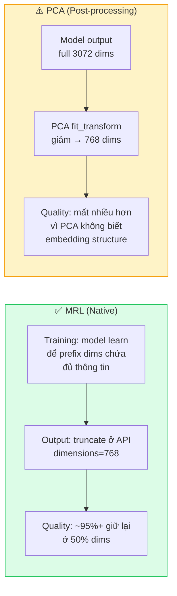
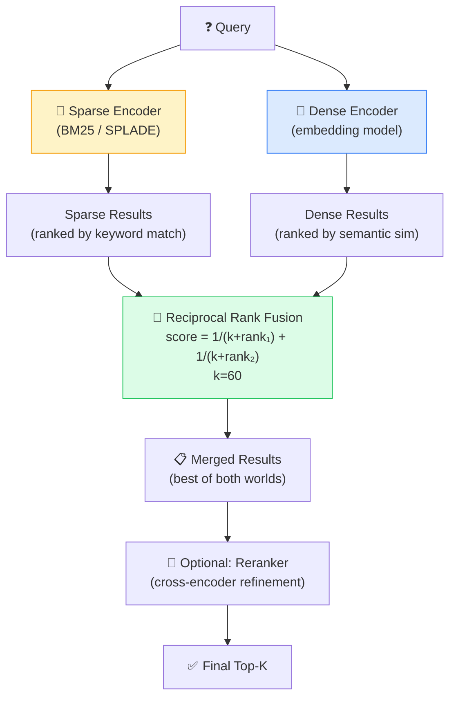

---

## 3.4 Dimension Reduction & Quantization

Nếu `3.1` là bài toán chọn model, `3.2` là chọn nơi lưu vectors, và `3.3` là chọn đơn vị kiến thức để retrieve, thì phần còn lại của `Layer 3` đi vào các đòn bẩy tối ưu cuối cùng: giảm chiều, nén vectors, kết hợp sparse với dense, và thiết kế evaluation để biết thay đổi nào thật sự làm hệ thống tốt hơn. Đây là nơi những quyết định có vẻ nhỏ bắt đầu tác động trực tiếp đến RAM, latency, chi phí và chất lượng production.

### Ưu tiên giảm chiều native khi model hỗ trợ MRL

Nếu model hỗ trợ `MRL` (Matryoshka Representation Learning), ưu tiên dùng chính khả năng giảm chiều native của model thay vì giảm chiều sau khi embedding đã được tạo ra.

- OpenAI: `dimensions` parameter
- Cohere embed-v4: `output_dimension` parameter
- Google Gemini: `output_dimensionality` trong config

| Model | MRL Support | Cách dùng | Min Dims |
|-------|-------------|-----------|----------|
| text-embedding-3-large | ✅ | `dimensions=1536` trong API call | 256 |
| text-embedding-3-small | ✅ | `dimensions=512` trong API call | 256 |
| embed-v4.0 | ✅ | `output_dimension` parameter ([Cohere API ref](https://docs.cohere.com/reference/embed)) | 256 |
| Gemini Embedding 2 | ✅ | `output_dimensionality` trong config ([Google docs](https://ai.google.dev/gemini-api/docs/embeddings)) | 768 (recommended min) |
| jina-embeddings-v3 | ✅ | Truncate output | 32 |

### Khi nào dùng MRL, PCA, UMAP hay Quantization?

| Kỹ thuật | Nên dùng khi | Không nên kỳ vọng gì | Vai trò chính |
|----------|--------------|----------------------|---------------|
| **MRL / native truncation** | Model hỗ trợ giảm chiều native và mục tiêu là giảm storage/RAM/latency | Không thay được visualization 2D/3D | Giảm chiều cho production retrieval |
| **PCA** | Model không hỗ trợ MRL hoặc cần exploratory analysis | Không phải cách tốt nhất để giữ retrieval quality ở scale production | Baseline reduction, phân tích phương sai |
| **UMAP** | Cần nhìn cấu trúc dữ liệu ở 2D/3D | Không nên dùng trực tiếp để thay thế embedding production | Visualization, exploratory analysis |
| **Quantization** | Dataset lớn đến mức RAM hoặc storage bắt đầu thành bottleneck rõ rệt | Không phải lúc nào cũng miễn phí về quality | Giảm footprint và tăng throughput ở scale lớn |

### Chọn target dimensions như thế nào?

Giảm từ `3072` xuống `1536`, `768` hay `512` không nên được làm theo cảm giác. Cách chọn hợp lý nhất là xem **use case nào đang nhạy cảm nhất với việc mất thông tin**.

- **Retrieval / semantic search** thường chịu giảm chiều khá tốt nếu model có `MRL`, nhất là khi corpus và query không quá khó
- **RAG retrieval** thường vẫn chấp nhận được ở dimensions thấp hơn, miễn là `Recall@K` và answer quality chưa giảm rõ
- **Clustering** thường nhạy hơn với thay đổi hình học của vector space, nên cần test kỹ hơn
- **Classification** có thể vẫn ổn ở dimensions thấp hơn nếu decision boundary của bài toán không quá phức tạp

Một workflow thực tế thường là:

1. chọn baseline ở full dims hoặc mức nhà cung cấp khuyến nghị
2. chạy sweep qua vài mức như `3072 -> 1536 -> 768 -> 512`
3. đo đúng metric của use case, không chỉ nhìn storage giảm bao nhiêu
4. dừng ở mức thấp nhất mà quality còn nằm trong ngưỡng chấp nhận được

Nói cách khác, target dimensions nên được xem như một điểm cân bằng giữa **quality, RAM, storage và latency**, chứ không phải một con số đẹp cố định cho mọi hệ thống.

### Tại sao MRL tốt hơn PCA truncation?



- **MRL training**: model được train với loss function ở nhiều granularities — đảm bảo prefix dimensions **đã capture đủ thông tin** quan trọng nhất
- **PCA truncation**: áp dụng **sau** training → linear transformation không tối ưu cho embedding structure → mất thông tin nhiều hơn
- **MRL giữ chất lượng cao ở 50% dimensions** (ví dụ 3072→1536; xem MTEB scores trong [Google docs](https://ai.google.dev/gemini-api/docs/embeddings)), PCA thường mất nhiều hơn

> Source: [Matryoshka Representation Learning — Kusupati et al., 2022](https://arxiv.org/abs/2205.13147)

### PCA/UMAP (Vẫn cần cho một số trường hợp)

MRL không thể thay thế PCA/UMAP trong mọi trường hợp. Điểm khác biệt quan trọng là MRL phục vụ giảm chiều cho **production embeddings**, còn PCA/UMAP thường phục vụ **phân tích** hoặc **visualization**.

| Method | Khi nào dùng | Cách hoạt động | Ghi chú |
|--------|-------------|---------------|---------|
| **UMAP** | Visualization 2D/3D, manifold learning | Non-linear mapping, giữ cấu trúc local | Tốt nhất cho visual exploration |
| **PCA** | Exploratory analysis, baseline reduction | Linear transform, maximize variance | Nhanh, deterministic, explainable |
| **t-SNE** | Visualization 2D/3D (alternative) | Non-linear, perplexity-based | Chậm hơn UMAP ở scale lớn |

**Khi nào dùng PCA/UMAP thay vì MRL?**
1. **Visualization**: UMAP chiếu 1536-dim → 2D plot → MRL không làm được (min dim thường = 256+)
2. **Model không hỗ trợ MRL**: all-mpnet-base-v2, embed-v3, các model cũ → PCA là lựa chọn duy nhất
3. **Exploratory analysis**: PCA explained variance ratio giúp hiểu thông tin phân bố trong dimensions

### Mã giả: Chọn giữa MRL, PCA và UMAP

```text
# Goal 1: reduce production vector size while preserving quality
if model_supports_mrl:
    vectors = embed(
        texts,
        model="embedding-model",
        dimensions=768
    )

# Goal 2: reduce dimensions for analysis when model has no MRL
else if need_smaller_vectors_for_analysis:
    full_vectors = embed(texts, model="embedding-model")
    reduced_vectors = pca_reduce(full_vectors, target_dimensions=768)

# Goal 3: visualize clusters or inspect the geometry manually
if need_2d_visualization:
    full_vectors = embed(texts, model="embedding-model")
    vectors_2d = umap_project(full_vectors, target_dimensions=2)
    plot(vectors_2d)
```

> Sources: [PCA — scikit-learn](https://scikit-learn.org/stable/modules/generated/sklearn.decomposition.PCA.html), [UMAP documentation](https://umap-learn.readthedocs.io/en/latest/)

### Quantization (Scale lớn: >10M vectors)

Khi vector database chứa hàng triệu hoặc hàng chục triệu vectors, **memory** thường trở thành bottleneck chính nhanh hơn nhiều team dự đoán.

### Ba đòn bẩy khác nhau: giảm chiều, nén vector, nén index

Ba kỹ thuật dưới đây thường bị trộn vào nhau, nhưng chúng tác động lên hệ thống theo những tầng khác nhau:

| Đòn bẩy | Tác động lên cái gì? | Ví dụ | Khi nào nghĩ tới |
|---------|----------------------|-------|------------------|
| **Giảm chiều đầu ra** | Bản thân vector embedding | `3072 -> 1536` bằng `MRL` | Muốn giảm RAM/storage ngay từ đầu mà vẫn giữ retrieval quality |
| **Quantization** | Cách biểu diễn giá trị trong vector | `float32 -> int8` hoặc `binary` | Khi vectors đã nhiều tới mức memory footprint trở thành bottleneck |
| **Nén / tối ưu ở tầng index** | Cấu trúc ANN index và cách search | `PQ`, `IVF_PQ`, compressed indexes | Khi scale lớn tới mức index structure cũng phải tối ưu mạnh |

Điểm quan trọng là ba bước này **không thay thế nhau**. Nhiều hệ thống production sẽ dùng kết hợp: giảm chiều trước, rồi quantize, rồi mới tối ưu index khi scale tiếp tục tăng.

**Ví dụ tính toán memory:**
- 10M vectors × 1536 dims × 4 bytes (float32) = **~57 GB RAM** chỉ cho vectors
- Thêm index overhead (HNSW graph) → ~80-100 GB
- 100M vectors → ~800 GB-1TB → cần nhiều machines

Quantization giải quyết bằng cách **nén** vectors:

| Method | Cách hoạt động | Memory Reduction | Quality Impact | Khi nào dùng |
|--------|---------------|-----------------|-------------|-------------|
| **Scalar Quantization (SQ8)** | float32 → int8 (mỗi dim) | **4x** | Nhỏ — thường chấp nhận được | Scale vừa (10M-100M vectors) |
| **Product Quantization (PQ)** | Chia vector thành sub-vectors, quantize mỗi sub | **16-64x** | Lớn hơn SQ8 — cần test | Scale lớn (>100M vectors) |
| **Binary Quantization** | Mỗi dim → 1 bit (sign) | **32x** | Đáng kể — dùng cho coarse pass | First-pass retrieval, re-rank later |

**Chiến lược kết hợp**: dùng binary quantization cho first-pass (nhanh, tìm ~1000 candidates) → re-score candidates bằng full-precision vectors (chính xác).

### Khi nào chưa nên Quantize?

Quantization không phải bước nên làm quá sớm. Nhiều hệ thống nên trì hoãn nó cho tới khi đã rõ bottleneck thật sự nằm ở đâu.

- dataset còn nhỏ hoặc vừa, RAM chưa phải vấn đề thật
- chất lượng retrieval còn chưa ổn định, chưa có baseline rõ để so sánh trước/sau quantization
- hệ thống còn đang đổi model, đổi chunking hoặc đổi index khá thường xuyên
- chi phí vận hành thêm của quantization lớn hơn lợi ích mà nó mang lại ở giai đoạn hiện tại

Thứ tự hợp lý thường là: chọn model phù hợp, chọn dimension hợp lý, benchmark baseline, rồi mới nghĩ tới quantization khi scale đã bắt đầu gây áp lực thật.

### Sai lầm thường gặp

- Dùng PCA để thay vai trò của MRL dù model đã hỗ trợ native truncation
- Dùng UMAP để "giảm chiều cho production", trong khi UMAP chủ yếu hữu ích cho visualization
- Quantize quá sớm khi hệ thống còn chưa có baseline chất lượng ổn định
- Đánh giá quantization chỉ bằng memory reduction mà không đo retrieval quality sau khi nén

> Sources: [FAISS — Index types and Quantization](https://github.com/facebookresearch/faiss/wiki/Faiss-indexes)

---

## 3.5 Hybrid Search (Sparse + Dense)

### Tổng quan

Sau khi model, vector DB và chunking đã tạm ổn, bottleneck tiếp theo thường nằm ở retrieval quality. Nhiều hệ thống dense-only hoạt động khá tốt với query tự nhiên, nhưng lại hụt hơi ở mã lỗi, tên riêng, SKU, số điều luật hay cụm từ chuẩn hóa. Ngược lại, BM25 rất mạnh ở exact match nhưng yếu ở paraphrase. `Hybrid search` xuất hiện để kết hợp hai mặt này trong cùng một pipeline.

### Khi nào Hybrid thực sự cần?

Hybrid đặc biệt đáng giá khi query distribution của hệ thống có tính pha trộn:

- vừa có câu hỏi tự nhiên, vừa có mã số, tên riêng hoặc thuật ngữ chuẩn
- corpus có nhiều cụm exact match quan trọng như product codes, error messages, legal citations
- người dùng diễn đạt cùng một ý bằng nhiều cách rất khác nhau
- dense retrieval có recall tốt nhưng hay bỏ sót exact matches quan trọng

Nói ngắn gọn: hybrid đáng giá nhất khi **sparse và dense thất bại ở những kiểu query khác nhau**.

### Khi nào dense-only hoặc sparse-only là đủ?

- **Dense-only** thường đủ khi query chủ yếu là ngôn ngữ tự nhiên, ít exact identifiers, và mục tiêu là semantic recall
- **Sparse-only** thường đủ khi corpus có tính cấu trúc cao, query nhiều mã số/tên chuẩn, và exact term matching quan trọng hơn paraphrase

Nếu hệ thống chưa có bằng chứng rõ ràng rằng sparse và dense bổ trợ nhau, việc thêm hybrid quá sớm có thể chỉ làm pipeline phức tạp hơn mà chưa đem lại nhiều lợi ích.

### Query Routing và Conditional Hybrid

Trong production, không phải query nào cũng cần đi qua cùng một pipeline. Nhiều hệ thống hoạt động tốt hơn khi **route query theo đặc điểm của nó**:

- query có mã lỗi, SKU, ticket ID, tên chuẩn hóa hoặc legal citation rõ ràng → ưu tiên sparse hoặc hybrid thiên sparse
- query dài, diễn đạt tự nhiên, có nhiều paraphrase → ưu tiên dense hoặc hybrid cân bằng hơn
- query quá ngắn hoặc mơ hồ → thường cần top-K rộng hơn và rerank mạnh hơn
- query có cả keyword exact lẫn ý nghĩa mở rộng → hybrid là lựa chọn tự nhiên

Điểm hay của query routing là nó giúp tránh việc mọi query đều phải trả "thuế độ phức tạp" của hybrid search, trong khi thực tế chỉ một nhóm query nhất định mới thật sự cần.

### Tại sao cần Hybrid?

| Method | Mạnh | Yếu | Ví dụ |
|--------|------|------|-------|
| **BM25 (Sparse)** | Exact keyword match, tên riêng, mã số | Không hiểu synonyms/paraphrases | Query "iPhone 15 Pro Max" → match exact |
| **Dense Embedding** | Semantic similarity, multilingual | Yếu exact match, rare terms | Query "cách sửa điện thoại" → match "phone repair guide" |
| **Hybrid** | Cả hai! | Phức tạp hơn, cần tune | Kết hợp keyword precision + semantic recall |

**Ví dụ thực tế** khi sparse thắng dense:
- Query: "PO-2024-001234" (mã đơn hàng) → BM25 match exact, dense embedding không hiểu
- Query: "OWASP Top 10" → BM25 match tên chuẩn, dense có thể nhầm lẫn

**Ví dụ thực tế** khi dense thắng sparse:
- Query: "cách làm cho máy tính chạy nhanh hơn" → dense match "performance optimization guide"
- Query: "feelings of sadness" → dense match "depression symptoms" (synonym understanding)

### Reciprocal Rank Fusion (RRF)

```
RRF_score(d) = 1/(k + rank_sparse(d)) + 1/(k + rank_dense(d))
```

- `k = 60` (constant, mặc định trong hầu hết implementations)
- RRF chỉ dùng **rank** (thứ hạng), không dùng raw score → không cần normalize scores giữa systems
- Tỷ lệ khuyến nghị: **70-80% dense + 20-30% sparse** (heuristic, tune theo domain)

Điểm mạnh rất thực dụng của `RRF` là nó giúp gộp hai hệ retrieval mà không phải đau đầu normalize raw scores giữa BM25 và dense similarity. Nếu không dùng `RRF` mà dùng weighted sum của raw scores, bạn gần như luôn phải xử lý normalization trước, nếu không một nhánh sẽ lấn át nhánh còn lại chỉ vì scale điểm khác nhau.

**Tune theo domain:**
- Legal/Medical: tăng sparse weight (exact terminology quan trọng)
- Casual Q&A: tăng dense weight (semantic understanding quan trọng)
- E-commerce: cân bằng (product names exact + description semantic)

### Ngoài RRF còn những cách fusion nào?

`RRF` là điểm bắt đầu rất tốt vì đơn giản, bền vững và ít cần calibration. Nhưng khi hệ thống trưởng thành hơn, vẫn có những hướng khác:

- **Weighted score fusion**: cộng điểm sparse và dense theo trọng số sau khi đã normalize cùng scale
- **Learning-to-rank**: học trực tiếp cách kết hợp nhiều tín hiệu như BM25, dense similarity, click priors, freshness
- **Conditional fusion**: đổi cách fusion theo loại query hoặc theo vertical riêng

Nếu chưa có lý do rõ ràng để đi xa hơn, `RRF` vẫn là baseline nên bắt đầu trước. Nó đơn giản đủ để debug và đủ mạnh cho rất nhiều use cases thực tế.

### SPLADE: Learned Sparse Model

**SPLADE** (Sparse Lexical and Expansion) là learned sparse model:
- Output vẫn là **sparse vectors** (như BM25) nhưng được train bằng neural network
- **Term expansion**: tự động expand query "car" → thêm "vehicle", "automobile" vào sparse representation
- **Learned term weights**: learn weights tốt hơn BM25's TF-IDF formula
- Kết quả: tốt hơn BM25 truyền thống 10-20% trên BEIR benchmark

### Diagram: Hybrid Search Architecture



### Failure Modes thường gặp

- dense branch và sparse branch trả về gần như cùng một tập kết quả, khiến hybrid không tạo thêm giá trị
- BM25 thắng rõ ở exact identifiers nhưng bị cho weight quá thấp
- dense retrieval tốt nhưng top results lặp ý, làm fusion ít diversity hơn mong đợi
- đánh giá hybrid chỉ bằng một vài query demo "đẹp", thay vì bằng query logs thật
- thêm hybrid trước khi dense-only baseline đủ tốt, khiến khó biết mình đang sửa bottleneck nào

### Mã giả: Hybrid Search Pipeline

```text
query_text = "Matryoshka embedding dimension reduction"

# Step 1: run sparse retrieval
sparse_results = sparse_search(
    query=query_text,
    method="bm25",
    top_k=100
)

# Step 2: run dense retrieval
query_vector = embed([query_text], model="embedding-model")
dense_results = dense_search(
    query_vector=query_vector,
    top_k=100
)

# Step 3: fuse the two ranked lists
merged_results = reciprocal_rank_fusion(
    sparse_results,
    dense_results,
    rank_constant=60
)

# Step 4: optionally rerank the merged candidates
final_results = rerank_if_needed(
    query=query_text,
    candidates=merged_results,
    top_k=10
)
```

> Source: [Elasticsearch — Semantic text hybrid search](https://www.elastic.co/guide/en/elasticsearch/reference/current/semantic-text-hybrid-search.html)

### Cách rollout Hybrid Search trong production

Một lộ trình thực tế thường an toàn hơn là:

1. dựng baseline `dense-only` hoặc `sparse-only`
2. phân tích query logs để xem nhóm query nào đang thua rõ
3. thêm nhánh retrieval còn thiếu và fusion bằng `RRF`
4. đo lại trên eval set theo từng nhóm query, không chỉ nhìn average chung
5. chỉ thêm reranker sau khi hybrid retrieval đã chứng minh được rằng nó thật sự tăng recall hoặc ranking quality

---

## 3.6 Evaluation Methodology

### Tổng quan

Evaluation là phần **quan trọng nhất nhưng thường bị bỏ qua** khi build embedding systems. Không đánh giá thì mọi thay đổi về model, chunking, hybrid search hay quantization đều dễ biến thành cảm giác chủ quan.

Phần này tập trung vào một ý rất thực dụng: evaluation không phải là phần trang trí cuối dự án. Nó là vòng lặp quyết định xem thay đổi nào nên được giữ lại trong production.

### Offline vs Online Evaluation

Hai lớp evaluation này bổ trợ nhau, không thay thế nhau:

| Loại | Trả lời câu hỏi gì? | Mạnh ở đâu | Yếu ở đâu |
|------|----------------------|------------|-----------|
| **Offline evaluation** | Model/config nào tốt hơn trên tập test có nhãn? | Nhanh, lặp lại được, phù hợp để so sánh nhiều phương án | Không phản ánh trọn vẹn hành vi người dùng thật |
| **Online evaluation** | Người dùng có thực sự hài lòng hơn không? | Đo được tác động sản phẩm thật | Chậm hơn, tốn rollout, dễ nhiễu bởi nhiều yếu tố ngoài retrieval |

Một nguyên tắc hữu ích là: dùng offline eval để **lọc phương án tệ**, còn online eval để **xác nhận tác động thực**.

### Benchmark Frameworks

| Framework | Focus | Datasets | Key Metric | Source |
|-----------|-------|----------|------------|--------|
| **MTEB** | General embedding quality | 58+ datasets, **8 tasks**, 112 languages | Task-dependent average | [paper](https://arxiv.org/abs/2210.07316), [leaderboard](https://huggingface.co/spaces/mteb/leaderboard) |
| **BEIR** | Information Retrieval | 18 datasets, diverse domains | nDCG@10 | [repo](https://github.com/beir-cellar/beir) |

#### MTEB — 8 Task Categories

MTEB (Massive Text Embedding Benchmark) đánh giá embeddings trên **8 tasks khác nhau**, phản ánh diverse use cases:

| # | Task | Mô tả | Datasets (ví dụ) |
|---|------|--------|-------------------|
| 1 | **Classification** | Dùng embedding làm features → classifier | Amazon Reviews, IMDB, Toxic Comments |
| 2 | **Clustering** | Phân cụm semantic | Reddit clustering, ArXiv clustering |
| 3 | **Retrieval** | Tìm relevant documents cho query | MS MARCO, NQ, BEIR suite |
| 4 | **Reranking** | Sắp xếp lại candidates theo relevance | AskUbuntu, StackOverflow |
| 5 | **STS** | Semantic Textual Similarity (đo score 0-5) | STS-B, SICK-R |
| 6 | **Pair Classification** | Phân loại cặp câu (entailment, paraphrase, contradiction) | MNLI, QQP, PAWS |
| 7 | **Bitext Mining** | Tìm cặp dịch song ngữ (cross-lingual) | Tatoeba, BUCC |
| 8 | **Summarization** | Đánh giá embedding cho text summarization | SummEval |

### Metrics Set Chi tiết

#### Retrieval Metrics (dùng cho search/RAG)

| Metric | Ý nghĩa | Công thức (simplified) | Ví dụ |
|--------|---------|----------------------|-------|
| **Recall@k** | Bao nhiêu % relevant docs nằm trong top-k? | \|relevant ∩ top-k\| / \|relevant\| | Recall@10 = 0.8 → 80% relevant docs được tìm thấy trong top 10 |
| **Precision@k** | Bao nhiêu % top-k là relevant? | \|relevant ∩ top-k\| / k | Precision@10 = 0.3 → 3/10 results là relevant |
| **nDCG@k** | Chất lượng ranking (relevant docs có ở vị trí cao?) | Normalized DCG | nDCG@10 = 0.9 → relevant docs gần đỉnh ranking |
| **MAP@k** | Average precision trung bình | Mean(AP per query) | MAP@100 = 0.75 |
| **MRR** | Rank của relevant result đầu tiên | 1 / rank_of_first_relevant | MRR = 0.5 → relevant result đầu tiên ở vị trí #2 |

**Cách chọn metric:**
- **Recall@k**: quan trọng nhất cho Stage 1 retrieval (coverage)
- **nDCG@k**: quan trọng nhất cho Stage 2 reranking (ranking quality)
- **MRR**: khi chỉ cần 1 kết quả đúng (e.g., question answering)

### Đánh giá theo từng stage của hệ thống

Một hệ thống embedding/RAG thường hỏng ở một stage cụ thể, không phải ở mọi stage cùng lúc. Vì vậy, evaluation nên bám vào từng lớp:

| Stage | Câu hỏi cần trả lời | Metric nên nhìn trước |
|-------|----------------------|-----------------------|
| **Embedding / representation** | Vectors có giữ được semantic structure đủ tốt không? | STS, clustering sanity checks, downstream task quality |
| **Stage 1 retrieval** | Relevant candidates có lọt vào top-K đủ nhiều không? | `Recall@K`, `MAP`, coverage theo query groups |
| **Stage 2 rerank** | Relevant items có được kéo lên đúng vị trí cao không? | `nDCG@K`, `MRR`, pairwise relevance accuracy |
| **Context assembly / RAG** | Context có đủ và ít nhiễu để model trả lời không? | context precision/recall, evidence coverage |
| **Answer layer** | Câu trả lời có đúng, grounded và hữu ích không? | faithfulness, answer relevance, human review |
| **Production behavior** | Hệ thống có nhanh, ổn định và đáng tiền không? | latency, QPS, RAM, cost per query |

Khung này giúp tránh nhầm lẫn rất phổ biến: thấy answer tệ rồi kết luận model embedding tệ, trong khi lỗi thật có thể nằm ở chunking, reranking hoặc prompt assembly.

#### RAG-specific Metrics

| Metric | Ý nghĩa | Cách đo | Tool |
|--------|---------|---------|------|
| **Faithfulness** | Answer có grounded trong context? (không hallucinate?) | LLM-as-judge hoặc NLI model | RAGAS, TruLens |
| **Answer Relevance** | Answer có trả lời đúng câu hỏi? | LLM-as-judge | RAGAS |
| **Context Precision** | Context được retrieve có relevant? | So với ground truth labels | Custom eval |
| **Context Recall** | Đủ context để trả lời? | So với ground truth answer | RAGAS |

#### Operational Metrics (Production monitoring)

| Metric | Ý nghĩa | Target | Cách đo |
|--------|---------|--------|---------|
| **P95 Latency** | 95th percentile response time | <100ms retrieval, <500ms rerank | APM tools (Datadog, Grafana) |
| **P99 Latency** | 99th percentile (tail) | <500ms retrieval | APM tools |
| **QPS** | Queries per second | >100 QPS production | Load testing (k6, locust) |
| **Index RAM/GB** | Bộ nhớ cho vector index | Phụ thuộc budget | VectorDB metrics |
| **Embedding Latency** | Thời gian generate 1 embedding | <50ms (API) | API response time |

**Công thức ước tính RAM:**
```text
RAM (bytes) = n_vectors × dims × bytes_per_value × index_overhead_factor
Ví dụ: 10M × 1536 × 4 (float32) × 1.5 (HNSW overhead) ≈ 88 GB
```

### Xây eval set như thế nào để không tự lừa mình?

Một eval set hữu ích thường nhỏ hơn mọi người nghĩ, nhưng phải đúng bài toán:

- lấy query từ logs thật hoặc từ những tình huống sản phẩm sẽ gặp thật
- cover cả happy path lẫn edge cases như rare terms, multilingual queries, typo, identifiers
- giữ ground truth ở mức đủ rõ: tài liệu đúng, chunk đúng, hoặc answer đúng tùy use case
- tách riêng các nhóm query quan trọng thay vì chỉ nhìn một điểm số trung bình

Với search và RAG, chỉ cần `50-200` queries được gán nhãn cẩn thận cũng thường giá trị hơn rất nhiều so với một benchmark lớn nhưng lệch domain.

### LLM-as-judge: dùng ở đâu, không nên tin ở đâu?

`LLM-as-judge` rất hữu ích cho RAG vì nhiều tiêu chí như faithfulness hoặc answer relevance khó viết thành rule cứng. Nhưng nó không nên được xem là chân lý tuyệt đối.

- hợp để chấm nhanh answer relevance, faithfulness, citation quality theo rubric rõ
- hữu ích khi muốn so sánh nhiều prompt hoặc retrieval configs trước khi human review sâu hơn
- không nên dùng như nguồn sự thật duy nhất cho domain quá nhạy cảm hoặc answer có tính pháp lý, y tế, tài chính
- nếu dùng judge model, nên giữ rubric ổn định và spot-check bằng human review định kỳ

### Label Quality và Judge Calibration

Không có metric nào cứu được một eval set gán nhãn kém. Khi xây evaluation, chất lượng nhãn thường quan trọng không kém bản thân model.

- annotators nên có rubric rõ: thế nào là `relevant`, `partially relevant`, `not relevant`
- nếu có nhiều người gán nhãn, nên kiểm tra disagreement rate để phát hiện chỗ rubric còn mơ hồ
- với `LLM-as-judge`, nên giữ cùng một prompt/rubric qua nhiều lần chạy để kết quả còn so sánh được
- nên spot-check định kỳ giữa human review và judge scores để xem judge có đang drift hoặc quá dễ hay quá khắt khe không

Nếu judge model và human review thường xuyên bất đồng ở một nhóm query, đó thường là tín hiệu rằng rubric hoặc nhãn đang có vấn đề, không chỉ riêng model retrieval.

### Quy trình regression testing nên có

Một pipeline evaluation thực dụng thường gồm:

1. model/config mới chạy trên eval set chuẩn
2. so với baseline theo đúng metric của use case
3. xem breakdown theo nhóm query, không chỉ average
4. nếu là RAG, kiểm tra thêm một mẫu answer bằng human review hoặc judge rubric
5. chỉ rollout khi thay đổi thắng ở đúng metric đang tối ưu và không tạo regressions lớn ở nhóm query quan trọng

### Best Practices cho Evaluation

1. **Không dựa hoàn toàn vào MTEB leaderboard** — model #1 trên MTEB chưa chắc tốt nhất cho domain/ngôn ngữ cụ thể

2. **Build domain-specific eval set**: tạo bộ test riêng cho use case với `50-200` query-relevant_doc pairs được gán nhãn cẩn thận, có cover edge cases và query distribution thật

3. **Multilingual evaluation**: MTEB chưa cover tiếng Việt tốt → cần build eval set riêng cho tiếng Việt

4. **A/B testing trong production**: offline metrics (nDCG, Recall) ≠ online satisfaction
   - Track click-through rate, dwell time, user satisfaction surveys
   - Gradual rollout: 5% → 25% → 100%

5. **Evaluation pipeline tự động hóa**:
   ```
   New model/config → Auto-eval on test set → Compare metrics → Deploy if better
   ```

> Sources: [MTEB paper — Muennighoff et al., 2022](https://arxiv.org/abs/2210.07316), [BEIR benchmark](https://github.com/beir-cellar/beir), [HuggingFace MTEB Blog](https://huggingface.co/blog/mteb)

---

# 📚 Tổng hợp Sources

Phần này gom các nguồn đã được dùng xuyên suốt tài liệu theo từng nhóm, để người đọc có thể tra cứu sâu hơn mà không phải lần ngược từng section. Nó hữu ích nhất khi bạn muốn đào sâu một mảng cụ thể như model docs, vector DB, benchmark hay papers nền tảng.

## Academic Papers

| # | Paper | URL |
|---|-------|-----|
| 1 | Word2Vec — Mikolov et al., 2013 | [arxiv.org/abs/1301.3781](https://arxiv.org/abs/1301.3781) |
| 2 | GloVe — Pennington et al., 2014 | [aclanthology.org/D14-1162.pdf](https://aclanthology.org/D14-1162.pdf) |
| 3 | FastText — Bojanowski et al., 2016 | [arxiv.org/abs/1607.04606](https://arxiv.org/abs/1607.04606) |
| 4 | Transformer — Vaswani et al., 2017 | [arxiv.org/abs/1706.03762](https://arxiv.org/abs/1706.03762) |
| 5 | Sentence-BERT — Reimers & Gurevych, 2019 | [arxiv.org/abs/1908.10084](https://arxiv.org/abs/1908.10084) |
| 6 | Matryoshka Representation Learning — Kusupati et al., 2022 | [arxiv.org/abs/2205.13147](https://arxiv.org/abs/2205.13147) |
| 7 | MTEB Benchmark — Muennighoff et al., 2022 | [arxiv.org/abs/2210.07316](https://arxiv.org/abs/2210.07316) |
| 8 | CLIP — Radford et al., 2021 | [arxiv.org/abs/2103.00020](https://arxiv.org/abs/2103.00020) |
| 9 | RAG — Lewis et al., 2020 | [arxiv.org/abs/2005.11401](https://arxiv.org/abs/2005.11401) |
| 10 | Jina Embeddings v3, 2024 | [arxiv.org/pdf/2409.10173](https://arxiv.org/pdf/2409.10173) |

## Embedding Model Documentation

| # | Resource | URL |
|---|----------|-----|
| 11 | Gemini Embedding 2 Blog | [blog.google/.../gemini-embedding-2/](https://blog.google/innovation-and-ai/models-and-research/gemini-models/gemini-embedding-2/) |
| 12 | Gemini API Pricing | [ai.google.dev/gemini-api/docs/pricing](https://ai.google.dev/gemini-api/docs/pricing) |
| 13 | Vertex AI Pricing | [cloud.google.com/vertex-ai/generative-ai/pricing](https://cloud.google.com/vertex-ai/generative-ai/pricing) |
| 14 | Vertex Multimodal Embeddings | [cloud.google.com/...get-multimodal-embeddings](https://cloud.google.com/vertex-ai/generative-ai/docs/embeddings/get-multimodal-embeddings) |
| 15 | Gemini Embedding 001 docs | [ai.google.dev/gemini-api/docs/embeddings](https://ai.google.dev/gemini-api/docs/embeddings) |
| 16 | OpenAI Embedding-3 | [openai.com/.../new-embedding-models-and-api-updates/](https://openai.com/index/new-embedding-models-and-api-updates/) |
| 17 | Cohere Embed Models | [docs.cohere.com/docs/cohere-embed](https://docs.cohere.com/docs/cohere-embed) |
| 18 | Cohere Embed v4 Changelog | [docs.cohere.com/changelog/embed-multimodal-v4](https://docs.cohere.com/changelog/embed-multimodal-v4) |
| 19 | Voyage AI Models | [docs.voyageai.com/docs/embeddings](https://docs.voyageai.com/docs/embeddings) |
| 20 | SBERT Pretrained Models | [sbert.net/.../pretrained_models.html](https://www.sbert.net/docs/sentence_transformer/pretrained_models.html) |

## Applications & Techniques

| # | Resource | URL |
|---|----------|-----|
| 21 | SBERT Semantic Search | [sbert.net/.../semantic-search/](https://www.sbert.net/examples/sentence_transformer/applications/semantic-search/README.html) |
| 22 | SBERT Paraphrase Mining | [sbert.net/.../paraphrase-mining/](https://www.sbert.net/examples/sentence_transformer/applications/paraphrase-mining/README.html) |
| 23 | Pinecone Rerankers Guide | [docs.pinecone.io/guides/search/rerank-results](https://docs.pinecone.io/guides/search/rerank-results) |
| 24 | Cohere Rerank Overview | [docs.cohere.com/docs/rerank-overview](https://docs.cohere.com/docs/rerank-overview) |
| 25 | Google ML Recommendation | [developers.google.com/.../candidate-generation](https://developers.google.com/machine-learning/recommendation/overview/candidate-generation) |
| 26 | OpenAI Cookbook Classification | [github.com/openai/openai-cookbook/.../Classification_using_embeddings.ipynb](https://github.com/openai/openai-cookbook/blob/main/examples/Classification_using_embeddings.ipynb) |
| 27 | OpenAI Text & Code Embeddings | [openai.com/.../introducing-text-and-code-embeddings/](https://openai.com/index/introducing-text-and-code-embeddings/) |
| 28 | Pinecone Chunking Strategies | [pinecone.io/learn/chunking-strategies/](https://www.pinecone.io/learn/chunking-strategies/) |
| 29 | Azure Chunking for Vector Search | [learn.microsoft.com/.../vector-search-how-to-chunk-documents](https://learn.microsoft.com/en-us/azure/search/vector-search-how-to-chunk-documents) |
| 30 | Elasticsearch Hybrid Search | [elastic.co/.../semantic-text-hybrid-search.html](https://www.elastic.co/guide/en/elasticsearch/reference/current/semantic-text-hybrid-search.html) |

## Tools & Libraries

| # | Resource | URL |
|---|----------|-----|
| 31 | FAISS — Metrics, Indexes, Quantization | [github.com/facebookresearch/faiss/wiki/](https://github.com/facebookresearch/faiss/wiki/) |
| 32 | scikit-learn K-means | [scikit-learn.org/.../KMeans.html](https://scikit-learn.org/stable/modules/generated/sklearn.cluster.KMeans.html) |
| 33 | scikit-learn HDBSCAN | [scikit-learn.org/.../HDBSCAN.html](https://scikit-learn.org/stable/modules/generated/sklearn.cluster.HDBSCAN.html) |
| 34 | scikit-learn Isolation Forest | [scikit-learn.org/.../IsolationForest.html](https://scikit-learn.org/stable/modules/generated/sklearn.ensemble.IsolationForest.html) |
| 35 | scikit-learn PCA | [scikit-learn.org/.../PCA.html](https://scikit-learn.org/stable/modules/generated/sklearn.decomposition.PCA.html) |
| 36 | scikit-learn Cosine Similarity | [scikit-learn.org/.../cosine_similarity.html](https://scikit-learn.org/stable/modules/generated/sklearn.metrics.pairwise.cosine_similarity.html) |
| 37 | UMAP Documentation | [umap-learn.readthedocs.io/](https://umap-learn.readthedocs.io/en/latest/) |
| 38 | BEIR Benchmark Framework | [github.com/beir-cellar/beir](https://github.com/beir-cellar/beir) |
| 39 | HuggingFace MTEB Blog | [huggingface.co/blog/mteb](https://huggingface.co/blog/mteb) |

## Vector Databases

| # | Resource | URL |
|---|----------|-----|
| 40 | Pinecone Documentation | [docs.pinecone.io/guides/get-started/overview](https://docs.pinecone.io/guides/get-started/overview) |
| 41 | Cloudflare Vectorize | [developers.cloudflare.com/vectorize/](https://developers.cloudflare.com/vectorize/) |
| 42 | Weaviate Documentation | [docs.weaviate.io/weaviate/introduction](https://docs.weaviate.io/weaviate/introduction) |
| 43 | Qdrant Documentation | [qdrant.tech/documentation/overview/](https://qdrant.tech/documentation/overview/) |
| 44 | Milvus Documentation | [milvus.io/docs/overview.md](https://milvus.io/docs/overview.md) |
| 45 | Chroma Documentation | [docs.trychroma.com/docs/overview/introduction](https://docs.trychroma.com/docs/overview/introduction) |
| 46 | pgvector — PostgreSQL Extension | [github.com/pgvector/pgvector](https://github.com/pgvector/pgvector) |
| 47 | sqlite-vec | [github.com/asg017/sqlite-vec](https://github.com/asg017/sqlite-vec) |

---

> **Disclaimer**: Pricing data là snapshot tại **March 2026**. Benchmark data có nguồn khác nhau (vendor-reported, paper-reported, independent). Gemini Embedding 2 đang ở **preview** — specs và pricing có thể thay đổi. Luôn kiểm tra official docs cho thông tin mới nhất.
