# Tài liệu Toàn diện về Embedding

> **Phiên bản**: March 2026 | **Ngôn ngữ**: Việt-Anh (thuật ngữ kỹ thuật giữ nguyên tiếng Anh)
> **Nguồn**: 65+ citations từ official docs, papers, benchmarks
> **Cấu trúc**: 3 phần lớn — Nền tảng → Hệ thống & Ứng dụng → Vận hành & Tối ưu

---

Embedding xuất hiện từ một nhu cầu rất thực tế: máy tính chỉ xử lý được số, trong khi dữ liệu con người quan tâm lại là từ ngữ, câu, hình ảnh hay âm thanh. Muốn tìm kiếm theo nghĩa, gom nhóm nội dung tương tự, gợi ý đúng sở thích hay kết nối text với image, trước hết cần biến những dữ liệu rời rạc ấy thành vector mà vẫn giữ được thông tin ngữ nghĩa. Vì vậy, để hiểu embedding, cần trả lời bốn câu hỏi nền tảng: vector này thực chất là gì, vì sao các thế hệ model liên tục thay đổi, khoảng cách giữa các vector nên được đo như thế nào, và các vector ấy được đưa vào retrieval/RAG theo kiến trúc nào.

## Mục lục

- [Phần 1 — Nền tảng](#phần-1--nền-tảng)
  - [1.1 Embedding là gì?](#11-embedding-là-gì)
  - [1.2 Lịch sử phát triển](#12-lịch-sử-phát-triển)
  - [1.3 Các thuật toán tính Similarity](#13-các-thuật-toán-tính-similarity)
  - [1.4 Retrieval Foundations](#14-retrieval-foundations)
    - [1.4.1 Bi-encoder vs Cross-encoder](#141-bi-encoder-vs-cross-encoder)
    - [1.4.2 Query vs Document Asymmetry](#142-query-vs-document-asymmetry)
    - [1.4.3 Chunk vs Document](#143-chunk-vs-document)
    - [1.4.4 Dense, Sparse, Hybrid](#144-dense-sparse-hybrid)
    - [1.4.5 Retrieve, Rerank, Generate](#145-retrieve-rerank-generate)
- [Phần 2 — Hệ thống & Ứng dụng](#phần-2--hệ-thống--ứng-dụng)
  - [2.1 Semantic Search / Information Retrieval](#21-semantic-search--information-retrieval)
  - [2.2 RAG + Rerank](#22-rag--rerank-pipeline-3-giai-đoạn)
  - [2.3 Clustering (Phân cụm)](#23-clustering-phân-cụm)
  - [2.4 Recommendation Systems](#24-recommendation-systems)
  - [2.5 Classification & Sentiment Analysis](#25-classification--sentiment-analysis)
  - [2.6 Anomaly Detection](#26-anomaly-detection)
  - [2.7 Deduplication / Near-duplicate Detection](#27-deduplication--near-duplicate-detection)
  - [2.8 Multimodal Embedding](#28-multimodal-embedding)
- [Phần 3 — Vận hành & Tối ưu](#phần-3--vận-hành--tối-ưu)
  - [3.1 Embedding Models Comparison](#31-embedding-models-comparison)
  - [3.2 Vector Databases](#32-vector-databases-ma-trận-chọn-nhanh)
  - [3.3 Chunking Strategies](#33-chunking-strategies)
  - [3.4 Dimension Reduction & Quantization](#34-dimension-reduction--quantization)
  - [3.5 Hybrid Search (Sparse + Dense)](#35-hybrid-search-sparse--dense)
  - [3.6 Evaluation Methodology](#36-evaluation-methodology)
- [Tổng hợp Sources](#tổng-hợp-sources)

---

# Phần 1 — Nền tảng

Ở mức nền tảng, điều quan trọng không phải là nhớ tên từng model, mà là nắm bốn ý cốt lõi. Thứ nhất, embedding biến dữ liệu rời rạc thành biểu diễn số học có ý nghĩa. Thứ hai, các thế hệ model mới xuất hiện để sửa dần những giới hạn của thế hệ trước. Thứ ba, khi đã có vector, việc chọn similarity metric sẽ quyết định trực tiếp cách các hệ thống search, recommendation hay clustering hoạt động. Thứ tư, một hệ thống retrieval không chỉ có vector và metric; nó còn cần kiến trúc encode, đơn vị retrieve và pipeline phù hợp.

Phần 1 đi từ bản chất của embedding, sang lịch sử phát triển, rồi đến cách đo độ giống nhau giữa các vector, trước khi nối sang các kiến trúc retrieval thường dùng trong search và RAG. Cách đi này giúp từng khái niệm mới xuất hiện đều có điểm tựa từ phần trước.

## 1.1 Embedding là gì?

Để hiểu embedding, cần nhìn từ ba góc độ: dữ liệu rời rạc được ánh xạ sang vector ra sao, vì sao vị trí trong embedding space mang ý nghĩa, và embedding giải quyết được những giới hạn gì so với biểu diễn truyền thống.

Text, image hay audio ở dạng thô không thể đem đi cộng, trừ, so sánh hay tìm láng giềng gần nhất một cách trực tiếp. Máy học cần một biểu diễn số học; nhưng nếu biểu diễn đó chỉ ghi nhận danh tính của token mà không giữ được quan hệ ý nghĩa, thì các bài toán như search, clustering hay recommendation vẫn hoạt động rất kém. Embedding được đưa ra để giải quyết chính bài toán này.

### Từ dữ liệu rời rạc sang không gian liên tục

**Embedding** là phép ánh xạ dữ liệu rời rạc (discrete) — chẳng hạn từ ngữ, câu, hình ảnh, âm thanh — sang **vector liên tục** (continuous) trong không gian nhiều chiều (high-dimensional space). Ký hiệu toán học:

$$f: X \rightarrow \mathbb{R}^n$$

Trong đó:
- **X** là tập dữ liệu đầu vào (ví dụ: tập từ vựng, tập hình ảnh, tập âm thanh)
- **ℝⁿ** là không gian vector n chiều (thường n = 384, 768, 1024, 1536, 3072)
- **f** là hàm embedding (có thể là neural network, hoặc lookup table)

Cách hiểu đơn giản: mỗi từ, câu hay hình ảnh được "đặt" vào một tọa độ trong không gian nhiều chiều, sao cho **các khái niệm có ý nghĩa tương tự sẽ nằm gần nhau**.

Về mặt hệ thống, số chiều không chỉ là chuyện toán học mà còn là chuyện storage và cost. Một vector `1536` chiều ở dạng `float32` chiếm khoảng `1536 × 4 = 6144 bytes`, tức xấp xỉ `6 KB`. Nếu lưu `1 triệu` chunks, riêng phần raw vectors đã vào khoảng `6 GB`, chưa tính metadata, index structure hay replication trong vector database.

### Distributional Hypothesis

> *"Words that appear in similar contexts have similar meanings."*
> — Distributional Hypothesis ([Harris, 1954](https://www.tandfonline.com/doi/abs/10.1080/00437956.1954.11659520))

Ý tưởng cốt lõi: nếu hai từ thường xuất hiện trong ngữ cảnh giống nhau, chúng có ý nghĩa tương tự → vectors của chúng sẽ **gần nhau** trong không gian embedding.

**Ví dụ cụ thể:**
- "king" và "queen" gần nhau vì cùng xuất hiện trong ngữ cảnh hoàng gia, quyền lực
- "cat" và "dog" gần nhau vì cùng xuất hiện trong ngữ cảnh thú cưng, chăm sóc
- "Python" và "JavaScript" gần nhau vì cùng ngữ cảnh lập trình

**Word Analogy — phép toán trên vectors:**

Một trong những phát hiện ấn tượng nhất của Word2Vec là khả năng thực hiện phép toán trên vectors:

```
king - man + woman ≈ queen
Paris - France + Japan ≈ Tokyo
```

Điều này cho thấy embedding đã capture được **quan hệ ngữ nghĩa** (semantic relationships) giữa các từ — cụ thể là quan hệ giới tính (king/queen), quan hệ thủ đô/quốc gia (Paris/France).

### Diagram: Embedding Space

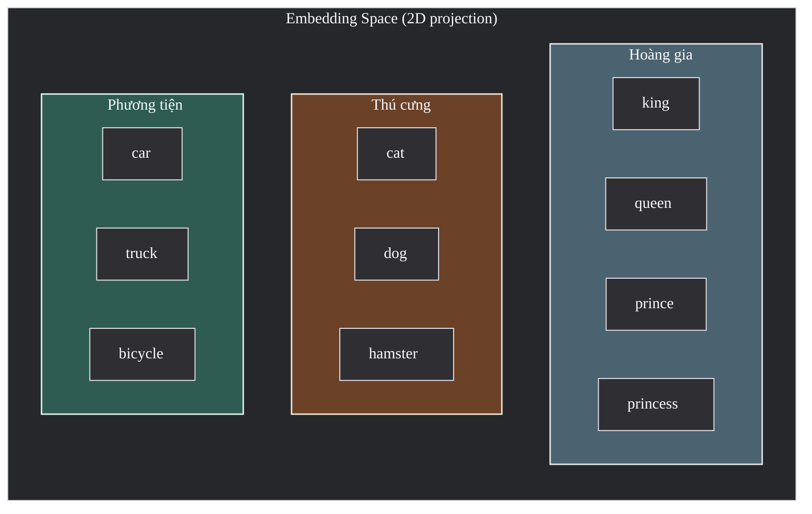

> **Hình 1**: Embedding space — các khái niệm liên quan nằm **gần nhau** trong cùng cluster. Khoảng cách giữa clusters phản ánh sự khác biệt ngữ nghĩa. Trong thực tế không gian có hàng trăm đến hàng nghìn chiều; hình trên là phép chiếu 2D minh họa.

### Tại sao Embedding quan trọng?

1. **Biểu diễn ngữ nghĩa**: One-hot encoding (vector thưa, mỗi từ 1 vị trí = 1) không capture được ý nghĩa. Embedding giải quyết bằng cách đặt "cat" và "kitten" gần nhau.
2. **Giảm chiều**: Vocabulary 100,000 từ → one-hot cần 100,000 dims. Embedding chỉ cần 384-3072 dims mà chứa nhiều thông tin hơn.
3. **Tính toán similarity**: Cho phép đo "khoảng cách ý nghĩa" giữa 2 khái niệm bất kỳ bằng phép toán vector đơn giản.
4. **Transfer learning**: Embedding được train trên dataset lớn có thể transfer sang task khác — không cần train lại từ đầu.
5. **Multimodal bridge**: Embedding cho phép đặt text, image, audio vào cùng không gian → so sánh cross-modal (tìm ảnh bằng mô tả text).

Nói ngắn gọn, embedding không chỉ đổi dữ liệu thành số, mà đổi dữ liệu thành số theo cách vẫn bảo toàn được phần nào cấu trúc ngữ nghĩa. Lịch sử phát triển của embedding vì thế cũng chính là lịch sử cải thiện chất lượng biểu diễn đó: hiểu ngữ cảnh tốt hơn, xử lý từ hiếm tốt hơn, và phục vụ hệ thống thực tế hiệu quả hơn.

---

## 1.2 Lịch sử phát triển

Lịch sử embedding không nên được nhìn như một timeline đơn thuần. Mỗi bước tiến xuất hiện đều để giải quyết một hạn chế khá cụ thể của thế hệ trước đó.

Lịch sử embedding có thể nhìn như một chuỗi lời giải nối tiếp nhau. Word2Vec học quan hệ từ ngữ từ ngữ cảnh cục bộ. GloVe bổ sung thống kê toàn cục. FastText xử lý tốt hơn các từ hiếm và OOV. Transformer mở ra contextual embeddings. Sentence-BERT làm cho retrieval quy mô lớn khả thi hơn. Matryoshka giúp cân bằng chất lượng với memory, latency và cost.

### Timeline tổng quan

| Năm | Model | Đặc điểm | Paper |
|-----|-------|----------|-------|
| 2013 | **Word2Vec** | CBOW & Skip-gram, static embeddings — mỗi từ có đúng 1 vector bất kể ngữ cảnh | [Mikolov et al., 2013](https://arxiv.org/abs/1301.3781) |
| 2014 | **GloVe** | Ma trận co-occurrence + global statistics, kết hợp count-based và prediction-based | [Pennington et al., 2014](https://aclanthology.org/D14-1162.pdf) |
| 2016 | **FastText** | Subword n-grams → xử lý OOV (out-of-vocabulary) words tốt hơn | [Bojanowski et al., 2016](https://arxiv.org/abs/1607.04606) |
| 2017 | **Transformer** | Self-attention mechanism, "Attention Is All You Need" — nền tảng cho tất cả modern models | [Vaswani et al., 2017](https://arxiv.org/abs/1706.03762) |
| 2019 | **Sentence-BERT** | Siamese/triplet BERT networks cho sentence-level embeddings — nhanh hơn cross-encoder 1000x cho search | [Reimers & Gurevych, 2019](https://arxiv.org/abs/1908.10084) |
| 2022 | **Matryoshka (MRL)** | Cho phép truncate embedding ở bất kỳ dimension nào mà vẫn giữ chất lượng — flexible dimensionality | [Kusupati et al., 2022](https://arxiv.org/abs/2205.13147) |
| 2024-2026 | **Modern Models** | text-embedding-3, embed-v4, Gemini Embedding 2 — multimodal, MRL, 128k+ context | Xem [Section 3.1](#31-embedding-models-comparison) |

### Diagram: Timeline Evolution

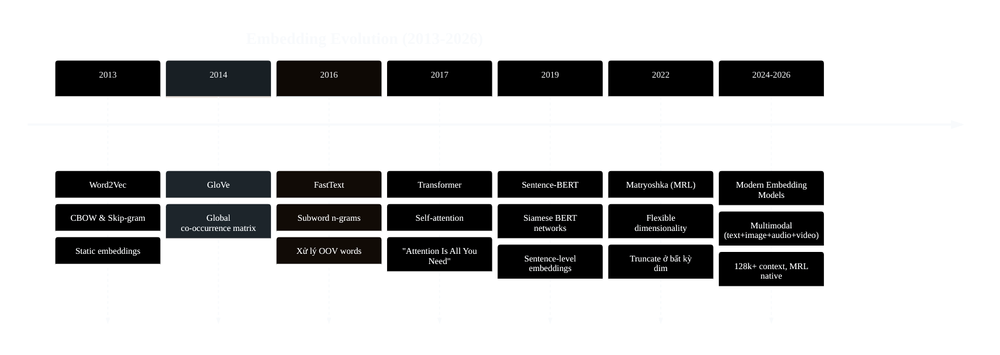

### Bước nhảy lớn nhất: Static → Contextual

Nếu chỉ chọn một bước ngoặt lớn nhất trong lịch sử embedding, đó là chuyển từ **static embeddings** sang **contextual embeddings**. Sự thay đổi này quyết định việc mô hình có thể hiểu ngữ cảnh và xử lý từ đa nghĩa đến mức nào.

**Static embeddings** (Word2Vec, GloVe, FastText):
- Mỗi từ → **1 vector cố định** duy nhất, bất kể ngữ cảnh
- Từ "bank" (ngân hàng) và "bank" (bờ sông) → **cùng chung 1 vector**
- Training: unsupervised trên corpus lớn, mỗi từ có 1 entry trong lookup table
- Ưu điểm: nhanh, nhỏ gọn, dễ sử dụng
- Nhược điểm: không phân biệt polysemy (từ đa nghĩa)

**Contextual embeddings** (Transformer-based: BERT, GPT, Sentence-BERT):
- Cùng 1 từ nhưng **vector thay đổi theo ngữ cảnh** xung quanh
- "The **bank** of the river" → vector khác hoàn toàn so với "I went to the **bank** to deposit money"
- Training: self-supervised (masked language modeling, next sentence prediction)
- Ưu điểm: hiểu ngữ cảnh, phân biệt đa nghĩa, transfer learning mạnh
- Nhược điểm: chậm hơn, cần GPU, model lớn hơn nhiều

### Chi tiết các model quan trọng

**Word2Vec (2013)** — [Mikolov et al.](https://arxiv.org/abs/1301.3781)

Word2Vec là cột mốc đầu tiên cho thấy vector có thể được học trực tiếp từ context thay vì gán thủ công hay giữ dạng one-hot.

Hai kiến trúc:
- **CBOW** (Continuous Bag of Words): dự đoán từ trung tâm từ các từ xung quanh. Nhanh hơn, tốt cho frequent words.
- **Skip-gram**: dự đoán các từ xung quanh từ từ trung tâm. Chậm hơn nhưng tốt hơn cho rare words.

Training dùng negative sampling để tăng tốc (không cần softmax trên toàn bộ vocabulary).

**GloVe (2014)** — [Pennington et al.](https://aclanthology.org/D14-1162.pdf)

So với Word2Vec, GloVe đưa thêm thông tin thống kê toàn cục của toàn bộ corpus vào quá trình học vector.

"Global Vectors for Word Representation" — kết hợp 2 approaches:
- **Count-based**: xây ma trận co-occurrence (từ nào xuất hiện cùng từ nào, bao nhiêu lần)
- **Prediction-based**: factorize ma trận đó bằng weighted least squares

Ưu điểm so với Word2Vec: tận dụng global statistics (toàn bộ corpus) thay vì chỉ local context windows.

**FastText (2016)** — [Bojanowski et al.](https://arxiv.org/abs/1607.04606)

FastText tập trung vào một hạn chế rất thực tế của word embeddings: xử lý kém với từ hiếm và từ chưa từng xuất hiện trong training.

Cải tiến quan trọng: biểu diễn từ bằng **tổng các subword n-grams**. Ví dụ từ "embedding" → {"em", "emb", "mbe", "bed", "edd", "ddi", "din", "ing", ...}.

→ Xử lý **OOV words** (từ chưa thấy trong training): vì subwords có thể overlap với các từ đã biết.
→ Đặc biệt hữu ích cho các ngôn ngữ có hình thái học phong phú (morphologically rich languages) như tiếng Thổ Nhĩ Kỳ, tiếng Phần Lan, và cả tiếng Việt (trong một số trường hợp).

**Transformer (2017)** — [Vaswani et al.](https://arxiv.org/abs/1706.03762)

Transformer không chỉ là một kiến trúc mô hình; nó còn thay đổi cách embeddings được tạo ra. Nhờ **self-attention**, mỗi token được biểu diễn trong quan hệ với toàn bộ ngữ cảnh xung quanh, thay vì chỉ mang một vector cố định.

Hệ quả rất lớn:
- Embedding không còn là một lookup table cố định cho từng từ
- Cùng một token có thể mang **representation khác nhau tùy câu**
- Transformer trở thành nền tảng cho BERT, GPT và hầu hết modern embedding models

**Sentence-BERT (2019)** — [Reimers & Gurevych](https://arxiv.org/abs/1908.10084)

Sentence-BERT giải quyết một vấn đề mang tính hệ thống: BERT gốc cho chất lượng tốt nhưng quá chậm cho retrieval quy mô lớn nếu dùng cross-encoder.

Giải quyết vấn đề lớn: BERT gốc cần input cặp câu (cross-encoder) → O(n²) cho search trong N documents.

SBERT dùng **Siamese network**: encode mỗi câu **độc lập** thành 1 vector → so sánh bằng cosine similarity → tốc độ nhanh gấp ~1000x so với cross-encoder BERT, đồng thời giữ chất lượng sentence-level tốt hơn nhiều so với mean pooling BERT thông thường.

**Matryoshka Representation Learning (2022)** — [Kusupati et al.](https://arxiv.org/abs/2205.13147)

Matryoshka Representation Learning trả lời một nhu cầu rất thực tế trong production: giảm kích thước vector để tiết kiệm memory, storage và latency mà vẫn giữ được phần lớn chất lượng.

Tên gọi từ búp bê Matryoshka (búp bê Nga lồng nhau): embedding vector được train sao cho **prefix bất kỳ** (d chiều đầu tiên) đã chứa đủ thông tin tốt.

Ví dụ: model output 3072 dims, nhưng bạn có thể chỉ lấy 1536 dims đầu → vẫn giữ chất lượng cao. Lấy 768 dims → vẫn tốt. Điều này giúp giảm memory/cost mà không cần PCA hay retrain.

Modern models hỗ trợ MRL native: OpenAI text-embedding-3, Cohere embed-v4, Google Gemini Embedding 2, Jina v3.

Mỗi thế hệ model giải một giới hạn riêng của bài toán biểu diễn. Nhưng bất kể model nào được dùng, đầu ra cuối cùng vẫn là vector; vì vậy câu hỏi tiếp theo luôn là đo độ giống nhau giữa các vector ấy như thế nào.

---

## 1.3 Các thuật toán tính Similarity

Mỗi similarity metric giữ lại một phần thông tin khác nhau của vector, và chính điều đó làm search, clustering, recommendation hay deduplication hành xử khác nhau. Vì vậy, phần này đi từ công thức đến hệ quả hệ thống thay vì chỉ dừng ở định nghĩa.

Phần này đặc biệt quan trọng vì cùng một embedding model, nhưng metric khác nhau sẽ dẫn đến hành vi hệ thống khác nhau. Search, recommendation, clustering hay deduplication đều phụ thuộc trực tiếp vào việc "gần" và "xa" được định nghĩa ra sao.

Có thể xem mỗi metric như một cách giữ lại hoặc loại bỏ một phần thông tin của vector: có metric chỉ quan tâm hướng, có metric giữ cả độ lớn, có metric đo khoảng cách tuyệt đối, và có metric chỉ đo overlap từ vựng.

### Bảng so sánh tổng quan

| Metric | Công thức | Range | Ưu điểm | Nhược điểm |
|--------|----------|-------|---------|------------|
| **Cosine Similarity** | `cos(θ) = (A·B) / (‖A‖ × ‖B‖)` | [-1, 1] | Không phụ thuộc magnitude | Mất tín hiệu magnitude |
| **Dot Product** | `A·B = Σ(aᵢ × bᵢ)` | (-∞, +∞) | Nhanh nhất; giữ tín hiệu popularity/norm | Thiên về vectors có norm lớn |
| **Euclidean (L2)** | `√Σ(aᵢ - bᵢ)²` | [0, +∞) | Trực giác hình học, khoảng cách thực | Nhạy cảm với scale |
| **Manhattan (L1)** | `Σ|aᵢ - bᵢ|` | [0, +∞) | Robust với outliers hơn L2 | Ít phổ biến trong NLP |
| **Jaccard** | `|A∩B| / |A∪B|` | [0, 1] | Tốt cho set/boolean data | Không dùng cho continuous vectors |

### Chi tiết từng Metric

#### Cosine Similarity — Chỉ đo hướng, bỏ qua độ dài

**Công thức đầy đủ:**

$$\text{cosine}(A, B) = \frac{A \cdot B}{\|A\| \times \|B\|} = \frac{\sum_{i=1}^{n} a_i \times b_i}{\sqrt{\sum_{i=1}^{n} a_i^2} \times \sqrt{\sum_{i=1}^{n} b_i^2}}$$

**Đặc điểm bản chất — chỉ quan tâm "hướng":**

Cosine đo **góc** giữa 2 vectors và **chia cho tích độ dài** của chúng. Phép chia này chính là điều then chốt: nó **triệt tiêu hoàn toàn ảnh hưởng của magnitude** (độ lớn/độ dài vector). Hai vectors chỉ ra cùng hướng → cosine = 1, dù vector A dài gấp 10 lần vector B.

Hệ quả trực tiếp: cosine **không quan tâm "bao nhiêu"**, chỉ quan tâm **"về cái gì"**.

**Từ đặc điểm này → tại sao dùng cho semantic search:**

Trong thực tế, khi user search "cách debug Python", họ muốn tìm documents **nói về cùng chủ đề** — bất kể document dài 1 đoạn hay 10 trang. Cosine đáp ứng chính xác nhu cầu này:

- Một đoạn ngắn: *"Debug Python bằng pdb"* (embedding norm nhỏ vì ít thông tin)
- Một bài dài: *"Hướng dẫn toàn diện debug Python: pdb, breakpoints, logging, IDE debugger..."* (embedding norm lớn vì nhiều thông tin)

Cả hai đều **trỏ cùng hướng** "debug Python" trong embedding space → cosine similarity cao cho cả hai. Nếu dùng dot product hoặc L2, document dài sẽ bị ưu tiên/bất lợi chỉ vì nó dài hơn — không phải vì nó relevant hơn.

**Vì lý do này:**
- Cosine là **metric mặc định** cho semantic search, RAG retrieval, semantic text similarity (STS), deduplication
- Hầu hết embedding models (OpenAI, Cohere, Google, Jina...) được **train để tối ưu cosine** giữa query-document pairs
- Tất cả major vector databases (Pinecone, Weaviate, Qdrant, pgvector) đều **default hoặc recommend cosine**
- Khi bạn **không chắc dùng metric nào** → cosine luôn là lựa chọn an toàn nhất

> Sources: [FAISS docs — MetricType and distances](https://github.com/facebookresearch/faiss/wiki/MetricType-and-distances), [scikit-learn cosine_similarity](https://scikit-learn.org/stable/modules/generated/sklearn.metrics.pairwise.cosine_similarity.html)

#### Dot Product — Đo hướng VÀ độ lớn cùng lúc

**Công thức:**

$$\text{dot}(A, B) = A \cdot B = \sum_{i=1}^{n} a_i \times b_i = \|A\| \times \|B\| \times \cos(\theta)$$

**Đặc điểm bản chất — magnitude là thông tin, không phải nhiễu:**

Nhìn vào công thức: `dot(A,B) = ‖A‖ × ‖B‖ × cos(θ)`. Dot product chính là cosine **nhân thêm độ dài** của cả 2 vectors. Khác với cosine (chia norm để triệt tiêu magnitude), dot product **cố tình giữ magnitude** như một tín hiệu có ý nghĩa.

Câu hỏi then chốt: **khi nào magnitude mang ý nghĩa?**

**Từ đặc điểm này → tại sao dùng cho recommendation systems:**

Trong recommendation, models (như two-tower architecture của Google, YouTube, Spotify) được train trên hàng tỷ interactions: user xem video nào, click sản phẩm nào, nghe bài hát nào. Quá trình training tạo ra embedding cho mỗi user và mỗi item. Điều quan trọng là **cách training ảnh hưởng đến norm**:

- **Item phổ biến** (Avengers, Despacito, iPhone) xuất hiện trong training data **hàng triệu lần** → model "thấy" item này rất nhiều → gradient updates liên tục → embedding vector **hội tụ mạnh**, norm lớn, "tự tin" cao.
- **Item niche** (phim indie, bài hát underground) xuất hiện **vài trăm lần** → model ít thấy → embedding vector **kém hội tụ**, norm nhỏ hơn, "tự tin" thấp hơn.

Norm của embedding tự nhiên encode mức độ **"confidence"** — model tin tưởng bao nhiêu vào embedding đó.

Khi tính `score = user · item`:
- `score = ‖user‖ × ‖item‖ × cos(θ)`
- `cos(θ)` = mức độ **phù hợp sở thích** (hướng gần nhau = relevant)
- `‖item‖` = mức độ **tin cậy / phổ biến** của item

→ Dot product tự động tính: **"item này phù hợp sở thích user bao nhiêu" × "model tự tin bao nhiêu về item này"**.

**Ví dụ cụ thể**: User thích sci-fi. Có 2 items cùng thuộc sci-fi (cos(θ) gần bằng nhau):
- "Avengers: Endgame" — cực popular, ‖embedding‖ = 8.5
- "Blade Runner 2049" — niche cult, ‖embedding‖ = 3.2
- Dot product score: Endgame ≈ 8.5 × cos(θ), Blade Runner ≈ 3.2 × cos(θ)
- → Endgame score cao hơn ~2.6x chỉ nhờ popularity signal

Đây là **hành vi mong muốn**: giữa 2 phim cùng relevant, recommend phim popular hơn là lựa chọn **an toàn hơn** (nhiều người thích = xác suất user thích cao hơn). Cosine sẽ cho 2 phim điểm gần bằng nhau — mất tín hiệu popularity quý giá này.

**Ngược lại — khi nào KHÔNG nên dùng dot product:**

Trong semantic search, magnitude **không mang ý nghĩa hữu ích**. Document dài hơn không có nghĩa là relevant hơn — nhưng dot product sẽ ưu tiên nó. Đây là lý do semantic search dùng cosine (triệt tiêu magnitude) chứ không dùng dot product.

> Source: [Google ML Recommendation — Candidate Generation](https://developers.google.com/machine-learning/recommendation/overview/candidate-generation)

#### Euclidean Distance (L2) — Khoảng cách tuyệt đối trong không gian

**Công thức:**

$$L2(A, B) = \sqrt{\sum_{i=1}^{n} (a_i - b_i)^2}$$

**Đặc điểm bản chất — đo "khoảng cách thực" giữa 2 điểm:**

L2 đo khoảng cách "đường chim bay" giữa 2 điểm trong không gian — chính xác như cách bạn dùng thước đo khoảng cách trên bản đồ. L2 = 0 nghĩa là 2 points trùng nhau. Đặc điểm quan trọng: L2 **nhạy cảm với cả hướng lẫn magnitude** — 2 vectors cùng hướng nhưng khác độ dài vẫn có L2 lớn.

Một hệ quả toán học quan trọng: **trung bình cộng** (mean) của một nhóm điểm chính là điểm **minimize tổng L2²** đến tất cả các điểm trong nhóm. Không có metric nào khác có tính chất này.

**Từ đặc điểm này → tại sao K-means bắt buộc dùng L2:**

K-means hoạt động bằng cách lặp 2 bước: (1) gán mỗi điểm vào centroid gần nhất, (2) cập nhật centroid = **trung bình cộng** các điểm trong cluster. Bước (2) chính là bước **minimize tổng L2²** — đây là objective function toán học của K-means:

$$\text{Inertia} = \sum_{i=1}^{N} \|x_i - \mu_{c(i)}\|^2$$

Nếu dùng cosine ở bước (1) nhưng mean ở bước (2), 2 bước **không nhất quán** về mặt toán học → thuật toán không đảm bảo hội tụ và kết quả sai. Đây không phải "best practice" mà là **yêu cầu toán học**: K-means = L2.

> **Mẹo**: Nếu muốn clustering theo cosine similarity → **normalize tất cả vectors về L2-norm = 1 trước**, rồi chạy K-means bình thường. Khi ‖v‖ = 1, minimize L2 ≡ maximize cosine (chứng minh bên dưới) → K-means trên normalized vectors = "cosine K-means".

**Khi nào nên dùng L2:**
- **K-means clustering**: bắt buộc (objective function)
- **kNN classification**: kNN truyền thống dùng L2 để tìm k neighbors gần nhất
- **Anomaly detection (distance-based)**: tính L2 trung bình đến K nearest neighbors → outlier = điểm có L2 lớn (nằm xa mọi thứ)
- **Đo information loss sau quantization/compression**: L2 giữa vector gốc vs vector sau nén → reconstruction error

**Khi nào KHÔNG nên dùng L2:**
- Cho **semantic search** — L2 nhạy cảm với magnitude nên document dài bị bất lợi so với document ngắn dù cùng relevant. Cosine phù hợp hơn.
- Khi **vectors có scale khác nhau** — L2 bị bias bởi scale. Normalize trước hoặc dùng cosine.

**Quan hệ L2 — Cosine khi normalized:**

Nếu embedding đã L2-normalized (‖v‖ = 1):

$$\|A - B\|^2 = \|A\|^2 + \|B\|^2 - 2(A \cdot B) = 1 + 1 - 2\cos(\theta) = 2(1 - \cos(\theta))$$

→ L2² là **hàm tuyến tính nghịch** của cosine → minimize L2 ≡ maximize cosine → **cùng ranking**. Đây là lý do normalize + L2 là cách làm K-means theo cosine.

#### Manhattan Distance (L1) — Cộng từng chiều, không khuếch đại outlier

**Công thức:**

$$L1(A, B) = \sum_{i=1}^{n} |a_i - b_i|$$

**Đặc điểm bản chất — không bình phương, nên không khuếch đại:**

So sánh L1 vs L2 qua cách xử lý sự khác biệt trên từng dimension:
- **L2** bình phương mỗi difference trước khi cộng: `(aᵢ - bᵢ)²`. Difference = 10 → đóng góp 100. Difference = 1 → đóng góp 1. **Tỷ lệ khuếch đại: 100:1** — dimension khác biệt lớn dominate hoàn toàn.
- **L1** chỉ lấy absolute value: `|aᵢ - bᵢ|`. Difference = 10 → đóng góp 10. Difference = 1 → đóng góp 1. **Tỷ lệ: 10:1** — cân bằng hơn nhiều.

Hệ quả: L1 **robust hơn với outlier dimensions**. Nếu 2 embeddings giống nhau ở 99/100 dimensions nhưng khác rất lớn ở 1 dimension (do noise hoặc encoding artifact), L2 bị dominate bởi dimension đó → khoảng cách bị "thổi phồng". L1 ít bị ảnh hưởng hơn.

**Từ đặc điểm này → khi nào phù hợp:**
- **Sparse high-dimensional data**: trong không gian rất cao chiều (hàng nghìn dims), L2 distances giữa các points có xu hướng **hội tụ về cùng 1 giá trị** (curse of dimensionality) → mất khả năng phân biệt. L1 ít bị hiệu ứng này hơn vì không bình phương.
- **Data có noise / outlier dimensions**: khi embedding có một số dimensions bị nhiễu (phổ biến với models cũ hoặc data chưa clean), L1 cho kết quả ổn định hơn L2.
- **Feature-level analysis**: khi muốn biết "tổng sự khác biệt" giữa 2 embeddings trên mọi dimensions — L1 cho con số dễ diễn giải hơn vì chỉ cộng các absolute differences.

**Hạn chế thực tế:**
- Hầu hết embedding models **không được train để optimize L1** → ranking quality kém hơn cosine/dot product
- Phần lớn vector databases **không có L1 index** → phải brute-force search, rất chậm
- Ít dùng trong embedding workflows hiện đại — chủ yếu gặp trong traditional ML pipelines

#### Jaccard Similarity — Đo overlap giữa 2 tập hợp

**Công thức:**

$$\text{Jaccard}(A, B) = \frac{|A \cap B|}{|A \cup B|}$$

**Đặc điểm bản chất — hoạt động trên sets, không phải vectors:**

Jaccard khác hoàn toàn 4 metrics trên: nó **không thao tác trên continuous vectors** mà trên **tập hợp** (sets). Câu hỏi nó trả lời: "trong tất cả phần tử mà A hoặc B có, bao nhiêu phần trăm là chung?"

Đây là phép đo **lexical overlap** (trùng lặp từ vựng) thuần túy — không hiểu ngữ nghĩa. "Xử lý lỗi phần mềm" và "debug software errors" có Jaccard = 0 vì không có từ nào trùng, dù nghĩa hoàn toàn giống nhau.

**Từ đặc điểm này → vai trò trong hệ thống search:**

Jaccard (và biến thể BM25) quan trọng cho **keyword matching** — trường hợp mà semantic similarity *không đủ*:
- **Tên riêng, mã sản phẩm, thuật ngữ chuyên ngành**: "iPhone 15 Pro Max" — cần exact match, không cần hiểu ngữ nghĩa
- **Mã lỗi, số hiệu**: "ERR_CONNECTION_REFUSED", "CVE-2024-12345" — phải khớp chính xác
- **Hybrid search**: kết hợp Jaccard/BM25 (tìm chính xác) + cosine embedding (tìm ngữ nghĩa) → bổ sung cho nhau. Đây là cách RAG pipelines hiện đại hoạt động (xem [Section 2.2](#22-rag--rerank-pipeline-3-giai-đoạn))

**Jaccard còn là nền tảng cho MinHash/LSH** — kỹ thuật approximate deduplication ở massive scale (hàng triệu documents). Thay vì tính Jaccard cho mọi cặp (O(n²)), MinHash hash sets → estimate Jaccard trong O(n) — giữ cùng ý tưởng đo overlap nhưng nhanh hơn hàng triệu lần.

**Không dùng Jaccard cho:**
- **Dense embedding vectors** (float arrays) — Jaccard cần sets/binary input, không hoạt động trên continuous numbers
- **Semantic similarity** — "mèo" và "cat" có Jaccard = 0 dù cùng nghĩa

### Tổng hợp: Từ đặc điểm → Use Case

| Metric | Đặc điểm cốt lõi | Hệ quả | → Phù hợp cho |
|--------|-------------------|--------|----------------|
| **Cosine** | Chỉ đo hướng, triệt tiêu magnitude | Không bias bởi document length hay embedding norm | Semantic search, RAG, STS, dedup — mọi thứ cần "pure meaning similarity" |
| **Dot Product** | Đo hướng × magnitude | Magnitude encode popularity / confidence | Recommendation systems — muốn kết hợp relevance + popularity |
| **L2** | Khoảng cách tuyệt đối; mean minimizes tổng L2² | Centroid (mean) có ý nghĩa toán học | K-means clustering (bắt buộc), kNN, anomaly detection |
| **L1** | Cộng absolute diff, không bình phương | Không khuếch đại outlier dimensions | Sparse/noisy data, feature-level analysis |
| **Jaccard** | Đo overlap giữa 2 sets | Chỉ biết lexical match, không hiểu semantics | Keyword search, BM25, MinHash dedup, exact term matching |

Có thể ghi nhớ ngắn gọn như sau: cosine trả lời câu hỏi "nói về cái gì?", dot product thêm tín hiệu "tự tin bao nhiêu?", L2 cho biết "xa nhau bao nhiêu?", còn Jaccard cho biết "có bao nhiêu từ trùng?".

### Khi vectors đã được normalize

> **Với L2-normalized vectors**: cosine similarity ≡ dot product ≡ L2 ranking.
> Khi `‖A‖ = ‖B‖ = 1`, thì `cos(θ) = A·B` và `‖A-B‖² = 2(1 - A·B)`.
> → Chọn metric nào cũng cho **cùng ranking** — chỉ khác scale.
> Nhiều embedding models (OpenAI, Cohere) trả vectors đã normalized, nên trong thực tế có thể dùng dot product để tính nhanh hơn vì không cần chia cho norm.
>
> Sources: [FAISS docs — MetricType and distances](https://github.com/facebookresearch/faiss/wiki/MetricType-and-distances), [scikit-learn cosine_similarity](https://scikit-learn.org/stable/modules/generated/sklearn.metrics.pairwise.cosine_similarity.html)

### Sai lầm thường gặp

| Sai lầm | Tại sao sai | Cách sửa |
|---------|------------|----------|
| Dùng L2 cho semantic search | L2 nhạy cảm magnitude → document dài bị rank thấp dù relevant (norm lớn → L2 xa) | Chuyển sang cosine (triệt tiêu magnitude) |
| Dùng cosine cho recommendation | Cosine triệt tiêu magnitude → mất tín hiệu popularity quý giá, items niche rank ngang popular | Chuyển sang dot product (giữ magnitude) |
| Dùng K-means với cosine distance | K-means objective là minimize tổng L2² — dùng cosine thì bước gán cluster và bước cập nhật centroid không nhất quán | Normalize vectors trước (→ L2 ≡ cosine), rồi chạy K-means bình thường |
| Dùng Jaccard cho dense embeddings | Jaccard cần set/binary input — continuous float vectors cho kết quả vô nghĩa | Dùng cosine cho dense vectors |
| Không normalize khi dùng dot product cho search | Ranking bị bias: documents có embedding norm lớn luôn rank trên, bất kể relevance | Normalize vectors trước khi index, hoặc dùng cosine |

### Diagram: Khi nào dùng metric nào?

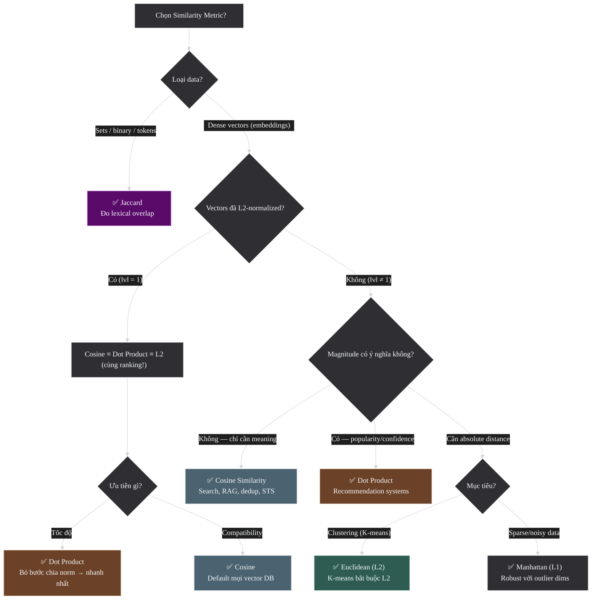

## 1.4 Retrieval Foundations

Retrieval foundations nối phần nền về embedding với các hệ thống search và RAG. Phần này đi qua kiến trúc encode, vai trò query/document, đơn vị retrieve, hybrid retrieval và pipeline nhiều giai đoạn thường gặp trong thực tế.

Similarity giải thích cách so sánh các vector, nhưng chỉ như vậy vẫn chưa đủ để xây semantic search hay RAG. Trước khi sang Phần 2, còn cần một lớp nền nữa: vector được tạo ra theo kiến trúc nào, được dùng để retrieve ở cấp độ nào, và pipeline retrieval thường được tổ chức ra sao. Những khái niệm dưới đây chính là chiếc cầu nối từ "embedding" sang "hệ thống dùng embedding".

### 1.4.1 Bi-encoder vs Cross-encoder

Khi cần so sánh một query với hàng triệu documents, cách thiết kế kiến trúc encode sẽ quyết định toàn bộ hành vi hệ thống.

**Bi-encoder** encode query và document **riêng rẽ**, rồi so sánh hai vector đầu ra bằng một similarity metric như cosine. Trong nhiều hệ thống, đó là cùng một model được gọi hai lần; trong các hệ thống khác, query side và document side có thể được tối ưu hơi khác nhau, nhưng nguyên tắc cốt lõi vẫn giữ nguyên: **mỗi input được encode độc lập**.

**Cross-encoder** thì ngược lại: nó nhận **cặp (query, document) cùng lúc** làm input. Vì query và document đi vào model đồng thời, mọi token trong query có thể tương tác trực tiếp với mọi token trong document thông qua attention. Kết quả đầu ra thường không phải là hai vectors, mà là **một relevance score** cho chính cặp đó.

Sự khác biệt này dẫn đến trade-off cốt lõi:

| Aspect | **Bi-encoder** | **Cross-encoder** |
|--------|----------------|-------------------|
| **Input** | Query và document encode riêng | Nhận cặp `(query, doc)` cùng lúc |
| **Output** | 2 vectors → similarity score | 1 relevance score trực tiếp |
| **Tốc độ** | Nhanh, vì document vectors có thể pre-compute | Chậm, vì phải chấm từng cặp |
| **Scale** | Phù hợp retrieval trên triệu documents | Chỉ hợp re-score số lượng nhỏ candidates |
| **Điểm mạnh** | Scalable, phù hợp search/retrieval | Chính xác hơn nhờ token interaction |
| **Điểm yếu** | Mất chi tiết token-level | Không thể scan toàn corpus trực tiếp |

Từ đây có thể thấy vì sao semantic search hiện đại gần như luôn dùng **bi-encoder cho retrieval** và **cross-encoder cho reranking**. Bi-encoder giúp tìm nhanh trong tập rất lớn; cross-encoder dùng ở bước sau để tăng precision trên một tập candidates nhỏ hơn. Trong lịch sử phát triển model, Sentence-BERT là cột mốc quan trọng vì nó đưa tư duy bi-encoder vào retrieval ở quy mô lớn, còn nhiều reranker hiện đại đi theo hướng cross-encoder.

### 1.4.2 Query vs Document Asymmetry

Dù bi-encoder encode query và document riêng rẽ, hai loại input này **không có cùng vai trò**.

- **Query** thường ngắn, mang tính hỏi thông tin, mô tả nhu cầu tìm kiếm
- **Document** thường dài hơn, mang tính cung cấp thông tin, chứa nội dung cần được tìm thấy

Nếu coi chúng là cùng một loại input và encode hoàn toàn giống nhau, hệ thống rất dễ ưu tiên các câu "trông giống query" thay vì những đoạn thật sự trả lời query đó. Nói cách khác, một câu hỏi thường giống một câu hỏi khác hơn là giống một đoạn trả lời, dù đoạn trả lời mới là thứ người dùng cần.

Đó là lý do nhiều modern embedding models cung cấp chế độ riêng cho:

- `search_query`
- `search_document`

Ý nghĩa không phải là query và document nằm ở hai không gian hoàn toàn khác nhau, mà là model biết **vai trò** của input để tối ưu representation phù hợp hơn cho retrieval. Đây là nền tảng của khái niệm **asymmetric search** sẽ được dùng nhiều trong Phần 2.

### 1.4.3 Chunk vs Document

Một vector có thể đại diện cho nhiều cấp độ khác nhau: một từ, một câu, một đoạn, một chunk, hay cả document. Vì vậy, trước khi retrieve, cần quyết định **đơn vị nào sẽ được index**.

Trong classic semantic search, retrieval có thể diễn ra ở cấp **document** nếu mỗi tài liệu tương đối tập trung vào một chủ đề và người dùng muốn mở cả tài liệu đó.

Trong RAG, retrieval thường diễn ra ở cấp **chunk** hơn là cả document. Lý do rất thực tế:

1. **Cả document thường quá rộng**: một tài liệu dài có thể nói về nhiều ý khác nhau, nên embedding của toàn tài liệu dễ bị "trung bình hóa" và mất trọng tâm
2. **LLM có context window hữu hạn**: không thể đưa cả knowledge base vào prompt, nên cần retrieve các đoạn nhỏ vừa đủ liên quan
3. **Chunk giúp grounding tốt hơn**: answer có thể bám sát đúng đoạn chứa thông tin, thay vì một document dài nhưng loãng

Nhưng chunk cũng không thể nhỏ tùy ý. Chunk quá nhỏ sẽ làm mất ngữ cảnh; chunk quá lớn sẽ làm loãng ý nghĩa. Đây chính là lý do `chunking strategies` trở thành một chủ đề riêng ở Phần 3.

### 1.4.4 Dense, Sparse, Hybrid

Khi retrieve, có ba cách biểu diễn phổ biến:

| Kiểu retrieval | Dựa trên gì | Mạnh ở đâu | Yếu ở đâu |
|----------------|-------------|------------|-----------|
| **Sparse** | Token overlap, BM25, TF-IDF | Exact match: tên riêng, mã lỗi, mã sản phẩm | Không hiểu synonym hay paraphrase |
| **Dense** | Embedding vectors | Semantic match: paraphrase, đa ngôn ngữ, câu hỏi tự nhiên | Dễ mất tín hiệu exact token-level |
| **Hybrid** | Kết hợp sparse + dense | Giữ cả exact match lẫn semantic match | Hệ thống phức tạp hơn, cần fusion/rerank |

Không có phương pháp nào thắng tuyệt đối. Sparse retrieval giỏi ở chỗ embedding thường yếu: rare terms, proper nouns, product codes. Dense retrieval lại giỏi ở chỗ sparse yếu: synonym, paraphrase, diễn đạt tự nhiên. Vì vậy, nhiều hệ thống production dùng **hybrid retrieval** để tăng recall trước khi rerank.

### 1.4.5 Retrieve, Rerank, Generate

Khi ghép các khái niệm trên lại, ta có mental model quan trọng nhất cho search hiện đại và RAG:

1. **Retrieve**: dùng phương pháp nhanh và scalable để lấy ra một tập candidates đủ rộng
2. **Rerank**: dùng model chính xác hơn để sắp xếp lại candidates theo relevance thực sự
3. **Generate**: nếu có LLM ở cuối pipeline, dùng top results làm context để sinh câu trả lời grounded


Nguyên tắc quan trọng nhất của pipeline này là: **reranker không thể cứu những gì retriever chưa lấy ra**. Nếu relevant document bị bỏ sót ở bước retrieve, bước rerank và bước generate phía sau sẽ không còn cơ hội nhìn thấy nó. Vì vậy:

- giai đoạn đầu ưu tiên **recall**
- giai đoạn sau tối ưu **precision**

Đây là khung tư duy sẽ lặp lại nhiều lần ở Phần 2: semantic search, RAG và recommendation systems đều chỉ là các biến thể khác nhau của pattern nhiều giai đoạn này.

Sau Phần 1, bức tranh nền tảng có thể gói lại trong bốn ý: embedding là biểu diễn số học mang thông tin ngữ nghĩa; lịch sử embedding là quá trình cải thiện dần chất lượng biểu diễn đó qua nhiều thế hệ model; similarity metric là cầu nối biến vector thành hành vi cụ thể; và retrieval foundations giải thích cách những vector ấy được dùng trong search và RAG thực tế. Từ nền tảng này, Phần 2 đi vào từng nhóm ứng dụng, còn Phần 3 tập trung vào các quyết định vận hành và tối ưu hệ thống.

# Phần 2 — Hệ thống & Ứng dụng

Từ đây, trọng tâm chuyển từ nền tảng sang ứng dụng. Nếu Phần 1 trả lời embedding là gì và hoạt động theo nguyên lý nào, thì Phần 2 trả lời embedding được đem vào các bài toán thực tế ra sao. Embeddings không còn được nhìn như một khái niệm đơn lẻ, mà như một thành phần trong các pipeline search, RAG, clustering và recommendation.

## 2.1 Semantic Search / Information Retrieval

Semantic search nên được nhìn như một hệ thống hoàn chỉnh: từ vấn đề keyword search gặp phải, cách chọn đơn vị index, cách encode query, cho đến các quyết định quan trọng như bi-encoder, query/document asymmetry, khi nào dense search là đủ, khi nào cần hybrid, và ANN search ở scale lớn.

### Keyword Search và Semantic Search

Keyword search (BM25, TF-IDF) so sánh **token chính xác** giữa query và document — nhanh, đơn giản, và hoạt động tốt khi người dùng biết chính xác từ khóa cần tìm. Nhưng nó có một điểm yếu cốt lõi: khi người dùng diễn đạt ý tưởng bằng **từ ngữ khác** với document gốc, keyword search thất bại hoàn toàn. Đây là **vocabulary mismatch problem** — query "cách xử lý lỗi phần mềm" sẽ **không** tìm được document chứa "debug application errors" dù cả hai nói về cùng một thứ.

Semantic search (tìm kiếm ngữ nghĩa) giải quyết vấn đề này bằng cách dùng embeddings để tìm documents **có ý nghĩa liên quan** đến query, thay vì khớp từ ngữ bề mặt. Embedding biểu diễn *ý nghĩa* thay vì *từ ngữ*, nên "xe hơi" và "automobile" nằm gần nhau trong embedding space dù không share ký tự nào. Cùng query "cách xử lý lỗi phần mềm" ở trên, semantic search sẽ tìm được document "debug application errors" — vì cả hai encode ra vectors gần nhau trong semantic space.

Phần nền về **bi-encoder**, **cross-encoder** và **query/document asymmetry** đã có ở [Section 1.4.1](#141-bi-encoder-vs-cross-encoder) và [Section 1.4.2](#142-query-vs-document-asymmetry). Ở phần ứng dụng này, trọng tâm không còn là định nghĩa từng khái niệm, mà là hiểu chúng được ghép thành **một hệ thống search thực tế** như thế nào.

### Semantic Search Flow — Từ index đến top-K results

Ở mức hệ thống, semantic search thường diễn ra theo ba bước:

1. **Index documents**: mỗi document được encode thành một vector và lưu vào vector database
2. **Encode query**: khi người dùng search, query cũng được encode thành một vector trong **cùng không gian**
3. **Tìm láng giềng gần nhất**: hệ thống so sánh query vector với document vectors để lấy ra top-K documents gần nhất

Trong thực tế, bước retrieve gần như luôn dùng **bi-encoder**. Lý do không phải vì nó chính xác nhất, mà vì nó là lựa chọn hợp lý nhất khi phải search trên tập rất lớn.

### Index theo document hay passage/chunk?

Câu "index documents" ở trên nghe có vẻ đơn giản, nhưng trong hệ thống thực tế còn một quyết định rất quan trọng: **thứ gì mới là đơn vị retrieve**. Có nơi index cả tài liệu, có nơi cắt tài liệu thành các đoạn nhỏ hơn rồi index từng đoạn.

- **Index theo document**: hợp khi mỗi tài liệu ngắn, tập trung vào một chủ đề, và người dùng thường muốn mở cả tài liệu đó
- **Index theo passage/chunk**: hợp khi tài liệu dài, chứa nhiều ý, hoặc hệ thống cần trả lại đúng đoạn liên quan nhất thay vì cả tài liệu

Nếu nhét cả một tài liệu dài vào một vector duy nhất, embedding của tài liệu đó dễ bị "trung bình hóa". Query có thể chỉ liên quan rất mạnh đến một đoạn nhỏ, nhưng vector của toàn tài liệu lại bị pha loãng bởi nhiều phần khác không liên quan.

Vì vậy, semantic search cho knowledge base, help center, API docs hay policy documents thường index theo **passage/chunk** hơn là cả document. Ngược lại, với FAQ ngắn, product cards, hoặc catalog items vốn đã cô đọng, index theo **document** thường vẫn đủ tốt và đơn giản hơn để vận hành.

### Bi-encoder trong Semantic Search — Tại sao vẫn là mặc định

1. **Đặc điểm cốt lõi**: Bi-encoder encode query và document **độc lập** — 2 lần gọi model riêng biệt, không có interaction giữa chúng
2. **Hệ quả 1 (tốc)**: Vì encode độc lập → document embeddings có thể **pre-compute offline** 1 lần rồi lưu vào vector database. Khi có query mới, chỉ cần encode query (1 vector) → tìm nearest neighbors trong vector index → trả kết quả trong ~ms
3. **Hệ quả 2 (xấu)**: Vì encode độc lập → **không có cross-attention** giữa query và document tokens. Model không "thấy" query khi encode document (và ngược lại) → bỏ sót **subtle token-level matching**. Ví dụ: query "Python error handling best practices" và document "try-except patterns in Python for production code" — bi-encoder có thể miss vì 2 câu dùng từ khác nhau cho cùng concept
4. **Giải pháp**: Dùng bi-encoder làm **Stage 1** (lọc nhanh triệu → trăm candidates), rồi cross-encoder **reranker** làm **Stage 2** (re-score chính xác trăm → chục) — xem [Section 2.2](#22-rag--rerank-pipeline-3-giai-đoạn)

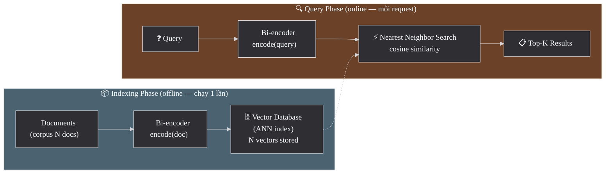

> **Tóm lại**: Encode độc lập → pre-compute được → nhanh ở scale triệu documents → nhưng mất cross-attention → cần reranker bổ sung precision. Đây là trade-off cốt lõi của bi-encoder.

Trong đoạn trên, `ANN` là viết tắt của **Approximate Nearest Neighbor** — nhóm thuật toán dùng để tìm vector gần nhất thật nhanh trong tập dữ liệu lớn. Phần dưới sẽ quay lại giải thích cụ thể các thuật toán như HNSW, IVF và DiskANN.

### Asymmetric Search trong thực tế

Một điểm vận hành rất quan trọng là: query và document tuy cùng nằm trong retrieval pipeline, nhưng **không đóng cùng vai trò**:
- Query **hỏi thông tin** — thường ngắn ("best practices for embedding"), là câu hỏi hoặc keyword
- Document **chứa thông tin** — thường dài (đoạn văn, trang web), là nội dung giải thích

Vì thế, semantic search chất lượng tốt thường không chỉ cần đúng model, mà còn cần encode đúng **vai trò** của input. Nếu encode sai kiểu, chất lượng retrieval giảm rõ rệt ngay cả khi embeddings và vector database đều không đổi.

Nhiều modern embedding models yêu cầu chỉ định `input_type`:
- `search_query` — cho câu hỏi/query (ngắn, hỏi thông tin)
- `search_document` — cho document/passage cần index (dài, chứa thông tin)

**Ví dụ ở mức mã giả:**
```text
# When indexing documents
document_embeddings = embed(
    texts=documents,
    input_type="search_document"
)

# When searching
query_embedding = embed(
    texts=[query],
    input_type="search_query"
)
```

⚠️ **Dùng sai input_type sẽ giảm chất lượng retrieval đáng kể** — model encode khác nhau cho query vs document. Đây là lỗi phổ biến khi mới bắt đầu.

> Source: [Cohere Embed docs](https://docs.cohere.com/docs/cohere-embed), [SBERT — Semantic Search](https://www.sbert.net/examples/sentence_transformer/applications/semantic-search/README.html)

### Khi nào Dense Search đủ, khi nào cần Hybrid?

Trong khá nhiều sản phẩm, chỉ dùng **dense retrieval** đã cho chất lượng rất tốt. Điều này thường đúng khi:

- query được viết như câu tự nhiên, có nhiều paraphrase và synonym
- dữ liệu chủ yếu là nội dung mô tả, bài viết, FAQ, hoặc tài liệu giải thích
- người dùng quan tâm đến **ý nghĩa gần đúng** hơn là exact keyword
- hệ thống phải hỗ trợ đa ngôn ngữ hoặc nhiều cách diễn đạt khác nhau

Nhưng chỉ dùng dense retrieval thường chưa đủ an toàn khi:

- corpus có nhiều **mã lỗi**, **SKU**, **product code**, **số điều luật**, **tên riêng**, hoặc các cụm từ phải khớp thật chính xác
- người dùng hay gõ query ngắn theo kiểu từ khóa hơn là câu hỏi tự nhiên
- sai sót retrieval có chi phí cao, ví dụ legal search, medical search, enterprise search nội bộ

Vì vậy, semantic search trong production thường đi theo một quy tắc đơn giản: nếu bài toán thiên về **meaning matching**, dense retrieval là nền rất tốt; nếu **exact term** có giá trị cao hoặc bỏ sót một từ khóa quan trọng là không chấp nhận được, hybrid retrieval (`BM25 + dense`) an toàn hơn nhiều. RAG là một trường hợp rất rõ của logic này, nhưng ngay cả search thông thường cũng thường cần cùng kiểu kết hợp.

### ANN Algorithms — Tìm kiếm nhanh trong triệu vectors

Sau khi documents hoặc passages đã được encode và lưu sẵn, bài toán còn lại là: với một query vector mới, làm sao tìm được các document vectors gần nhất đủ nhanh. Cách đơn giản nhất là brute-force search — so sánh query với **tất cả** N vectors, complexity O(N). Với vài nghìn documents thì ổn, nhưng khi N = hàng triệu hay hàng tỷ, brute-force trở nên quá chậm. ANN (Approximate Nearest Neighbor) algorithms giải quyết bằng cách **hy sinh một chút accuracy để đạt tốc độ sub-linear** — tìm "gần đúng" top-K vectors nhanh hơn nhiều lần.

#### HNSW (Hierarchical Navigable Small World)

**Cách hoạt động**: Xây một **multi-layer graph** trên tập vectors. Layer cao nhất chỉ có vài nodes (long-range connections), layer thấp nhất có tất cả nodes (short-range connections). Search bắt đầu từ layer cao → nhảy nhanh đến vùng gần đúng → xuống layer thấp → tìm chính xác trong vùng lân cận.

**Tại sao hay dùng?** Vì HNSW thường cho latency thấp và recall cao trong nhiều use case search thực tế. Đổi lại, nó tốn RAM và không phải lựa chọn rẻ nhất khi corpus rất lớn.

#### IVF (Inverted File Index)

**Cách hoạt động**: Chia không gian vector thành K clusters (bằng K-means). Mỗi cluster lưu danh sách vectors thuộc cluster đó. Khi search: tìm cluster gần nhất với query → chỉ search trong cluster đó (và vài clusters lân cận).

**Khi nào hợp lý?** Khi muốn tiết kiệm memory hơn graph-based search. Đổi lại, IVF cần bước partition trước và thường nhạy hơn với cách dữ liệu được phân cụm.

#### DiskANN

**Cách hoạt động**: Giống HNSW nhưng lưu graph trên **disk** thay vì RAM. Dùng SSD random reads thay vì memory access.

**Khi nào dùng?** Khi dataset quá lớn cho RAM nhưng vẫn cần giữ chất lượng search tốt. Đổi lại, latency thường cao hơn in-memory ANN.

| Algorithm | Ý tưởng | Điểm mạnh chính | Trade-off chính | Dùng trong |
|-----------|---------|-----------------|-----------------|-----------|
| **HNSW** | Multi-layer graph | Nhanh, recall cao | Tốn RAM | Qdrant, Weaviate, pgvector, Pinecone |
| **IVF** | K-means partition | Ít memory hơn | Cần partition/training trước | FAISS, Milvus |
| **DiskANN** | Graph trên SSD | Scale rất lớn | Latency cao hơn in-memory | Milvus |

> **Recall vs Latency là trade-off cốt lõi**: Không có ANN algorithm nào vừa nhanh nhất vừa chính xác nhất. Ở phần ứng dụng này, điều quan trọng là hiểu vì sao ANN tồn tại. Chi tiết tuning và chọn vector database phù hợp sẽ được đi sâu hơn ở Phần 3.

> Sources: [FAISS wiki — Indexes](https://github.com/facebookresearch/faiss/wiki/Faiss-indexes), [HNSW paper — Malkov & Yashunin, 2018](https://arxiv.org/abs/1603.09320), [SBERT — Semantic Search](https://www.sbert.net/examples/sentence_transformer/applications/semantic-search/README.html)

---

## 2.2 RAG + Rerank (Pipeline 3 giai đoạn)

RAG được hiểu rõ nhất khi đi theo đúng thứ tự vận hành của nó: vì sao cần retrieval, vì sao Stage 1 phải ưu tiên recall, vì sao cần rerank ở Stage 2, cách ghép các chunks đã retrieve thành context có ích, và LLM ở Stage 3 phụ thuộc vào toàn bộ phần trước như thế nào.

### Tổng quan — Tại sao cần RAG?

**Retrieval-Augmented Generation (RAG)** kết hợp retrieval với LLM generation. Để hiểu tại sao cần RAG, hãy theo chuỗi nhân-quả:

1. **LLM chỉ biết training data** — knowledge bị đóng băng tại cutoff date. Không biết tài liệu nội bộ công ty, sản phẩm mới, hay tin tức hôm nay
2. **Không thể retrain liên tục** — fine-tuning tốn kém (GPU hours, data preparation) và vẫn không giải quyết real-time data
3. **Cần inject context vào prompt** — đưa thông tin liên quan vào prompt để LLM trả lời dựa trên context thực tế
4. **Nhưng context window có giới hạn** — không thể đưa toàn bộ database vào prompt (128K tokens ≈ 100 trang — vẫn quá nhỏ cho enterprise data)
5. **→ Cần retrieval để chọn context phù hợp nhất** — tìm đúng 3-10 chunks liên quan nhất từ hàng triệu documents → đưa vào prompt → LLM sinh câu trả lời **grounded trong actual documents**

**Kết quả**: RAG giảm hallucination (answer có nguồn), knowledge luôn up-to-date (chỉ cần update database), và không cần retrain LLM.

### Diagram: RAG + Rerank Pipeline

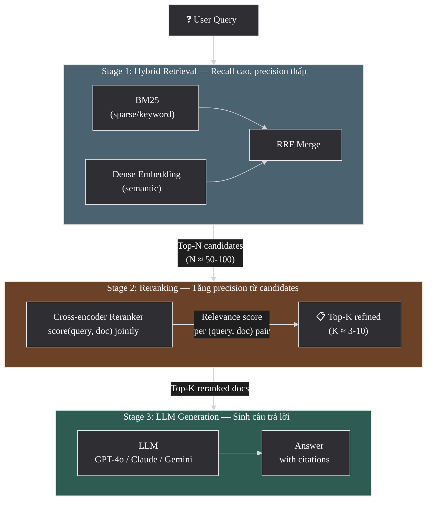

### Nguyên tắc quan trọng: Optimize Recall trước Rerank

> ⚠️ **Reranker chỉ sắp xếp lại những gì đã được retrieve — không thể recover documents bị miss ở Stage 1.**

Nếu Stage 1 trả về 100 candidates mà document chứa câu trả lời **không nằm trong đó** → reranker và LLM đều không thể cứu. Vì vậy:
- **Recall@N** (Stage 1) quan trọng hơn **Precision@N** ở stage này
- Stage 1 nên cast a wide net (N = 50-100) để maximize recall
- Stage 2 (reranker) sẽ tăng precision từ candidates đó
- Chất lượng **chunking** ảnh hưởng trực tiếp đến recall — nếu chunk cắt giữa câu trả lời, embedding không capture được ý → miss document. Xem chi tiết chunking strategies tại [Section 3.3](#33-chunking-strategies)

### Stage 1: Hybrid Retrieval (BM25 + Dense)

Phần nền về **dense**, **sparse** và **hybrid retrieval** đã có ở [Section 1.4.4](#144-dense-sparse-hybrid). Trong RAG, việc kết hợp này đặc biệt quan trọng vì **Stage 1 phải ưu tiên recall**: lấy đủ rộng để không bỏ sót đoạn chứa câu trả lời.

**Tại sao cần kết hợp?** Vì BM25 và dense embedding **mạnh ở những chỗ khác nhau**, và yếu ở những chỗ khác nhau:

| Method | Mạnh — và tại sao | Yếu — và tại sao |
|--------|-------------------|-------------------|
| **BM25 (Sparse)** | Exact keyword match: tên riêng ("GPT-4o"), mã sản phẩm ("SKU-1234"), thuật ngữ chuyên ngành ("habeas corpus"). Vì BM25 so sánh **token chính xác** → không bỏ sót rare terms | Không hiểu synonyms ("mèo" ≠ "cat"), paraphrases ("how to fix" ≠ "troubleshooting guide"). Vì BM25 chỉ match **surface form**, không hiểu semantics |
| **Dense Embedding** | Semantic similarity: paraphrases, đa ngôn ngữ, câu hỏi tự nhiên. Vì embedding capture **ý nghĩa** thay vì từ ngữ → "fix bug" gần "debug error" | Yếu exact match: rare terms, proper nouns, product codes. Vì embedding **nén toàn bộ câu thành 1 vector** → mất chi tiết token-level |

**Reciprocal Rank Fusion (RRF)** — merge 2 ranked lists **không cần normalize scores**:

$$\text{RRF\_score}(d) = \sum_{i} \frac{1}{k + \text{rank}_i(d)}$$

**Tại sao RRF hoạt động tốt?** BM25 trả về scores dạng TF-IDF (giá trị 0-30+), dense retrieval trả về cosine similarity (giá trị 0-1). Hai scales **không so sánh trực tiếp được**. RRF giải quyết bằng cách chỉ dùng **rank** (vị trí), không dùng score → robust khi merge lists từ models khác nhau. Constant `k` (thường = 60) smooths contribution — documents ranked cao ở cả 2 lists sẽ có RRF score cao nhất.

**Tỷ lệ dense/sparse**: Heuristic phổ biến **70-80% dense + 20-30% sparse**, nhưng phụ thuộc domain:
- **Legal/medical**: sparse cao hơn (40-50%) vì exact terminology quan trọng ("Section 230", "myocardial infarction")
- **Casual Q&A**: dense cao hơn (80-90%) vì users diễn đạt tự nhiên, nhiều paraphrases
- **Không có chuẩn cố định** — phải tune trên eval data của domain mình

### Stage 2: Reranking — Tăng precision trên tập candidates nhỏ

Phần nền về **bi-encoder** và **cross-encoder** đã có ở [Section 1.4.1](#141-bi-encoder-vs-cross-encoder). Trong RAG, sự khác biệt đó trở thành một chiến lược hệ thống rất rõ:

- **Stage 1** dùng retriever nhanh để lấy ra một tập candidates đủ rộng
- **Stage 2** dùng reranker chính xác hơn để đọc lại từng cặp `(query, chunk)` trong tập nhỏ đó

Reranking hiệu quả hơn retrieval ở bước này vì:

- retriever nén mỗi chunk thành một vector để giữ scale, nên dễ mất chi tiết token-level
- reranker nhìn query và chunk **cùng lúc**, nên thấy được các tín hiệu khớp tinh vi hơn
- số lượng candidates lúc này chỉ còn khoảng `50-100`, nên chi phí chấm từng cặp là chấp nhận được

| Giai đoạn | Mục tiêu chính | Loại model thường dùng | Quy mô xử lý |
|-----------|----------------|------------------------|--------------|
| **Stage 1 — Retrieve** | Maximize recall | Bi-encoder / hybrid retrieval | Hàng triệu chunks |
| **Stage 2 — Rerank** | Tăng precision | Cross-encoder reranker | ~50-100 candidates |

→ **Pattern tổng quát**: retrieval mở rộng trước, reranking làm sắc lại sau. Nếu Stage 1 bỏ sót evidence, Stage 2 không thể tự tạo lại nó.

**Reranker models nổi bật:**
- **Cohere Rerank v3.5** — managed API, multilingual, dễ integrate. — [docs](https://docs.cohere.com/docs/rerank-overview)
- **BGE Reranker** — open-source, self-hosted, hỗ trợ multilingual
- **ColBERT** (Contextualized Late Interaction over BERT) — **middle ground** giữa bi-encoder và cross-encoder:

  **ColBERT hoạt động thế nào?** Encode query và document **riêng rẽ** (như bi-encoder) → nhưng giữ **tất cả token embeddings** thay vì compress thành 1 vector. Khi scoring: tính **MaxSim** — mỗi query token tìm document token match nhất → sum tất cả MaxSim scores.

  **Tại sao tốt hơn bi-encoder?** Vì giữ token-level information thay vì compress. **Tại sao nhanh hơn cross-encoder?** Vì encode riêng → document token embeddings có thể precompute offline. Chỉ cần compute MaxSim at query time.

  > Source: [ColBERT paper — Khattab & Zaharia, 2020](https://arxiv.org/abs/2004.12832)

### Context Assembly — Từ top-K chunks đến prompt cuối

Sau khi rerank xong, pipeline vẫn chưa thật sự hoàn tất. Top-K chunks lúc này mới chỉ là **nguyên liệu thô**; hệ thống còn phải quyết định **đưa chunk nào vào prompt, theo thứ tự nào, và bỏ bớt phần nào** để không làm loãng context.

Một vài nguyên tắc rất thực tế:

- **Bỏ trùng lặp**: nhiều chunks có thể nói cùng một ý bằng câu chữ hơi khác nhau; nếu nhét tất cả vào prompt, ta chỉ lãng phí token budget
- **Ưu tiên evidence trực tiếp**: đoạn nào trả lời đúng trọng tâm câu hỏi nên được đưa lên trước; background chỉ nên thêm khi thật sự giúp hiểu ngữ cảnh
- **Giữ metadata quan trọng**: tiêu đề, nguồn, section name, timestamp hoặc document ID thường giúp LLM trích dẫn và diễn giải đúng hơn
- **Sắp xếp có chủ đích**: có hệ thống xếp theo relevance score, có hệ thống gom theo tài liệu gốc rồi giữ thứ tự tự nhiên trong tài liệu để tránh mất mạch
- **Tôn trọng token budget**: ba chunks ngắn nhưng sắc thường hữu ích hơn mười chunks dài và loãng

Nếu context assembly làm không tốt, retrieval có thể đúng mà câu trả lời cuối vẫn kém: evidence chính bị chìm giữa các đoạn phụ, prompt lặp ý, citations rối, hoặc hai đoạn mâu thuẫn bị đặt cạnh nhau mà không có tín hiệu phân giải.

### Stage 3: LLM Generation

LLM nhận top-K reranked documents làm context → generate câu trả lời có citations. Chất lượng answer **phụ thuộc trực tiếp vào chất lượng retrieved chunks** — đây là lý do optimize Stage 1 và Stage 2 quan trọng hơn chọn LLM nào.

Prompt thường yêu cầu:
- Chỉ trả lời dựa trên context (giảm hallucination)
- Trích dẫn nguồn [1], [2] cho mỗi claim
- Nói "không biết" nếu context không chứa câu trả lời

### Evaluation Metrics cho RAG

| Giai đoạn | Metric | Ý nghĩa | Tại sao quan trọng |
|-----------|--------|---------|-------------------|
| **Stage 1** | Recall@N | Bao nhiêu relevant docs nằm trong N candidates? | Reranker không thể recover docs bị miss → recall là ceiling |
| **Stage 2** | nDCG@K | Relevant docs có ở vị trí cao trong top-K? | Docs ở vị trí 1-3 ảnh hưởng LLM nhiều hơn vị trí 8-10 |
| **Stage 3** | Faithfulness | Answer có grounded trong context? | Phát hiện hallucination — LLM bịa thông tin không có trong context |
| **Stage 3** | Answer Relevance | Answer có trả lời đúng câu hỏi? | Context đúng nhưng LLM trả lời lạc đề |

> Sources: [RAG paper — Lewis et al., 2020](https://arxiv.org/abs/2005.11401), [Pinecone Rerankers Guide](https://docs.pinecone.io/guides/search/rerank-results), [Cohere Rerank Overview](https://docs.cohere.com/docs/rerank-overview), [SBERT Retrieve & Re-rank](https://www.sbert.net/examples/sentence_transformer/applications/retrieve_rerank/README.html)

### Mã giả: Retrieve → Rerank → Generate

```text
query = "What is Matryoshka Representation Learning?"

# Stage 1: retrieve a broad candidate set
# In production, embedding and rerank calls are often batched and sometimes async
# to avoid sending one chunk or one document per network round-trip.
query_embedding = embed(query)
candidates = hybrid_retrieve(
    query=query,
    query_embedding=query_embedding,
    top_n=50
)

# Stage 2: rerank for precision
top_results = rerank(
    query=query,
    documents=candidates,
    top_k=5
)

# Stage 3: generate with grounded context
context = build_context(top_results)
answer = generate(
    question=query,
    context=context,
    instruction="Answer only from the provided context and cite evidence"
)

return answer
```

---

## 2.3 Clustering (Phân cụm)

Clustering là một kiểu sử dụng embeddings khác: không còn đi tìm tài liệu cho một query cụ thể, mà dùng embeddings để khám phá cấu trúc ẩn của dữ liệu. Từ đây, trọng tâm chuyển sang câu hỏi khi nào nên dùng clustering thay vì classification, vì sao cần giảm chiều trước khi cluster, khi nào dùng K-means hay HDBSCAN, và làm sao kiểm tra cluster có thật sự hữu ích hay không.

### Clustering dùng để khám phá cấu trúc dữ liệu

Ở §2.1 và §2.2, ta dùng embeddings để **tìm** documents liên quan đến một query cụ thể — luôn bắt đầu từ câu hỏi của người dùng. Nhưng đôi khi ta chưa có câu hỏi nào cả, mà muốn **khám phá cấu trúc** của dữ liệu: trong hàng nghìn bài viết, có những nhóm chủ đề nào? Feedback khách hàng tập trung vào những vấn đề gì? Vì embeddings đặt items có ý nghĩa tương tự **gần nhau** trong vector space, câu hỏi "vectors nào nằm gần nhau?" chính là bài toán **phân cụm** (clustering) — gom các items vào nhóm mà **không cần labels** (unsupervised).

**Use cases thực tế:**
- **Topic discovery**: gom hàng nghìn bài viết thành nhóm chủ đề (AI, finance, health...) → tự động tạo taxonomy
- **Customer segmentation**: phân loại feedback/reviews theo chủ đề → biết khách hàng phàn nàn về gì nhiều nhất
- **Data exploration**: khám phá cấu trúc ẩn trong dataset trước khi build models → hiểu distribution
- **Content organization**: tự động tạo categories cho knowledge base → routing câu hỏi đến đúng team
- **Anomaly triage**: cluster support tickets → ticket nào không thuộc cluster nào = potentially new issue

### Khi nào dùng Clustering, khi nào nên Classification?

Clustering và classification đều là cách gom dữ liệu thành nhóm, nhưng chúng phục vụ hai giai đoạn rất khác nhau của bài toán.

- **Clustering** phù hợp khi chưa có labels rõ ràng, hoặc chính ta còn chưa biết taxonomy nên trông như thế nào
- **Classification** phù hợp khi categories đã ổn định và hệ thống cần gán nhãn **nhất quán** cho dữ liệu mới

Nói ngắn gọn: clustering giúp **khám phá**, còn classification giúp **vận hành**. Trong nhiều dự án thực tế, quy trình thường là:

1. dùng clustering để nhìn ra các nhóm chủ đề tự nhiên trong dữ liệu
2. con người đọc các cụm, chỉnh sửa và đặt tên taxonomy
3. khi taxonomy đã đủ ổn định, chuyển sang classification để gán nhãn tự động với chất lượng lặp lại được

Vì vậy, clustering thường là bước rất tốt ở đầu dự án hoặc khi domain thay đổi nhanh. Nhưng nếu tổ chức đã có bộ nhãn rõ ràng và cần dự đoán đáng tin cậy cho từng record mới, classification thường là công cụ phù hợp hơn.

### Lưu ý quan trọng: Curse of Dimensionality

Với K-means hay HDBSCAN ở phần dưới, bước đầu tiên bạn nghĩ đến có thể là đưa embeddings (1536 dims) **thẳng vào** clustering algorithm. Đây là sai lầm phổ biến.

> ⚠️ **Embedding vectors 1536 dims không nên cluster trực tiếp.**

**Tại sao?** Clustering algorithms dựa vào **khoảng cách** để phân biệt "gần" vs "xa" — nhưng trong không gian chiều cao (high-dimensional space), khoảng cách giữa mọi cặp điểm **converge về cùng một giá trị**. Hiện tượng này gọi là **curse of dimensionality**: khi số chiều tăng, tỷ lệ giữa khoảng cách gần nhất và xa nhất tiến về 1. Hệ quả: algorithm không phân biệt được điểm nào "gần" vs "xa" → cluster boundary mờ nhạt → kết quả kém.

Ngoài chuyện hình học trở nên kém phân biệt, số chiều cao còn làm compute tăng rất nhanh. Chỉ riêng việc quét brute-force qua `1 triệu` vectors `1536` chiều đã đòi hỏi cỡ `1.5 tỷ` phép nhân-cộng cho một lượt so sánh toàn bộ, nên đây vừa là vấn đề chất lượng, vừa là vấn đề hiệu năng.

**Giải pháp**: Giảm chiều trước khi cluster:
- **UMAP** (50-100 dims) cho clustering — giữ cấu trúc local neighborhood
- **PCA** (50-100 dims) nếu cần tốc độ — linear, deterministic
- **UMAP** (2-3 dims) cho visualization — nhưng **không dùng 2D UMAP output để cluster** (mất quá nhiều thông tin)

### K-means — Phù hợp nhất khi các cụm có hình dạng gần giống hình cầu

K-means là thuật toán clustering phổ biến nhất vì đơn giản và nhanh. Thuật toán bắt đầu bằng việc đặt trước `K` điểm đại diện vào dữ liệu, rồi liên tục cập nhật các điểm đại diện đó về giữa nhóm điểm đang thuộc về chúng. Trong K-means, điểm đại diện này gọi là **centroid**, tức **tâm của cụm**.

Phần dưới đây lần lượt trình bày cách thuật toán hoạt động, điều kiện dữ liệu mà nó xử lý tốt, và những trường hợp nó thường cho kết quả kém.

**Cách hoạt động:**
1. Chọn trước số cụm `K`, rồi đặt `K` centroid ban đầu vào dữ liệu
2. Mỗi điểm dữ liệu được gán vào centroid gần nhất
3. Với mỗi cụm, tính lại centroid = **trung bình** (mean) của tất cả điểm trong cụm đó
4. Lặp lại bước 2-3 cho đến khi các centroid gần như không còn thay đổi nữa

> K-means thường dùng **L2 distance** (Euclidean distance), tức khoảng cách đường thẳng giữa hai điểm trong không gian vector.

**Mục tiêu tối ưu**: giảm **inertia** xuống thấp nhất. Có thể hiểu inertia là **tổng bình phương khoảng cách từ mỗi điểm đến tâm cụm của nó**:

$$\text{Inertia} = \sum_{i=1}^{N} \|x_i - \mu_{c(i)}\|^2$$

Nếu không muốn nhớ công thức, chỉ cần nhớ ý chính: K-means cố làm cho **các điểm trong cùng cụm nằm càng gần tâm cụm càng tốt**.

**Vì sao K-means phù hợp nhất khi các cụm gần giống hình cầu?** Đây là hệ quả trực tiếp từ cách thuật toán hoạt động:

1. Mỗi điểm luôn được gán cho **tâm gần nhất**
2. Vì vậy, mỗi cụm thực chất là một vùng dữ liệu **bao quanh một tâm**
3. Cách chia này hợp với các cụm tương đối **tròn**, gọn và có kích thước không quá lệch nhau
4. Ngược lại, nếu cụm có hình dạng **dài**, **cong**, hoặc một cụm rất dày còn cụm khác rất thưa, K-means thường chia không tốt

Hai tình huống thường gặp:
- Nếu dữ liệu trông như vài "đám mây điểm" tròn, tách nhau khá rõ, K-means thường hoạt động ổn
- Nếu dữ liệu trông như hai dải dài hoặc hai hình lưỡi liềm, K-means vẫn cố chia theo các vùng quanh tâm cụm, nên dễ cắt sai

| Ưu điểm | Nhược điểm |
|---------|------------|
| Đơn giản, dễ hiểu | Phải chỉ định trước K (số cụm) |
| Nhanh — O(NKd) mỗi iteration | Phù hợp nhất khi các cụm khá tròn và không quá lệch nhau về kích thước |
| Scale tốt đến triệu điểm | Nhạy cảm với khởi tạo (dùng k-means++) |
| Kết quả lặp lại được khi fix seed | Không xử lý outlier — mỗi điểm **buộc phải** thuộc 1 cluster |

**Chọn K**: dùng **Elbow method** (plot inertia vs K, chọn "khuỷu tay" — điểm mà tăng K không giảm inertia đáng kể) hoặc **Silhouette score**.

**Silhouette score** — đo chất lượng clustering:

$$s(i) = \frac{b(i) - a(i)}{\max(a(i), b(i))}$$

Trong đó:
- `a(i)` = khoảng cách trung bình từ điểm i đến **các điểm cùng cluster** (intra-cluster)
- `b(i)` = khoảng cách trung bình từ điểm i đến **cluster gần nhất** khác (inter-cluster)
- Score gần **+1** = điểm nằm rõ trong cluster. Score gần **0** = overlapping. Score **âm** = có thể sai cluster.

Diễn giải thực tế:
- **Silhouette cao** = các cụm tách nhau khá rõ
- **Silhouette gần 0** = các cụm chồng lấn nhiều
- **Silhouette âm** = có điểm nhiều khả năng đang bị gán sai cụm

> Source: [scikit-learn K-means](https://scikit-learn.org/stable/modules/generated/sklearn.cluster.KMeans.html)

### HDBSCAN — Khi Clusters có Density khác nhau

Nếu K-means phù hợp với các cụm khá tròn và tương đối đồng đều, thì HDBSCAN phù hợp hơn với dữ liệu "lộn xộn" hơn. Thay vì ép dữ liệu vào đúng `K` cụm, HDBSCAN đi tìm những vùng có **mật độ điểm cao**.

Ở đây, **mật độ** có thể hiểu là: trong vùng xung quanh một điểm, có nhiều điểm khác nằm gần nó hay không.

**Cách hoạt động ở mức khái quát:**
1. Tìm những vùng mà nhiều điểm nằm sát nhau
2. Gom các vùng dày đặc đó thành cụm
3. Nếu một điểm nằm lẻ loi, không thực sự thuộc vùng dày đặc nào, HDBSCAN có thể coi nó là **noise** thay vì ép nó vào một cụm
4. Từ cấu trúc đó, thuật toán tự quyết định nên có bao nhiêu cụm là hợp lý

Về mặt thuật toán, HDBSCAN vẫn có những khái niệm như `core distance`, `mutual reachability distance`, hay một cấu trúc cây để tìm ra các cụm ổn định nhất. Ở mức ứng dụng, điều cần nắm là:

- nó tìm cụm dựa trên **vùng dày đặc**
- nó **không bắt buộc** mọi điểm phải thuộc một cụm
- nó có thể tự quyết định số cụm thay vì buộc ta chọn trước `K`

**Vì sao HDBSCAN thường hợp hơn K-means cho embeddings?** Vì dữ liệu thực tế hiếm khi đẹp như vài cụm tròn, đều nhau:
- Có cụm rất lớn, có cụm rất nhỏ
- Có cụm đậm đặc, có cụm thưa hơn
- Có nhiều điểm "lạc đàn" không thật sự thuộc chủ đề nào rõ ràng
- Có những cụm kéo dài hoặc méo, không tròn

Trong các trường hợp đó, HDBSCAN thường linh hoạt hơn K-means.

| Ưu điểm | Nhược điểm |
|---------|------------|
| **Tự xác định số cụm** — không cần chỉ định K | Chậm hơn K-means ở scale lớn |
| Phát hiện **outlier/noise** (label = -1) | Cần tune `min_cluster_size` |
| Xử lý tốt hơn khi cụm có mật độ/hình dạng khác nhau | Kết quả phụ thuộc vào hyperparameters |
| Robust với noise trong data | Khó scale >1M points (có approximate modes) |

> Source: [scikit-learn HDBSCAN](https://scikit-learn.org/stable/modules/generated/sklearn.cluster.HDBSCAN.html), [HDBSCAN paper — Campello et al., 2013](https://link.springer.com/chapter/10.1007/978-3-642-37456-2_14)

### K-means vs HDBSCAN — Decision Tree

Có thể tóm tắt việc chọn thuật toán như sau:
- **K-means**: dùng khi bạn biết trước số cụm và dữ liệu khá gọn, khá sạch
- **HDBSCAN**: dùng khi dữ liệu lộn xộn hơn, có noise, hoặc bạn chưa biết rõ nên chia thành bao nhiêu cụm

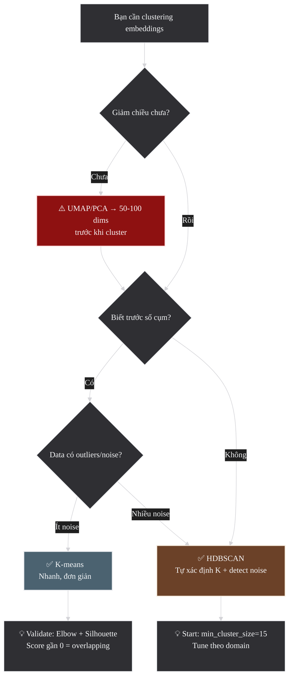

Đến đây, ta đã có một pipeline khá rõ: giảm chiều trước, chọn K-means nếu dữ liệu tương đối gọn và biết trước số cụm, hoặc chọn HDBSCAN nếu dữ liệu có noise và hình dạng cụm phức tạp hơn. Nhưng chọn được thuật toán mới chỉ là nửa đầu của bài toán.

Bước tiếp theo là kiểm tra xem các cụm vừa tạo ra có thật sự đáng tin và hữu ích hay không. Đây là lúc nhiều người nhìn ngay vào UMAP 2D plot để kết luận, vì hình vẽ thường rất trực quan. Vấn đề là UMAP 2D chỉ nên được xem như công cụ quan sát nhanh, không phải bằng chứng cuối cùng về chất lượng clustering.

### Đánh giá Cluster — UMAP 2D chỉ là một phần của câu chuyện

UMAP 2D plot có thể trông rất đẹp nhưng vẫn **gây hiểu nhầm**. Trong quá trình chiếu dữ liệu từ không gian nhiều chiều xuống 2D, UMAP có thể làm xuất hiện các cụm nhìn có vẻ tách biệt dù trong không gian gốc chúng không tách rõ, hoặc ngược lại làm các cụm thật bị dính vào nhau. Vì vậy, việc đánh giá cluster nên đi theo một quy trình đầy đủ hơn:

1. **Chuẩn hóa embeddings** trước khi cluster (nếu đang làm việc theo cosine similarity)
2. **Giảm chiều** bằng UMAP/PCA xuống khoảng 50-100 chiều để cluster (không phải 2D)
3. **Cluster** bằng K-means hoặc HDBSCAN
4. **Lấy ví dụ đại diện**: chọn 5-10 samples tiêu biểu trong mỗi cluster → đọc thủ công → đặt tên cluster
5. **Kiểm tra ích lợi thực tế**: clusters có giúp task thực tế không?
   - Routing: tickets được route đúng team?
   - Taxonomy: categories có ý nghĩa business?
   - Dedup: cluster grouping có overlap hợp lý?

> Các metric như silhouette hay inertia chỉ cho biết cluster có "đẹp về mặt hình học" hay không. Chúng không tự bảo đảm cluster đó có **ý nghĩa về mặt nội dung**.
> Ví dụ: một cluster có silhouette rất cao nhưng lại gom "AI" với "blockchain" vào cùng nhóm thì với người dùng cuối, cluster đó vẫn không hữu ích.

### Mã giả: Clustering + UMAP Visualization

Đoạn mã giả dưới đây ghép lại toàn bộ quy trình trên: normalize embeddings, giảm chiều để cluster, chạy cả K-means lẫn HDBSCAN, rồi mới dùng UMAP 2D cho visualization như một bước quan sát riêng.

```text
embeddings = load_embeddings(texts)

# Step 1: normalize if the similarity setup depends on cosine
normalized_embeddings = l2_normalize(embeddings)

# Step 2: reduce dimensions for clustering
cluster_vectors = reduce_dimensions(
    normalized_embeddings,
    method="UMAP or PCA",
    target_dims=50
)

# Step 3a: run K-means
kmeans_labels = kmeans(cluster_vectors, k=5)
kmeans_score = silhouette(cluster_vectors, kmeans_labels)

# Step 3b: run HDBSCAN
hdbscan_labels = hdbscan(
    cluster_vectors,
    min_cluster_size=15,
    min_samples=5
)
noise_count = count_noise_points(hdbscan_labels)

# Step 4: reduce separately for 2D visualization
viz_points = reduce_dimensions(
    normalized_embeddings,
    method="UMAP",
    target_dims=2
)

# Step 5: inspect and compare the clustering outputs
plot(viz_points, labels=kmeans_labels, title="K-means clusters")
plot(viz_points, labels=hdbscan_labels, title="HDBSCAN clusters")
representative_samples = sample_examples_per_cluster(texts, hdbscan_labels)

# Step 6: validate with real task usefulness
review(representative_samples)
check_business_usefulness()
```

---

## 2.4 Recommendation Systems

Cùng tư duy retrieval cũng có thể được áp dụng sang recommendation. Ở đây, trọng tâm chuyển từ query-document sang user-item, nhưng logic nền vẫn là tìm các láng giềng gần nhất ở scale lớn và tổ chức pipeline đủ nhanh để phục vụ real-time.

### Recommendation là một bài toán retrieval

Bài toán recommendation có một thách thức quen thuộc: từ hàng triệu items (phim, sản phẩm, bài viết), chọn ra vài chục items phù hợp nhất cho **mỗi** user — và phải nhanh (real-time). Nếu nghe giống bài toán search (từ hàng triệu documents, tìm vài chục liên quan nhất), đó không phải trùng hợp — cả hai đều là bài toán **tìm nearest neighbors ở scale lớn**.

Embedding-based recommendation giải quyết bằng cách đặt **users** và **items** vào **cùng một không gian vector**. Khi user và item gần nhau → item phù hợp với user đó. Đây chính là **bi-encoder pattern** từ [Section 1.4.1](#141-bi-encoder-vs-cross-encoder) áp dụng cho domain khác: thay vì encode query/document **độc lập** → pre-compute document embeddings → ANN lookup, ta encode user/item **độc lập** → pre-compute item embeddings → ANN lookup → top-K recommendations. Cùng nguyên lý, cùng trade-offs, khác domain.

### Two-Tower Architecture — Bi-encoder cho Recommendation

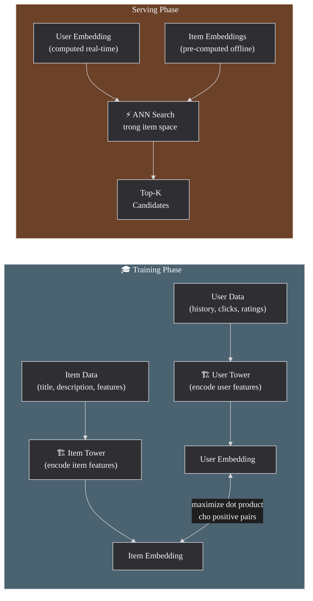

**Kiến trúc chi tiết:**

- **User tower**: encode user features (browsing history, demographics, device, time of day) → **user embedding**
- **Item tower**: encode item features (title, description, category, price, popularity) → **item embedding**
- **Scoring**: `score(user, item) = user_embedding · item_embedding`

**Tại sao Two-Tower scale được?**
1. **Item embeddings pre-compute offline** — giống document embeddings trong search. Hàng triệu items được encode 1 lần → lưu vào vector database
2. **User embedding compute real-time** — khi user request, chỉ cần encode 1 user vector
3. **ANN search** trong item embedding space → trả về top-K candidates trong ~ms
4. → Scale đến **hàng triệu items** mà vẫn giữ latency thấp. YouTube dùng pattern này cho billions of videos.

### Candidate Generation → Ranking — Pipeline 2 giai đoạn

Giống RAG (retrieve → rerank → generate), recommendation systems thường có **2 giai đoạn**, với logic tương tự:

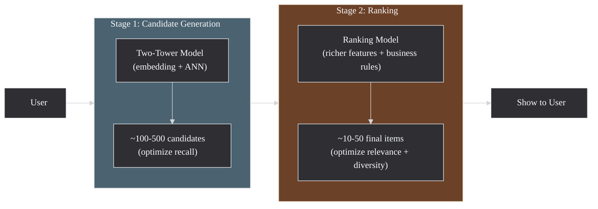

**Stage 1 — Candidate Generation** (tương đương retrieval trong RAG):
- Two-Tower + ANN: cast wide net, lấy ~100-500 candidates
- **Optimize recall**: không bỏ sót items user có thể thích
- Cheap model (embedding + dot product) → fast

**Stage 2 — Ranking** (tương đương reranking trong RAG):
- Model phức tạp hơn: dùng thêm features (user history sequence, item freshness, context)
- **Business rules**: diversity (không recommend cùng category), freshness, ad revenue
- Expensive model → chỉ chạy trên ~100-500 candidates từ Stage 1

> **Pattern chung**: Retrieval (cheap, wide) → Ranking (expensive, precise). Pattern này xuất hiện trong cả search, recommendation, và ads targeting. Lý do: không có model nào vừa chính xác vừa scalable — nên chia thành 2 stages.

> Sources: [Google ML — Recommendation: Candidate Generation](https://developers.google.com/machine-learning/recommendation/overview/candidate-generation), [Deep Neural Networks for YouTube Recommendations — Covington et al., 2016](https://research.google/pubs/deep-neural-networks-for-youtube-recommendations/), [Google Cloud — Two-Tower Architecture](https://cloud.google.com/architecture/implement-two-tower-retrieval-large-scale-candidate-generation)

### Tại sao dùng Dot Product thay vì Cosine?

Trong recommendation, **popularity là tín hiệu quan trọng**, và dot product capture nó tự nhiên:

| Aspect | Dot Product | Cosine Similarity |
|--------|------------|-------------------|
| **Công thức** | `A·B = ‖A‖‖B‖cos(θ)` | `cos(θ) = (A·B)/(‖A‖‖B‖)` |
| **Magnitude** | Giữ tín hiệu norm | Normalize → mất norm |
| **Item phổ biến** | Score cao tự nhiên (norm lớn) | Không ưu tiên |
| **Ý nghĩa** | Relevance × Popularity | Pure relevance only |
| **Use case** | Recommend items vừa liên quan vừa phổ biến | Tìm items tương tự nhất (diversity) |

**Tại sao norm encode popularity?** Items phổ biến (nhiều interactions) được model thấy nhiều lần trong training → gradients tích lũy → embedding norm lớn hơn. Đây là tính chất tự nhiên của training process, không phải bug.

**Ví dụ**: "Avengers: Endgame" (rất phổ biến) và "Blade Runner 2049" (ít phổ biến hơn) cùng thuộc genre sci-fi:
- **Dot product**: ưu tiên Endgame (norm lớn hơn → score cao hơn dù góc θ tương tự)
- **Cosine**: score gần bằng nhau (chỉ đo góc, bỏ qua popularity)

**Cẩn thận**: Dot product có thể **over-favor popular items** nếu không kiểm soát → popular items dominate top-K → thiếu diversity. Giải pháp: post-processing diversification, popularity penalty, hoặc dùng cosine + explicit popularity feature.

> Sources: [Google ML — Candidate Generation](https://developers.google.com/machine-learning/recommendation/overview/candidate-generation), [Google ML — Supervised Similarity](https://developers.google.com/machine-learning/clustering/dnn-clustering/supervised-similarity)

### Cold-start Problem — Tại sao xảy ra và cách giải quyết

Two-Tower architecture ở trên rất powerful — scale đến hàng triệu items, latency thấp, YouTube dùng cho billions of videos. Nhưng nó hoạt động dựa trên một **giả định ngầm**: model cần **interaction history** (clicks, ratings, purchases) để học được user thích gì và item nào hấp dẫn. Khi giả định này bị phá vỡ — user mới chưa có lịch sử, hoặc item mới chưa ai tương tác — model không có signal để encode meaningful embedding → recommendations kém. Đây là **cold-start problem**.

**Cold-start có 2 loại khác nhau:**

| Loại | Vấn đề | Tại sao khó |
|------|--------|-------------|
| **New User** | Không biết user thích gì | Chưa có clicks/ratings → user embedding không có ý nghĩa |
| **New Item** | Item chưa ai interact | Chưa có interactions → item embedding chưa học được từ collaborative signals |

**Giải pháp theo mechanism:**

1. **Content-based features** (giải quyết cả 2 loại):
   - User tower: dùng **demographics** (age, location) + **device type** + **time context** thay vì chỉ behavior history → user mới vẫn có meaningful embedding từ metadata
   - Item tower: dùng **text features** (title, description, category) thay vì chỉ interaction signals → item mới vẫn có embedding từ content
   - **Tại sao hiệu quả?** Vì content features là **static** — không cần interaction history. Model học mapping "user profile → interests" và "item description → embedding" từ existing users/items

2. **Hybrid approach**: kết hợp collaborative filtering (behavior) + content-based (features) → system dùng collaborative signals khi có, fallback sang content khi không có

3. **Popularity fallback**: user mới → recommend items phổ biến nhất (highest average rating, most purchased). Đơn giản nhưng hiệu quả vì popular items có xác suất cao relevant cho bất kỳ user nào

4. **Khám phá có kiểm soát**: dành một phần nhỏ recommendations cho item mới hoặc item còn ít dữ liệu, để hệ thống thu thập thêm tín hiệu. Vì đây là một chủ đề lớn hơn cold-start, phần dưới sẽ tách riêng exploration và exploitation.

> Source: [Google ML — Recommendation: Candidate Generation](https://developers.google.com/machine-learning/recommendation/overview/candidate-generation)

### Exploration vs Exploitation — Không thể chỉ lặp lại cái đã biết

Một recommender tốt không chỉ chọn item có điểm cao nhất theo mô hình hiện tại. Nó còn phải tạo cơ hội để hệ thống học xem user có thể thích điều gì tiếp theo.

- **Exploitation**: ưu tiên những item mà model đã tin khá chắc là user sẽ thích
- **Exploration**: cố ý dành một phần nhỏ lưu lượng cho item mới, item ít dữ liệu, hoặc item giúp hệ thống học thêm về user

Nếu chỉ **exploitation**, hệ thống dễ rơi vào vòng lặp quen thuộc:

- luôn đẩy cùng một nhóm item phổ biến
- item mới rất khó có cơ hội xuất hiện
- hồ sơ sở thích của user không được mở rộng
- diversity giảm dần theo thời gian

Nếu chỉ **exploration**, trải nghiệm lại trở nên kém ổn định vì người dùng thấy quá nhiều item chưa đủ liên quan.

Trong thực tế, hệ thống thường cân bằng theo những cách khá thực dụng:

- dành `1-2` vị trí trong mỗi danh sách cho item mới hoặc under-exposed items
- thêm diversity rules để top-K không bị chiếm bởi cùng một category
- dùng các chiến lược đơn giản như `epsilon-greedy`, hoặc tiến xa hơn là `contextual bandit`, khi hệ thống cần học liên tục từ phản hồi người dùng

Điểm quan trọng là exploration không phải "ném ngẫu nhiên". Nó là một phần có chủ đích của hệ thống để vừa phục vụ user hiện tại, vừa giúp model tốt hơn ở những lượt sau.

### Evaluation cho Recommendation

Khác với semantic search, recommendation không thể đánh giá chỉ bằng câu hỏi "item có liên quan không?". Một recommender tốt còn phải tạo ra hành vi tốt trong sản phẩm: click, conversion, watch time, retention, và cả diversity phù hợp.

| Lớp đánh giá | Metric | Ý nghĩa |
|--------------|--------|---------|
| **Candidate Generation** | Recall@K | Item mà user thực sự tương tác có nằm trong candidate set hay không |
| **Ranking** | nDCG@K | Những item tốt có được đưa lên vị trí cao hay không |
| **Ranking** | MRR / HitRate@K | User có nhìn thấy ít nhất một item phù hợp đủ sớm hay không |
| **Product** | CTR | Recommendation có đủ hấp dẫn để được click không |
| **Product** | Conversion / Watch Time / Dwell Time | Click có dẫn đến giá trị thật hay chỉ là click hời hợt |
| **Product** | Retention / Session Length | Hệ thống có giúp user quay lại và ở lại lâu hơn không |

Offline metrics rất hữu ích để iterate model nhanh. Nhưng online metrics mới cho biết recommender có thật sự tốt trong sản phẩm hay không. Một model có thể tăng CTR bằng cách đẩy các item giật chú ý hơn, nhưng lại làm giảm retention hoặc giảm diversity.

Vì vậy, evaluation cho recommendation thường đi theo hai lớp:

1. **Offline evaluation** để lọc nhanh mô hình và so sánh các thay đổi về candidate generation hoặc ranking
2. **Online evaluation** bằng A/B test để kiểm tra tác động thật lên hành vi người dùng và mục tiêu business

Đây cũng là lý do recommendation systems hiếm khi có một metric duy nhất đại diện cho tất cả. Hệ thống tốt là hệ thống cân bằng được relevance, business value và trải nghiệm dài hạn của người dùng.

Từ đây, Phần 2 mở rộng sang bốn nhóm ứng dụng khác của embedding: classification, anomaly detection, deduplication và multimodal retrieval. Điểm chung vẫn là embeddings đóng vai trò lớp biểu diễn nền; điều thay đổi là cách hệ thống đọc các vector đó để gán nhãn, phát hiện điểm bất thường, loại dữ liệu trùng lặp, hoặc nối nhiều modality vào cùng một không gian.

## 2.5 Classification & Sentiment Analysis

Khi bài toán đã có nhãn rõ ràng, embeddings không còn chỉ dùng để retrieve mà còn có thể trở thành lớp đặc trưng đầu vào cho classifier. Phần này đi qua pipeline cơ bản, cách chọn giữa embedding + classifier với fine-tuning, sự khác nhau giữa multiclass và multilabel, rồi khép lại bằng threshold, abstain và cách đánh giá hệ thống phân loại trong thực tế.

### Embedding như lớp đặc trưng cho classification

Khi bài toán đã có **labels rõ ràng** như `positive/negative`, `spam/ham`, `billing/support`, embeddings có thể được dùng như một lớp đặc trưng chung rồi đưa vào một classifier nhỏ ở phía sau. Đây là cách rất thực dụng để xây text classifier nhanh mà không phải fine-tune ngay một model lớn.

Nói theo cách đơn giản hơn: embedding biến mỗi đoạn text thành một **vector đặc trưng có cùng kích thước**, còn classifier là mô hình đọc vector đó và quyết định nó thuộc nhãn nào.

### Pipeline

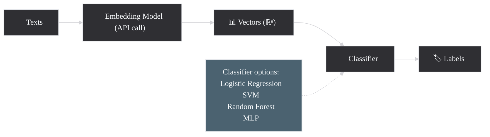

Ở pipeline này, embedding model đóng vai trò **feature extractor**. Nó rút từ text ra một biểu diễn số học đủ giàu thông tin để một classifier nhỏ như Logistic Regression hay SVM có thể học ranh giới giữa các nhãn.

### So sánh: Embedding + Classifier vs Fine-tuning

| Aspect | Embedding + Classifier | Fine-tuning Full Model |
|--------|----------------------|----------------------|
| **Training time** | Giây-phút (chỉ train classifier nhỏ) | Giờ-ngày (train cả model lớn) |
| **Data cần** | Ít (100-1000 samples có thể đủ) | Nhiều (thường >5000 samples) |
| **GPU cần** | Không (classifier chạy CPU) | Có (fine-tune cần GPU) |
| **Flexibility** | Cao: đổi model embed dễ dàng | Thấp: retrain toàn bộ |
| **Accuracy** | Tốt cho hầu hết tasks | Tốt nhất cho domain-specific |
| **Cost** | Rẻ (chỉ API calls + CPU) | Đắt (GPU hours) |

### Khi nào Embedding + Classifier là đủ?

Trong rất nhiều sản phẩm nội bộ hoặc business apps, cách làm này đã đủ tốt nếu:

- số lượng labels không quá nhiều và ý nghĩa của chúng khá ổn định
- dataset gán nhãn còn nhỏ hoặc vừa phải
- team cần iterate nhanh, dễ debug và chi phí thấp
- inference cần chạy nhẹ trên CPU hoặc tích hợp đơn giản vào hệ thống sẵn có

Ngược lại, fine-tuning thường đáng cân nhắc hơn khi:

- ngôn ngữ trong domain quá đặc thù, ví dụ legal, medical, scientific
- ranh giới giữa các nhãn rất tinh vi, không chỉ dựa vào nội dung tổng quát
- bạn có đủ dữ liệu gán nhãn để việc cập nhật cả model lớn mang lại lợi ích rõ rệt
- mô hình cần tối ưu rất mạnh cho một task duy nhất thay vì giữ tính đa dụng

### Multiclass vs Multilabel — Hai bài toán khác nhau

Nói đến classification, có một chỗ rất dễ bị bỏ qua: không phải lúc nào mỗi text cũng chỉ thuộc **một** nhãn duy nhất.

- **Multiclass**: mỗi mẫu chỉ có **một nhãn đúng**. Ví dụ một ticket chỉ thuộc `billing` hoặc `technical_support`
- **Multilabel**: một mẫu có thể có **nhiều nhãn cùng lúc**. Ví dụ một review vừa là `negative`, vừa là `shipping_issue`, vừa là `damaged_product`

Sự khác biệt này kéo theo cách thiết kế mô hình khác nhau:

- multiclass thường dùng một đầu ra chọn **một nhãn duy nhất**
- multilabel thường dự đoán **xác suất riêng cho từng nhãn**, rồi áp threshold cho từng nhãn đó

Nếu nhầm hai bài toán này với nhau, chất lượng hệ thống sẽ nhìn rất lạ: model multiclass sẽ bị ép chọn một nhãn duy nhất dù dữ liệu thật có nhiều ý, còn model multilabel có thể gán quá nhiều nhãn nếu threshold không được kiểm soát.

### Ví dụ Use Cases

- **Sentiment analysis**: positive/negative/neutral từ reviews
- **Spam detection**: spam vs ham trong email/comments
- **Topic classification**: gán chủ đề cho bài viết (AI, finance, sports...)
- **Intent recognition**: phân loại ý định trong chatbot (hỏi giá, khiếu nại, hỗ trợ kỹ thuật...)
- **Toxicity detection**: phát hiện nội dung độc hại/toxic

### Class Imbalance, Threshold và Abstain

Trong production, dữ liệu gán nhãn thường **không cân bằng**. Có thể `90%` tickets là hỗ trợ chung, còn `2%` là fraud hoặc escalation. Nếu chỉ nhìn `accuracy`, model rất dễ trông có vẻ tốt dù thực ra gần như bỏ qua những class hiếm nhưng quan trọng.

Một vài điểm cần chú ý:

- **Class imbalance**: nên quan sát số mẫu của từng nhãn, dùng `macro-F1`, và khi cần có thể dùng `class weights` hoặc resampling
- **Threshold**: với multilabel hoặc binary classification, threshold `0.5` không phải lúc nào cũng đúng; nhiều hệ thống đặt threshold riêng cho từng nhãn theo business cost
- **Abstain / Human Review**: nếu model không đủ tự tin, tốt hơn là chuyển sang hàng đợi review thay vì ép dự đoán

`Abstain` đặc biệt hữu ích khi:

- nhãn sai gây hậu quả lớn, ví dụ moderation, compliance, fraud
- câu trả lời cần độ chắc chắn cao hơn mức trung bình
- dữ liệu đầu vào bị mơ hồ hoặc nằm ngoài phân phối quen thuộc

Trong các hệ thống kiểu này, classifier không chỉ trả nhãn; nó còn trả **mức tin cậy** và đôi khi cả cờ "không chắc, cần người xem lại".

### Evaluation cho Classification

Với classification, độ chính xác không chỉ là một con số duy nhất. Cùng một model có thể nhìn ổn theo `accuracy`, nhưng lại bỏ sót gần hết những nhãn hiếm.

| Metric | Dùng khi nào | Ý nghĩa |
|--------|--------------|---------|
| **Accuracy** | Classes khá cân bằng | Tỷ lệ dự đoán đúng trên toàn bộ mẫu |
| **Precision** | False positive đắt giá | Trong những mẫu model gắn nhãn dương, có bao nhiêu mẫu thật sự đúng |
| **Recall** | False negative đắt giá | Trong những mẫu dương thật, model bắt được bao nhiêu |
| **F1-score** | Cần cân bằng precision và recall | Trung bình điều hòa giữa hai chỉ số trên |
| **Confusion Matrix** | Muốn biết model nhầm ở đâu | Cho thấy cặp nhãn nào hay bị lẫn với nhau |

Với sentiment, spam hay intent routing, `macro-F1` thường hữu ích hơn nhìn mỗi `accuracy`, vì nó buộc ta quan sát cả những class ít dữ liệu thay vì chỉ class đông mẫu.

Zero-shot classification cũng là một lựa chọn trung gian đáng nhớ. Nó hữu ích khi muốn bootstrap nhanh một hệ thống phân loại mà chưa có nhiều dữ liệu gán nhãn. Nhưng một khi labels đã ổn định và có dataset đủ tốt, embedding + classifier hoặc fine-tuning thường cho hành vi dễ kiểm soát và dễ đánh giá hơn.

### Mã giả: Sentiment Classification

```text
texts, labels = load_labeled_dataset()

# Step 1: convert texts to embeddings
vectors = embed(
    texts,
    model="embedding-model",
    dimensions=256
)

# Step 2: split train and test sets
train_vectors, test_vectors, train_labels, test_labels = train_test_split(
    vectors,
    labels,
    test_ratio=0.25
)

# Step 3: train a lightweight classifier
classifier = train_logistic_regression(
    train_vectors,
    train_labels
)

# Step 4: evaluate
predicted_labels = classifier.predict(test_vectors)
report_metrics(
    truth=test_labels,
    predicted=predicted_labels,
    metrics=["accuracy", "precision", "recall", "f1"]
)

# Step 5: predict on new text
new_text = "This product is worth buying"
new_vector = embed([new_text], model="embedding-model", dimensions=256)
predicted_label = classifier.predict(new_vector)
return predicted_label
```

> Source: [OpenAI Cookbook — Classification using Embeddings](https://github.com/openai/openai-cookbook/blob/main/examples/Classification_using_embeddings.ipynb)

Nếu `2.5` giả định rằng ta đã có labels và muốn gán nhãn nhất quán cho dữ liệu mới, thì phần tiếp theo đi sang tình huống ngược lại: chưa biết nhãn nào là đúng, chỉ biết rằng có những điểm **lạ** cần được kéo ra khỏi đám đông để kiểm tra.

---

## 2.6 Anomaly Detection

Nếu classification giả định rằng ta đã biết cần gán nhãn gì, anomaly detection lại phù hợp với tình huống chưa có taxonomy rõ mà chỉ muốn kéo những điểm lạ ra khỏi đám đông. Phần này tập trung vào cách embeddings giúp phát hiện khác biệt ngữ nghĩa, khi nào nên dùng anomaly detection thay vì rules hoặc classification, các kiểu anomaly thường gặp, và cách đặt threshold để hệ thống còn hữu ích với team vận hành.

### Phát hiện điểm lạ trong embedding space

Anomaly detection (phát hiện bất thường) dùng embeddings để tìm ra những data points **khác biệt rõ rệt** so với phần lớn dataset. Ý tưởng cốt lõi là: nếu một điểm nằm xa khỏi các patterns quen thuộc trong embedding space, nó có thể là anomaly.

Điểm quan trọng là anomaly **không đồng nghĩa** với lỗi. Nó chỉ có nghĩa là điểm đó đủ khác thường để cần được xem xét kỹ hơn.

Phần này đi qua khi nào anomaly detection phù hợp hơn rules hay classification, ba hướng tiếp cận phổ biến, và cách đặt threshold sao cho hệ thống hữu ích trong thực tế.

**Use cases thực tế:**
- Phát hiện **customer support tickets bất thường** (chủ đề mới chưa từng thấy)
- Phát hiện **nội dung spam/scam** trong reviews
- **Quality control**: phát hiện sản phẩm có mô tả bất thường
- **Security**: phát hiện log entries bất thường (intrusion detection)
- **Content moderation**: phát hiện nội dung vi phạm khác biệt patterns bình thường

### Khi nào dùng Anomaly Detection, khi nào dùng Rules hoặc Classification?

Anomaly detection phù hợp nhất khi bạn **chưa biết rõ anomaly sẽ trông như thế nào**, hoặc anomaly quá hiếm nên không có đủ dữ liệu gán nhãn để train classifier tử tế.

- **Dùng anomaly detection** khi muốn tìm những điểm lạ trong dữ liệu chưa có taxonomy rõ
- **Dùng rule-based** khi đã có các dấu hiệu cố định, ví dụ regex cho mã lỗi, blacklist domains, ngưỡng transaction quá lớn
- **Dùng classification** khi đã có đủ ví dụ gán nhãn cho các loại bất thường cụ thể và muốn hệ thống gán nhãn nhất quán

Trong thực tế, anomaly detection thường là lớp **sàng lọc ban đầu**: nó đẩy các điểm đáng ngờ vào hàng đợi review, còn rules hoặc classifiers xử lý những pattern đã biết rõ.

### Semantic Novelty vs True Anomaly

Một điểm rất quan trọng với embeddings là: một item có thể **mới về mặt ngữ nghĩa** nhưng chưa chắc đã là **anomaly theo nghĩa xấu**.

- Một support ticket nói về tính năng vừa ra mắt có thể rất khác phần lớn tickets cũ, nên bị kéo ra như anomaly
- Nhưng đó có thể chỉ là **semantic novelty**: chủ đề mới xuất hiện, không phải lỗi hay hành vi bất thường

Vì vậy, anomaly detection bằng embeddings thường tốt ở việc phát hiện **cái gì đang khác đi**, chứ không tự quyết định được khác đó là tốt hay xấu. Quyết định cuối cùng vẫn cần bối cảnh nghiệp vụ.

### Global, Local và Contextual Anomalies

Không phải anomaly nào cũng giống nhau. Có thể chia thành ba kiểu để dễ hình dung:

- **Global anomaly**: điểm nằm xa hẳn phần còn lại của dataset
- **Local anomaly**: điểm chỉ lạ trong vùng lân cận của nó; toàn cục thì không quá hiếm
- **Contextual anomaly**: nội dung tự thân không lạ, nhưng lạ trong đúng bối cảnh đó. Ví dụ một ticket "server down" là bình thường trong incident queue, nhưng bất thường nếu xuất hiện trong một tập feedback về giao diện

Embeddings thường giúp tốt với global hoặc semantic local anomalies. Với contextual anomalies, bạn thường cần thêm metadata như thời gian, category, tenant, hoặc source hệ thống mới đánh giá đúng được.

### Các hướng tiếp cận phổ biến

#### 1. Isolation Forest

**Ý tưởng**: xây nhiều random decision trees, mỗi tree cố gắng **cô lập** (isolate) từng data point bằng random splits. Anomaly = data point dễ bị cô lập → **path length ngắn**.

**Tại sao anomaly có path ngắn?** Anomaly nằm xa cluster chính → chỉ cần vài random splits đã tách riêng được. Normal points nằm trong cluster dense → cần nhiều splits.

#### 2. Distance-based

**Ý tưởng**: tính khoảng cách trung bình từ mỗi point đến K nearest neighbors. Anomaly = points có khoảng cách lớn (nằm xa tất cả).

#### 3. Clustering-based

**Ý tưởng**: dùng HDBSCAN clustering → points labeled noise (label = -1) là anomaly candidates. Hoặc: tính khoảng cách mỗi point đến centroid gần nhất → threshold.

### Chọn threshold và cách xử lý kết quả

Phần khó nhất của anomaly detection thường không nằm ở thuật toán, mà ở **threshold** và **quy trình review**.

- threshold quá thấp → quá nhiều false positives, team review bị quá tải
- threshold quá cao → bỏ sót những trường hợp thật sự quan trọng

Vì vậy, nhiều hệ thống bắt đầu bằng cách:

1. lấy `top 1-5%` điểm bất thường nhất
2. cho con người đọc mẫu và gắn nhãn lại
3. điều chỉnh threshold cho đến khi tỷ lệ cảnh báo hữu ích chấp nhận được

Một nguyên tắc thực dụng khác là: anomaly detection thường nên **flag để review** trước, thay vì tự động xóa hay chặn ngay, trừ khi domain đã rất ổn định và rủi ro false positive thấp.

### Evaluation cho Anomaly Detection

Anomaly detection khó đánh giá hơn classification vì thường **thiếu labels đầy đủ**. Trong thực tế, nhiều team dùng các chỉ số gần với vận hành hơn là chỉ số học thuật thuần túy:

| Metric / Tín hiệu | Ý nghĩa |
|-------------------|---------|
| **Precision@Top-K** | Trong K điểm bị gắn cờ đầu tiên, có bao nhiêu điểm thật sự đáng xem |
| **Review Yield** | Tỷ lệ cảnh báo tạo ra hành động hữu ích sau khi con người đọc |
| **Alert Volume** | Mỗi ngày/tuần hệ thống đẩy ra bao nhiêu case; team review có xử lý nổi không |
| **Time-to-detect** | Hệ thống có kéo được pattern mới ra sớm hơn rule-based monitoring không |

Ngoài ra còn có một yếu tố rất thực tế là **drift**. Một pattern hôm nay còn lạ, nhưng vài tuần sau có thể đã thành bình thường. Vì vậy, anomaly detection cần được re-baseline định kỳ; nếu không, hàng đợi review sẽ đầy những trường hợp "từng mới nhưng giờ đã quen".

### Mã giả: Anomaly Detection Pipeline

```text
texts = load_dataset()
vectors = embed(texts)

# Method 1: isolation-based scoring
isolation_scores = isolation_forest(
    vectors,
    contamination=0.05
)

# Method 2: distance-based scoring
neighbor_distances = average_distance_to_k_neighbors(
    vectors,
    k=5,
    metric="cosine"
)

# Combine signals
# Normalize the two score families first because isolation and
# distance-based scores often live on different scales.
# Rank-normalization or min-max scaling is safer than adding raw values.
combined_scores = combine_scores(
    isolation_scores,
    neighbor_distances
)

# Select the most suspicious samples
threshold = percentile(combined_scores, 95)
anomaly_candidates = select_where(combined_scores >= threshold)

# Send candidates to review
flag_for_review(texts, anomaly_candidates)
```

> Sources: [scikit-learn Isolation Forest](https://scikit-learn.org/stable/modules/generated/sklearn.ensemble.IsolationForest.html), [OpenAI — Text and Code Embeddings use cases](https://openai.com/index/introducing-text-and-code-embeddings/)

Nếu `2.6` đi tìm những điểm **khác thường**, thì `2.7` đi theo hướng ngược lại: tìm những điểm **quá giống nhau** để dọn dữ liệu, giảm trùng lặp và tránh làm hệ thống bị nhiễu.

---

## 2.7 Deduplication / Near-duplicate Detection

Sau khi tìm điểm lạ, một bài toán chất lượng dữ liệu ngược chiều nhưng cũng rất quan trọng là tìm những điểm quá giống nhau. Phần này đi từ duplicate, near-duplicate đến semantic duplicate, trình bày pipeline `exact -> fuzzy -> semantic`, rồi đi vào các quyết định thực tế như threshold, chọn bản canonical và chính sách xử lý theo từng use case.

### Tìm dữ liệu trùng ở nhiều mức

Phát hiện và loại bỏ **duplicates** hoặc **near-duplicates** là một bài toán chất lượng dữ liệu rất thực tế. Mục tiêu không chỉ là tìm hai bản giống hệt nhau, mà còn phát hiện những trường hợp gần như trùng ý nhưng khác câu chữ, ngôn ngữ hoặc định dạng.

Việc này quan trọng vì:
- **Data quality**: duplicates làm bias training data
- **Storage**: giảm kích thước database/index
- **Search**: tránh trả về nhiều kết quả gần giống nhau
- **Content**: phát hiện plagiarism, repost

Phần này sẽ lần lượt tách bạch duplicate với near-duplicate, đi qua các hướng tiếp cận từ đơn giản đến scalable, rồi chốt ở câu hỏi thực tế nhất: threshold nào thì nên tự động xử lý, threshold nào thì nên chuyển sang review.

### Duplicate, Near-duplicate và Semantic duplicate khác nhau thế nào?

- **Duplicate**: gần như giống hệt nhau, ví dụ copy-paste cùng một đoạn text
- **Near-duplicate**: khác đôi chút về câu chữ, format, typo, tiêu đề, nhưng nội dung gần như không đổi
- **Semantic duplicate**: diễn đạt khác hẳn, thậm chí khác ngôn ngữ, nhưng truyền đạt cùng một ý

Càng đi từ duplicate sang semantic duplicate, bài toán càng bớt giống kiểm tra chuỗi và càng phụ thuộc nhiều hơn vào embeddings.

### Pipeline thực tế: Exact -> Fuzzy -> Semantic

Trong nhiều hệ thống, deduplication không nên bắt đầu ngay bằng embeddings. Một pipeline thực tế thường đi theo ba lớp:

1. **Exact dedup**: hash hoặc so sánh chuỗi sau khi normalize cơ bản để loại các bản sao giống hệt
2. **Fuzzy dedup**: xử lý khác biệt nhỏ như typo, format, tiêu đề gần giống
3. **Semantic dedup**: dùng embeddings để tìm những bản trùng ý nhưng khác cách diễn đạt

Cách đi này vừa rẻ hơn, vừa dễ giải thích hơn. Embeddings nên được dùng ở lớp cuối, khi những kỹ thuật đơn giản hơn không còn đủ nữa.

### Các hướng tiếp cận phổ biến

#### 1. Pairwise Similarity (O(n²))

Tính cosine similarity giữa **mọi cặp** → threshold → duplicate pairs.

- ✅ Đơn giản, chính xác
- ❌ O(n²) — chỉ phù hợp dataset nhỏ (<10k docs)
- Ví dụ: 10k docs = 50M cặp cần tính; 100k docs = 5B cặp → không khả thi

#### 2. Paraphrase Mining (Scalable)

**SBERT paraphrase mining**: kỹ thuật thông minh hơn — chia corpus thành chunks, tìm top-k similar pairs trong mỗi chunk, rồi merge. Giảm complexity đáng kể.

#### 3. Locality-Sensitive Hashing (LSH)

Hash embedding vectors → buckets. Vectors tương tự → cùng bucket với xác suất cao. Chỉ so sánh các cặp trong cùng bucket → near-linear time.

### Chọn threshold và hành động xử lý

Deduplication không chỉ có câu hỏi "có giống nhau không?", mà còn có câu hỏi "giống đến mức nào thì nên làm gì?".

- threshold cao hơn phù hợp cho **auto-remove** các bản gần như trùng hệt
- threshold thấp hơn phù hợp cho **flag review** hoặc gom thành nhóm để con người quyết định
- với multilingual corpora, hai câu khác ngôn ngữ nhưng cùng nghĩa có thể là semantic duplicate, nhưng việc có nên xóa hay giữ lại còn phụ thuộc mục tiêu sản phẩm

Trong nhiều hệ thống production, cách an toàn thường là:

1. **exact duplicates** → có thể xóa tự động
2. **near-duplicates rất rõ** → hợp nhất hoặc giữ một bản canonical
3. **semantic duplicates chưa chắc chắn** → gắn cờ để review, đặc biệt nếu việc xóa có ảnh hưởng business

### Chain Effect và chọn bản Canonical

Khi dedup ở mức semantic, một rủi ro rất hay gặp là **chain effect**:

- A rất giống B
- B rất giống C
- nhưng A và C không thật sự đủ giống để coi là cùng một bản

Nếu chỉ nối cặp theo kiểu "gần là nhập nhóm", hệ thống có thể tạo ra các cụm quá lớn và làm mất dữ liệu hợp lệ. Vì vậy, bước `build_duplicate_groups` không nên chỉ dựa trên nối chuỗi cặp một cách mù quáng; nó thường cần thêm điều kiện như:

- giới hạn độ rộng cụm
- so sánh lại với bản canonical của nhóm
- hoặc yêu cầu mọi bản trong nhóm phải đủ gần tâm nhóm, không chỉ gần một hàng xóm trung gian

Việc chọn **bản canonical** cũng nên theo policy rõ ràng. Tùy use case, bản được giữ lại có thể là:

- bản xuất hiện sớm nhất
- bản có metadata đầy đủ nhất
- bản có chất lượng nội dung tốt hơn
- hoặc bản đã được dùng làm ID tham chiếu ở nơi khác trong hệ thống

### Use Case khác nhau -> Threshold khác nhau

Deduplication cho các bài toán khác nhau không nên dùng cùng một threshold:

- **Training corpus**: thường cần threshold chặt hơn để tránh lặp dữ liệu làm bias model
- **Search results**: có thể chấp nhận threshold mềm hơn, miễn là top results không bị lặp quá rõ
- **Plagiarism / compliance**: thường cần quy trình review chặt hơn vì tác động pháp lý hoặc nghiệp vụ cao

### Workflow Deduplication

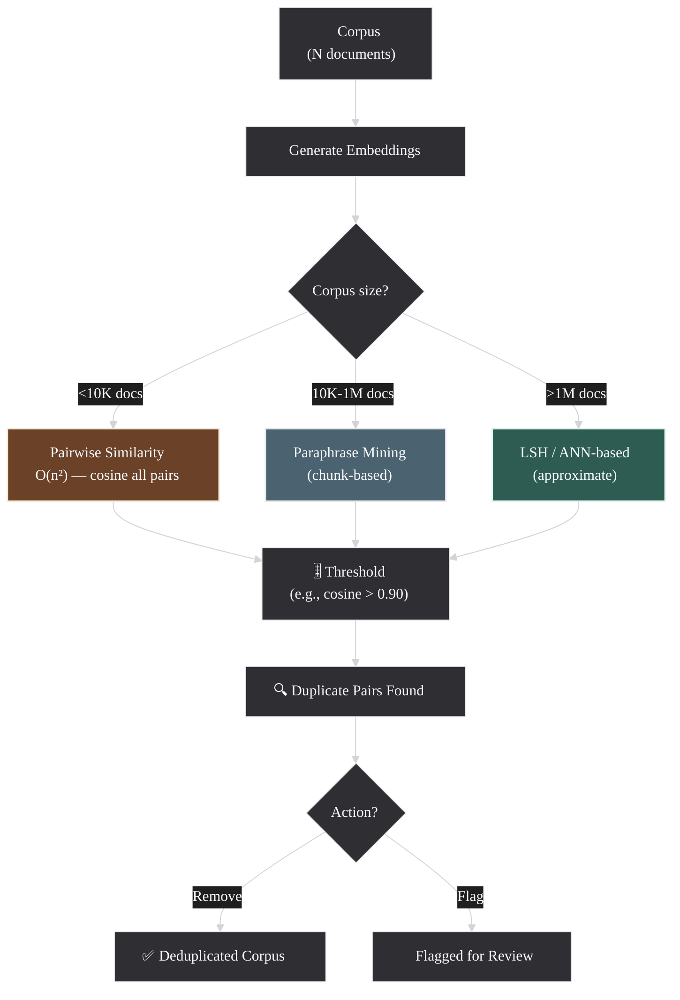

### Mã giả: Paraphrase Mining + Deduplication

```text
texts = load_corpus()
vectors = embed(texts)

# Step 1: find highly similar candidate pairs
candidate_pairs = paraphrase_mining(
    texts=texts,
    vectors=vectors
)

# Step 2: keep only pairs above the chosen threshold
near_duplicate_pairs = filter_by_similarity(
    candidate_pairs,
    threshold=0.70
)

# Step 3: group connected pairs into duplicate clusters
duplicate_groups = build_duplicate_groups(near_duplicate_pairs)

# Step 4: decide what to keep
canonical_texts = choose_canonical_version(
    duplicate_groups,
    policy="keep the earliest or highest-quality version"
)

# Step 5: review or remove
flag_groups_for_review(duplicate_groups)
write_deduplicated_corpus(canonical_texts)
```

> Source: [SBERT — Paraphrase Mining](https://www.sbert.net/examples/sentence_transformer/applications/paraphrase-mining/README.html)

Nếu `2.5`, `2.6` và `2.7` chủ yếu xoay quanh text embeddings, thì `2.8` mở rộng cùng các nguyên lý đó sang nhiều modality khác nhau. Câu hỏi không còn là "hai đoạn text có gần nhau không?" mà là "một query text có tìm đúng image, video hay PDF liên quan hay không?".

---

## 2.8 Multimodal Embedding

Cho tới đây, phần lớn ví dụ vẫn xoay quanh text. Mục này mở rộng cùng các nguyên lý đó sang nhiều modality hơn như image, video, audio và PDF, để trả lời bốn câu hỏi quan trọng: khi nào multimodal thật sự cần, các pattern retrieval phổ biến là gì, nên index theo đơn vị nào, và những failure modes nào thường xuất hiện khi đưa multimodal retrieval vào hệ thống thật.

### Từ text-only sang nhiều modality

Multimodal embedding mở rộng ý tưởng của embedding từ một loại dữ liệu sang **nhiều modality cùng lúc**: text, image, audio, video, PDF. Khi mọi modality này được đặt vào **cùng một không gian vector**, hệ thống có thể làm những việc mà text-only embeddings không làm được, như tìm ảnh bằng câu mô tả, tìm video bằng transcript, hay nối một đoạn PDF với ảnh liên quan.

Điểm quan trọng ở đây không chỉ là "hỗ trợ nhiều loại input", mà là **hỗ trợ nhiều loại input trong một hệ biểu diễn chung**. Chính điều đó tạo ra cross-modal retrieval: query ở một modality, kết quả ở modality khác.

### Khi nào Multimodal Embedding thực sự cần thiết?

Không phải cứ có hình ảnh hay video là bắt buộc phải dùng multimodal embedding. Nó đặc biệt hữu ích khi:

- người dùng có thể query bằng text nhưng kết quả lại là image, video, audio hoặc PDF
- nội dung ý nghĩa nằm ở nhiều modality cùng lúc, ví dụ product title + product image
- hệ thống cần so sánh chéo giữa các modality thay vì chỉ xử lý từng modality riêng rẽ

Ngược lại, nếu image chỉ đóng vai trò minh họa còn toàn bộ logic tìm kiếm vẫn nằm ở text, text-only embeddings đôi khi đã đủ và đơn giản hơn nhiều để vận hành.

Phần này đi từ CLIP, qua Vertex multimodalembedding, đến Gemini Embedding 2 để thấy rõ cách các hệ thống multimodal phát triển: từ text-image dual-encoder sang các mô hình hợp nhất nhiều modality hơn.

### Các Pattern Retrieval phổ biến trong Multimodal

Khi nói "multimodal retrieval", thực ra có nhiều hướng truy xuất khác nhau:

- **Text -> Image**: gõ mô tả để tìm ảnh
- **Image -> Text**: đưa ảnh vào để tìm caption, sản phẩm, hoặc tài liệu mô tả
- **Text -> PDF / Video / Audio**: dùng query text để tìm nội dung ở modality khác
- **Mixed input -> Mixed output**: query gồm nhiều phần, ví dụ text + image mẫu, rồi trả về kết quả nhiều loại

Mỗi pattern có đặc điểm riêng. `Text -> Image` thường trực quan và dễ demo nhất. Nhưng trong production, những bài toán như `Text -> PDF` hay `Text -> mixed media` mới là nơi multimodal embeddings tạo ra nhiều giá trị cho knowledge systems.

### Chọn đơn vị Index cho Multimodal

Giống text retrieval, multimodal retrieval cũng cần quyết định **đơn vị nào sẽ được index**.

- với ảnh đơn lẻ, đơn vị index có thể là **mỗi ảnh**
- với PDF, đơn vị index có thể là **mỗi trang**, **mỗi section**, hoặc **một cụm trang**
- với video, đơn vị index thường không phải cả video mà là **clip** hoặc **frame segments**
- với sản phẩm, nhiều hệ thống index **gói hợp nhất** gồm `title + description + image` thay vì index từng phần riêng rẽ

Chọn đơn vị index sai dễ làm retrieval kém đi rất nhanh. Index quá lớn làm biểu diễn bị loãng; index quá nhỏ lại mất ngữ cảnh.

### 2.8.1 CLIP (OpenAI) — Đặt text và image vào cùng một không gian

**CLIP** (Contrastive Language-Image Pre-training) — model đầu tiên thành công lớn trong multimodal embedding:

**Kiến trúc:**

```mermaid
%%{init: {'theme':'base','themeVariables':{'background':'#1f1f1f','primaryColor':'#2f2f33','primaryTextColor':'#f8fafc','primaryBorderColor':'#e5e7eb','secondaryColor':'#4b6270','secondaryTextColor':'#f8fafc','secondaryBorderColor':'#e5e7eb','tertiaryColor':'#6b4128','tertiaryTextColor':'#f8fafc','tertiaryBorderColor':'#f3e8d8','lineColor':'#d4d4d8','textColor':'#f8fafc','mainBkg':'#2f2f33','clusterBkg':'#26272b','clusterBorder':'#d4d4d8','edgeLabelBackground':'#1f1f1f','nodeTextColor':'#f8fafc','fontFamily':'Inter, Segoe UI, sans-serif','fontSize':'16px'}}}%%
flowchart TB
    subgraph training["🎓 Training: Contrastive Learning (400M pairs)"]
        direction LR
        IMG["🖼️ Image"] --> IE["Image Encoder<br/>(ViT)"]
        TXT["📝 Text<br/>'a photo of a cat'"] --> TE["Text Encoder<br/>(Transformer)"]
        IE --> IV["Image Vector"]
        TE --> TV["Text Vector"]
        IV <-->|"maximize similarity<br/>cho matching pairs,<br/>minimize cho non-matching"| TV
    end

    subgraph usage["🚀 Usage: Zero-shot"]
        direction LR
        NEW_IMG["🖼️ New Image"] --> IE2["Image Encoder"]
        LABELS["📝 Candidate Labels<br/>'a dog' / 'a cat' / 'a car'"] --> TE2["Text Encoder"]
        IE2 --> COS["Cosine Similarity"]
        TE2 --> COS
        COS --> BEST["🏷️ Best match: 'a cat'"]
    end

    style training fill:#4b6270,stroke:#e5e7eb,color:#f8fafc,stroke-width:1.5px
    style usage fill:#2e5c53,stroke:#ddf5ea,color:#f8fafc,stroke-width:1.5px
```

**Đặc điểm:**
- Training trên **400 triệu** cặp image-text từ internet (web scraping)
- Contrastive loss: maximize similarity cho matching pairs, minimize cho non-matching
- **Zero-shot transfer**: classify image bằng text descriptions mà **không cần fine-tune**
- Mở đường cho DALL-E, Stable Diffusion (dùng CLIP text encoder)

**Use cases:**
- **Image search by text**: "sunset over ocean" → tìm ảnh hoàng hôn
- **Image classification zero-shot**: gán label cho ảnh mới mà không cần training data
- **Content filtering**: kiểm tra image content khớp text description không

> Source: [CLIP paper — Radford et al., 2021](https://arxiv.org/abs/2103.00020)

Sau CLIP, câu hỏi tự nhiên là liệu cùng ý tưởng đó có thể mở rộng ra ngoài cặp `text + image` hay không. Những hệ thống đời sau bắt đầu hỗ trợ thêm video và những input phức tạp hơn, nhưng vẫn còn nhiều giới hạn về context và cách kết hợp modality.

### 2.8.2 Vertex AI multimodalembedding@001 (Legacy) — Mở rộng thêm modality nhưng còn giới hạn

| Feature | Spec |
|---------|------|
| **Modalities** | Text + Image + Video |
| **Dimensions** | 1408 (default); giảm được 128/256/512 |
| **Text limit** | Ngắn (captions, queries) |
| **Video** | Hỗ trợ video segments |
| **Status** | Legacy — xem xét migrate sang Gemini Embedding 2 |

**Giới hạn quan trọng**: text input ngắn trong mode text+image — không phù hợp cho long documents. Chỉ phù hợp cho short captions, product titles, brief descriptions.

**Use cases**: e-commerce image search ("red dress"), video retrieval, visual Q&A.

> Source: [Vertex AI — Multimodal Embeddings](https://cloud.google.com/vertex-ai/generative-ai/docs/embeddings/get-multimodal-embeddings)

Vertex cho thấy hướng mở rộng là khả thi, nhưng vẫn còn mang màu sắc của các hệ dual-encoder ghép nhiều modality lại với nhau. Bước tiếp theo là đi tới các mô hình **native multimodal**, nơi nhiều loại dữ liệu được xử lý trong một kiến trúc thống nhất hơn.

### 2.8.3 Gemini Embedding 2 (March 2026) — Hướng tới không gian hợp nhất nhiều modality

> **Lưu ý**: Model đang ở giai đoạn preview. Specs, pricing, và model name có thể thay đổi.

**Gemini Embedding 2** được giới thiệu như một mô hình embedding **natively multimodal** built trên kiến trúc Gemini. Không phải ghép nối 2 encoder riêng rẽ (như CLIP) mà embed tất cả modalities trong **cùng 1 architecture** — cho phép hiểu cross-modal relationships sâu hơn.

#### 5 Modalities được hỗ trợ

| Modality | Limit | Ghi chú |
|----------|-------|---------|
| **Text** | 8192 tokens | Long-context cho full documents |
| **Image** | Max 6 images/request | PNG, JPEG; hỗ trợ interleaved text+image |
| **Video** | Max 128 giây | MP4, MOV; codec H264/H265/AV1/VP9 |
| **Audio** | Max 80 giây | MP3, WAV |
| **PDF** | Max 6 trang | Native PDF understanding (layout, tables, figures) |

#### Specs

- **Dimensions**: default **3072**, recommended **1536 / 768** (MRL-based → truncate native)
- **Interleaved input**: gửi text + images trong cùng 1 request → **single unified embedding**
- **Architecture**: built trên Gemini → hiểu cross-modal semantics natively

#### Pricing (snapshot March 2026, preview — có thể thay đổi)

| Input Type | Price |
|-----------|-------|
| Text | **$0.20 / 1M tokens** |
| Image | **$0.00012 / image** |

#### So sánh với CLIP và Vertex multimodalembedding

| Feature | CLIP | Vertex multimodal@001 | Gemini Embedding 2 |
|---------|------|----------------------|---------------------|
| **Architecture** | Dual-encoder (separate) | Dual-encoder | Single unified model |
| **Modalities** | 2 (text, image) | 3 (text, image, video) | **5** (text, image, video, audio, PDF) |
| **Max dims** | 512/768 | 1408 | **3072** (MRL to 768) |
| **Text context** | ~77 tokens | Short | **8192 tokens** |
| **MRL support** | ❌ | ❌ | ✅ |
| **Interleaved** | ❌ | ❌ | ✅ |
| **Provider** | OpenAI (open-source) | Google Cloud | Google AI |

### Chọn mô hình theo bài toán

Nhìn bảng specs thôi vẫn chưa đủ để chọn model. Về mặt hệ thống, có thể hình dung khá đơn giản:

- **CLIP** hợp khi bài toán chủ yếu là `text <-> image`, cần mô hình kinh điển, dễ nghiên cứu hoặc tự triển khai
- **Vertex multimodalembedding@001** hợp với các hệ thống Google Cloud cũ cần hỗ trợ thêm video, nhưng đã có dấu hiệu bị thay thế
- **Gemini Embedding 2** hợp khi cần nhiều modality hơn, context dài hơn, hoặc muốn embed input interleaved trong một không gian hợp nhất

#### Diagram: Cross-modal Retrieval

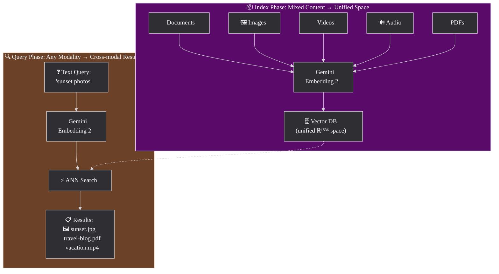

> **Cross-modal**: text query → tìm images, videos, docs, audio cùng lúc — tất cả trong cùng 1 vector space!

### Lưu ý hệ thống khi dùng Multimodal Embedding

Multimodal embedding mở ra nhiều khả năng, nhưng cũng kéo theo vài lưu ý vận hành rất quan trọng:

- **Không trộn embeddings từ model khác nhau trong cùng index**: cùng là vector cho image hay text nhưng nếu được tạo bởi hai model khác nhau, chúng không tự nhiên nằm trong cùng một không gian có thể so sánh trực tiếp
- nếu chưa thể chuyển toàn bộ hệ thống sang một **unified multimodal model**, cách làm chuyển tiếp thường là lưu vectors **riêng theo từng modality hoặc từng model**, rồi truy xuất chéo qua metadata, hoặc dùng vector database hỗ trợ **multi-vector indexing** thay vì ép mọi vector vào cùng một index để so sánh trực tiếp
- **Phải thống nhất cách index và cách query**: nếu lúc index dùng `text + image` nhưng lúc query chỉ dùng text rời rạc, chất lượng có thể thay đổi nhiều hơn mong đợi
- **Chi phí và latency phụ thuộc modality**: embedding cho image, video, audio hay PDF thường đắt và nặng hơn text-only
- **Evaluation phải đúng với hướng truy xuất thực tế**: `text -> image`, `image -> text`, `text -> PDF` hay `audio -> text` là các bài toán khác nhau, không nên gộp vào một chỉ số chung duy nhất
- **Dữ liệu nguồn quan trọng hơn bao giờ hết**: caption sai, OCR lỗi, hình mờ, hoặc PDF layout phức tạp đều có thể làm embedding giảm chất lượng đáng kể

### Failure Modes thường gặp

Multimodal retrieval rất dễ cho demo đẹp, nhưng cũng có nhiều failure modes đặc trưng:

- **OCR yếu**: ảnh hoặc PDF có text nhỏ, mờ, lệch layout → model bỏ sót tín hiệu quan trọng
- **Visual bias**: ảnh rất đẹp hoặc rất nổi bật về màu sắc nhưng không đúng nội dung query
- **Sai đơn vị thời gian trong video**: index cả video dài khiến query chỉ khớp một đoạn nhỏ nhưng vẫn bị loãng
- **Table / chart mismatch**: biểu đồ và bảng trong PDF có thể chứa đúng dữ kiện, nhưng model hiểu kém hơn plain text
- **Modality dominance**: khi index `text + image`, một modality có thể lấn át modality còn lại nếu dữ liệu không cân bằng

Những lỗi này là lý do multimodal systems cần được đánh giá bằng bộ query thực tế, thay vì chỉ dựa vào vài ví dụ demo ấn tượng.

### Evaluation cho Cross-modal Retrieval

Evaluation trong multimodal nên bám sát đúng hướng truy xuất mà sản phẩm thật sẽ dùng:

| Bài toán | Nên đo gì |
|---------|-----------|
| **Text -> Image** | Recall@K, nDCG@K, human relevance review |
| **Image -> Text** | Caption/document relevance, MRR, top-K usefulness |
| **Text -> PDF / Video** | Evidence coverage, answerability, page/segment hit rate |
| **Mixed-media search** | Diversity theo modality, usefulness của top results |

Ngoài metrics offline, human evaluation thường quan trọng hơn trong multimodal vì nhiều lỗi khó thấy nếu chỉ nhìn similarity score. Một hệ thống có thể trả về ảnh "trông gần đúng", nhưng lại sai chi tiết mà người dùng thật rất quan tâm.

### Mã giả: Multimodal Embedding và Cross-modal Search

```text
# Step 1: build a unified multimodal index
items = [
    {"type": "image", "content": image_file_1},
    {"type": "pdf", "content": pdf_file_1},
    {"type": "video", "content": video_file_1}
]

item_vectors = multimodal_embed(
    items,
    model="multimodal-embedding-model",
    dimensions=768
)
store_in_vector_index(items, item_vectors)

# Step 2: embed a text query
query = {"type": "text", "content": "sunset over the ocean"}
query_vector = multimodal_embed(
    [query],
    model="multimodal-embedding-model",
    dimensions=768
)

# Step 3: search across all indexed modalities
results = vector_search(
    query_vector=query_vector,
    top_k=5
)

# Step 4: return mixed-modality results
show(results)
```

> Sources: [Gemini Embedding 2 Blog](https://blog.google/innovation-and-ai/models-and-research/gemini-models/gemini-embedding-2/), [Gemini API Pricing](https://ai.google.dev/gemini-api/docs/pricing)

# Phần 3 — Vận hành & Tối ưu

Nếu Phần 2 trả lời embedding được dùng vào bài toán nào, thì Phần 3 trả lời câu hỏi khó hơn: khi đã muốn đưa vào hệ thống thật, nên chọn model nào, lưu vectors ở đâu, chunk tài liệu ra sao, và cân bằng chất lượng với latency, storage, cost như thế nào. Phần này vì vậy không chỉ là tập hợp specs; nó là lớp ra quyết định vận hành.

## 3.1 Embedding Models Comparison

Chọn embedding model là một bài toán tối ưu nhiều chiều. Bảng benchmark chỉ là một phần rất nhỏ của câu chuyện; trong production, chất lượng thực trên domain của bạn, context length, số chiều vector, cost, compliance và việc có cần multimodal hay không thường quan trọng hơn vị trí trên leaderboard.

### Những câu hỏi cần khóa trước khi so model

Trước khi nhìn bảng specs, nên khóa trước vài câu hỏi nền:

1. **Task chính là gì?** Search, RAG, clustering, classification hay multimodal retrieval có nhu cầu rất khác nhau.
2. **Ngôn ngữ mục tiêu là gì?** Benchmark tiếng Anh thường không phản ánh đúng chất lượng cho tiếng Việt hoặc domain-specific jargon.
3. **Corpus dài đến đâu?** Model context ngắn sẽ buộc hệ thống chunk mạnh hơn.
4. **Bạn đang tối ưu cái gì?** Chất lượng tốt nhất, chi phí thấp nhất, hay khả năng self-hosted?
5. **Scale bao nhiêu vectors?** Số chiều của model ảnh hưởng trực tiếp đến storage, RAM và latency.

### Bảng 1 — Specs

| Model | Provider | Dims | Context | Multimodal | MRL | Languages |
|-------|----------|------|---------|------------|-----|-----------|
| **text-embedding-3-large** | OpenAI | 3072 (shortable) | 8191 tokens | ❌ | ✅ | Multi |
| **text-embedding-3-small** | OpenAI | 1536 (shortable) | 8191 tokens | ❌ | ✅ | Multi |
| **embed-v4.0** | Cohere | 256-1536 | 128k tokens | ✅ (text+image+PDF) | ✅ | 100+ |
| **embed-v3.0** | Cohere | 384/1024 | 512 tokens | ❌ | ❌ | Multi |
| **gemini-embedding-001** | Google | max 3072 | 2048 tokens | ❌ | ✅ | Multi |
| **Gemini Embedding 2** | Google | 3072 (rec. 1536/768) | 8192 tokens | ✅ (5 modalities) | ✅ | Multi |
| **multimodalembedding@001** | Google (Legacy) | 1408 | Short | ✅ (text+img+video) | ❌ | Multi |
| **jina-embeddings-v3** | Jina AI | 1024 (MRL→32) | 8192 tokens | ❌ | ✅ | Multi |
| **all-MiniLM-L6-v2** | Sentence-Transformers | 384 | 256 tokens | ❌ | ❌ | English |
| **all-mpnet-base-v2** | Sentence-Transformers | 768 | 384 tokens | ❌ | ❌ | English |
| **voyage-3** | Voyage AI | 1024 | 32k tokens | ❌ | ❌ | Multi |
| **voyage-3-lite** | Voyage AI | 512 | 32k tokens | ❌ | ❌ | Multi |

> Sources: [OpenAI](https://openai.com/index/new-embedding-models-and-api-updates/), [Cohere embed-v4](https://docs.cohere.com/changelog/embed-multimodal-v4), [Cohere embed-v3](https://docs.cohere.com/docs/cohere-embed), [Gemini Embedding 2](https://blog.google/innovation-and-ai/models-and-research/gemini-models/gemini-embedding-2/), [gemini-embedding-001 docs](https://ai.google.dev/gemini-api/docs/embeddings), [Jina v3 paper](https://arxiv.org/pdf/2409.10173), [SBERT models](https://www.sbert.net/docs/sentence_transformer/pretrained_models.html), [Voyage AI models](https://docs.voyageai.com/docs/embeddings)

### Chọn model nào?

Sơ đồ dưới đây chỉ nên được đọc như một điểm bắt đầu nhanh. Quyết định cuối cùng vẫn nên quay về ba trục chính: chất lượng trên dữ liệu thật, tổng chi phí hệ thống, và các ràng buộc vận hành như compliance hoặc self-hosting.

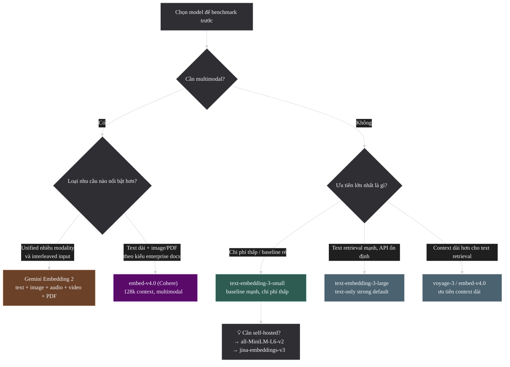

### Heuristics vận hành nhanh

- **`text-embedding-3-small`**: hợp khi ngân sách rất nhạy cảm, cần baseline mạnh, và corpus không quá khó.
- **`text-embedding-3-large`**: hợp khi cần chất lượng text retrieval tốt, API ổn định, và không cần multimodal.
- **`embed-v4.0`**: đáng cân nhắc khi context dài và multimodal là nhu cầu thực, không phải chỉ để thử nghiệm.
- **`Gemini Embedding 2`**: đáng giá khi bài toán thực sự là cross-modal hoặc cần unified embedding cho nhiều loại dữ liệu.
- **Open-source nhỏ như `all-MiniLM-L6-v2`**: hợp khi cần self-hosted, prototyping nhanh, hoặc workload nội bộ chấp nhận đánh đổi chất lượng.

### Snapshot 2024-2026: Những model nổi bật nên nhớ

Nếu bỏ qua chi tiết benchmark và chỉ giữ lại vài mốc quan trọng của giai đoạn `2024-2026`, thị trường embedding hiện tại có thể được nhìn như sau:

- **`text-embedding-3-large`**: mốc tham chiếu phổ biến nhất cho text-only retrieval nhờ ecosystem rộng, API ổn định và MRL native.
- **`embed-v4.0`**: lựa chọn đáng chú ý khi cần long-context hoặc multimodal theo hướng enterprise documents như text, image, PDF.
- **`Gemini Embedding 2`**: đại diện cho xu hướng unified multimodal embedding, nơi text, image, audio, video và PDF cùng đi vào một không gian vector.
- **`voyage-3` / họ Voyage**: phù hợp khi ưu tiên retrieval quality cao và sẵn sàng đánh đổi bằng ecosystem nhỏ hơn các nhà cung cấp lớn.
- **`Qwen3-Embedding-8B`**: điểm neo quan trọng ở phía open-source, đặc biệt khi cần multilingual mạnh và muốn self-hosted.
- **`jina-embeddings-v3`**: hợp với bài toán self-hosted gọn nhẹ hơn, cần MRL linh hoạt và chấp nhận benchmark không ở nhóm đầu bảng.

Điểm quan trọng là không nên đọc danh sách này như một bảng xếp hạng tuyệt đối. Nó hữu ích hơn nếu được xem như bản đồ nhanh: model nào đại diện cho xu hướng nào, và bài toán nào khiến model đó đáng để benchmark trước.

### Bảng 2 — Quality (MTEB Benchmarks)

| Model | MTEB Avg | Source Type | Date | Source Link |
|-------|----------|------------|------|-------------|
| text-embedding-3-large | 64.6 | vendor-reported | Jan 2024 | [OpenAI blog](https://openai.com/index/new-embedding-models-and-api-updates/) |
| voyage-large-2-instruct | 68.28 | vendor-reported | May 2024 | [Voyage AI blog](https://blog.voyageai.com/2024/05/05/voyage-large-2-instruct/) |
| jina-embeddings-v3 | 65.52 (English) | paper-reported | Sep 2024 | [Jina v3 paper](https://arxiv.org/pdf/2409.10173) |
| Cohere embed-v3 | N/A (xem note) | vendor-reported | 2023 | [Cohere blog](https://cohere.com/blog/introducing-embed-v3) |

> **Note (Cohere embed-v3)**: Cohere không công bố single MTEB average number; họ report individual tasks trên MTEB và BEIR. Xem link nguồn để xem breakdown chi tiết.

> ⚠️ **Benchmark Comparability Warning**:
>
> Vendor-reported benchmarks **không** "apple-to-apple":
> - Khác dataset subset, evaluation protocol, thời điểm chạy
> - Self-reported → có thể cherry-pick kết quả tốt nhất
> - MTEB leaderboard thay đổi thường xuyên
>
> **Best practice**: Luôn ghi rõ **source type** (vendor-reported / independent / paper-reported) + **snapshot date**. Cần **benchmark riêng** cho ngôn ngữ mục tiêu (ví dụ: tiếng Việt không có trên MTEB tiêu chuẩn).
>
> Sources: [MTEB paper — Muennighoff et al., 2022](https://arxiv.org/abs/2210.07316), [Jina v3 paper](https://arxiv.org/pdf/2409.10173), [HuggingFace MTEB Blog](https://huggingface.co/blog/mteb)

### Bảng 3 — Pricing (Snapshot: March 2026)

| Model | Native Unit | Native Price | ~USD/1M tokens | Ghi chú |
|-------|-------------|-------------|----------------|---------|
| text-embedding-3-large | tokens | $0.13/1M tokens | **$0.13** | |
| text-embedding-3-small | tokens | $0.02/1M tokens | **$0.02** | Rẻ nhất |
| Gemini Embedding 2 (text) | tokens | $0.20/1M tokens | **$0.20** | Preview pricing |
| Gemini Embedding 2 (image) | per image | $0.00012/image | N/A | Tính theo ảnh |
| embed-v4.0 | tokens | TBD | TBD | Giá chưa công bố chính thức |
| embed-v3.0 | tokens | Xem [Cohere pricing](https://cohere.com/pricing) | N/A | Không dùng estimate |
| voyage-3 | tokens | Xem [Voyage pricing](https://www.voyageai.com/pricing) | N/A | Không dùng estimate |
| all-MiniLM-L6-v2 | — | **Free** (open-source) | $0 | Self-hosted, cần compute |
| jina-embeddings-v3 | — | **Free** (open-source) / API | $0 or API pricing | Self-hosted hoặc API |

> **Conversion note**: Ước tính 1 character ≈ 0.25 token (trung bình cho tiếng Anh). Tiếng Việt có thể cao hơn do tokenization. Luôn test thực tế với `tiktoken` hoặc API response `usage.total_tokens`.
>
> Sources: [OpenAI Pricing](https://openai.com/index/new-embedding-models-and-api-updates/), [Gemini Pricing](https://ai.google.dev/gemini-api/docs/pricing), [Vertex Pricing](https://cloud.google.com/vertex-ai/generative-ai/pricing)

### Dimensions, Storage và Latency

Một model có chất lượng tốt hơn nhưng vector dài hơn sẽ tạo áp lực rất thật lên hạ tầng. Công thức gần đúng cho raw vector storage là:

`num_vectors × dimensions × bytes_per_value`

Nếu dùng `float32`, mỗi chiều thường chiếm `4 bytes`. Điều đó có nghĩa là:

- `1 triệu` vectors `3072` chiều ≈ `12.3 GB` raw vectors
- `1 triệu` vectors `1536` chiều ≈ `6.1 GB`
- `1 triệu` vectors `768` chiều ≈ `3.1 GB`

Đó mới chỉ là phần vector thô, chưa tính metadata, index structure, replication hay caching. Vì vậy, MRL hoặc dimension truncation không chỉ là "tính năng hay", mà là đòn bẩy trực tiếp lên storage cost, RAM footprint và cả tốc độ search.

Trong nhiều hệ thống production dùng index kiểu `HNSW`, áp lực này thường được cảm nhận rất rõ ở **RAM** chứ không chỉ ở dung lượng lưu trữ trên đĩa. Nếu vectors dài và số lượng lớn, working set của index rất dễ phình to đến mức chi phối chi phí máy và thời gian warm-up. Đó là lý do `MRL`, dimension truncation và các kỹ thuật quantization như `int8` hoặc `binary` không chỉ là tối ưu phụ, mà thường là đòn bẩy vận hành trực tiếp.

### Sai lầm thường gặp khi chọn model

- Chọn theo leaderboard mà không benchmark trên dữ liệu thật
- Chọn model context rất dài nhưng corpus thực tế đã được chunk ngắn sẵn
- Chọn vector quá dài cho workload khổng lồ rồi mới phát hiện chi phí index quá cao
- Chọn multimodal model chỉ vì "nghe mạnh hơn", dù sản phẩm chủ yếu vẫn là text retrieval
- Quên rằng thay model thường kéo theo re-embed toàn bộ corpus

Nói ngắn gọn: model tốt nhất không phải model có benchmark cao nhất, mà là model cho **quality đủ tốt nhất với tổng cost chấp nhận được** trên chính hệ thống của bạn.

---

## 3.2 Vector Databases (Ma trận chọn nhanh)

Chọn vector database không chỉ là chọn chỗ để lưu vectors. Đó là quyết định về mô hình vận hành: managed hay self-hosted, có cần hybrid search/filtering không, đội ngũ có sẵn PostgreSQL hoặc SQLite hay không, và scale nào thì bắt đầu phải lo chuyện reindex, backup, shard, snapshot hay failover.

Ở mức khái quát, các lựa chọn thường rơi vào hai hướng lớn:

- **All-in-one**: vector search sống chung với stack hiện có hoặc đi kèm một platform bao trọn metadata, filtering, API và đôi khi cả ingestion. Hướng này hợp khi muốn giảm số lượng thành phần hạ tầng và tối ưu tốc độ triển khai.
- **Chuyên biệt**: dùng một vector engine được tối ưu chủ yếu cho indexing, ANN search, filtering và scale. Hướng này hợp khi vector retrieval là thành phần cốt lõi của hệ thống và cần tối ưu sâu về hiệu năng hoặc vận hành.

Ranh giới này không phải lúc nào cũng tuyệt đối. `PostgreSQL + pgvector` và `SQLite + sqlite-vec` nghiêng rõ về phía all-in-one trong stack có sẵn. `Pinecone`, `Qdrant`, `Milvus` nghiêng rõ về phía chuyên biệt. Còn `Weaviate` và `Chroma` nằm ở giữa: chúng vẫn là sản phẩm chuyên cho retrieval/AI, nhưng cố gắng đem lại trải nghiệm trọn gói hơn một engine thuần ANN.

### Những tiêu chí thật sự quyết định lựa chọn

| Tiêu chí | Câu hỏi cần trả lời | Tại sao quan trọng |
|----------|---------------------|--------------------|
| **Kiểu hệ thống** | Muốn `all-in-one` hay một engine `chuyên biệt` cho vector search? | Quyết định số lượng moving parts, cách đội ngũ vận hành, và mức tối ưu có thể đạt được |
| **Ops model** | Muốn fully managed hay tự quản lý cluster? | Ảnh hưởng trực tiếp đến thời gian vận hành và on-call burden |
| **Scale** | Dữ liệu là vài triệu, vài chục triệu hay hàng tỷ vectors? | Database phù hợp cho 5M vectors có thể không còn hợp ở 500M |
| **Filtering / Hybrid** | Có cần metadata filtering, BM25 + dense, rerank tích hợp không? | Nhiều hệ thống production mạnh ở filter và hybrid hơn là pure vector search |
| **Stack hiện có** | Đã có PostgreSQL, Kubernetes hay cloud vendor lock-in sẵn chưa? | Tận dụng hạ tầng hiện có thường rẻ và bền hơn đổi cả stack |
| **Latency / Cost** | Ưu tiên milliseconds thấp nhất hay tổng chi phí dễ chịu? | Database nhanh nhất chưa chắc là database phù hợp nhất |

### Bảng so sánh

| Hướng | Database | Best for | Key Feature | Source |
|-------|----------|----------|-------------|--------|
| **Chuyên biệt (managed)** | **Pinecone** | Dễ dùng, production-ready | Serverless, hybrid search, integrated rerank | [docs](https://docs.pinecone.io/guides/get-started/overview) |
| **Chuyên biệt (managed, edge-native)** | **Cloudflare Vectorize** | Global low-latency, Workers ecosystem, serverless edge apps | Vector DB phân tán toàn cầu, gắn chặt với Workers, R2, D1 | [docs](https://developers.cloudflare.com/vectorize/) |
| **All-in-one AI-native** | **Weaviate** | Hybrid search + GraphQL API | Semantic + keyword search, generative modules | [docs](https://docs.weaviate.io/weaviate/introduction) |
| **Chuyên biệt (self-hosted)** | **Qdrant** | Performance + advanced filtering | Rust-based, payload filtering, quantization | [docs](https://qdrant.tech/documentation/overview/) |
| **Chuyên biệt ở scale lớn** | **Milvus** | Massive scale (tỷ vectors) | GPU acceleration, HNSW/IVF/DiskANN | [docs](https://milvus.io/docs/overview.md) |
| **All-in-one trong relational stack** | **PostgreSQL + pgvector** | Giữ vector search trong relational stack có sẵn | HNSW/IVFFlat, SQL, JOIN với business data | [repo](https://github.com/pgvector/pgvector) |
| **All-in-one embedded** | **SQLite + sqlite-vec** | App local, edge, desktop, mobile, prototyping gọn nhẹ | Chạy trong SQLite, không cần server riêng | [repo](https://github.com/asg017/sqlite-vec) |
| **All-in-one local/prototyping** | **Chroma** | Rapid prototyping, local dev | AI-native, simple API, local-first | [docs](https://docs.trychroma.com/docs/overview/introduction) |

### Chi tiết từng database

#### Pinecone — Managed, Production-ready

- **Hosting**: Fully managed (serverless hoặc pod-based)
- **Hybrid search**: kết hợp sparse + dense vectors native
- **Integrated rerank**: gọi reranker trực tiếp trong query pipeline
- **Metadata filtering**: filter theo fields trước/sau vector search
- **Scale**: automatic scaling, không cần quản lý infra
- **Nhược điểm**: vendor lock-in, giá cao ở scale lớn, không self-hosted

#### Cloudflare Vectorize — Managed, edge-native

- **Hosting**: fully managed, gắn với Cloudflare Workers platform
- **Điểm mạnh thật sự**: hợp với hệ thống cần query từ edge hoặc muốn gom vector search vào cùng hệ sinh thái `Workers + R2 + D1 + Workers AI`
- **Đặc tính nổi bật**: phù hợp cho serverless applications cần global low-latency mà không muốn tự quản lý cluster vector riêng
- **Use cases điển hình**: semantic search hoặc RAG trong các ứng dụng đã ở sẵn trên Cloudflare stack
- **Nhược điểm**: phù hợp nhất khi bạn đã hoặc sẽ đi theo hệ sinh thái Cloudflare; nếu không, lợi thế tích hợp sẽ giảm đi rõ rệt

#### Weaviate — Hybrid Search Champion

- **Hosting**: self-hosted (Docker/K8s) hoặc Weaviate Cloud
- **Hybrid search**: BM25 + vector search native, có fusion methods
- **GraphQL API**: query flexible, nested objects
- **Generative modules**: tích hợp LLM generation trong query pipeline
- **Multi-tenancy**: hỗ trợ nhiều tenants trên cùng cluster
- **Nhược điểm**: GraphQL learning curve, resource-heavy hơn Qdrant

#### Qdrant — Performance King

- **Language**: Rust → performance + memory efficiency cao
- **Payload filtering**: filter phức tạp trên metadata fields (nested, geo, range...)
- **Quantization**: Scalar/Product/Binary quantization built-in
- **Snapshot & recovery**: backup/restore dễ dàng
- **Nhược điểm**: community nhỏ hơn Weaviate/Milvus, hybrid search cần cấu hình thêm

#### Milvus — Scale Monster

- **Scale**: designed cho **tỷ vectors**, production-tested ở Zilliz Cloud
- **GPU acceleration**: dùng GPU cho indexing và search
- **Indexes**: HNSW, IVF_FLAT, IVF_PQ, IVF_SQ8, DiskANN, SCANN
- **Distributed**: multi-node cluster, horizontal scaling
- **Nhược điểm**: phức tạp deploy/operate, overhead cho dataset nhỏ

#### PostgreSQL + pgvector — Relational-first, vector-capable

- **Integration**: thêm vector search vào PostgreSQL có sẵn → không cần thêm infra
- **Indexes**: HNSW (mới, nhanh hơn) và IVFFlat (legacy)
- **Metrics**: cosine, L2, inner product
- **SQL**: query vectors bằng SQL quen thuộc + JOIN với tables khác
- **Điểm mạnh thật sự**: dữ liệu quan hệ và vector ở cùng một nơi, rất hợp cho metadata filtering, ACL, audit fields, transaction và reporting
- **Nhược điểm**: performance kém hơn dedicated vector DB ở scale lớn, tuning khó

#### SQLite + sqlite-vec — Embedded, local-first

- **Integration**: chạy ngay trong SQLite → hợp với desktop apps, mobile, edge devices, offline tools hoặc local demos
- **Deployment model**: không cần service riêng, không cần cluster, không cần network hop tới DB khác
- **Điểm mạnh**: footprint nhỏ, dễ đóng gói cùng ứng dụng, phù hợp khi dataset vừa hoặc nhỏ và môi trường triển khai ưu tiên sự đơn giản
- **Use cases điển hình**: personal knowledge base local, semantic search trong app desktop, assistant chạy on-device, test harness hoặc prototyping không muốn dựng thêm hạ tầng
- **Nhược điểm**: không dành cho scale lớn hoặc multi-tenant production; filtering và vận hành phân tán không phải điểm mạnh

#### Chroma — Prototyping Đơn giản

- **API**: cực kỳ đơn giản — `collection.add()`, `collection.query()`
- **Local-first**: chạy in-process (Python) hoặc client-server
- **AI-native**: tích hợp sẵn embedding functions
- **Nhược điểm**: không phù hợp production (chưa distributed), features hạn chế

### Khi nào PostgreSQL + pgvector là đủ, khi nào nên dùng vector engine chuyên biệt?

`PostgreSQL + pgvector` rất hấp dẫn vì cho phép giữ mọi thứ trong relational stack quen thuộc. Nó đặc biệt hợp khi:

- dữ liệu chưa quá lớn
- team đã có PostgreSQL mạnh và muốn giảm số lượng moving parts
- workload cần JOIN chặt với relational data
- vector search chỉ là một phần của hệ thống, không phải lõi duy nhất

Ngược lại, vector engine chuyên biệt thường đáng giá hơn khi:

- scale tăng nhanh và index/search bắt đầu trở thành bottleneck riêng
- filtering, hybrid search, quantization hoặc snapshot/recovery trở thành nhu cầu thường xuyên
- đội ngũ sẵn sàng chấp nhận thêm một thành phần hạ tầng để đổi lấy khả năng tối ưu tốt hơn

### Khi nào SQLite + sqlite-vec là đủ?

`SQLite + sqlite-vec` hợp khi mục tiêu không phải xây một vector platform hoàn chỉnh, mà là đưa semantic search vào một ứng dụng nhỏ hoặc một môi trường local-first.

- dataset còn gọn, thường ở mức local hoặc một file ứng dụng có thể mang theo
- không muốn vận hành server database riêng
- ứng dụng chạy offline, on-device, hoặc edge là yêu cầu thật
- vector search là một tính năng tiện ích trong app, không phải backend trung tâm phục vụ nhiều tenants

Khi nhu cầu bắt đầu chuyển sang concurrent writes lớn, multi-user production, replication, scaling theo node, hoặc metadata filtering phức tạp, `sqlite-vec` thường không còn là lựa chọn phù hợp nữa.

### Managed vs Self-hosted

- **Managed** hợp khi muốn giảm tối đa gánh nặng hạ tầng, chấp nhận trả tiền cho sự đơn giản và tốc độ triển khai
- **Self-hosted** hợp khi cần kiểm soát sâu hơn về cost, compliance, residency, hoặc muốn tích hợp rất chặt với hạ tầng hiện có

Không có lựa chọn nào mặc định tốt hơn. Điểm quan trọng là ước lượng đúng **ops burden**. Nhiều team đánh giá thấp chi phí reindex, backup, nâng version, capacity planning và xử lý sự cố khi tự vận hành.

### Sai lầm thường gặp khi chọn Vector DB

- Chọn database rất mạnh cho dataset nhỏ, khiến hệ thống phức tạp hơn mức cần thiết
- Chọn engine chuyên biệt quá sớm dù bài toán thực tế chỉ cần một giải pháp all-in-one trong stack có sẵn
- Chỉ so benchmark ANN mà quên nhu cầu filtering và hybrid search
- Đánh giá thấp chi phí reindex khi đổi embedding model hoặc đổi dimension
- Không phân biệt rõ `PostgreSQL` với `pgvector`: PostgreSQL là hệ quản trị quan hệ, còn vector search đến từ extension `pgvector`
- Bỏ qua `SQLite + sqlite-vec` ở các bài toán embedded/local-first rồi vô tình dựng một hạ tầng quá nặng
- Chọn self-hosted chỉ vì "rẻ hơn", nhưng không tính công vận hành và thời gian của đội ngũ
- Chọn managed quá sớm ở scale lớn mà không dự tính vendor lock-in hoặc storage cost dài hạn

### Decision Tree

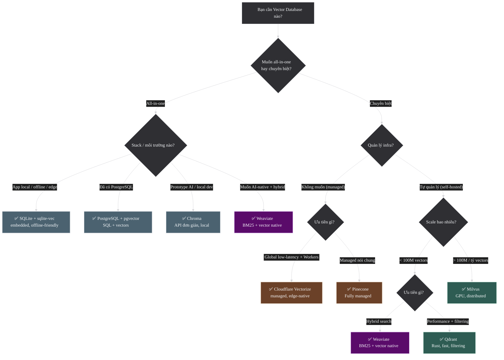

Sơ đồ trên hữu ích để rút gọn lựa chọn ban đầu. Nhưng trong production, quyết định cuối cùng gần như luôn phải quay lại ba câu hỏi: ai sẽ vận hành nó, scale thật trong 6-12 tháng tới là bao nhiêu, và hybrid/filtering có phải nhu cầu cốt lõi hay không.

---

## 3.3 Chunking Strategies

Chunking là một trong những quyết định có ảnh hưởng lớn nhất đến chất lượng retrieval, nhưng cũng là quyết định dễ bị xem nhẹ nhất. Cùng một embedding model, cùng một vector database, chỉ cần đổi cách cắt tài liệu là recall và answer quality có thể thay đổi rất rõ.

### Tại sao cần Chunking?

Embedding models có **giới hạn context length** (256-8192 tokens). Documents dài hơn phải được chia nhỏ thành **chunks** trước khi embed. Cách chunk ảnh hưởng trực tiếp đến chất lượng retrieval:
- Chunk quá nhỏ → mất context, thiếu thông tin
- Chunk quá lớn → embedding bị "pha loãng" (diluted), không capture specific info
- Chunk cắt giữa câu/ý → mất coherence

Vì vậy, chunking không chỉ là bước tiền xử lý kỹ thuật. Nó là cách bạn quyết định **đơn vị kiến thức** nào sẽ được retrieve ở runtime.

### Khi nào không cần Chunking?

Không phải lúc nào cũng nên cắt nhỏ tài liệu. Trong một số trường hợp, index theo **document** hoặc **item hoàn chỉnh** lại đúng hơn:

- tài liệu vốn đã ngắn và nằm gọn trong context của model
- mỗi record tự nó đã là một đơn vị tri thức hoàn chỉnh, như FAQ entry, product item, support ticket ngắn
- bài toán cần document-level similarity hoặc classification hơn là passage retrieval
- việc chia nhỏ làm mất cấu trúc tự nhiên của dữ liệu mà không mang lại thêm precision đáng kể

Điểm quan trọng là chỉ chunk khi bài toán thật sự cần retrieve ở mức đoạn nhỏ hơn document. Nếu câu trả lời thường nằm trong đúng một mục hoàn chỉnh, chunking quá tay chỉ làm index phình to và pipeline phức tạp hơn.

### Chọn đơn vị chunk trước khi chọn kích thước

Trước khi hỏi "chunk bao nhiêu tokens", nên hỏi trước "một chunk nên tương ứng với phần kiến thức nào?".

- với FAQ hoặc catalog items, một chunk có thể chính là **một mục hoàn chỉnh**
- với docs kỹ thuật, chunk thường nên bám theo **section** hoặc **subsection**
- với hợp đồng, báo cáo, PDF dài, chunk có thể cần đi theo **page + heading + đoạn liên quan**

Nếu chọn sai đơn vị ngay từ đầu, việc tinh chỉnh `256` hay `512` tokens sau đó thường không cứu được nhiều.

### Chunking theo loại dữ liệu

| Loại dữ liệu | Đơn vị retrieve thường hợp lý | Gợi ý thực tế |
|--------------|-------------------------------|---------------|
| **FAQ / catalog / knowledge base ngắn** | Mỗi item hoàn chỉnh | Thường không cần cắt nhỏ hơn item; giữ title, id, tags đi kèm |
| **Docs kỹ thuật / manuals / wiki** | Section hoặc subsection | Giữ heading, đoạn giải thích và ví dụ gần nhau trong cùng chunk nếu có thể |
| **Source code** | Function, class hoặc module nhỏ | Tránh cắt giữa function signature, docstring và implementation; giữ path + symbol name trong metadata |
| **Meeting transcript / chat / call log** | Cửa sổ theo lượt nói | Giữ speaker, timestamp và một ít ngữ cảnh trước đó để tránh mất mạch hội thoại |
| **PDF scan / báo cáo / hợp đồng** | Page + heading + đoạn liên quan | Đừng tách bảng, caption và phần diễn giải quá xa nhau; OCR kém thường cần overlap cao hơn |
| **Table-heavy documents** | Một bảng kèm caption và đoạn giải thích xung quanh | Nếu chỉ embed ô dữ liệu rời rạc, retrieval thường đúng từ khóa nhưng sai ý nghĩa |

### Bảng so sánh Strategies

| Strategy | Mô tả | Khi nào dùng | Ưu/Nhược |
|----------|--------|-------------|----------|
| **Fixed-size** | ~512 tokens + 20-25% overlap | Baseline, simple setup, corpus đa dạng format | ✅ Đơn giản, predictable size; ❌ Cắt giữa câu/ý |
| **Sentence-boundary** | Chunk tại câu hoàn chỉnh (không cắt giữa câu) | Text dạng prose (bài viết, email) | ✅ Tự nhiên, giữ coherence; ❌ Chunk size không đều |
| **Semantic** | Chunk theo ranh giới ngữ nghĩa (topic shift detection) | Cải thiện retrieval quality khi cần | ✅ Recall thường tốt hơn fixed-size; ❌ Phức tạp, cần model thêm |
| **Recursive / Hierarchical** | Theo cấu trúc document (heading → section → paragraph) | Tài liệu có heading/section rõ ràng (docs, wiki) | ✅ Giữ cấu trúc logic; ❌ Phụ thuộc format |
| **Agentic / Late chunking** | Model đọc full document trước, rồi quyết định chunk boundaries | Research/emerging (2024-2026) | ✅ Tối ưu nhất về lý thuyết; ❌ Chậm, đắt |

### Diagram: Chunking Comparison

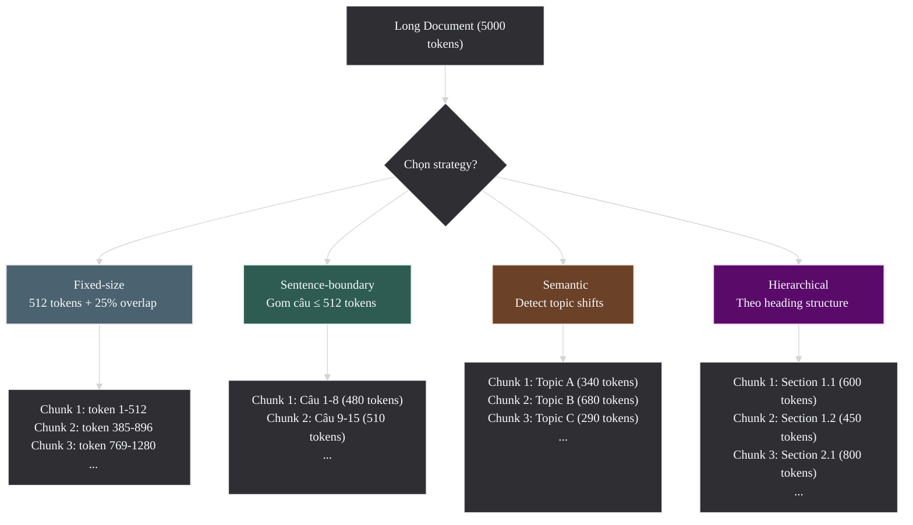

### Khi nào chọn strategy nào?

- **Fixed-size**: tốt để có baseline nhanh, nhất là khi dữ liệu lộn xộn hoặc format không đồng nhất
- **Sentence-boundary**: hợp khi dữ liệu chủ yếu là prose và bạn muốn tránh cắt cụt ý giữa câu
- **Hierarchical**: thường mạnh với docs, wiki, manuals, policy documents vì giữ cấu trúc logic
- **Semantic chunking**: đáng thử khi retrieval chất lượng cao là ưu tiên lớn hơn độ đơn giản triển khai
- **Agentic / late chunking**: nên xem như hướng nghiên cứu hoặc tối ưu nâng cao, chưa phải lựa chọn mặc định

### Parent-child Retrieval: retrieve nhỏ, trả về ngữ cảnh lớn hơn

Một pattern rất thực dụng trong RAG là **index các child chunks nhỏ để tăng precision**, nhưng khi đưa context cho model thì **nâng lên parent section hoặc parent document fragment** để đủ ngữ cảnh.

Ví dụ:

- child chunk dùng để search: `150-300 tokens`
- parent chunk dùng để assemble context: `800-1500 tokens` hoặc cả subsection

Cách này hữu ích vì:

- chunk nhỏ dễ match đúng câu hỏi hơn
- ngữ cảnh lớn hơn giúp model không trả lời dựa trên một câu bị cắt rời
- citation và answer synthesis thường ổn định hơn so với việc chỉ ném nhiều mảnh rất nhỏ vào prompt

Nếu chỉ index ở mức parent lớn, retrieval dễ bị pha loãng. Nếu chỉ giữ child chunks rất nhỏ, hệ thống lại dễ retrieve đúng mảnh thông tin nhưng thiếu bối cảnh để trả lời trọn vẹn.

### Chunking ảnh hưởng thế nào tới storage, latency và cost?

Chunking không chỉ ảnh hưởng chất lượng retrieval. Nó còn quyết định trực tiếp số lượng vectors phải lưu và số tokens phải xử lý ở các bước sau.

Một công thức gần đúng là:

`num_chunks ≈ total_tokens / (chunk_size - overlap)`

Ví dụ một tài liệu `5000 tokens`:

- chunk `500` với overlap `100` → stride `400` → khoảng `13` chunks
- chunk `250` với overlap `50` → stride `200` → khoảng `25` chunks

Chỉ riêng việc giảm chunk size từ `500` xuống `250` trong ví dụ này đã gần như **nhân đôi số vectors**, và kéo theo:

- storage tăng
- thời gian indexing và re-embedding tăng
- ANN index lớn hơn
- số candidates phải rerank có xu hướng tăng
- prompt assembly dễ trùng lặp hơn nếu top results là nhiều đoạn gần nhau

Ngược lại, chunk quá lớn có thể làm giảm số vector nhưng lại khiến mỗi chunk mang quá nhiều thông tin thừa, dẫn đến retrieval kém chính xác và mỗi chunk nhét vào prompt cũng tốn token hơn. Vì vậy, chunking luôn là bài toán tối ưu đồng thời **quality, latency, storage và cost**.

### Best Practices

1. **Chunk size sweet spot**: **256-512 tokens** là baseline tốt cho nhiều use cases dạng prose. Với code, bảng hoặc transcripts, điều quan trọng hơn là bám đúng đơn vị logic chứ không phải ép mọi thứ về cùng một số tokens.

2. **Overlap nên theo loại dữ liệu**: `10-15%` thường đủ khi biên chunk đã sạch theo section hoặc sentence; `20-25%` hợp hơn với prose dài, OCR noisy hoặc transcript. Overlap quá `30%` thường làm chi phí tăng nhanh hơn lợi ích.

3. **Metadata preservation**: giữ metadata cùng mỗi chunk — rất quan trọng cho attribution, filtering và parent-child retrieval:
   ```text
   chunk = {
       "text": "...",
       "metadata": {
           "doc_id": "report-2025",
           "chunk_id": "report-2025#chunk-03",
           "source": "annual-report-2025.pdf",
           "page": 15,
           "section": "Financial Results",
           "parent_section": "Q4 Results",
           "chunk_index": 3,
           "updated_at": "2026-03-01"
       }
   }
   ```

4. **Context enrichment**: prepend section heading/title vào chunk content để giúp embedding hiểu context:
   ```text
   # Trước:
   "Revenue grew 15% year-over-year..."

   # Sau (enriched):
   "Financial Results — Q4 2025: Revenue grew 15% year-over-year..."
   ```

5. **Benchmark trên domain data**: không có "one size fits all" — test chunk strategy trên data thực tế với eval metrics như `Recall@K`, `nDCG@K`, và nếu đang làm RAG thì đo cả answer quality hoặc citation quality.

### Failure Modes thường gặp

- **Chunk quá nhỏ**: retrieve được nhiều đoạn "có vẻ gần" nhưng đoạn nào cũng thiếu ý chính để answer
- **Chunk quá lớn**: relevant information bị chìm trong phần không liên quan
- **Overlap quá ít**: mất ý ở biên đoạn, đặc biệt với answer nằm giữa hai chunks
- **Overlap quá nhiều**: index phình to, top results lặp lại nhiều đoạn gần giống nhau
- **Bỏ mất cấu trúc document**: section title hoặc page context biến mất, khiến retrieval đúng nội dung nhưng khó trích dẫn
- **Chia sai đơn vị logic**: function bị cắt đôi, bảng bị tách khỏi caption, transcript mất speaker turns
- **Retrieve đúng child chunk nhưng answer vẫn yếu**: hệ thống tìm được đoạn nhỏ liên quan nhưng không kéo parent context vào đủ để model tổng hợp câu trả lời

### Quy trình benchmark chunking nên làm như thế nào?

Một workflow thực tế thường đơn giản hơn nhiều so với những gì bài báo mô tả:

1. bắt đầu bằng `fixed-size 256-512 tokens` với overlap `20-25%`
2. đo `Recall@K` hoặc `nDCG@K` trên một tập query thật, không chỉ trên ví dụ đẹp
3. nếu đang làm RAG, đo thêm answer quality, citation quality hoặc tỷ lệ phải fallback sang "không đủ bằng chứng"
4. nếu dữ liệu có cấu trúc rõ, thử `hierarchical`, `sentence-boundary`, hoặc `parent-child retrieval`
5. chỉ thử `semantic chunking` khi baseline đã rõ và chất lượng retrieval vẫn là bottleneck lớn

Mục tiêu không phải tìm "chunking tối ưu tuyệt đối", mà là tìm cấu hình cho chất lượng đủ tốt với index size, latency và chi phí chấp nhận được.

> Sources: [Pinecone — Chunking Strategies](https://www.pinecone.io/learn/chunking-strategies/), [Azure — Chunk Documents for Vector Search](https://learn.microsoft.com/en-us/azure/search/vector-search-how-to-chunk-documents)

## 3.4 Dimension Reduction & Quantization

Nếu `3.1` là bài toán chọn model, `3.2` là chọn nơi lưu vectors, và `3.3` là chọn đơn vị kiến thức để retrieve, thì phần còn lại của Phần 3 đi vào các đòn bẩy tối ưu cuối cùng: giảm chiều, nén vectors, kết hợp sparse với dense, và thiết kế evaluation để biết thay đổi nào thật sự làm hệ thống tốt hơn. Đây là nơi những quyết định có vẻ nhỏ bắt đầu tác động trực tiếp đến RAM, latency, chi phí và chất lượng production.

### Ưu tiên giảm chiều native khi model hỗ trợ MRL

Nếu model hỗ trợ `MRL` (Matryoshka Representation Learning), ưu tiên dùng chính khả năng giảm chiều native của model thay vì giảm chiều sau khi embedding đã được tạo ra.

- OpenAI: `dimensions` parameter
- Cohere embed-v4: `output_dimension` parameter
- Google Gemini: `output_dimensionality` trong config

| Model | MRL Support | Cách dùng | Min Dims |
|-------|-------------|-----------|----------|
| text-embedding-3-large | ✅ | `dimensions=1536` trong API call | 256 |
| text-embedding-3-small | ✅ | `dimensions=512` trong API call | 256 |
| embed-v4.0 | ✅ | `output_dimension` parameter ([Cohere API ref](https://docs.cohere.com/reference/embed)) | 256 |
| Gemini Embedding 2 | ✅ | `output_dimensionality` trong config ([Google docs](https://ai.google.dev/gemini-api/docs/embeddings)) | 768 (recommended min) |
| jina-embeddings-v3 | ✅ | Truncate output | 32 |

### Khi nào dùng MRL, PCA, UMAP hay Quantization?

| Kỹ thuật | Nên dùng khi | Không nên kỳ vọng gì | Vai trò chính |
|----------|--------------|----------------------|---------------|
| **MRL / native truncation** | Model hỗ trợ giảm chiều native và mục tiêu là giảm storage/RAM/latency | Không thay được visualization 2D/3D | Giảm chiều cho production retrieval |
| **PCA** | Model không hỗ trợ MRL hoặc cần exploratory analysis | Không phải cách tốt nhất để giữ retrieval quality ở scale production | Baseline reduction, phân tích phương sai |
| **UMAP** | Cần nhìn cấu trúc dữ liệu ở 2D/3D | Không nên dùng trực tiếp để thay thế embedding production | Visualization, exploratory analysis |
| **Quantization** | Dataset lớn đến mức RAM hoặc storage bắt đầu thành bottleneck rõ rệt | Không phải lúc nào cũng miễn phí về quality | Giảm footprint và tăng throughput ở scale lớn |

### Chọn target dimensions như thế nào?

Giảm từ `3072` xuống `1536`, `768` hay `512` không nên được làm theo cảm giác. Cách chọn hợp lý nhất là xem **use case nào đang nhạy cảm nhất với việc mất thông tin**.

- **Retrieval / semantic search** thường chịu giảm chiều khá tốt nếu model có `MRL`, nhất là khi corpus và query không quá khó
- **RAG retrieval** thường vẫn chấp nhận được ở dimensions thấp hơn, miễn là `Recall@K` và answer quality chưa giảm rõ
- **Clustering** thường nhạy hơn với thay đổi hình học của vector space, nên cần test kỹ hơn
- **Classification** có thể vẫn ổn ở dimensions thấp hơn nếu decision boundary của bài toán không quá phức tạp

Một workflow thực tế thường là:

1. chọn baseline ở full dims hoặc mức nhà cung cấp khuyến nghị
2. chạy sweep qua vài mức như `3072 -> 1536 -> 768 -> 512`
3. đo đúng metric của use case, không chỉ nhìn storage giảm bao nhiêu
4. dừng ở mức thấp nhất mà quality còn nằm trong ngưỡng chấp nhận được

Nói cách khác, target dimensions nên được xem như một điểm cân bằng giữa **quality, RAM, storage và latency**, chứ không phải một con số đẹp cố định cho mọi hệ thống.

### Tại sao MRL tốt hơn PCA truncation?

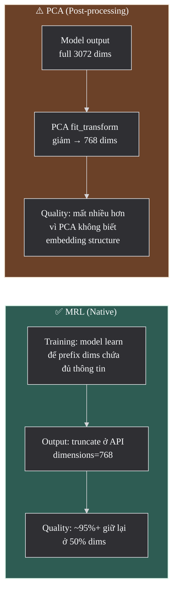

- **MRL training**: model được train với loss function ở nhiều granularities — đảm bảo prefix dimensions **đã capture đủ thông tin** quan trọng nhất
- **PCA truncation**: áp dụng **sau** training → linear transformation không tối ưu cho embedding structure → mất thông tin nhiều hơn
- **MRL giữ chất lượng cao ở 50% dimensions** (ví dụ 3072→1536; xem MTEB scores trong [Google docs](https://ai.google.dev/gemini-api/docs/embeddings)), PCA thường mất nhiều hơn

> Source: [Matryoshka Representation Learning — Kusupati et al., 2022](https://arxiv.org/abs/2205.13147)

### PCA/UMAP (Vẫn cần cho một số trường hợp)

MRL không thể thay thế PCA/UMAP trong mọi trường hợp. Điểm khác biệt quan trọng là MRL phục vụ giảm chiều cho **production embeddings**, còn PCA/UMAP thường phục vụ **phân tích** hoặc **visualization**.

| Method | Khi nào dùng | Cách hoạt động | Ghi chú |
|--------|-------------|---------------|---------|
| **UMAP** | Visualization 2D/3D, manifold learning | Non-linear mapping, giữ cấu trúc local | Tốt nhất cho visual exploration |
| **PCA** | Exploratory analysis, baseline reduction | Linear transform, maximize variance | Nhanh, deterministic, explainable |
| **t-SNE** | Visualization 2D/3D (alternative) | Non-linear, perplexity-based | Chậm hơn UMAP ở scale lớn |

**Khi nào dùng PCA/UMAP thay vì MRL?**
1. **Visualization**: UMAP chiếu 1536-dim → 2D plot → MRL không làm được (min dim thường = 256+)
2. **Model không hỗ trợ MRL**: all-mpnet-base-v2, embed-v3, các model cũ → PCA là lựa chọn duy nhất
3. **Exploratory analysis**: PCA explained variance ratio giúp hiểu thông tin phân bố trong dimensions

### Mã giả: Chọn giữa MRL, PCA và UMAP

```text
# Goal 1: reduce production vector size while preserving quality
if model_supports_mrl:
    vectors = embed(
        texts,
        model="embedding-model",
        dimensions=768
    )

# Goal 2: reduce dimensions for analysis when model has no MRL
else if need_smaller_vectors_for_analysis:
    full_vectors = embed(texts, model="embedding-model")
    reduced_vectors = pca_reduce(full_vectors, target_dimensions=768)

# Goal 3: visualize clusters or inspect the geometry manually
if need_2d_visualization:
    full_vectors = embed(texts, model="embedding-model")
    vectors_2d = umap_project(full_vectors, target_dimensions=2)
    plot(vectors_2d)
```

> Sources: [PCA — scikit-learn](https://scikit-learn.org/stable/modules/generated/sklearn.decomposition.PCA.html), [UMAP documentation](https://umap-learn.readthedocs.io/en/latest/)

### Quantization (Scale lớn: >10M vectors)

Khi vector database chứa hàng triệu hoặc hàng chục triệu vectors, **memory** thường trở thành bottleneck chính nhanh hơn nhiều team dự đoán.

### Ba đòn bẩy khác nhau: giảm chiều, nén vector, nén index

Ba kỹ thuật dưới đây thường bị trộn vào nhau, nhưng chúng tác động lên hệ thống theo những tầng khác nhau:

| Đòn bẩy | Tác động lên cái gì? | Ví dụ | Khi nào nghĩ tới |
|---------|----------------------|-------|------------------|
| **Giảm chiều đầu ra** | Bản thân vector embedding | `3072 -> 1536` bằng `MRL` | Muốn giảm RAM/storage ngay từ đầu mà vẫn giữ retrieval quality |
| **Quantization** | Cách biểu diễn giá trị trong vector | `float32 -> int8` hoặc `binary` | Khi vectors đã nhiều tới mức memory footprint trở thành bottleneck |
| **Nén / tối ưu ở tầng index** | Cấu trúc ANN index và cách search | `PQ`, `IVF_PQ`, compressed indexes | Khi scale lớn tới mức index structure cũng phải tối ưu mạnh |

Điểm quan trọng là ba bước này **không thay thế nhau**. Nhiều hệ thống production sẽ dùng kết hợp: giảm chiều trước, rồi quantize, rồi mới tối ưu index khi scale tiếp tục tăng.

**Ví dụ tính toán memory:**
- 10M vectors × 1536 dims × 4 bytes (float32) = **~57 GB RAM** chỉ cho vectors
- Thêm index overhead (HNSW graph) → ~80-100 GB
- 100M vectors → ~800 GB-1TB → cần nhiều machines

Quantization giải quyết bằng cách **nén** vectors:

| Method | Cách hoạt động | Memory Reduction | Quality Impact | Khi nào dùng |
|--------|---------------|-----------------|-------------|-------------|
| **Scalar Quantization (SQ8)** | float32 → int8 (mỗi dim) | **4x** | Nhỏ — thường chấp nhận được | Scale vừa (10M-100M vectors) |
| **Product Quantization (PQ)** | Chia vector thành sub-vectors, quantize mỗi sub | **16-64x** | Lớn hơn SQ8 — cần test | Scale lớn (>100M vectors) |
| **Binary Quantization** | Mỗi dim → 1 bit (sign) | **32x** | Đáng kể — dùng cho coarse pass | First-pass retrieval, re-rank later |

**Chiến lược kết hợp**: dùng binary quantization cho first-pass (nhanh, tìm ~1000 candidates) → re-score candidates bằng full-precision vectors (chính xác).

### Khi nào chưa nên Quantize?

Quantization không phải bước nên làm quá sớm. Nhiều hệ thống nên trì hoãn nó cho tới khi đã rõ bottleneck thật sự nằm ở đâu.

- dataset còn nhỏ hoặc vừa, RAM chưa phải vấn đề thật
- chất lượng retrieval còn chưa ổn định, chưa có baseline rõ để so sánh trước/sau quantization
- hệ thống còn đang đổi model, đổi chunking hoặc đổi index khá thường xuyên
- chi phí vận hành thêm của quantization lớn hơn lợi ích mà nó mang lại ở giai đoạn hiện tại

Thứ tự hợp lý thường là: chọn model phù hợp, chọn dimension hợp lý, benchmark baseline, rồi mới nghĩ tới quantization khi scale đã bắt đầu gây áp lực thật.

### Sai lầm thường gặp

- Dùng PCA để thay vai trò của MRL dù model đã hỗ trợ native truncation
- Dùng UMAP để "giảm chiều cho production", trong khi UMAP chủ yếu hữu ích cho visualization
- Quantize quá sớm khi hệ thống còn chưa có baseline chất lượng ổn định
- Đánh giá quantization chỉ bằng memory reduction mà không đo retrieval quality sau khi nén

> Sources: [FAISS — Index types and Quantization](https://github.com/facebookresearch/faiss/wiki/Faiss-indexes)

---

## 3.5 Hybrid Search (Sparse + Dense)

Sau khi model, vector database và chunking đã tạm ổn, nhiều hệ thống bắt đầu gặp cùng một vấn đề: dense search tốt ở semantic matching nhưng hụt ở exact terms, còn sparse search mạnh ở exact match nhưng yếu ở paraphrase. Phần này giải thích khi nào hybrid search thật sự đáng giá, cách route query, cách gộp sparse với dense, và lộ trình rollout sao cho không làm pipeline phức tạp hơn mức cần thiết.

### Sparse và Dense bổ trợ nhau ra sao

Sau khi model, vector DB và chunking đã tạm ổn, bottleneck tiếp theo thường nằm ở retrieval quality. Nhiều hệ thống dense-only hoạt động khá tốt với query tự nhiên, nhưng lại hụt hơi ở mã lỗi, tên riêng, SKU, số điều luật hay cụm từ chuẩn hóa. Ngược lại, BM25 rất mạnh ở exact match nhưng yếu ở paraphrase. `Hybrid search` xuất hiện để kết hợp hai mặt này trong cùng một pipeline.

### Khi nào Hybrid thực sự cần?

Hybrid đặc biệt đáng giá khi query distribution của hệ thống có tính pha trộn:

- vừa có câu hỏi tự nhiên, vừa có mã số, tên riêng hoặc thuật ngữ chuẩn
- corpus có nhiều cụm exact match quan trọng như product codes, error messages, legal citations
- người dùng diễn đạt cùng một ý bằng nhiều cách rất khác nhau
- dense retrieval có recall tốt nhưng hay bỏ sót exact matches quan trọng

Nói ngắn gọn: hybrid đáng giá nhất khi **sparse và dense thất bại ở những kiểu query khác nhau**.

### Khi nào dense-only hoặc sparse-only là đủ?

- **Dense-only** thường đủ khi query chủ yếu là ngôn ngữ tự nhiên, ít exact identifiers, và mục tiêu là semantic recall
- **Sparse-only** thường đủ khi corpus có tính cấu trúc cao, query nhiều mã số/tên chuẩn, và exact term matching quan trọng hơn paraphrase

Nếu hệ thống chưa có bằng chứng rõ ràng rằng sparse và dense bổ trợ nhau, việc thêm hybrid quá sớm có thể chỉ làm pipeline phức tạp hơn mà chưa đem lại nhiều lợi ích.

### Query Routing và Conditional Hybrid

Trong production, không phải query nào cũng cần đi qua cùng một pipeline. Nhiều hệ thống hoạt động tốt hơn khi **route query theo đặc điểm của nó**:

- query có mã lỗi, SKU, ticket ID, tên chuẩn hóa hoặc legal citation rõ ràng → ưu tiên sparse hoặc hybrid thiên sparse
- query dài, diễn đạt tự nhiên, có nhiều paraphrase → ưu tiên dense hoặc hybrid cân bằng hơn
- query quá ngắn hoặc mơ hồ → thường cần top-K rộng hơn và rerank mạnh hơn
- query có cả keyword exact lẫn ý nghĩa mở rộng → hybrid là lựa chọn tự nhiên

Điểm hay của query routing là nó giúp tránh việc mọi query đều phải trả "thuế độ phức tạp" của hybrid search, trong khi thực tế chỉ một nhóm query nhất định mới thật sự cần.

### Tại sao cần Hybrid?

| Method | Mạnh | Yếu | Ví dụ |
|--------|------|------|-------|
| **BM25 (Sparse)** | Exact keyword match, tên riêng, mã số | Không hiểu synonyms/paraphrases | Query "iPhone 15 Pro Max" → match exact |
| **Dense Embedding** | Semantic similarity, multilingual | Yếu exact match, rare terms | Query "cách sửa điện thoại" → match "phone repair guide" |
| **Hybrid** | Cả hai! | Phức tạp hơn, cần tune | Kết hợp keyword precision + semantic recall |

**Ví dụ thực tế** khi sparse thắng dense:
- Query: "PO-2024-001234" (mã đơn hàng) → BM25 match exact, dense embedding không hiểu
- Query: "OWASP Top 10" → BM25 match tên chuẩn, dense có thể nhầm lẫn

**Ví dụ thực tế** khi dense thắng sparse:
- Query: "cách làm cho máy tính chạy nhanh hơn" → dense match "performance optimization guide"
- Query: "feelings of sadness" → dense match "depression symptoms" (synonym understanding)

### Reciprocal Rank Fusion (RRF)

```
RRF_score(d) = 1/(k + rank_sparse(d)) + 1/(k + rank_dense(d))
```

- `k = 60` (constant, mặc định trong hầu hết implementations)
- RRF chỉ dùng **rank** (thứ hạng), không dùng raw score → không cần normalize scores giữa systems
- Tỷ lệ khuyến nghị: **70-80% dense + 20-30% sparse** (heuristic, tune theo domain)

Điểm mạnh rất thực dụng của `RRF` là nó giúp gộp hai hệ retrieval mà không phải đau đầu normalize raw scores giữa BM25 và dense similarity. Nếu không dùng `RRF` mà dùng weighted sum của raw scores, bạn gần như luôn phải xử lý normalization trước, nếu không một nhánh sẽ lấn át nhánh còn lại chỉ vì scale điểm khác nhau.

**Tune theo domain:**
- Legal/Medical: tăng sparse weight (exact terminology quan trọng)
- Casual Q&A: tăng dense weight (semantic understanding quan trọng)
- E-commerce: cân bằng (product names exact + description semantic)

### Ngoài RRF còn những cách fusion nào?

`RRF` là điểm bắt đầu rất tốt vì đơn giản, bền vững và ít cần calibration. Nhưng khi hệ thống trưởng thành hơn, vẫn có những hướng khác:

- **Weighted score fusion**: cộng điểm sparse và dense theo trọng số sau khi đã normalize cùng scale
- **Learning-to-rank**: học trực tiếp cách kết hợp nhiều tín hiệu như BM25, dense similarity, click priors, freshness
- **Conditional fusion**: đổi cách fusion theo loại query hoặc theo vertical riêng

Nếu chưa có lý do rõ ràng để đi xa hơn, `RRF` vẫn là baseline nên bắt đầu trước. Nó đơn giản đủ để debug và đủ mạnh cho rất nhiều use cases thực tế.

### SPLADE: Learned Sparse Model

**SPLADE** (Sparse Lexical and Expansion) là learned sparse model:
- Output vẫn là **sparse vectors** (như BM25) nhưng được train bằng neural network
- **Term expansion**: tự động expand query "car" → thêm "vehicle", "automobile" vào sparse representation
- **Learned term weights**: learn weights tốt hơn BM25's TF-IDF formula
- Kết quả: tốt hơn BM25 truyền thống 10-20% trên BEIR benchmark

### Diagram: Hybrid Search Architecture

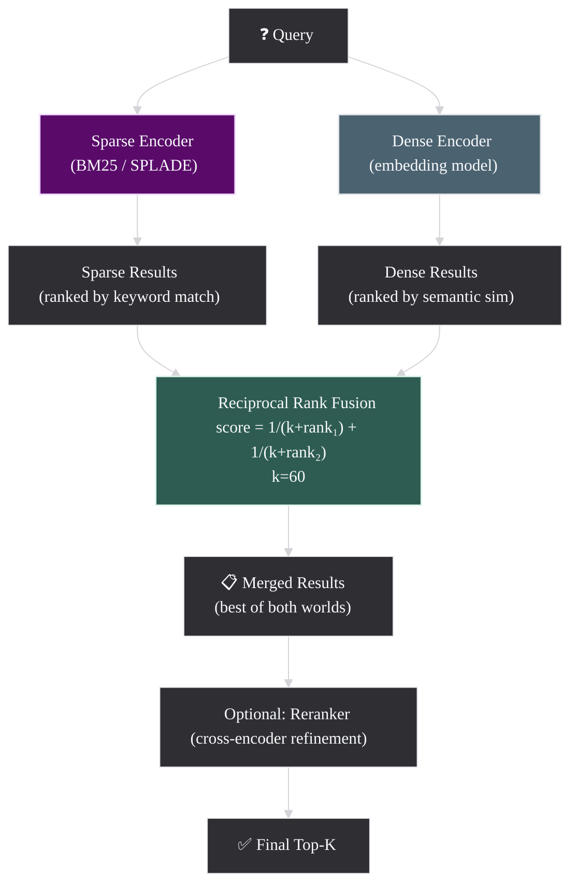

### Failure Modes thường gặp

- dense branch và sparse branch trả về gần như cùng một tập kết quả, khiến hybrid không tạo thêm giá trị
- BM25 thắng rõ ở exact identifiers nhưng bị cho weight quá thấp
- dense retrieval tốt nhưng top results lặp ý, làm fusion ít diversity hơn mong đợi
- đánh giá hybrid chỉ bằng một vài query demo "đẹp", thay vì bằng query logs thật
- thêm hybrid trước khi dense-only baseline đủ tốt, khiến khó biết mình đang sửa bottleneck nào

### Mã giả: Hybrid Search Pipeline

```text
query_text = "Matryoshka embedding dimension reduction"

# Step 1: run sparse retrieval
sparse_results = sparse_search(
    query=query_text,
    method="bm25",
    top_k=100
)

# Step 2: run dense retrieval
query_vector = embed([query_text], model="embedding-model")
dense_results = dense_search(
    query_vector=query_vector,
    top_k=100
)

# Step 3: fuse the two ranked lists
merged_results = reciprocal_rank_fusion(
    sparse_results,
    dense_results,
    rank_constant=60
)

# Step 4: optionally rerank the merged candidates
final_results = rerank_if_needed(
    query=query_text,
    candidates=merged_results,
    top_k=10
)
```

> Source: [Elasticsearch — Semantic text hybrid search](https://www.elastic.co/guide/en/elasticsearch/reference/current/semantic-text-hybrid-search.html)

### Cách rollout Hybrid Search trong production

Một lộ trình thực tế thường an toàn hơn là:

1. dựng baseline `dense-only` hoặc `sparse-only`
2. phân tích query logs để xem nhóm query nào đang thua rõ
3. thêm nhánh retrieval còn thiếu và fusion bằng `RRF`
4. đo lại trên eval set theo từng nhóm query, không chỉ nhìn average chung
5. chỉ thêm reranker sau khi hybrid retrieval đã chứng minh được rằng nó thật sự tăng recall hoặc ranking quality

---

## 3.6 Evaluation Methodology

Đây là phần khóa lại toàn bộ tài liệu, vì mọi quyết định trước đó chỉ có ý nghĩa khi ta đo được tác động của chúng. Phần này đi từ offline và online evaluation, sang metrics theo từng stage của hệ thống, cách xây eval set, dùng `LLM-as-judge` đúng chỗ, rồi chốt lại bằng một quy trình regression testing đủ thực dụng cho production.

### Evaluation là vòng lặp ra quyết định

Evaluation là phần **quan trọng nhất nhưng thường bị bỏ qua** khi build embedding systems. Không đánh giá thì mọi thay đổi về model, chunking, hybrid search hay quantization đều dễ biến thành cảm giác chủ quan.

Phần này tập trung vào một ý rất thực dụng: evaluation không phải là phần trang trí cuối dự án. Nó là vòng lặp quyết định xem thay đổi nào nên được giữ lại trong production.

### Offline vs Online Evaluation

Hai lớp evaluation này bổ trợ nhau, không thay thế nhau:

| Loại | Trả lời câu hỏi gì? | Mạnh ở đâu | Yếu ở đâu |
|------|----------------------|------------|-----------|
| **Offline evaluation** | Model/config nào tốt hơn trên tập test có nhãn? | Nhanh, lặp lại được, phù hợp để so sánh nhiều phương án | Không phản ánh trọn vẹn hành vi người dùng thật |
| **Online evaluation** | Người dùng có thực sự hài lòng hơn không? | Đo được tác động sản phẩm thật | Chậm hơn, tốn rollout, dễ nhiễu bởi nhiều yếu tố ngoài retrieval |

Một nguyên tắc hữu ích là: dùng offline eval để **lọc phương án tệ**, còn online eval để **xác nhận tác động thực**.

### Benchmark Frameworks

| Framework | Focus | Datasets | Key Metric | Source |
|-----------|-------|----------|------------|--------|
| **MTEB** | General embedding quality | 58+ datasets, **8 tasks**, 112 languages | Task-dependent average | [paper](https://arxiv.org/abs/2210.07316), [leaderboard](https://huggingface.co/spaces/mteb/leaderboard) |
| **BEIR** | Information Retrieval | 18 datasets, diverse domains | nDCG@10 | [repo](https://github.com/beir-cellar/beir) |

#### MTEB — 8 Task Categories

MTEB (Massive Text Embedding Benchmark) đánh giá embeddings trên **8 tasks khác nhau**, phản ánh diverse use cases:

| # | Task | Mô tả | Datasets (ví dụ) |
|---|------|--------|-------------------|
| 1 | **Classification** | Dùng embedding làm features → classifier | Amazon Reviews, IMDB, Toxic Comments |
| 2 | **Clustering** | Phân cụm semantic | Reddit clustering, ArXiv clustering |
| 3 | **Retrieval** | Tìm relevant documents cho query | MS MARCO, NQ, BEIR suite |
| 4 | **Reranking** | Sắp xếp lại candidates theo relevance | AskUbuntu, StackOverflow |
| 5 | **STS** | Semantic Textual Similarity (đo score 0-5) | STS-B, SICK-R |
| 6 | **Pair Classification** | Phân loại cặp câu (entailment, paraphrase, contradiction) | MNLI, QQP, PAWS |
| 7 | **Bitext Mining** | Tìm cặp dịch song ngữ (cross-lingual) | Tatoeba, BUCC |
| 8 | **Summarization** | Đánh giá embedding cho text summarization | SummEval |

### Metrics Set Chi tiết

#### Retrieval Metrics (dùng cho search/RAG)

| Metric | Ý nghĩa | Công thức (simplified) | Ví dụ |
|--------|---------|----------------------|-------|
| **Recall@k** | Bao nhiêu % relevant docs nằm trong top-k? | \|relevant ∩ top-k\| / \|relevant\| | Recall@10 = 0.8 → 80% relevant docs được tìm thấy trong top 10 |
| **Precision@k** | Bao nhiêu % top-k là relevant? | \|relevant ∩ top-k\| / k | Precision@10 = 0.3 → 3/10 results là relevant |
| **nDCG@k** | Chất lượng ranking (relevant docs có ở vị trí cao?) | Normalized DCG | nDCG@10 = 0.9 → relevant docs gần đỉnh ranking |
| **MAP@k** | Average precision trung bình | Mean(AP per query) | MAP@100 = 0.75 |
| **MRR** | Rank của relevant result đầu tiên | 1 / rank_of_first_relevant | MRR = 0.5 → relevant result đầu tiên ở vị trí #2 |

**Cách chọn metric:**
- **Recall@k**: quan trọng nhất cho Stage 1 retrieval (coverage)
- **nDCG@k**: quan trọng nhất cho Stage 2 reranking (ranking quality)
- **MRR**: khi chỉ cần 1 kết quả đúng (e.g., question answering)

### Đánh giá theo từng stage của hệ thống

Một hệ thống embedding/RAG thường hỏng ở một stage cụ thể, không phải ở mọi stage cùng lúc. Vì vậy, evaluation nên bám vào từng lớp:

| Stage | Câu hỏi cần trả lời | Metric nên nhìn trước |
|-------|----------------------|-----------------------|
| **Embedding / representation** | Vectors có giữ được semantic structure đủ tốt không? | STS, clustering sanity checks, downstream task quality |
| **Stage 1 retrieval** | Relevant candidates có lọt vào top-K đủ nhiều không? | `Recall@K`, `MAP`, coverage theo query groups |
| **Stage 2 rerank** | Relevant items có được kéo lên đúng vị trí cao không? | `nDCG@K`, `MRR`, pairwise relevance accuracy |
| **Context assembly / RAG** | Context có đủ và ít nhiễu để model trả lời không? | context precision/recall, evidence coverage |
| **Answer layer** | Câu trả lời có đúng, grounded và hữu ích không? | faithfulness, answer relevance, human review |
| **Production behavior** | Hệ thống có nhanh, ổn định và đáng tiền không? | latency, QPS, RAM, cost per query |

Khung này giúp tránh nhầm lẫn rất phổ biến: thấy answer tệ rồi kết luận model embedding tệ, trong khi lỗi thật có thể nằm ở chunking, reranking hoặc prompt assembly.

#### RAG-specific Metrics

| Metric | Ý nghĩa | Cách đo | Tool |
|--------|---------|---------|------|
| **Faithfulness** | Answer có grounded trong context? (không hallucinate?) | LLM-as-judge hoặc NLI model | RAGAS, TruLens |
| **Answer Relevance** | Answer có trả lời đúng câu hỏi? | LLM-as-judge | RAGAS |
| **Context Precision** | Context được retrieve có relevant? | So với ground truth labels | Custom eval |
| **Context Recall** | Đủ context để trả lời? | So với ground truth answer | RAGAS |

#### Operational Metrics (Production monitoring)

| Metric | Ý nghĩa | Target | Cách đo |
|--------|---------|--------|---------|
| **P95 Latency** | 95th percentile response time | <100ms retrieval, <500ms rerank | APM tools (Datadog, Grafana) |
| **P99 Latency** | 99th percentile (tail) | <500ms retrieval | APM tools |
| **QPS** | Queries per second | >100 QPS production | Load testing (k6, locust) |
| **Index RAM/GB** | Bộ nhớ cho vector index | Phụ thuộc budget | VectorDB metrics |
| **Embedding Latency** | Thời gian generate 1 embedding | <50ms (API) | API response time |

**Công thức ước tính RAM:**
```text
RAM (bytes) = n_vectors × dims × bytes_per_value × index_overhead_factor
Ví dụ: 10M × 1536 × 4 (float32) × 1.5 (HNSW overhead) ≈ 88 GB
```

### Xây eval set như thế nào để không tự lừa mình?

Một eval set hữu ích thường nhỏ hơn mọi người nghĩ, nhưng phải đúng bài toán:

- lấy query từ logs thật hoặc từ những tình huống sản phẩm sẽ gặp thật
- cover cả happy path lẫn edge cases như rare terms, multilingual queries, typo, identifiers
- giữ ground truth ở mức đủ rõ: tài liệu đúng, chunk đúng, hoặc answer đúng tùy use case
- tách riêng các nhóm query quan trọng thay vì chỉ nhìn một điểm số trung bình

Với search và RAG, chỉ cần `50-200` queries được gán nhãn cẩn thận cũng thường giá trị hơn rất nhiều so với một benchmark lớn nhưng lệch domain.

### LLM-as-judge: dùng ở đâu, không nên tin ở đâu?

`LLM-as-judge` rất hữu ích cho RAG vì nhiều tiêu chí như faithfulness hoặc answer relevance khó viết thành rule cứng. Nhưng nó không nên được xem là chân lý tuyệt đối.

- hợp để chấm nhanh answer relevance, faithfulness, citation quality theo rubric rõ
- hữu ích khi muốn so sánh nhiều prompt hoặc retrieval configs trước khi human review sâu hơn
- không nên dùng như nguồn sự thật duy nhất cho domain quá nhạy cảm hoặc answer có tính pháp lý, y tế, tài chính
- nếu dùng judge model, nên giữ rubric ổn định và spot-check bằng human review định kỳ

### Label Quality và Judge Calibration

Không có metric nào cứu được một eval set gán nhãn kém. Khi xây evaluation, chất lượng nhãn thường quan trọng không kém bản thân model.

- annotators nên có rubric rõ: thế nào là `relevant`, `partially relevant`, `not relevant`
- nếu có nhiều người gán nhãn, nên kiểm tra disagreement rate để phát hiện chỗ rubric còn mơ hồ
- với `LLM-as-judge`, nên giữ cùng một prompt/rubric qua nhiều lần chạy để kết quả còn so sánh được
- nên spot-check định kỳ giữa human review và judge scores để xem judge có đang drift hoặc quá dễ hay quá khắt khe không

Nếu judge model và human review thường xuyên bất đồng ở một nhóm query, đó thường là tín hiệu rằng rubric hoặc nhãn đang có vấn đề, không chỉ riêng model retrieval.

### Quy trình regression testing nên có

Một pipeline evaluation thực dụng thường gồm:

1. model/config mới chạy trên eval set chuẩn
2. so với baseline theo đúng metric của use case
3. xem breakdown theo nhóm query, không chỉ average
4. nếu là RAG, kiểm tra thêm một mẫu answer bằng human review hoặc judge rubric
5. chỉ rollout khi thay đổi thắng ở đúng metric đang tối ưu và không tạo regressions lớn ở nhóm query quan trọng

### Best Practices cho Evaluation

1. **Không dựa hoàn toàn vào MTEB leaderboard** — model #1 trên MTEB chưa chắc tốt nhất cho domain/ngôn ngữ cụ thể

2. **Build domain-specific eval set**: tạo bộ test riêng cho use case với `50-200` query-relevant_doc pairs được gán nhãn cẩn thận, có cover edge cases và query distribution thật

3. **Multilingual evaluation**: MTEB chưa cover tiếng Việt tốt → cần build eval set riêng cho tiếng Việt

4. **A/B testing trong production**: offline metrics (nDCG, Recall) ≠ online satisfaction
   - Track click-through rate, dwell time, user satisfaction surveys
   - Gradual rollout: 5% → 25% → 100%

5. **Evaluation pipeline tự động hóa**:
   ```
   New model/config → Auto-eval on test set → Compare metrics → Deploy if better
   ```

> Sources: [MTEB paper — Muennighoff et al., 2022](https://arxiv.org/abs/2210.07316), [BEIR benchmark](https://github.com/beir-cellar/beir), [HuggingFace MTEB Blog](https://huggingface.co/blog/mteb)

---

# Tổng hợp Sources

Phần này gom các nguồn đã được dùng xuyên suốt tài liệu theo từng nhóm, để người đọc có thể tra cứu sâu hơn mà không phải lần ngược từng section. Nó hữu ích nhất khi bạn muốn đào sâu một mảng cụ thể như model docs, vector DB, benchmark hay papers nền tảng.

## Academic Papers

| # | Paper | URL |
|---|-------|-----|
| 1 | Word2Vec — Mikolov et al., 2013 | [arxiv.org/abs/1301.3781](https://arxiv.org/abs/1301.3781) |
| 2 | GloVe — Pennington et al., 2014 | [aclanthology.org/D14-1162.pdf](https://aclanthology.org/D14-1162.pdf) |
| 3 | FastText — Bojanowski et al., 2016 | [arxiv.org/abs/1607.04606](https://arxiv.org/abs/1607.04606) |
| 4 | Transformer — Vaswani et al., 2017 | [arxiv.org/abs/1706.03762](https://arxiv.org/abs/1706.03762) |
| 5 | Sentence-BERT — Reimers & Gurevych, 2019 | [arxiv.org/abs/1908.10084](https://arxiv.org/abs/1908.10084) |
| 6 | Matryoshka Representation Learning — Kusupati et al., 2022 | [arxiv.org/abs/2205.13147](https://arxiv.org/abs/2205.13147) |
| 7 | MTEB Benchmark — Muennighoff et al., 2022 | [arxiv.org/abs/2210.07316](https://arxiv.org/abs/2210.07316) |
| 8 | CLIP — Radford et al., 2021 | [arxiv.org/abs/2103.00020](https://arxiv.org/abs/2103.00020) |
| 9 | RAG — Lewis et al., 2020 | [arxiv.org/abs/2005.11401](https://arxiv.org/abs/2005.11401) |
| 10 | Jina Embeddings v3, 2024 | [arxiv.org/pdf/2409.10173](https://arxiv.org/pdf/2409.10173) |

## Embedding Model Documentation

| # | Resource | URL |
|---|----------|-----|
| 11 | Gemini Embedding 2 Blog | [blog.google/.../gemini-embedding-2/](https://blog.google/innovation-and-ai/models-and-research/gemini-models/gemini-embedding-2/) |
| 12 | Gemini API Pricing | [ai.google.dev/gemini-api/docs/pricing](https://ai.google.dev/gemini-api/docs/pricing) |
| 13 | Vertex AI Pricing | [cloud.google.com/vertex-ai/generative-ai/pricing](https://cloud.google.com/vertex-ai/generative-ai/pricing) |
| 14 | Vertex Multimodal Embeddings | [cloud.google.com/...get-multimodal-embeddings](https://cloud.google.com/vertex-ai/generative-ai/docs/embeddings/get-multimodal-embeddings) |
| 15 | Gemini Embedding 001 docs | [ai.google.dev/gemini-api/docs/embeddings](https://ai.google.dev/gemini-api/docs/embeddings) |
| 16 | OpenAI Embedding-3 | [openai.com/.../new-embedding-models-and-api-updates/](https://openai.com/index/new-embedding-models-and-api-updates/) |
| 17 | Cohere Embed Models | [docs.cohere.com/docs/cohere-embed](https://docs.cohere.com/docs/cohere-embed) |
| 18 | Cohere Embed v4 Changelog | [docs.cohere.com/changelog/embed-multimodal-v4](https://docs.cohere.com/changelog/embed-multimodal-v4) |
| 19 | Voyage AI Models | [docs.voyageai.com/docs/embeddings](https://docs.voyageai.com/docs/embeddings) |
| 20 | SBERT Pretrained Models | [sbert.net/.../pretrained_models.html](https://www.sbert.net/docs/sentence_transformer/pretrained_models.html) |

## Applications & Techniques

| # | Resource | URL |
|---|----------|-----|
| 21 | SBERT Semantic Search | [sbert.net/.../semantic-search/](https://www.sbert.net/examples/sentence_transformer/applications/semantic-search/README.html) |
| 22 | SBERT Paraphrase Mining | [sbert.net/.../paraphrase-mining/](https://www.sbert.net/examples/sentence_transformer/applications/paraphrase-mining/README.html) |
| 23 | Pinecone Rerankers Guide | [docs.pinecone.io/guides/search/rerank-results](https://docs.pinecone.io/guides/search/rerank-results) |
| 24 | Cohere Rerank Overview | [docs.cohere.com/docs/rerank-overview](https://docs.cohere.com/docs/rerank-overview) |
| 25 | Google ML Recommendation | [developers.google.com/.../candidate-generation](https://developers.google.com/machine-learning/recommendation/overview/candidate-generation) |
| 26 | OpenAI Cookbook Classification | [github.com/openai/openai-cookbook/.../Classification_using_embeddings.ipynb](https://github.com/openai/openai-cookbook/blob/main/examples/Classification_using_embeddings.ipynb) |
| 27 | OpenAI Text & Code Embeddings | [openai.com/.../introducing-text-and-code-embeddings/](https://openai.com/index/introducing-text-and-code-embeddings/) |
| 28 | Pinecone Chunking Strategies | [pinecone.io/learn/chunking-strategies/](https://www.pinecone.io/learn/chunking-strategies/) |
| 29 | Azure Chunking for Vector Search | [learn.microsoft.com/.../vector-search-how-to-chunk-documents](https://learn.microsoft.com/en-us/azure/search/vector-search-how-to-chunk-documents) |
| 30 | Elasticsearch Hybrid Search | [elastic.co/.../semantic-text-hybrid-search.html](https://www.elastic.co/guide/en/elasticsearch/reference/current/semantic-text-hybrid-search.html) |

## Tools & Libraries

| # | Resource | URL |
|---|----------|-----|
| 31 | FAISS — Metrics, Indexes, Quantization | [github.com/facebookresearch/faiss/wiki/](https://github.com/facebookresearch/faiss/wiki/) |
| 32 | scikit-learn K-means | [scikit-learn.org/.../KMeans.html](https://scikit-learn.org/stable/modules/generated/sklearn.cluster.KMeans.html) |
| 33 | scikit-learn HDBSCAN | [scikit-learn.org/.../HDBSCAN.html](https://scikit-learn.org/stable/modules/generated/sklearn.cluster.HDBSCAN.html) |
| 34 | scikit-learn Isolation Forest | [scikit-learn.org/.../IsolationForest.html](https://scikit-learn.org/stable/modules/generated/sklearn.ensemble.IsolationForest.html) |
| 35 | scikit-learn PCA | [scikit-learn.org/.../PCA.html](https://scikit-learn.org/stable/modules/generated/sklearn.decomposition.PCA.html) |
| 36 | scikit-learn Cosine Similarity | [scikit-learn.org/.../cosine_similarity.html](https://scikit-learn.org/stable/modules/generated/sklearn.metrics.pairwise.cosine_similarity.html) |
| 37 | UMAP Documentation | [umap-learn.readthedocs.io/](https://umap-learn.readthedocs.io/en/latest/) |
| 38 | BEIR Benchmark Framework | [github.com/beir-cellar/beir](https://github.com/beir-cellar/beir) |
| 39 | HuggingFace MTEB Blog | [huggingface.co/blog/mteb](https://huggingface.co/blog/mteb) |

## Vector Databases

| # | Resource | URL |
|---|----------|-----|
| 40 | Pinecone Documentation | [docs.pinecone.io/guides/get-started/overview](https://docs.pinecone.io/guides/get-started/overview) |
| 41 | Cloudflare Vectorize | [developers.cloudflare.com/vectorize/](https://developers.cloudflare.com/vectorize/) |
| 42 | Weaviate Documentation | [docs.weaviate.io/weaviate/introduction](https://docs.weaviate.io/weaviate/introduction) |
| 43 | Qdrant Documentation | [qdrant.tech/documentation/overview/](https://qdrant.tech/documentation/overview/) |
| 44 | Milvus Documentation | [milvus.io/docs/overview.md](https://milvus.io/docs/overview.md) |
| 45 | Chroma Documentation | [docs.trychroma.com/docs/overview/introduction](https://docs.trychroma.com/docs/overview/introduction) |
| 46 | pgvector — PostgreSQL Extension | [github.com/pgvector/pgvector](https://github.com/pgvector/pgvector) |
| 47 | sqlite-vec | [github.com/asg017/sqlite-vec](https://github.com/asg017/sqlite-vec) |

---

> **Disclaimer**: Pricing data là snapshot tại **March 2026**. Benchmark data có nguồn khác nhau (vendor-reported, paper-reported, independent). Gemini Embedding 2 đang ở **preview** — specs và pricing có thể thay đổi. Luôn kiểm tra official docs cho thông tin mới nhất.
